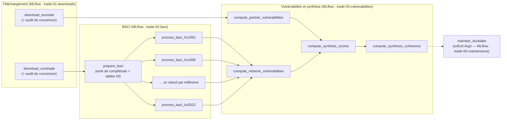

# Architecture du pipeline de production — Kedro · Argo · MLflow · DuckLake

> **Statut** : référence de conception, rédigée le 2026-09-15 à partir de la lecture du
> code de la branche `qb-vulnerabilities` (commit `6f24c6c`), des dépendances installées
> (`statflows 0.1.0`, `dt-ducklake-manager 0.3.0`, `duckdb 1.5.3`) et du code source des
> plugins `argo-kedro 0.1.41`, `kedro-mlflow 2.0.3`, `kedro-viz 12.4.0` (`kedro 1.6.0`).
> Aucune vérification n'a pu être faite sur le cluster (cf. C-20) : tout ce qui touche à
> Onyxia est une **hypothèse**, recensée en §8 (questions ouvertes).
>
> **Compagnon** : `PIPELINE_PROMPTS.md` (liste de prompts d'implémentation, chacun
> exécutable dans une session Claude Code séparée). Ce document fait foi en cas de
> divergence.

## Sommaire

0. [Conventions de lecture](#0-conventions-de-lecture)
1. [État des lieux : constats sur le code actuel](#1-état-des-lieux--constats-sur-le-code-actuel)
2. [Vue d'ensemble de la cible](#2-vue-densemble-de-la-cible)
3. [Décisions d'architecture](#3-décisions-darchitecture)
4. [Spécifications détaillées](#4-spécifications-détaillées)
5. [Runbooks d'exploitation](#5-runbooks-dexploitation)
6. [Stratégie de tests](#6-stratégie-de-tests)
7. [Risques](#7-risques)
8. [Questions ouvertes et hypothèses retenues](#8-questions-ouvertes-et-hypothèses-retenues)
9. [Actions manuelles à la charge de l'utilisateur](#9-actions-manuelles-à-la-charge-de-lutilisateur)
10. [Phasage et planning jusqu'à la présentation](#10-phasage-et-planning-jusquà-la-présentation)
11. [Références](#11-références)

---

## 0. Conventions de lecture

| Préfixe | Signification |
|---|---|
| `C-xx` | Constat sur le code existant (§1) |
| `PD-xx` | Décision d'architecture (§3) : décision, justification, alternatives écartées, conséquences |
| `PS-xx` | Spécification détaillée (§4) : contrat d'implémentation, avec exemples |
| `PR-xx` | Risque (§7) |
| `PQ-xx` | Question ouverte (§8), toujours accompagnée de l'**hypothèse retenue par défaut** |
| `K-xx` | Prompt d'implémentation (`PIPELINE_PROMPTS.md`) |

Les préfixes `D-xx`, `S-x`, `M-xx` sans `P` renvoient à `AGREGATION_ARCHITECTURE.md`
(synthèse multicritère) et ne sont pas redéfinis ici.

Vocabulaire :

- **étape** : l'une des huit unités fonctionnelles du pipeline (téléchargement Eurostat,
  téléchargement Comtrade, BACI, vulnérabilités partenaires, vulnérabilités réseau,
  synthèse, cohérence, maintenance) ;
- **nœud** : un nœud Kedro ; **tâche** : une tâche du DAG Argo (= un pod) ;
- **unité de fraîcheur** : la maille à laquelle une étape décide de (re)calculer
  (couple reporter × produit, millésime HS, contexte de synthèse…) ;
- **empreinte méthodologique** (*fingerprint*) : hachage de la version de code déclarée
  et des paramètres méthodologiques d'une métrique, d'une méthode ou d'une étape (PS-10).

Conventions de code inchangées (cf. `CLAUDE.md`) : commentaires en français à formulation
nominale, docstrings Google Style en anglais, type hints systématiques, API sklearn pour
les transformations, **aucune valeur méthodologique en dur** dans `macroforecast/`.

---

## 1. État des lieux : constats sur le code actuel

Les constats ci-dessous motivent les décisions. Chacun indique où il se trouve et sa
gravité pour la mise en production (🔴 bloquant, 🟠 à traiter avant le régime nominal,
🟡 dette).

| ID | Gravité | Constat | Localisation |
|---|---|---|---|
| C-01 | 🔴 | Restrictions de test codées en dur : `queries = queries[:10]` (Comtrade) et `queries[:5]` (Eurostat). En l'état, la production ne téléchargerait que 15 requêtes. | `scripts/download_comtrade.py:226`, `scripts/download_eurostat_comext.py:216` |
| C-02 | 🔴 | Profondeur historique insuffisante : `period_start: "2010"` pour Comtrade ; les millésimes BACI configurés commencent en 2012 (`HS2012`). L'objectif 1992 n'est couvert ni au téléchargement ni au redressement. | `config/datasets/comtrade.yaml:41`, `config/baci.yaml:108-111` |
| C-03 | 🔴 | `os.environ["AWS_SESSION_TOKEN"]` est lu sans défaut dans les neuf constructions de connecteur. Avec les **clés Minio permanentes** du secret `trade-s3-credentials`, il n'y a pas de jeton de session : `KeyError` au démarrage de chaque pod. | tous les `scripts/*.py` |
| C-04 | 🟠 | La construction `DuckLakeConnector.from_postgres(...)` est dupliquée neuf fois, avec des divergences : `admin_user="postgres"` codé en dur (absent de `process_baci*.py`), `admin_dbname=os.environ["PGDATABASE"]`. | `scripts/*.py` |
| C-05 | 🟠 | Identifiants de dataflow en dur (`DATAFLOW = "C_A_HS"`, `"DS-045409"`) dans les `main()`, contraire à la règle « aucune valeur en dur qui présage de l'exécution ». | `scripts/*.py` |
| C-06 | 🔴 | `process_baci*.py` lit **toute** la table de faits Comtrade dans un DataFrame pandas (`SELECT cols FROM comtrade.fact_table`). À partir de 1992 et en HS6 bilatéral, la table atteint plusieurs centaines de millions de lignes : dépassement mémoire certain. | `scripts/process_baci_hs.py:484`, `scripts/process_baci.py:288` |
| C-07 | 🟠 | Les registres de fraîcheur sont des fichiers JSON uniques, **relus puis réécrits en entier** à chaque mise à jour, sans verrou. Deux pods parallèles qui écrivent le même registre (ex. deux millésimes BACI) perdent des entrées (*last writer wins*). | `process_baci_hs.py:608-622`, `compute_*` |
| C-08 | 🔴 | Dans `statflows.core.download.SDMXDownloader._process_query`, le registre des téléchargements est **réécrit intégralement sur S3 après chaque requête**, et chaque requête non vide déclenche un upsert DuckLake avec `compact_after_update=True`. Pour 10⁴ à 10⁵ requêtes, le coût devient quadratique (PUT de fichiers de plusieurs Mo, compaction répétée, un snapshot par requête). | `statflows/core/download.py:593-602`, `statflows/storage/ducklake/tables.py:171-175` |
| C-09 | 🟠 | Le client Eurostat décide de l'incrémental à partir de la date de mise à jour **du dataflow entier** (`get_data_last_update`) : après chaque publication Comext, toutes les requêtes déjà téléchargées redeviennent éligibles (10 dernières observations chacune). Le client Comtrade décide, lui, par période (`lastReleased`). | `statflows/sources/eurostat/client.py:733-786`, `statflows/sources/comtrade/client.py:871-925` |
| C-10 | 🟠 | Les règles de fraîcheur ignorent les **changements de méthodologie** : corriger une formule ou ajouter une métrique ne déclenche aucun recalcul. Seuls `SYNTHESIS.FORCE` et `COHERENCE.FORCE` existent ; les étapes partenaires, réseau et BACI n'ont pas de forçage. | `scripts/compute_*.py` |
| C-11 | 🟠 | La synthèse filtre en dur le flux import (`p."flow" = 1`) et les 5 dernières périodes. La jointure réseau ne retient que `HS2022`. | `config/synthesis.yaml:55-64` |
| C-12 | 🟡 | Côté partenaires, `HHI` est calculé pour les deux flux ; `CDI2` et `CDI3` ne sont définis que pour l'import (valeur nulle ailleurs). Aucune métrique d'export dédiée n'existe. Les métriques de réseau portent sur le graphe mondial d'un produit : elles ne dépendent pas du sens du flux. | `macroforecast/trade/vulnerabilities/metrics.py` |
| C-13 | 🟠 | L'upsert de `dt_ducklake_manager` ne sait pas **ajouter une colonne** à une table existante (constat déjà fait dans `AGREGATION_ARCHITECTURE.md`) : ajouter une métrique à la table large `indicators` échoue ou perd la colonne. | `statflows/storage/ducklake/tables.py` |
| C-14 | 🔴 | Le `Dockerfile` part de `python:3.12-slim` alors que `requires-python = ">=3.13"`, copie un dossier `parameters/` inexistant, n'installe aucun extra (`tracking`, `optimal-transport`) et utilise `uv:latest` (non reproductible). | `docker/Dockerfile` |
| C-15 | 🔴 | `kubernetes/workflow.yaml` déclare `kind: Workflow` avec des champs de `CronWorkflow` (`schedule`, `concurrencyPolicy`…), invalides pour ce type ; il référence un script `trade-script` inexistant et un secret `comtrade-credentials` qui ne correspond pas aux secrets créés (`comtrade-api-credentials`, `trade-s3-credentials`). À traiter comme un exemple, pas comme une base. | `kubernetes/workflow.yaml` |
| C-16 | 🟡 | `config/base/catalog.yaml` et `config/base/parameters.yaml` existent mais sont vides : amorce d'une arborescence Kedro. | `config/base/` |
| C-17 | 🟡 | Incohérence des chemins CEPII : `process_baci.py` préfixe `s3://{bucket}/` **et** passe `bucket=`, alors que `process_baci_hs.py` passe le chemin relatif et `bucket=`. | `process_baci.py:257-264` vs `process_baci_hs.py:453-454` |
| C-18 | 🟡 | `scripts/test_baci.py` (écriture `df_reconciled.xlsx` en local) est un script de mise au point, hors pipeline. | `scripts/test_baci.py` |
| C-19 | 🟡 | Le suivi MLflow crée une expérience par script, avec des noms de métriques séparés par des points (`gravity.r2`) : l'interface MLflow ne regroupe pas automatiquement les graphiques par étape. | `macroforecast/tracking/` |
| C-20 | 🔴 | **Accès au cluster impossible depuis le poste local** : le jeton de rafraîchissement OIDC de `sspcloud_access_script.txt` est lié à une preuve DPoP (`oauth2: "invalid_grant" "DPoP proof is missing"`), que le fournisseur `oidc` de `kubectl` ne sait pas produire. Voir PQ-09. | `sspcloud_access_script.txt` |
| C-21 | 🟡 | Aucune documentation mkdocs, aucun workflow GitHub Actions, aucun `.dockerignore` dans le dépôt. `sspcloud_access_script.txt` et `Trade deployment.md` sont bien ignorés par git, mais **seraient copiés dans une image** construite avec `COPY . .`. | racine |

Points solides sur lesquels on s'appuie :

- séparation nette méthodologie pure (`macroforecast/trade/*`, sans I/O) / scripts (I/O) ;
- runners isolant l'échec d'une unité (millésime, contexte) sans interrompre les autres ;
- registres écrits **après** succès de l'écriture, date capturée **avant** le calcul ;
- rapports structurés (`to_metrics()`) et protocole `RunTracker` pensé pour kedro-mlflow ;
- `download_updates` qui traite d'abord les requêtes jamais téléchargées, puis les plus
  anciennes, et s'arrête proprement à l'expiration de `max_runtime` ;
- tests de caractérisation (`tests/`), qui servent de contrat de non-régression.

---

## 2. Vue d'ensemble de la cible

### 2.1 Couches

```
┌──────────────────────────────────────────────────────────────────────────────┐
│ Infrastructure : GHCR (image) · Argo Workflows (CronWorkflow + WorkflowTemplate)│
│                  MLflow (Onyxia) · PostgreSQL (catalogues DuckLake) · Minio S3 │
├──────────────────────────────────────────────────────────────────────────────┤
│ trade_pipeline/  (NOUVEAU — projet Kedro : orchestration + I/O)               │
│   settings.py · pipeline_registry.py · pipelines/* (nœuds fins)               │
│   steps/*   (logique d'étape partagée par les nœuds ET par scripts/)          │
│   io/*      (fabrique de connecteurs, datasets Kedro, registres de fraîcheur)  │
│   deploy/*  (rendu des manifestes Argo à partir du DAG argo-kedro)            │
├──────────────────────────────────────────────────────────────────────────────┤
│ scripts/   (CONSERVÉS — enveloppes CLI minces : `uv run baci-hs-script` …)    │
├──────────────────────────────────────────────────────────────────────────────┤
│ macroforecast/  (INCHANGÉ dans son rôle — méthodologie pure, sans I/O)        │
├──────────────────────────────────────────────────────────────────────────────┤
│ statflows (dépendance externe — acquisition, registres de téléchargement,     │
│            écriture DuckLake)  · dt-ducklake-manager (connecteur, maintenance) │
└──────────────────────────────────────────────────────────────────────────────┘
```

### 2.2 DAG cible (pipeline `__default__`)



Chaque flèche est une dépendance de **données** portée par un dataset Kedro (PS-07). En
local, `kedro run` exécute tout le DAG dans un seul processus. Sur Argo, chaque nœud (ou
`FusedPipeline`) devient une tâche, donc un pod (PD-05).

### 2.3 Flux de contrôle quotidien

1. 01:00 Europe/Paris : le `CronWorkflow` `trade-pipeline-daily` instancie le
   `WorkflowTemplate` `trade-pipeline` avec les paramètres par défaut.
2. Les deux téléchargements tournent en parallèle, chacun dans un **budget de temps**
   (`MAX_RUNTIME`, 10 h par défaut) : ils s'arrêtent proprement une fois le budget épuisé.
3. Les étapes aval s'exécutent **même si un téléchargement a échoué** : elles ne lisent
   que des données commitées et décident seules, par leurs registres de fraîcheur, de ce
   qui est à recalculer (PD-06, PD-10).
4. En fin de workflow, qu'il ait réussi ou non, le gestionnaire `onExit` lance la
   maintenance DuckLake (PD-16).
5. Tous les pods journalisent dans MLflow sous un même `workflow_id` (PD-13).

---

## 3. Décisions d'architecture

### PD-01 — Projet Kedro `trade_pipeline` à la racine, configuration dans `config/`

**Décision.**
- Nouveau package Python **`trade_pipeline/`** à la racine du dépôt, à côté de
  `macroforecast/` et `scripts/`. Déclaration dans `pyproject.toml` :
  `[tool.kedro] package_name = "trade_pipeline"`, `project_name = "trade-analysis"`,
  `kedro_init_version = "1.6.0"`, `source_dir = "."`.
- Source de configuration Kedro : **`config/`** (`CONF_SOURCE = "config"` dans
  `settings.py`), avec les environnements :
  - `base` : paramètres de production, versionnés ;
  - `local` : surcharges de poste (non versionné, sauf `.gitkeep`) ;
  - `cloud` : surcharges d'exécution dans Argo (chemins S3, `n_jobs`, budgets) ;
  - `demo` : périmètre réduit pour la présentation (PD-19, PS-04.4).
- `macroforecast/` reste de la méthodologie pure : **aucune dépendance à Kedro** n'y est
  introduite.

**Justification.** Kedro impose un package projet qui contient `settings.py` et
`pipeline_registry.py`. Le placer dans `macroforecast/` mêlerait orchestration et
méthodologie, alors que `CLAUDE.md` exige de les séparer. `source_dir = "."` évite de
déplacer `macroforecast/` et `scripts/` sous `src/`, ce qui casserait les entrées
`[project.scripts]` et les imports des tests. Enfin, le dossier `config/` existe déjà et
contient l'amorce `config/base/` (C-16).

**Alternatives écartées.** Un layout `src/` standard (déplacements massifs, imports
cassés) ; un dépôt Kedro séparé (deux images, deux versions de configuration).

**Conséquences.** `hatchling` doit empaqueter `macroforecast`, `scripts` et
`trade_pipeline` (PS-02). Les scripts voient leurs chemins de configuration par défaut
changer (PD-03).

### PD-02 — Implémentation unique : `trade_pipeline/steps/`, partagée par les nœuds et les scripts

**Décision.** La logique d'orchestration de chaque script (lecture des registres,
sélection des unités, boucle d'isolation des échecs, écriture, mise à jour du registre)
est déplacée dans des **fonctions d'étape** de `trade_pipeline/steps/<étape>.py`. Ces
fonctions reçoivent des **objets résolus** (paramètres typés, poignées de tables,
registres, tracker) et ne lisent **ni fichier YAML ni variable d'environnement**. Deux
consommateurs les appellent :

- les **nœuds Kedro** (`trade_pipeline/pipelines/*/nodes.py`), qui ne font que
  l'adaptation catalogue → étape ;
- les **scripts** (`scripts/*.py`), qui restent des enveloppes CLI : chargement YAML via
  `trade_pipeline.config.load_parameters(env)`, construction des poignées via
  `trade_pipeline.io`, appel de l'étape.

Les helpers publics des scripts que les tests importent (`build_source_query`,
`synthesis_config_from_params`, `contexts_to_recompute`, `pairs_to_recompute`,
`vintages_to_recompute`, `distinct_contexts`, `build_scores_query`…) restent
**importables depuis `scripts.*`** par ré-export, afin que `tests/test_scripts_*.py`
passent sans modification des assertions.

**Justification.** Deux implémentations divergeraient tôt ou tard. Les scripts restent
utiles pour déboguer une étape isolée, et `uv run <script>` fonctionne toujours.

**Conséquences.** Le refactoring (K-11) doit laisser `uv run pytest` vert à l'identique.

### PD-03 — Configuration : fichiers `parameters_*.yml` à clé racine, secrets par `credentials.yml`

**Décision.**
1. Les fichiers méthodologiques migrent vers `config/base/`, **un fichier par domaine,
   chacun encapsulé sous une clé racine unique** (le chargeur Kedro fusionne tous les
   `parameters*` dans un seul dictionnaire et refuse les clés dupliquées ; or `MLFLOW`,
   `DOWNLOADS`, `fixed_dims`… existent déjà dans plusieurs fichiers) :

   | Ancien fichier | Nouveau fichier | Clé racine |
   |---|---|---|
   | `config/datasets/comtrade.yaml` | `config/base/parameters_comtrade.yml` | `comtrade` |
   | `config/datasets/eurostat.yaml` | `config/base/parameters_eurostat.yml` | `eurostat` |
   | `config/datasets/oecd.yaml` | `config/base/parameters_oecd.yml` | `oecd` |
   | `config/baci.yaml` | `config/base/parameters_baci.yml` | `baci` |
   | `config/vulnerabilities.yaml` | `config/base/parameters_vulnerabilities.yml` | `vulnerabilities` |
   | `config/synthesis.yaml` | `config/base/parameters_synthesis.yml` | `synthesis` |
   | *(nouveau)* | `config/base/parameters_runtime.yml` | `runtime` |
   | *(nouveau)* | `config/base/parameters_maintenance.yml` | `maintenance` |

   Les ancres YAML restent valides car chaque fichier est analysé isolément.
2. Les identifiants de dataflow sortent du code (C-05) : clé `DATAFLOW` dans chaque bloc
   (`comtrade.DATAFLOW: "C_A_HS"`, `eurostat.DATAFLOW: "DS-045409"`).
3. Les blocs `MLFLOW` par script disparaissent au profit de `config/base/mlflow.yml`
   (kedro-mlflow, PD-13). Les options de journalisation (`LOG_ARTIFACTS`, `DRIFT`)
   restent dans les blocs d'étape sous `TRACKING`.
4. Les secrets et variables d'environnement passent exclusivement par
   `config/base/credentials.yml`, avec le résolveur `oc.env` (PS-05). Aucun
   `os.environ[...]` ne subsiste dans `steps/` ni dans les nœuds.
5. Les scripts lisent les nouveaux fichiers via
   `trade_pipeline.config.load_parameters(env="base")`, qui reproduit la fusion Kedro
   (`OmegaConfigLoader`). Leurs variables d'environnement historiques
   (`BACI_CONFIG_PATH`…) sont supprimées, **`KEDRO_ENV`** les remplace.

**Justification.** On conserve la paramétrisation externe voulue, tout en la rendant
native pour Kedro (`params:baci.CLASSIFICATIONS`) et visible dans kedro-viz.

### PD-04 — Datasets Kedro : poignées paresseuses de tables DuckLake et registres JSON

**Décision.** Le catalogue ne matérialise **jamais** une table DuckLake complète en
mémoire. Deux types de datasets personnalisés vivent dans `trade_pipeline/io/datasets.py` :

- **`DuckLakeTableDataset`** : `load()` renvoie une **poignée** `DuckLakeTable` (catalogue,
  schéma, table, fabrique de connecteur ; aucune connexion ouverte), qui expose
  `connect()`, `query(sql) -> pd.DataFrame`, `upsert(df, primary_keys)`, `exists()`,
  `add_missing_columns(df)` (PD-11). `save(obj)` accepte une poignée (cas nominal : le
  nœud a écrit via la poignée et la renvoie pour matérialiser la lignée) et vérifie
  qu'elle désigne bien la même table ; il **refuse un DataFrame**, afin que toute écriture
  passe par l'upsert explicite du nœud.
- **`FreshnessRegistryDataset`** : `load()` renvoie un `FreshnessRegistry` (PS-10) adossé
  à des fichiers JSON **fragmentés** sur S3 ; `save(registry)` persiste les seuls
  fragments modifiés.

Les nœuds reçoivent donc des poignées en entrée et **renvoient** des poignées en sortie.
Kedro en déduit les dépendances du DAG, kedro-viz affiche la lignée et argo-kedro calcule
les dépendances entre tâches (il rapproche les sorties d'un nœud des entrées d'un autre).

**Justification.**
1. Les étapes font des **upserts incrémentaux** par lots (un contexte, un millésime),
   incompatibles avec la sémantique « un `save` = un DataFrame complet » de Kedro.
2. Les volumes Comtrade/BACI interdisent le chargement complet (C-06).
3. argo-kedro **n'accepte pas de `MemoryDataset` entre tâches** : toute entrée/sortie doit
   être déclarée au catalogue, et une poignée se recharge à l'identique dans un autre pod.

**Alternatives écartées.** `kedro_datasets.ibis.TableDataset` (pas d'upsert DuckLake) ;
un DataFrame en sortie de nœud (explosion mémoire, pas d'incrémental) ; des nœuds sans
sorties (plus de lignée, plus de dépendances Argo).

**Conséquences.** Les datasets ne se connectent **jamais** dans `__init__` : `kedro viz
build` en CI (sans secrets) doit pouvoir instancier le catalogue.

### PD-05 — Parallélisme : où couper en pods, où paralléliser dans le pod

C'est la décision centrale demandée. Règle générale : **une frontière de pod se justifie
si les trois conditions suivantes sont réunies** :

1. **pas d'écrivain partagé** : les deux branches n'écrivent pas la même table DuckLake ni
   le même fragment de registre (DuckLake gère la concurrence de façon optimiste, et deux
   commits sur la même table entrent en conflit) ;
2. **domaine d'échec ou profil de ressources distinct** : API et quota différents, besoin
   mémoire différent, risque d'OOM à isoler ;
3. **durée ≫ coût de démarrage d'un pod** (≈ 30 à 90 s : tirage d'image, import de
   `macroforecast`, connexion au catalogue), soit plus de 10 minutes environ.

Dans le cas contraire, on parallélise **à l'intérieur du pod** (processus `joblib`/`loky`,
un seul écrivain qui collecte les résultats et écrit par lots).

| Étape | Tâches Argo (pods) | Parallélisme intra-pod | Justification |
|---|---|---|---|
| Téléchargement Eurostat | **1 pod** (`FusedPipeline` téléchargement + audit de couverture) | Aucun : séquentiel, sous rate limiter | API à débit limité par IP ; un seul écrivain du registre `statflows` et de la table `DS_045409` ; paralléliser n'accélère pas un débit plafonné. |
| Téléchargement Comtrade | **1 pod** (idem), **en parallèle** d'Eurostat | Aucun | Autre API, autre quota (clé premium) ; les deux sources sont indépendantes. |
| Préparation BACI | **1 pod léger** (porte de complétude + cache des tables HS) | — | Écrivain unique du cache de concordances ; évite une course entre millésimes. |
| Redressement BACI | **1 pod par millésime HS** (fan-out) | BLAS multi-thread (numpy/statsmodels), `n_jobs` limité par `NUM_CPU` | Chaque millésime écrit son propre schéma (`baci_hs2017`…), donc sans écrivain partagé ; très gourmand en mémoire, un OOM ne doit emporter qu'un millésime ; le fan-out divise le temps écoulé. |
| Vulnérabilités réseau | **1 pod** | `joblib` sur les groupes (millésime × année × produit), écrivain unique | Tous les millésimes écrivent la même table `network_indicators`. |
| Vulnérabilités partenaires | **1 pod**, en parallèle du bloc BACI/réseau | Calcul vectorisé narwhals ; découpage par reporter ; backend `polars` multi-thread en option | Table unique `indicators`. |
| Synthèse | **1 pod** | `joblib` sur les contextes (`n_jobs = NUM_CPU`), écriture par lots de K contextes | Table unique `synthesis` ; grand nombre de petites unités CPU (contextes). |
| Cohérence | **1 pod** | Idem | Table unique `synthesis_diagnostics`. |
| Maintenance | **1 pod** (`onExit`) | Séquentiel par table | Les opérations de maintenance DuckLake doivent être sérialisées sur un catalogue. |

Conséquences : 2 + 1 + *n*<sub>millésimes</sub> + 4 + 1 tâches, soit **15 pods** avec les
sept millésimes HS1992, HS1996, HS2002, HS2007, HS2012, HS2017, HS2022. Le chemin critique est `download_comtrade → prepare_baci →
max(process_baci_*) → network → synthesis → coherence`.

**Alternatives écartées.**
- *Un pod par étape pour BACI (millésimes séquentiels)* : temps écoulé multiplié par six,
  et le premier OOM emporte tout.
- *Réseau fan-out par millésime* : conflits d'écriture sur `network_indicators` (on
  pourrait ajouter des tentatives, mais le calcul réseau est court comparé à BACI).
- *Téléchargement fragmenté en N pods* : même IP et même quota, registre partagé ;
  aucun gain.

### PD-06 — Rattrapage historique : calcul progressif par unité, priorités de téléchargement, porte de complétude BACI

**Décision.** On n'attend **pas** la fin du téléchargement pour calculer. On combine :

1. **Calcul progressif** : chaque jour, chaque étape aval calcule ce qui est devenu
   disponible depuis la veille, grâce aux registres de fraîcheur (PD-10). Concrètement :
   - *partenaires (Eurostat)* : un couple reporter × produit est calculable dès que sa
     requête a été téléchargée une fois. Le couple est complet, puisque la requête
     rapporte tous les partenaires, les deux flux et tous les indicateurs. Le calcul
     progresse donc **produit par produit** ;
   - *synthèse / cohérence* : les contextes s'enrichissent au fil des jours. Une cellule
     absente un jour J apparaît au jour J+k et fait recalculer le contexte (PS-17). Les
     niveaux `by_reporter` et `global` bougent tant que la couverture progresse : c'est
     attendu, et c'est tracé dans MLflow (`coverage/*`).
2. **Priorités de téléchargement** : `download_updates` traite déjà en premier les
   requêtes jamais téléchargées, **dans l'ordre de la liste fournie** (tri stable). On
   ordonne donc la liste selon une priorité configurable (PS-12) : produits prioritaires
   d'abord (liste `PRIORITY.PRODUCTS`), puis années récentes avant les anciennes (pour
   Comtrade). La présentation dispose ainsi très tôt de résultats récents sur des produits
   parlants.
3. **Porte de complétude BACI** : BACI estime la gravité et la qualité des déclarants
   **sur l'ensemble des flux d'une année** : un redressement sur une année à moitié
   téléchargée serait biaisé et instable. Le nœud `prepare_baci` ne retient donc que les
   **années complètes**, c'est-à-dire celles dont toutes les requêtes (lots de produits)
   ont été téléchargées au moins une fois, selon le registre `statflows` (PS-14). Le seuil
   est paramétrable (`baci.COMPLETENESS.MIN_SHARE`, 1.0 en production). En
   environnement `demo`, on l'abaisse ou on restreint le périmètre produit, et le résultat
   est **étiqueté provisoire** dans MLflow et dans une colonne `is_provisional`.

**Justification.** À l'échelle complète (1992 → aujourd'hui, HS6, tous reporters), le
rattrapage prendra **plusieurs jours** (PR-01). Attendre la fin pour calculer
repousserait tout résultat après la présentation. Le calcul progressif est déjà dans
l'ADN des scripts (registres par unité) ; il suffit de l'étendre.

### PD-07 — Granularité des requêtes de téléchargement

**Décision.**
- **Comtrade** : une requête = **(année × lot de `PRODUCTS_STEP` produits HS6)**, tous
  reporters (`reporters=None`), flux `M` et `X`.
  - La période devient une dimension de découpage : la décision `lastReleased` de
    `fetch_updates` est prise par période, ce qui la rend exacte et permet d'ordonner par
    année.
  - On ne télécharge que les **sous-positions à 6 chiffres** (`include_regex: '^\d{6}$'`) :
    BACI et le réseau travaillent en HS6, et les agrégats HS2/HS4 se déduisent par somme,
    sans raison de les télécharger (3 à 4 fois moins de requêtes).
- **Eurostat** : une requête = **(reporter × lot de `PRODUCTS_STEP` codes produits)**,
  les codes d'un lot appartenant au même chapitre HS2. La réponse contient
  `product` par ligne : le couple reporter × produit reste reconstituable.
  - `PRODUCTS_STEP` est un paramètre ; sa valeur de production sera fixée par une mesure
    (longueur d'URL et taille de réponse SDMX acceptées, PR-03).
  - Le lecteur du registre de téléchargement côté partenaires éclate les lots en couples
    (PS-12.3).
- Les plafonds de test (C-01) sont remplacés par un paramètre `MAX_QUERIES` (`null` en
  production, entier en `demo`).

**Justification.** Le nombre de requêtes gouverne à la fois la durée du rattrapage, le
coût des registres (C-08) et la volumétrie de petits fichiers DuckLake. Réduire la
cardinalité d'un facteur 20 à 50 côté Eurostat rend la réactualisation post-publication
(C-09) tenable en une journée.

### PD-08 — Couverture historique depuis 1992 et audit de couverture

**Décision.**
- Paramètre unique `runtime.ANALYSIS_START_YEAR: 1992`, référencé par interpolation
  OmegaConf dans `comtrade.fixed_dims.C_A_HS.period_start`,
  `eurostat.fixed_dims.DS-045409.startPeriod` (si le client l'accepte) et
  `baci.PARAMETERS.period_start`.
- **Millésimes BACI** : `HS1992`, `HS1996`, `HS2002`, `HS2007`, `HS2012`, `HS2017`,
  `HS2022`, avec `START_YEAR` égal à l'année d'entrée en vigueur (1992 pour HS1992, cf.
  PQ-05). Seul `HS1992` couvre toute la période d'analyse ; les millésimes récents
  offrent une nomenclature plus fine sur une période plus courte.
- **Audit de couverture** en fin de nœud de téléchargement (PS-13) : pour chaque source,
  première et dernière période observées par reporter (et par chapitre HS2), nombre de
  requêtes jamais téléchargées, part téléchargée par année. Il est publié dans MLflow
  (`coverage/*` et artefact CSV). Une **alerte** (tag `coverage_alert=true` + log
  WARNING) se déclenche si `min(period) > ANALYSIS_START_YEAR` pour un reporter censé
  couvrir la période (liste `EXPECTED_FULL_HISTORY_REPORTERS`).

**Justification.** « Télécharger depuis 1992 » ne se vérifie que par les données
effectivement écrites. Les pays entrés tardivement dans l'UE ou ayant adopté le SH
tardivement auront légitimement une couverture plus courte : d'où une liste explicite
plutôt qu'une règle universelle.

### PD-09 — Paramétrage import / export

**Décision.**

| Étape | Paramétrable import/export ? | Comportement retenu |
|---|---|---|
| Téléchargement Comtrade | **Non** | Toujours `M` et `X` : la réconciliation miroir BACI a besoin des deux déclarations (import de A = export de B). |
| Téléchargement Eurostat | **Non** | Toujours flux `1` et `2` : `CDI3` (import) utilise les exports ; les métriques d'export ont besoin des deux. |
| BACI | **Non** | Produit une matrice bilatérale unique exportateur → importateur ; les vulnérabilités à l'import d'un pays lisent sa colonne, à l'export sa ligne. |
| Réseau | **Non** | Métriques du graphe mondial d'un produit, indépendantes du sens. Partagées par les deux sens dans la synthèse. |
| Partenaires (Eurostat) | **Oui** : `vulnerabilities.FLOWS: [import, export]` | Chaque métrique déclare `supported_flows` ; seules les combinaisons (métrique × flux) supportées et demandées sont calculées. |
| Synthèse / cohérence | **Oui** : `synthesis.FLOWS: [import, export]` | Le filtre SQL sur le flux est **généré** à partir de `FLOWS` (plus de `p."flow" = 1` en dur). `flow` fait déjà partie de `context_columns` : import et export ne sont jamais comparés entre eux. |

Métriques d'export (**à valider méthodologiquement**, PQ-06) :

| Métrique | Import (existant) | Export (proposé) |
|---|---|---|
| `HHI` | concentration des fournisseurs | concentration des débouchés (déjà calculée pour le flux 2) |
| `CDI2` | imports extra-UE / imports totaux | `CDI2` sur le flux export : exports extra-UE / exports totaux (dépendance aux marchés extra-UE) |
| `CDI3` | imports extra-UE / exports totaux | **non défini** à l'export (reste `null`) |

Tant que PQ-06 n'est pas tranchée, `FLOWS: [import]` est la valeur de `base`, et `export`
s'active par simple changement de configuration. Les métriques réseau sont jointes aux
deux sens.

**Justification.** Le paramètre n'a de sens que là où la méthodologie distingue le sens
du flux. L'exposer ailleurs créerait des combinaisons fausses (BACI sans exports).

### PD-10 — Registres de fraîcheur v2 : fragmentés, dotés d'empreintes méthodologiques, forçables

**Décision.** Un module générique `trade_pipeline/io/freshness.py` remplace les six
lecteurs/écrivains de registres dupliqués. Chaque étape aval tient un registre dont les
entrées sont indexées par **unité de fraîcheur** et portent :

- `last_computed` (instant UTC capturé **avant** le calcul) ;
- `upstream_watermark` (instant amont pris en compte) ;
- `fingerprints` : `{nom_métrique_ou_méthode: empreinte}` (PS-10.2) ;
- `reason` : `new_data` | `fingerprint` | `forced` | `first` ;
- des compteurs (`n_rows`, `n_cells`…).

Une unité est recalculée si **au moins une** des conditions suivantes est vraie :
1. elle n'a jamais été calculée ;
2. son amont est plus récent que `upstream_watermark` ;
3. l'empreinte d'une métrique/méthode **demandée** diffère de celle enregistrée : la
   métrique a été ajoutée ou sa formule/version a changé ;
4. elle entre dans le périmètre d'un **forçage** (PS-11).

Les registres sont **fragmentés** (un fichier JSON par fragment : reporter, millésime,
période…) afin de ne jamais réécrire un fichier géant (C-08) et de supprimer toute course
entre pods (C-07). Chaque étape a son préfixe :
`trade/state/<étape>/<fragment>.json`.

**Justification.** C'est la réponse aux deux besoins exprimés :
- *ajouter une métrique ou une méthode* : nouvelle empreinte, donc recalcul **de cette
  métrique/méthode** sur **toutes** les unités existantes, sans rien d'autre ;
- *corriger une formule* : on incrémente la `version` déclarée de la métrique (PS-10.2),
  ce qui provoque le recalcul automatique partout. On peut aussi, ponctuellement, forcer
  une étape entière via les paramètres d'exécution (PS-11).

**Alternative écartée.** Hacher le *code source* des classes : trop sensible (un
commentaire modifié recalculerait tout), et invisible pour l'utilisateur. On retient une
**version déclarée explicitement** (`version: ClassVar[str]`) plus les paramètres.

### PD-11 — Évolution de schéma pour les nouvelles métriques

**Décision.** Avant tout upsert, la poignée `DuckLakeTable.upsert(df, keys)` appelle
`add_missing_columns(df)`. Pour chaque colonne présente dans `df` et absente de la table,
elle exécute `ALTER TABLE <catalogue>.<schéma>.fact_table ADD COLUMN "<col>" <type>`
(DuckLake supporte l'évolution de schéma), le type étant déduit par DuckDB du DataFrame.
Les lignes existantes prennent `NULL` jusqu'à leur recalcul, que l'empreinte déclenche
(PD-10). Suppressions et renommages de colonnes ne sont **jamais** automatiques
(runbook §5.3).

Pour les tables **longues** (`synthesis`, `synthesis_diagnostics`, clé incluant `method`
ou `statistic`), ajouter une méthode n'ajoute que des lignes : aucune évolution de schéma
n'est nécessaire.

**Justification.** C-13. Passer les indicateurs en format long casserait le contrat
`SOURCES/COLUMNS` de la synthèse ; ajouter une colonne est la solution minimale.

**À vérifier dans K-08** : que `DatabaseUpdater.update_database` accepte un DataFrame
contenant **un sous-ensemble** des colonnes de la table (sinon, compléter le DataFrame
avec les colonnes existantes relues avant l'upsert).

### PD-12 — Synthèse et cohérence incrémentales, par contexte et par méthode

**Décision.** L'unité de fraîcheur de la synthèse devient le **contexte**
`(freq, flow, indicators, TIME_PERIOD)`. Le registre stocke une entrée par contexte, avec
une empreinte par méthode.

- *Nouvelle méthode ou méthode modifiée* : recalcul de **cette seule méthode** sur tous
  les contextes filtrés, plus les pseudo-méthodes de consensus (`borda`, `copeland`) qui
  dépendent de toutes les autres.
- *Amont partenaires `new_data`* : recalcul des contextes des **`RECENT_PERIODS`**
  dernières périodes (par défaut `eurostat.DOWNLOADS.*.N_LAST_OBSERVATIONS`, puisque
  l'incrémental ne rapporte que ces périodes), plus les contextes **jamais calculés**.
- *Amont partenaires `fingerprint` ou `forced`, ou amont réseau modifié* : recalcul de
  tous les contextes filtrés. Un redressement BACI réestime en effet toutes les années de
  son millésime.
- **Budget** : `synthesis.MAX_CONTEXTS_PER_RUN` (null = illimité) ; les contextes
  périmés les plus récents passent en premier, le reste est traité les jours suivants.
  Idem `COHERENCE`.
- `FILTERS.LAST_N_PERIODS` disparaît de `base` (null) : on synthétise toutes les périodes
  depuis `ANALYSIS_START_YEAR`, mais seulement celles qui sont périmées.
- La cohérence suit la synthèse : un contexte est recalculé si sa synthèse l'a été depuis
  (watermark par contexte), si l'empreinte de la configuration de cohérence a changé, ou
  en cas de forçage. L'empreinte de cohérence est globale : pas de granularité par
  statistique.

**Justification.** Sur toute la période, avec 15 méthodes (SMAA 2 000 tirages, bootstrap,
Kantorovitch), une synthèse complète quotidienne ne tiendrait pas dans la fenêtre de
24 h. Le registre global actuel (C-10) serait « tout ou rien ».

### PD-13 — MLflow : kedro-mlflow, une expérience par grand bloc, un run par tâche, métriques groupées par préfixe

**Décision.**
- **Serveur** : service MLflow Onyxia (lancé par l'utilisateur, §9), métadonnées en
  PostgreSQL et artefacts sur S3.
- **kedro-mlflow 2.0.3** (MLflow ≥ 3) gère le cycle de vie des runs : un run par
  exécution de `kedro run`, soit **un run par tâche Argo**. Il fournit la configuration du
  serveur (`config/base/mlflow.yml`) et les datasets de journalisation.
- **Expériences** : l'expérience est choisie par la variable `MLFLOW_EXPERIMENT_NAME`,
  que le rendu Argo injecte **par tâche** d'après le tag Kedro `experiment:<nom>` du nœud
  (PS-21). Correspondance :

  | Expérience | Nœuds | Runs |
  |---|---|---|
  | `trade-01-downloads` | `download_eurostat`, `download_comtrade` | 1 run par source par jour |
  | `trade-02-baci` | `prepare_baci`, `process_baci_<millésime>` | 1 run par millésime par jour → **tableau de bord par étape BACI** (ci-dessous) |
  | `trade-03-vulnerabilities` | partenaires, réseau, synthèse, cohérence | 1 run par nœud par jour |
  | `trade-00-maintenance` | `maintain_ducklake` | 1 run par jour |

- **Regroupement** : tous les runs d'une même exécution portent le tag
  `workflow_id=<WORKFLOW_ID>` (injecté par argo-kedro), `run_name =
  <nœud>-<WORKFLOW_ID>`, `git_sha`, `image_tag`, `kedro_env`.
- **Noms de métriques hiérarchisés par `/`**, que l'interface MLflow (vue *Chart*)
  regroupe automatiquement en sections :
  `conversion/…`, `gravity/…`, `quality/…`, `valuation/…`, `reconciliation/…`,
  `nes/…`, `harmonization/…`, `output/…`, `timing/…` pour BACI ;
  `download/…`, `http/…`, `rate_limit/…`, `coverage/…` pour les téléchargements ;
  `partners/…`, `network/…`, `synthesis/<niveau>/…`, `coherence/<niveau>/…`,
  `drift/…`, `freshness/…` pour le bloc 3 ; `ducklake/<catalogue>/<schéma>/…` pour la
  maintenance.
- **Tableaux de bord BACI par étape** : pour chacune des étapes de la méthodologie
  (conversion en tonnes, gravité/fret, qualité des déclarants, régimes de valorisation,
  réconciliation miroir, réallocation NES, harmonisation), le run de chaque millésime
  publie un artefact HTML autonome `dashboards/<étape>.html` (Plotly, sans CDN), produit à
  partir des tables d'artefacts déjà journalisées, **en plus** des sections de métriques.
  L'utilisateur crée par ailleurs, une fois, les vues de comparaison dans l'interface
  (runbook §5.8).
- Le protocole `RunTracker` est conservé. Une implémentation **`ActiveRunTracker`**
  journalise dans le run actif ouvert par kedro-mlflow ; `get_tracker()` la renvoie
  lorsqu'un run est actif, ce qui laisse les runners inchangés. Les scripts CLI continuent
  d'utiliser `MlflowTracker`.
- `flatten_metrics(payload, prefix, sep=".")` gagne un paramètre `sep`. Le pipeline
  utilise `sep="/"` ; le défaut `"."` préserve les tests existants.

**Justification.** La demande est de présenter BACI séparément des téléchargements
d'une part, et des vulnérabilités/synthèse/cohérence d'autre part, avec un tableau de
bord par étape BACI. Les expériences séparent les blocs ; les préfixes et artefacts HTML
fournissent le tableau de bord par étape ; le tag `workflow_id` recolle une exécution
quotidienne complète.

### PD-14 — Ordonnancement : argo-kedro pour le DAG, rendu maison en `WorkflowTemplate` + `CronWorkflow`

**Décision.**
- `argo-kedro==0.1.41` (version épinglée : paquet 0.x, API mouvante) sert à :
  1. **calculer le DAG** Argo à partir des pipelines Kedro (`get_argo_dag`), en
     respectant `FusedPipeline` et le `machine_type` par nœud ;
  2. fournir la configuration `config/base/argo.yml` (types de machines, image) ;
  3. exposer `kedro argo submit --dry_run` pour inspecter le rendu brut.
- argo-kedro **ne sait pas** produire de `CronWorkflow` (seul `kind: Workflow` est rendu
  et soumis). Il ne transmet ni `--env` ni `--params` à `kedro run`, ni
  `serviceAccountName`, TTL, `onExit`, politiques de reprise ou dépendances tolérantes à
  l'échec. On ajoute donc un **rendu maison** `trade_pipeline/deploy/render.py`
  (commande `kedro trade render-argo`), qui :
  - appelle `get_argo_dag` (import de bibliothèque, pas de sous-processus) ;
  - produit, par un gabarit Jinja versionné, **deux manifestes** :
    `kubernetes/generated/workflowtemplate.yaml` (`WorkflowTemplate trade-pipeline`) et
    `kubernetes/generated/cronworkflow.yaml` (`CronWorkflow trade-pipeline-daily`, qui
    référence le template) ;
  - injecte les paramètres de workflow (`kedro-env`, `image-tag`, `force-steps`,
    `force-metrics`, `force-methods`, `max-runtime-hours`) transmis à
    `kedro run --env … --params …` ;
  - injecte les secrets et l'environnement (PS-05), `MLFLOW_EXPERIMENT_NAME` par tâche,
    les ressources par `machine_type`, `retryStrategy`, `activeDeadlineSeconds` ;
  - convertit le nœud tagué `onexit` (maintenance) en gestionnaire `onExit` ;
  - rend les dépendances **tolérantes à l'échec amont**
    (`depends: "(a.Succeeded || a.Failed)"`) pour les étapes idempotentes pilotées par
    registre (§2.3). Le workflow reste marqué `Failed` si une tâche a échoué.
- Les manifestes générés sont **versionnés**. Un job de CI vérifie qu'ils correspondent au
  code (`render-argo --check`). Le déploiement se fait par `kubectl apply -f
  kubernetes/generated/`.
- Pour une exécution ponctuelle (rattrapage, forçage) :
  `argo submit --from workflowtemplate/trade-pipeline -p force-steps=synthesis`.
- Le pod appelle `kedro run --pipeline __default__ --nodes <nœud>` (commande générée par
  argo-kedro) complétée de `--env` et `--params`. **À vérifier dans K-15** : argo-kedro
  enregistre une commande globale `run` qui remplace `kedro run` par sa version
  `FusedRunner` ; il faut confirmer qu'elle coexiste avec les hooks kedro-mlflow.

**Justification.** Un seul workflow, voulu par l'utilisateur ; kedro reste la source de
vérité du DAG ; la planification quotidienne et les exécutions ponctuelles partagent le
même template. Le rendu maison est petit, testé et remplaçable si argo-kedro ajoute ces
fonctions.

### PD-15 — Image et intégration continue : GHCR public, GitHub Actions

**Décision.**
- Image **`ghcr.io/qbolliet/trade-analysis`**, visibilité **publique** (pas
  d'`imagePullSecret`, gratuit). Étiquettes : SHA court du commit (immuable, utilisée par
  Argo), `main`, `latest`, et tag git `vX.Y.Z` le cas échéant.
- `Dockerfile` à deux étages (PS-22) : `python:3.13-slim`, `uv` épinglé, `uv sync
  --frozen --no-dev --extra tracking --extra optimal-transport`, extensions DuckDB
  (`ducklake`, `postgres`, `httpfs`) **préinstallées** dans l'image, utilisateur non root.
- GitHub Actions (PS-23) : `ci.yml` (tests + `render-argo --check`), `image.yml`
  (construction avec cache `type=gha` et publication sur GHCR), `docs.yml` (site statique
  sur GitHub Pages).
- **Coût nul** si le dépôt est public (minutes Actions illimitées, Pages gratuit, stockage
  et bande passante GHCR gratuits pour les paquets publics). Si le dépôt reste privé :
  2 000 minutes/mois gratuites, et **Pages indisponible** sur un compte gratuit (PQ-08).

### PD-16 — Maintenance DuckLake quotidienne, sans intervention humaine

**Décision.**
1. **Écriture** : `compact_after_update` devient configurable et vaut `False` pendant les
   téléchargements (C-08). Les écritures du téléchargement sont **tamponnées** (flush
   toutes les N requêtes ou T secondes, PS-27). L'inlining des petites écritures dans le
   catalogue (`DATA_INLINING_ROW_LIMIT`) est activé si la version DuckLake embarquée le
   supporte (à vérifier sur DuckDB 1.5.3).
2. **Nœud `maintain_ducklake`** (`onExit`, chaque jour), par catalogue (`eurostat`,
   `comtrade`, `vulnerabilities`) et pour **chaque table écrite dans les 24 h** (d'après
   les snapshots) :
   | Opération | Fréquence | Paramètre |
   |---|---|---|
   | `ducklake_flush_inlined_data` | quotidienne | si l'inlining est actif |
   | `ducklake_merge_adjacent_files` | quotidienne | — |
   | `ducklake_rewrite_data_files` | quotidienne **si** part de lignes supprimées > seuil, sinon hebdomadaire | `DELETE_RATIO_THRESHOLD: 0.1`, `WEEKLY_DAY: 6` |
   | `ducklake_expire_snapshots` | quotidienne | `SNAPSHOT_RETENTION_DAYS: 7` |
   | `ducklake_cleanup_old_files` (+ fichiers orphelins) | quotidienne | `CLEANUP_OLDER_THAN_DAYS: 7` |
   | `VACUUM (ANALYZE)` du PostgreSQL du catalogue | hebdomadaire | `WEEKLY_DAY` |
   | Sauvegarde logique `pg_dump` du catalogue vers S3 | hebdomadaire, rétention 4 | `BACKUP.*` |
3. **Partitionnement**, posé une fois par le nœud à la création de la table (idempotent) :
   `comtrade/C_A_HS` par année (`refYear` ou `period`), `baci_hs*` par `year`,
   `eurostat/DS_045409` par `reporter`, `network_indicators` par
   `classification`, `synthesis` par `TIME_PERIOD`.
4. **Observabilité** : avant/après chaque opération, le nœud relève le nombre de fichiers
   de données, leur taille moyenne, le nombre de fichiers de suppression et le nombre de
   snapshots (tables `__ducklake_metadata_*`), et les publie dans
   `trade-00-maintenance`. **Alerte** si le nombre de fichiers d'une table dépasse
   `MAX_FILES_PER_TABLE` après maintenance.
5. Les opérations sont non fatales une à une (sémantique déjà en place dans
   `DuckLakeMaintenance`) ; le nœud échoue seulement si **toutes** échouent sur un
   catalogue.

**Justification.** Un pipeline quotidien qui fait des upserts crée chaque jour des
petits fichiers, des tombstones et des snapshots. Sans compaction, expiration et
nettoyage réguliers, les lectures se dégradent et le stockage croît sans limite. Placer
la maintenance en `onExit` du même workflow respecte la préférence « un seul workflow »
et garantit qu'elle ne tourne jamais pendant une écriture du pipeline.

### PD-17 — Documentation : site statique mkdocs-material + kedro-viz

**Décision.** Site généré par `mkdocs build` (thème Material), avec le rendu statique
de `kedro viz build` copié dans `site/pipeline/` et lié depuis la navigation (« Pipeline
interactif »). Publié sur GitHub Pages par `docs.yml`. Contenu minimal : accueil (README),
architecture (ce document), runbooks (§5), configuration (référence des paramètres
générée depuis `config/base/`), méthodologies (liens vers les PDF LaTeX compilés, s'ils
sont publiés), pipeline (kedro-viz).

`kedro viz build` s'exécute en CI **sans secrets** : les datasets ne se connectent pas à
l'instanciation (PD-04), et `credentials.yml` résout vers des valeurs vides grâce aux
défauts `oc.env`.

### PD-18 — Contrat des secrets et de l'environnement d'exécution

**Décision.** Quatre secrets Kubernetes, exposés comme variables d'environnement dans
toutes les tâches (injectés par le rendu) :

| Secret | Clés | Statut |
|---|---|---|
| `trade-s3-credentials` | `S3_ACCESS_KEY`, `S3_SECRET_KEY` → exposées en `AWS_ACCESS_KEY_ID`, `AWS_SECRET_ACCESS_KEY` | **existe** |
| `comtrade-api-credentials` | `COMTRADE_FREE_SUBSCRIPTION_KEY`, `COMTRADE_PREMIUM_INSTITUTIONNAL_SUBSCRIPTION_KEY` | **existe** |
| `trade-postgres-credentials` | `PGHOST`, `PGPORT`, `PGUSER`, `PGPASSWORD`, `PGDATABASE`, `PGADMINUSER` | **à créer** (§9) |
| `trade-mlflow-credentials` | `MLFLOW_TRACKING_URI`, et si l'authentification est active `MLFLOW_TRACKING_USERNAME`, `MLFLOW_TRACKING_PASSWORD` | **à créer** (§9) |

Variables non secrètes (valeurs dans le template) : `AWS_S3_ENDPOINT=minio.lab.sspcloud.fr`,
`AWS_DEFAULT_REGION=us-east-1`, `MLFLOW_S3_ENDPOINT_URL=https://minio.lab.sspcloud.fr`,
`KEDRO_ENV`, `PYTHONUNBUFFERED=1`, `WORKFLOW_ID` et `NUM_CPU` (injectées par argo-kedro).
`AWS_SESSION_TOKEN` devient **optionnelle** (C-03).

### PD-19 — Phasage : un « jalon démonstration » indépendant de la migration Kedro

**Décision.** La migration complète (Kedro, argo-kedro, kedro-mlflow, rendu, docs)
représente une douzaine de prompts, et **le rattrapage des données prend plusieurs
jours** : le téléchargement doit démarrer **avant** la fin de la migration. D'où deux
voies :

- **Phase 0 (J0–J2)** : corriger les bloquants des scripts (C-01, C-02, C-03, C-14),
  publier l'image, puis déployer un `WorkflowTemplate`/`CronWorkflow` **écrit à la main**
  qui enchaîne les scripts existants selon le DAG de §2.2, sur le **périmètre `demo`**
  (produits prioritaires, années récentes d'abord). Les téléchargements tournent dès J1.
  Ce workflow de transition est remplacé par le workflow généré en phase 3.
- **Phases 1 à 4** : robustesse `statflows`, méthodologie paramétrable, Kedro, puis
  déploiement généré (§10).

**Justification.** La présentation ne peut montrer « des résultats de chaque étape » que
si des données existent. Découpler garantit ce jalon, même si la migration Kedro prend
du retard.

---

## 4. Spécifications détaillées

### PS-01 — Arborescence cible

```
trade-analysis/
├── .github/workflows/{ci.yml, image.yml, docs.yml}
├── .dockerignore
├── config/
│   ├── base/
│   │   ├── catalog.yml                     # PS-07
│   │   ├── credentials.yml                 # PS-05 (oc.env uniquement, versionné)
│   │   ├── mlflow.yml                      # PS-19
│   │   ├── argo.yml                        # PS-20
│   │   ├── parameters_runtime.yml          # PS-04.1, PS-11
│   │   ├── parameters_comtrade.yml
│   │   ├── parameters_eurostat.yml
│   │   ├── parameters_oecd.yml
│   │   ├── parameters_baci.yml
│   │   ├── parameters_vulnerabilities.yml
│   │   ├── parameters_synthesis.yml
│   │   └── parameters_maintenance.yml
│   ├── cloud/  {parameters_runtime.yml, …}  # surcharges Argo
│   ├── demo/   {parameters_*.yml}           # périmètre présentation
│   └── local/  .gitkeep
├── docker/Dockerfile
├── docs/ {index.md, architecture.md → lien, runbooks.md, configuration.md}
├── mkdocs.yml
├── kubernetes/
│   ├── generated/{workflowtemplate.yaml, cronworkflow.yaml}   # rendus (PS-21)
│   ├── transition/{workflowtemplate.yaml, cronworkflow.yaml}  # phase 0 (PD-19)
│   └── examples/ (ancien workflow.yaml, configmap.yaml déplacés)
├── macroforecast/ (inchangé dans son rôle)
├── scripts/ (enveloppes CLI minces)
├── trade_pipeline/
│   ├── __init__.py
│   ├── __main__.py
│   ├── settings.py
│   ├── pipeline_registry.py
│   ├── config.py               # load_parameters(env), accès typé
│   ├── hooks.py                # hooks projet (tags MLflow, NUM_CPU → n_jobs)
│   ├── cli.py                  # commandes projet `kedro trade …`
│   ├── io/
│   │   ├── ducklake.py         # fabrique de connecteur, DuckLakeTable (PS-06)
│   │   ├── datasets.py         # DuckLakeTableDataset, FreshnessRegistryDataset (PS-07)
│   │   ├── freshness.py        # FreshnessRegistry, empreintes, décision (PS-10)
│   │   └── tracking.py         # ActiveRunTracker, conventions de nommage (PS-19)
│   ├── steps/
│   │   ├── downloads.py  baci.py  partners.py  network.py
│   │   ├── synthesis.py  coherence.py  maintenance.py  coverage.py
│   ├── pipelines/
│   │   ├── downloads/{__init__.py, pipeline.py, nodes.py}
│   │   ├── baci/… vulnerabilities/… synthesis/… maintenance/…
│   └── deploy/{render.py, templates/workflowtemplate.yaml.j2, templates/cronworkflow.yaml.j2}
├── tests/ (existants + tests/pipeline/, tests/deploy/)
├── PIPELINE_ARCHITECTURE.md
└── PIPELINE_PROMPTS.md
```

### PS-02 — `pyproject.toml`

```toml
[project]
requires-python = ">=3.13"
dependencies = [
    # … existant …
    "kedro>=1.6,<2",
    "kedro-mlflow==2.0.3",
    "argo-kedro==0.1.41",
    "joblib>=1.4",
    "jinja2>=3.1",
]

[project.optional-dependencies]
tracking = ["mlflow>=3,<4"]              # aligné sur kedro-mlflow 2.x
optimal-transport = ["jax>=0.4.30", "ott-jax>=0.4.6"]
viz = ["kedro-viz==12.4.0"]              # hors image de production
docs = ["mkdocs-material>=9.5", "kedro-viz==12.4.0"]
dashboards = ["plotly>=5.24"]            # artefacts HTML BACI (inclus dans l'image)

[project.scripts]
# inchangés : comtrade-script, eurostat-script, baci-script, baci-hs-script,
# vulnerabilities-eurostat-script, vulnerabilities-network-script,
# vulnerabilities-synthesis-script, vulnerabilities-coherence-script
# supprimé : test-baci-script (C-18)

[tool.kedro]
package_name = "trade_pipeline"
project_name = "trade-analysis"
kedro_init_version = "1.6.0"
source_dir = "."

[tool.hatch.build.targets.wheel]
packages = ["macroforecast", "scripts", "trade_pipeline"]
```

Remarque : `plotly` est ajouté aux dépendances de l'image par l'extra `dashboards`
(`uv sync --extra dashboards`). `kedro-viz` n'est pas dans l'image (inutile à l'exécution).

### PS-03 — `trade_pipeline/settings.py`

```python
"""Kedro project settings for the trade vulnerability pipeline."""
# Importation des modules
from kedro.config import OmegaConfigLoader

from trade_pipeline.hooks import TradeRunHooks

# Source de configuration : dossier existant `config/` (et non `conf/`)
CONF_SOURCE = "config"

# Chargeur de configuration et environnements
CONFIG_LOADER_CLASS = OmegaConfigLoader
CONFIG_LOADER_ARGS = {
    "base_env": "base",
    "default_run_env": "local",
    "merge_strategy": {"parameters": "soft"},
    "config_patterns": {
        "argo": ["argo*", "argo*/**"],
        "mlflow": ["mlflow*", "mlflow*/**"],
    },
}

# Hooks projet : les hooks kedro-mlflow et argo-kedro sont auto-enregistrés par entry points
HOOKS = (TradeRunHooks(),)
```

Remarques :
- `soft` permet à `config/demo/parameters_eurostat.yml` de ne surcharger que quelques clés
  du bloc `eurostat` ;
- les entry points de `kedro-mlflow` et `argo-kedro` enregistrent leurs hooks
  automatiquement : ne pas les dupliquer dans `HOOKS`.

### PS-04 — Paramètres

#### PS-04.1 `config/base/parameters_runtime.yml`

```yaml
runtime:
  # Première année de l'analyse, référencée par interpolation dans les autres fichiers
  ANALYSIS_START_YEAR: 1992
  # Parallélisme intra-pod : null → NUM_CPU (injecté par Argo) ou os.cpu_count()
  N_JOBS: null
  # Forçage ponctuel (PS-11) : chaînes séparées par des virgules, vides par défaut
  FORCE_STEPS: ""        # ex. "partners,synthesis" ou "all"
  FORCE_METRICS: ""      # ex. "HHI,CDI2"
  FORCE_METHODS: ""      # ex. "critic_sum"
  FORCE_SCOPE:
    REPORTERS: ""        # ex. "FR,DE"
    PRODUCTS: ""         # préfixes acceptés : "28,8541"
    PERIODS: ""          # ex. "2020,2021"
    VINTAGES: ""         # ex. "HS2017"
```

#### PS-04.2 Extrait `config/base/parameters_comtrade.yml`

```yaml
comtrade:
  DATAFLOW: "C_A_HS"
  code_groups:
    majors_m49: &majors_m49 ["251", "276", "380", "724", "528"]
  parameters:
    C_A_HS: &params_c_a_hs
      products_step: 10
      # Plafond de requêtes (null en production ; remplace queries[:10], C-01)
      max_queries: null
      # Ordre de priorité des requêtes jamais téléchargées (PS-12)
      priority:
        products: []            # préfixes HS prioritaires, dans l'ordre
        periods_order: "desc"   # années récentes d'abord
  fixed_dims:
    C_A_HS: &fixed_dims_c_a_hs
      frequency: annual
      flows: ["M", "X"]
      type_code: "C"
      classification: "HS"
  split_filters:
    C_A_HS:
      periods:
        start: ${runtime.ANALYSIS_START_YEAR}
        end: null               # null → dernière année publiée (client)
      reporters: {include: null, include_regex: null, exclude: null, exclude_regex: null}
      products:
        include: null
        include_regex: '^\d{6}$'   # HS6 uniquement (PD-07)
        exclude: ["999999"]
        exclude_regex: null
  DOWNLOADS:
    DBNAME: "comtrade"
    CATALOG_ALIAS: "comtrade"
    C_A_HS:
      BUCKET: "qbollietdgddi"
      PATHS:
        DATA_PATH: "trade/datasets/comtrade"
        STRUCTURES_PATH: "trade/datasets/structures/comtrade.json"
        LAST_DOWNLOAD_PATH: "trade/datasets/last_downloads/comtrade.json"
      N_LAST_OBSERVATIONS: 10
      MAX_RUNTIME: {WEEKS: 0, DAYS: 0, HOURS: 10, MINUTES: 0, SECONDS: 0}
      COVERAGE:
        EXPECTED_FULL_HISTORY_REPORTERS: []   # PS-13
  TRACKING:
    LOG_ARTIFACTS: true
```

> L'interpolation `${runtime.ANALYSIS_START_YEAR}` entre fichiers de paramètres est
> supportée par `OmegaConfigLoader`, qui résout après fusion. **À vérifier dans K-10**
> (sinon : `globals.yml` + résolveur `${globals:…}`).

#### PS-04.3 Extraits `parameters_vulnerabilities.yml` et `parameters_synthesis.yml`

```yaml
vulnerabilities:
  FLOWS: ["import"]              # PD-09 ; ["import", "export"] après validation PQ-06
  FLOW_CODES: {import: 1, export: 2}
  DATAFLOW: "DS-045409"
  VULNERABILITIES: { … inchangé … }
  STATE:
    PATH_TEMPLATE: "trade/state/vulnerabilities/partners/{reporter}.json"   # PS-10
    BUCKET: "qbollietdgddi"
  PARAMETERS: { … inchangé … }
  NETWORK_VULNERABILITIES:
    STATE:
      PATH_TEMPLATE: "trade/state/vulnerabilities/network/{vintage}.json"
    N_JOBS: ${runtime.N_JOBS}
    # … reste inchangé …

synthesis:
  SYNTHESIS:
    FLOWS: ${vulnerabilities.FLOWS}
    RECENT_PERIODS: 10
    MAX_CONTEXTS_PER_RUN: null
    WRITE_BATCH_CONTEXTS: 8
    N_JOBS: ${runtime.N_JOBS}
    STATE:
      PATH_TEMPLATE: "trade/state/synthesis/scores/{period}.json"
    FILTERS:
      # Le prédicat sur le flux est GÉNÉRÉ depuis FLOWS : ne plus l'écrire ici
      WHERE: 'p."indicators" = ''VALUE_IN_EUROS'' AND p."freq" = ''A'''
      LAST_N_PERIODS: null
    # … SOURCES, PARAMETERS inchangés …
  COHERENCE:
    STATE:
      PATH_TEMPLATE: "trade/state/synthesis/coherence/{period}.json"
    # … inchangé …
```

#### PS-04.4 Environnement `demo` (présentation)

```yaml
# config/demo/parameters_comtrade.yml
comtrade:
  parameters:
    C_A_HS:
      max_queries: null
      priority:
        products: ["2805", "2846", "8105", "8112", "2844", "3004", "8541", "8542", "8507"]
  split_filters:
    C_A_HS:
      periods: {start: 2015, end: null}
      products:
        include_regex: '^(2805|2846|8105|8112|2844|3004|8541|8542|8507)\d{2}$'

# config/demo/parameters_eurostat.yml
eurostat:
  split_filters:
    DS-045409:
      product:
        include_regex: '^(2805|2846|8105|8112|2844|3004|8541|8542|8507)\d{2,4}$'

# config/demo/parameters_baci.yml
baci:
  COMPLETENESS: {MIN_SHARE: 1.0}
  CLASSIFICATIONS:
    TARGETS:
      HS2017: {START_YEAR: 2017, RESULT_SCHEMA: "demo_baci_hs2017"}

# config/demo/parameters_synthesis.yml
synthesis:
  SYNTHESIS:
    PARAMETERS:
      min_group_size: 10
```

> La liste de produits ci-dessus est un **exemple** (terres rares, cobalt, gallium/germanium,
> uranium, médicaments, semi-conducteurs, batteries), à remplacer par la sélection de
> l'utilisateur (PQ-07). Attention : un BACI sur un sous-ensemble de produits n'est **pas**
> le BACI complet (la qualité des déclarants est estimée sur tous les produits). Les
> résultats `demo` sont écrits dans des schémas préfixés `demo_` et étiquetés
> `is_provisional`.

### PS-05 — `credentials.yml` et variables d'environnement

```yaml
# config/base/credentials.yml — versionné : ne contient QUE des références oc.env
ducklake_postgres:
  host: ${oc.env:PGHOST,""}
  port: ${oc.env:PGPORT,"5432"}
  user: ${oc.env:PGUSER,""}
  password: ${oc.env:PGPASSWORD,""}
  admin_dbname: ${oc.env:PGDATABASE,"postgres"}
  admin_user: ${oc.env:PGADMINUSER,"postgres"}
  admin_password: ${oc.env:PGPASSWORD,""}

s3:
  endpoint: ${oc.env:AWS_S3_ENDPOINT,"minio.lab.sspcloud.fr"}
  access_key_id: ${oc.env:AWS_ACCESS_KEY_ID,""}
  secret_access_key: ${oc.env:AWS_SECRET_ACCESS_KEY,""}
  session_token: ${oc.env:AWS_SESSION_TOKEN,null}   # optionnel (C-03)

comtrade_api:
  subscription_key: ${oc.env:COMTRADE_PREMIUM_INSTITUTIONNAL_SUBSCRIPTION_KEY,""}
```

`OmegaConfigLoader` n'autorise `oc.env` que dans `credentials*` : c'est voulu, les
secrets ne transitent donc jamais par les paramètres (ni par les paramètres journalisés
dans MLflow). Les nœuds obtiennent les identifiants **via les datasets** (argument
`credentials:` du catalogue), jamais en paramètre.

Une valeur vide pour `host` ne provoque d'erreur qu'**à la connexion**, avec un message
explicite (`"PGHOST is not set: …"`) : `kedro viz build` passe sans secrets.

### PS-06 — Fabrique de connecteur et poignée de table (`trade_pipeline/io/ducklake.py`)

```python
@dataclass(frozen=True)
class DuckLakeLocation:
    """Where a DuckLake schema lives (catalog identity + data path)."""
    dbname: str            # base PostgreSQL du catalogue (ex. "comtrade")
    catalog_alias: str     # alias ATTACH (ex. "comtrade")
    schema: str            # schéma assaini par _schema_name (ex. "C_A_HS")
    bucket: str
    data_path: str         # préfixe S3 des fichiers Parquet
    table: str = "fact_table"

def build_connector(location: DuckLakeLocation, pg: Mapping[str, Any],
                    s3: Mapping[str, Any]) -> DuckLakeConnector:
    """Build (never connect) the DuckLake connector — single replacement of the 9 copies (C-04)."""

class DuckLakeTable:
    """Lazy handle on a DuckLake fact table; opens connections on demand."""
    def __init__(self, location: DuckLakeLocation, pg: Mapping, s3: Mapping) -> None: ...
    @contextmanager
    def connect(self) -> Iterator[duckdb.DuckDBPyConnection]: ...
    def exists(self) -> bool: ...
    def query(self, sql: str, params: Sequence[Any] | None = None) -> pd.DataFrame: ...
    def add_missing_columns(self, df: pd.DataFrame) -> list[str]: ...   # PD-11
    def upsert(self, df: pd.DataFrame, primary_keys: Sequence[str], *,
               conn: duckdb.DuckDBPyConnection | None = None) -> bool: ...
    @property
    def qualified_name(self) -> str: ...   # '"alias"."schema"."fact_table"'
```

Exemple d'usage dans une étape :

```python
with baci_hs2017.connect() as conn:
    df_slice = comtrade_raw.query(
        f"SELECT {cols} FROM {comtrade_raw.qualified_name} WHERE CAST(\"refYear\" AS INT) = ?",
        params=[year],
    )  # lecture poussée en SQL, jamais la table entière (C-06)
    baci_hs2017.upsert(df_reconciled, primary_keys, conn=conn)
```

### PS-07 — Catalogue Kedro

```yaml
# config/base/catalog.yml
_pg: &pg {type: trade_pipeline.io.datasets.DuckLakeTableDataset, credentials: ducklake_postgres}

eurostat.comext:
  <<: *pg
  location: {dbname: eurostat, catalog_alias: eurostat, schema: DS_045409,
             bucket: qbollietdgddi, data_path: trade/datasets/comext}

comtrade.tariffline:
  <<: *pg
  location: {dbname: comtrade, catalog_alias: comtrade, schema: C_A_HS,
             bucket: qbollietdgddi, data_path: trade/datasets/comtrade}

"baci.{vintage}":                      # dataset factory Kedro : baci.hs2017, baci.hs2022…
  <<: *pg
  location: {dbname: comtrade, catalog_alias: comtrade, schema: "baci_{vintage}",
             bucket: qbollietdgddi, data_path: trade/datasets/comtrade}

baci.scope:                            # sortie de prepare_baci : années éligibles par millésime
  type: kedro_datasets.json.JSONDataset   # ou dataset maison S3 via statflows
  filepath: s3://qbollietdgddi/trade/state/baci/scope.json

vulnerabilities.partners:
  <<: *pg
  location: {dbname: vulnerabilities, catalog_alias: vulnerabilities, schema: indicators,
             bucket: qbollietdgddi, data_path: trade/datasets/vulnerabilities/}

vulnerabilities.network:  { <<: *pg, location: { …, schema: network_indicators, … } }
synthesis.scores:         { <<: *pg, location: { …, schema: synthesis, … } }
synthesis.diagnostics:    { <<: *pg, location: { …, schema: synthesis_diagnostics, … } }

"state.{step}":
  type: trade_pipeline.io.datasets.FreshnessRegistryDataset
  credentials: s3
  path_template: "${…}"                # renseigné via paramètres (PS-10.1)

"mlflow.metrics.{node}":
  type: kedro_mlflow.io.metrics.MlflowMetricsHistoryDataset
"mlflow.artifacts.{node}":
  type: kedro_mlflow.io.artifacts.MlflowArtifactDataset
  dataset: {type: kedro_datasets.pandas.CSVDataset, filepath: "data/08_reporting/{node}.csv"}
```

> Les noms de schémas du catalogue doivent rester **identiques** aux `RESULT_SCHEMA` des
> paramètres. K-10 ajoute un test qui vérifie cette cohérence et fait échouer la CI en cas
> d'écart (le doublon est le prix de la lisibilité dans kedro-viz). La syntaxe exacte des
> dataset factories et de `kedro_mlflow` est à vérifier sur les versions épinglées.

### PS-08 — API des fonctions d'étape (`trade_pipeline/steps/`)

Toutes les étapes renvoient un **`StepResult`** :

```python
@dataclass
class StepResult:
    """Outcome of one pipeline step, consumed by nodes (metrics/artifacts) and scripts (logs)."""
    step: str
    n_units_planned: int
    n_units_succeeded: int
    failures: dict[str, str]                 # unité → message (tronqué)
    metrics: dict[str, float]                # déjà préfixées « <famille>/… »
    artifacts: dict[str, pd.DataFrame]       # chemin d'artefact → table
    tags: dict[str, str]
    def raise_if_failed(self) -> None: ...   # RuntimeError si failures (après tentative de tout)
```

Signatures cibles :

```python
def run_download(client_factory: Callable[[], Any], table: DuckLakeTable, *, source: str,
                 params: Mapping[str, Any], tracker: RunTracker) -> StepResult
def audit_coverage(table: DuckLakeTable, registry_path: str, *, source: str,
                   params: Mapping[str, Any]) -> StepResult
def prepare_baci(comtrade: DuckLakeTable, *, params: Mapping[str, Any],
                 runtime: Mapping[str, Any]) -> BaciScope
def run_baci_vintage(vintage: str, scope: BaciScope, comtrade: DuckLakeTable,
                     result: DuckLakeTable, state: FreshnessRegistry, *,
                     params: Mapping[str, Any], runtime: Mapping[str, Any],
                     tracker: RunTracker) -> StepResult
def run_partner_vulnerabilities(source: DuckLakeTable, result: DuckLakeTable,
                                state: FreshnessRegistry, download_registry: DownloadRegistryView, *,
                                params: Mapping, runtime: Mapping, tracker: RunTracker) -> StepResult
def run_network_vulnerabilities(baci: Mapping[str, DuckLakeTable], result: DuckLakeTable,
                                state: FreshnessRegistry, baci_state: FreshnessRegistry, *,
                                params: Mapping, runtime: Mapping, tracker: RunTracker) -> StepResult
def run_synthesis(catalog: DuckLakeTable, scores: DuckLakeTable, diagnostics: DuckLakeTable,
                  state: FreshnessRegistry, upstream: Sequence[FreshnessRegistry], *,
                  params: Mapping, runtime: Mapping, tracker: RunTracker) -> StepResult
def run_coherence(catalog: DuckLakeTable, scores: DuckLakeTable, diagnostics: DuckLakeTable,
                  state: FreshnessRegistry, synthesis_state: FreshnessRegistry, *,
                  params: Mapping, runtime: Mapping, tracker: RunTracker) -> StepResult
def run_maintenance(tables: Sequence[DuckLakeTable], *, params: Mapping,
                    tracker: RunTracker) -> StepResult
```

Invariants communs (hérités des scripts, à conserver) :
1. l'instant de référence est capturé **avant** le calcul ;
2. le registre n'avance **qu'après** une écriture réussie, et seulement pour les unités
   réussies ;
3. l'échec d'une unité n'interrompt pas les autres ; `raise_if_failed()` est appelé par le
   nœud **après** la persistance du registre et la journalisation ;
4. aucune lecture de variable d'environnement, aucun chemin YAML.

### PS-09 — Pipelines et nœuds

| Pipeline | Nœud Kedro (nom) | Entrées | Sorties | Tags | `machine_type` |
|---|---|---|---|---|---|
| `downloads` | `download_eurostat` *(FusedPipeline avec `audit_coverage_eurostat`)* | `params:eurostat`, `params:runtime` | `eurostat.comext`, `mlflow.metrics.download_eurostat`, `mlflow.artifacts.coverage_eurostat` | `experiment:trade-01-downloads` | `io-small` |
| `downloads` | `download_comtrade` *(Fused avec `audit_coverage_comtrade`)* | `params:comtrade`, `params:runtime` | `comtrade.tariffline`, metrics, artifacts | idem | `io-small` |
| `baci` | `prepare_baci` | `comtrade.tariffline`, `params:baci`, `params:comtrade`, `params:runtime` | `baci.scope`, `baci.concordances` | `experiment:trade-02-baci` | `compute-medium` |
| `baci` | `process_baci_<vintage>` (un par `CLASSIFICATIONS.TARGETS`) | `baci.scope`, `baci.concordances`, `comtrade.tariffline`, `state.baci_<vintage>`, `params:baci`, `params:runtime` | `baci.<vintage>`, `state.baci_<vintage>`, metrics, artifacts | idem | `baci-large` |
| `vulnerabilities` | `compute_partner_vulnerabilities` | `eurostat.comext`, `state.partners`, `params:eurostat`, `params:vulnerabilities`, `params:runtime` | `vulnerabilities.partners`, `state.partners`, metrics, artifacts | `experiment:trade-03-vulnerabilities` | `compute-medium` |
| `vulnerabilities` | `compute_network_vulnerabilities` | `baci.<vintage>` (tous), `state.baci_*`, `state.network`, `params:vulnerabilities`, `params:runtime` | `vulnerabilities.network`, `state.network`, metrics, artifacts | idem | `compute-medium` |
| `synthesis` | `compute_synthetic_scores` | `vulnerabilities.partners`, `vulnerabilities.network`, `state.partners`, `state.network`, `state.synthesis`, `params:synthesis`, `params:runtime` | `synthesis.scores`, `state.synthesis`, metrics, artifacts | idem | `synthesis-cpu` |
| `synthesis` | `compute_synthesis_coherence` | `synthesis.scores`, `vulnerabilities.partners`, `vulnerabilities.network`, `state.synthesis`, `state.coherence`, `params:synthesis`, `params:runtime` | `synthesis.diagnostics`, `state.coherence`, metrics, artifacts | idem | `synthesis-cpu` |
| `maintenance` | `maintain_ducklake` | `params:maintenance` *(aucune entrée de données : exécuté en `onExit`)* | `mlflow.metrics.maintain_ducklake` | `experiment:trade-00-maintenance`, `onexit` | `io-small` |

- `__default__` = somme de tous les pipelines (via `sum(pipelines)`, **pas** un
  `FusedPipeline` englobant : limitation argo-kedro) ;
- les nœuds `process_baci_<vintage>` sont générés dans `create_pipeline()` à partir de
  `baci.CLASSIFICATIONS.TARGETS`, lu par `trade_pipeline.config.load_parameters(env)`
  avec l'environnement `KEDRO_ENV` ;
- le nœud `compute_synthesis_coherence` prend `synthesis.scores` en entrée : c'est ce qui
  fonde la dépendance synthèse → cohérence dans Argo.

### PS-10 — Registres de fraîcheur v2

#### PS-10.1 Format d'un fragment

Fichier `s3://qbollietdgddi/trade/state/vulnerabilities/partners/FR.json` :

```json
{
  "schema_version": 2,
  "step": "partners",
  "fragment": "FR",
  "entries": {
    "FR|280530": {
      "unit": {"reporter": "FR", "product": "280530"},
      "last_computed": "2026-09-16T03:12:44+00:00",
      "upstream_watermark": "2026-09-16T01:47:02+00:00",
      "fingerprints": {"HHI": "a3f9c1e04b7d2e11", "CDI2": "9be0417c55aa1f02", "CDI3": "0c77d1f3e9a24b58"},
      "reason": "new_data",
      "n_rows": 68
    }
  }
}
```

Maille et fragment par étape :

| Étape | Unité | Fragment | Watermark amont |
|---|---|---|---|
| BACI | millésime × année | millésime | max `last_download` des requêtes Comtrade de l'année |
| Partenaires | reporter × produit | reporter | `last_download` de la requête couvrant le couple |
| Réseau | millésime | millésime | `last_computed` max du fragment BACI du millésime |
| Synthèse | contexte `(freq, flow, indicators, TIME_PERIOD)` | période | max des watermarks partenaires et réseau pertinents |
| Cohérence | contexte | période | `last_computed` synthèse du contexte |

#### PS-10.2 Empreinte méthodologique

```python
def fingerprint(name: str, version: str, params: Mapping[str, Any]) -> str:
    """Stable 16-hex digest of a metric/method/step methodology.

    Examples:
        >>> fingerprint("HHI", "1", {"world_code": "WORLD"})
        '…'  # stable across runs and platforms
    """
    payload = json.dumps({"name": name, "version": version, "params": params},
                         sort_keys=True, default=str, separators=(",", ":"))
    return hashlib.sha256(payload.encode("utf-8")).hexdigest()[:16]
```

- **`version`** : attribut de classe `version: ClassVar[str] = "1"` ajouté à
  `VulnerabilityMetric`, `NetworkVulnerabilityMetric` et à chaque étape BACI. Pour les
  méthodes de synthèse, champ `version` (défaut `"1"`) dans l'entrée YAML de la méthode.
  **Une correction de formule = incrément de `version`** (runbook §5.3).
- **`params`** : paramètres qui influent sur le résultat de la métrique ou de la méthode
  (champs du dataclass de configuration **hors** options de journalisation : `artifact_*`,
  `drift_*`, `psi_n_bins`…, dont la liste d'exclusion est déclarée à côté du dataclass).
  Pour une méthode de synthèse : `kind`, `params`, `metrics`, `levels`, plus les champs de
  `SynthesisConfig` qui la concernent (`normalization`, `winsorize_quantile`,
  `polarities`, `min_group_size`, `metric_columns`).
- Pour BACI, l'empreinte est **unique par millésime** (toutes les étapes sont couplées).

#### PS-10.3 Décision

```python
def units_to_compute(planned: Iterable[Unit], registry: FreshnessRegistry,
                     upstream: Mapping[Unit, datetime], requested: Mapping[str, str],
                     force: ForceSpec) -> dict[Unit, UnitPlan]:
    """Return, per stale unit, the reason and the subset of metrics/methods to (re)compute.

    UnitPlan(reason, names) where names ⊆ requested:
      - 'first'       : unit absent from the registry → all names
      - 'forced'      : unit in force scope → force.names or all names
      - 'new_data'    : upstream[unit] > entry.upstream_watermark → all names
      - 'fingerprint' : names whose fingerprint differs or is missing → those names only
    Precedence: first > forced > new_data > fingerprint (a unit gets a single plan).
    """
```

- **Partenaires et réseau** (tables larges) : même si seule une métrique a changé, on
  recalcule **toutes** les métriques de l'unité (le coût est faible, et l'upsert porte
  sur des lignes entières). Le registre enregistre les nouvelles empreintes de toutes.
- **Synthèse** (table longue par méthode) : on ne recalcule **que** les méthodes de
  `names`, plus le consensus dès que `names` n'est pas vide.

### PS-11 — Forçage ponctuel (paramètres d'exécution)

| Besoin | Commande locale | Exécution Argo ponctuelle |
|---|---|---|
| Recalculer toute la synthèse | `kedro run --pipeline synthesis --params runtime.FORCE_STEPS=synthesis` | `argo submit --from workflowtemplate/trade-pipeline -p force-steps=synthesis` |
| Recalculer HHI partout | `--params runtime.FORCE_STEPS=partners,runtime.FORCE_METRICS=HHI` | `-p force-steps=partners -p force-metrics=HHI` |
| Recalculer une méthode | `--params runtime.FORCE_STEPS=synthesis,runtime.FORCE_METHODS=critic_sum` | `-p force-steps=synthesis -p force-methods=critic_sum` |
| Forcer BACI HS2017 sur 2020-2021 | `--params runtime.FORCE_STEPS=baci,runtime.FORCE_SCOPE.VINTAGES=HS2017,runtime.FORCE_SCOPE.PERIODS=2020,2021` | idem en paramètres |
| Tout recalculer | `--params runtime.FORCE_STEPS=all` | `-p force-steps=all` |

Règles :
- le forçage d'une étape **cascade** vers l'aval : les unités forcées sont inscrites avec
  `reason=forced`, et l'aval traite une raison `forced` amont comme un changement complet
  (PD-12) ;
- les valeurs sont des chaînes séparées par des virgules : pas de liste YAML dans
  `--params`, pour éviter les problèmes d'échappement dans Argo ;
- le `CronWorkflow` quotidien n'expose **jamais** de forçage (valeurs vides) ;
- toute exécution forcée pose le tag MLflow `forced=<steps>`.

> La syntaxe `--params` avec des virgules à l'intérieur d'une valeur doit être validée
> sur Kedro 1.6 (séparateur de paires). À défaut, utiliser `;` comme séparateur interne
> (`FORCE_SCOPE.PERIODS=2020;2021`). K-05 tranche et documente.

### PS-12 — Construction et ordonnancement des requêtes

#### PS-12.1 Comtrade

```python
def build_comtrade_queries(dims_codes, fixed_dims, split_filters, products_step,
                           periods, priority) -> list[ComtradeQueryRequest]:
    """One query per (period, product batch); ordered by priority then period."""
```

Ordre de la liste retournée, exploité par le tri stable de `download_updates` :
1. lots contenant au moins un produit dont le code commence par un préfixe de
   `priority.products`, dans l'ordre des préfixes ;
2. à priorité égale, années selon `priority.periods_order` (`desc` par défaut) ;
3. puis l'ordre naturel des codes.

Les lots sont formés **après** tri des produits prioritaires, afin qu'un lot prioritaire
ne contienne que des produits prioritaires.

Exemple : `products_step=2`, prioritaires `["8541"]`, années 2023-2024 →
`[(2024,[854140,854150]), (2023,[854140,854150]), (2024,[010121,010129]), (2023,[010121,010129]), …]`.

#### PS-12.2 Eurostat

Même principe : lots de `PRODUCTS_STEP` codes **d'un même chapitre HS2**, croisés avec les
reporters ; les lots prioritaires passent en premier, puis l'ordre des reporters. Tant que
PR-03 n'est pas mesuré, `PRODUCTS_STEP: 1` en `base` (comportement actuel).

#### PS-12.3 Lecture du registre de téléchargement par les étapes aval

`DownloadRegistryView` (dans `trade_pipeline/io/freshness.py`) **éclate** chaque entrée
du registre `statflows` en unités :
- Eurostat : `dims.reporter` × chaque code de `dims.product` (chaîne ou liste, séparateurs
  `+` ou `,`) → `{(reporter, product): last_download}` ;
- Comtrade : chaque période de `params.periods` → `{year: [last_download de chaque lot]}`
  pour la porte de complétude (PS-14).

La vue passe par l'API de lecture de `statflows` (PS-27) et **ne suppose pas** le format
physique du registre (fichier unique ou fragments).

### PS-13 — Audit de couverture

Sorties publiées dans `trade-01-downloads` :

| Métrique | Définition |
|---|---|
| `coverage/queries_total` | nombre de requêtes planifiées |
| `coverage/queries_never_downloaded` | requêtes sans entrée de registre |
| `coverage/share_downloaded` | 1 − never / total |
| `coverage/min_period` | plus petite période présente dans la table |
| `coverage/reporters_below_start` | nombre de reporters de `EXPECTED_FULL_HISTORY_REPORTERS` dont `min(period) > ANALYSIS_START_YEAR` |
| `coverage/eta_days` | estimation naïve : `never / (requêtes traitées aujourd'hui)` |

Artefacts : `coverage/by_reporter.csv` (reporter, min_period, max_period, n_products,
n_rows) et `coverage/by_year.csv` (year, share_queries_downloaded). La lecture passe par
**une seule requête SQL agrégée** (`GROUP BY reporter`), jamais par un chargement de
table.

### PS-14 — BACI : porte de complétude et lecture par tranches

1. `prepare_baci` calcule, pour chaque année `y ≥ ANALYSIS_START_YEAR`,
   `share(y) = (lots Comtrade de y téléchargés au moins une fois) / (lots planifiés de y)`,
   par `DownloadRegistryView`. Années éligibles : `share(y) ≥ COMPLETENESS.MIN_SHARE`.
2. Pour chaque millésime `V`, `scope[V] = {y éligible : y ≥ START_YEAR[V]}`.
   Sortie `baci.scope` :
   ```json
   {"HS2017": {"years": [2017, 2018, 2019, 2020, 2021, 2022, 2023],
               "provisional": false, "upstream_watermark": "2026-09-16T01:47:02+00:00"}}
   ```
3. `process_baci_<V>` lit Comtrade **par requête SQL filtrée** (projection
   `required_columns` + colonne de classification, `WHERE year IN scope[V]`), jamais la
   table entière (C-06).
4. **Découpage temporel** : K-07 doit d'abord **établir, dans le code de
   `macroforecast/trade/processing/baci.py`, quelles étapes mettent en commun plusieurs
   années** (inférence de régime `country`, `sigma` de qualité par pays, conversion des
   quantités). Selon le résultat :
   - si toutes les estimations sont annuelles (ou peuvent l'être sans trahir la note
     méthodologique), on traite **une année à la fois** (`CHUNK: "year"`), avec une
     mémoire bornée ;
   - sinon, on traite par **fenêtres** `CHUNK_YEARS` (ex. 5 ans) avec recouvrement, en
     conservant la sortie de l'année centrale ; le choix est **documenté comme écart
     méthodologique** et validé par l'utilisateur (PQ-10).
5. Le registre `state.baci_<V>` avance par année écrite. Une année est recalculée si son
   watermark amont a bougé, si l'empreinte du millésime a changé ou si elle est forcée.
6. Garde mémoire : `BACI.MAX_ROWS_PER_CHUNK` ; au-delà, l'étape échoue explicitement pour
   ce millésime (message clair) plutôt que de subir un OOM.

### PS-15 — Paramètre `FLOWS`

- `VulnerabilityMetric.supported_flows: ClassVar[frozenset[str]]` : `HHI` →
  `{"import","export"}`, `CDI2` → `{"import"}` (plus `"export"` si PQ-06 est validée),
  `CDI3` → `{"import"}` ;
- le runner filtre la grille sur `FLOW_CODES[f]` pour `f ∈ FLOWS` et met à `null` toute
  métrique non supportée pour un flux (comportement actuel pour CDI2/CDI3) ;
- la synthèse génère `p."flow" IN (1, 2)` à partir de `FLOWS` et l'ajoute par conjonction
  à `FILTERS.WHERE` ; `build_source_query` reçoit un argument `flow_codes` optionnel (le
  test existant passe `None` et reste inchangé) ;
- MLflow : les métriques partenaires sont suffixées par flux
  (`partners/import/HHI/mean`, `partners/export/HHI/mean`).

### PS-16 — Évolution de schéma

```python
def add_missing_columns(conn, qualified_table: str, df: pd.DataFrame) -> list[str]:
    """ALTER TABLE … ADD COLUMN for each df column absent from the table.

    Types are inferred by DuckDB from a zero-row relation of ``df``
    (``DESCRIBE SELECT * FROM df LIMIT 0``); columns are never dropped or retyped.

    Returns:
        Names of the added columns (empty when the schema already matches).

    Raises:
        ValueError: If a column exists with an incompatible type.
    """
```

Test obligatoire (catalogue DuckLake local) : table créée avec `HHI` → upsert d'un
DataFrame `HHI, NEW_METRIC` → la colonne existe, les anciennes lignes valent `NULL`, les
nouvelles portent la valeur ; puis upsert d'un DataFrame **sans** `NEW_METRIC` → les
valeurs existantes de `NEW_METRIC` sont **préservées** (sinon compléter le DataFrame avant
upsert, cf. PD-11).

### PS-17 — Synthèse incrémentale (algorithme)

```
entrées : registre synthèse S (fragments par période), registres amont P (partenaires) et N (réseau),
          méthodes demandées M (avec empreintes), FLOWS, RECENT_PERIODS, budget B
1. contextes_planifiés ← SELECT DISTINCT freq, flow, indicators, TIME_PERIOD FROM grille
                          WHERE FILTERS.WHERE AND flow IN FLOWS
2. changement_amont_complet ← ∃ entrée de P ou N plus récente que S.watermark_global
                               avec reason ∈ {fingerprint, forced}  OU  N a changé
3. pour chaque contexte c :
     si c ∉ S                                  → plan(c) = (first, M)
     sinon si c ∈ portée de forçage            → plan(c) = (forced, M_forcées ou M)
     sinon si changement_amont_complet         → plan(c) = (new_data, M)
     sinon si P a changé et période(c) ∈ RECENT_PERIODS dernières → plan(c) = (new_data, M)
     sinon m ← {méthodes dont l'empreinte diffère}; si m ≠ ∅ → plan(c) = (fingerprint, m ∪ consensus)
4. trier les contextes planifiés par période décroissante ; tronquer à B
5. joblib.Parallel(n_jobs) sur les contextes (lecture SQL du contexte dans le worker,
   run_synthesis restreint aux méthodes du plan) ; résultats collectés dans le processus parent
6. écriture par lots de WRITE_BATCH_CONTEXTS contextes (upsert scores + diagnostics fit),
   puis avancement des entrées de registre du lot
```

Le worker **n'écrit jamais** et ouvre sa propre connexion de lecture (les connexions
DuckDB ne se partagent pas entre processus). `run_synthesis` doit accepter un
sous-ensemble de méthodes (paramètre `methods: Sequence[str] | None`), ce qui ne change
pas les résultats des méthodes calculées : un test d'équivalence le vérifie.

### PS-18 — Contrat du parallélisme intra-pod

- `n_jobs = runtime.N_JOBS or int(os.environ.get("NUM_CPU", 0)) or os.cpu_count()`,
  résolu **dans le hook** `TradeRunHooks.before_node_run`, puis passé en paramètre (les
  étapes ne lisent pas l'environnement) ;
- backend `loky` (processus) pour le code Python/pandas ; `threading` interdit pour le
  CPU ;
- dans chaque worker : `OMP_NUM_THREADS=MKL_NUM_THREADS=OPENBLAS_NUM_THREADS=1`
  (sur-souscription) ; JAX : `XLA_PYTHON_CLIENT_PREALLOCATE=false` ;
- **un seul écrivain** par table (le processus parent) ;
- déterminisme : graine par unité dérivée de `random_state` et de la clé d'unité (pas de
  l'ordre d'exécution) ; un test vérifie l'égalité `n_jobs=1` / `n_jobs=2`.

### PS-19 — Journalisation MLflow

`config/base/mlflow.yml` (extrait) :

```yaml
server:
  mlflow_tracking_uri: ${oc.env:MLFLOW_TRACKING_URI, null}
tracking:
  disable_tracking:
    pipelines: []
  experiment:
    name: ${oc.env:MLFLOW_EXPERIMENT_NAME, trade-local}
    restore_if_deleted: true
  run:
    id: null
    name: ${oc.env:WORKFLOW_ID, local}
    nested: true
  params:
    dict_params: {flatten: true, recursive: true, sep: "."}
    long_params_strategy: truncate
```

> `oc.env` est interdit hors `credentials*` par défaut : `mlflow.yml` est lu par
> kedro-mlflow avec ses propres résolveurs. **À vérifier dans K-13** ; en cas de refus,
> déclarer `custom_resolvers={"oc.env": oc.env}` dans `CONFIG_LOADER_ARGS`.

Conventions :
- `TradeRunHooks.before_pipeline_run` pose les tags `workflow_id`, `git_sha` (variable
  `GIT_SHA` gravée dans l'image), `image_tag`, `kedro_env`, `node`, `forced` ;
- le nom du run est **`<nœud>-<WORKFLOW_ID>`** (surcharge du nom kedro-mlflow par le hook
  via `mlflow.set_tag("mlflow.runName", …)`) ;
- les nœuds renvoient `StepResult.metrics` vers `mlflow.metrics.<nœud>`
  (`MlflowMetricsHistoryDataset`, format `{nom: [{"value": v, "step": 0}]}`) et
  `StepResult.artifacts` vers des `MlflowArtifactDataset` ;
- les runners de `macroforecast` continuent de journaliser **pendant** le calcul via le
  `RunTracker` (métriques par étape BACI, artefacts) ; `ActiveRunTracker` écrit dans le run
  actif ;
- **pas de paramètre sensible** : `credentials` n'est jamais passé en `params:` ;
- tableaux de bord BACI : `macroforecast/trade/processing/dashboards.py` (fonction pure
  `build_step_dashboards(report, artifacts) -> dict[str, str]`, HTML autonome, Plotly
  embarqué `include_plotlyjs="inline"`), appelée par l'étape BACI si
  `baci.TRACKING.DASHBOARDS: true`.

### PS-20 — `config/base/argo.yml`

```yaml
namespace: user-qbollietdgddi
deployment:
  image: ghcr.io/qbolliet/trade-analysis
  tag: ${oc.env:IMAGE_TAG, latest}      # surchargé au rendu par le SHA court
  target_platform: linux/amd64
  context: ./
  dockerfile: docker/Dockerfile
runner:
  use_memory_datasets: true              # uniquement à l'intérieur des FusedPipeline
machine_types:                           # HYPOTHÈSES à ajuster aux quotas (PQ-01)
  io-small:       {mem: 2,  cpu: 1, num_gpu: 0, emph_storage: 5}
  compute-medium: {mem: 16, cpu: 4, num_gpu: 0, emph_storage: 20}
  baci-large:     {mem: 48, cpu: 4, num_gpu: 0, emph_storage: 50}
  synthesis-cpu:  {mem: 32, cpu: 8, num_gpu: 0, emph_storage: 20}
default_machine_type: io-small
```

`mem` est en GiB, `emph_storage` en GiB. Le rendu maison fixe `requests = limits` pour la
mémoire (OOM prévisible) et `requests = cpu`, `limits = cpu` pour le CPU.

### PS-21 — Manifestes générés

#### PS-21.1 `WorkflowTemplate` (extrait attendu)

```yaml
apiVersion: argoproj.io/v1alpha1
kind: WorkflowTemplate
metadata:
  name: trade-pipeline
  namespace: user-qbollietdgddi
  labels: {app: trade-analysis, generated-by: trade_pipeline.deploy.render}
  annotations: {trade-analysis/git-sha: "6f24c6c"}
spec:
  entrypoint: pipeline
  serviceAccountName: workflow          # PQ-02
  onExit: maintain-ducklake
  activeDeadlineSeconds: 82800          # 23 h
  ttlStrategy: {secondsAfterSuccess: 259200, secondsAfterFailure: 604800}
  podGC: {strategy: OnPodSuccess}
  arguments:
    parameters:
      - {name: image-tag, value: "6f24c6c"}
      - {name: kedro-env, value: cloud}
      - {name: force-steps, value: ""}
      - {name: force-metrics, value: ""}
      - {name: force-methods, value: ""}
  templates:
    - name: kedro
      inputs:
        parameters: [{name: kedro-node}, {name: experiment}, {name: cpu}, {name: mem}]
      podSpecPatch: |
        containers:
          - name: main
            resources:
              requests: {cpu: "{{inputs.parameters.cpu}}", memory: "{{inputs.parameters.mem}}Gi"}
              limits:   {cpu: "{{inputs.parameters.cpu}}", memory: "{{inputs.parameters.mem}}Gi"}
      retryStrategy: {limit: 1, retryPolicy: OnError}
      container:
        image: "ghcr.io/qbolliet/trade-analysis:{{workflow.parameters.image-tag}}"
        command: [kedro]
        args:
          - run
          - --pipeline=__default__
          - --env={{workflow.parameters.kedro-env}}
          - --nodes={{inputs.parameters.kedro-node}}
          - >-
            --params=runtime.FORCE_STEPS={{workflow.parameters.force-steps}},runtime.FORCE_METRICS={{workflow.parameters.force-metrics}},runtime.FORCE_METHODS={{workflow.parameters.force-methods}}
        env:
          - {name: KEDRO_ENV, value: "{{workflow.parameters.kedro-env}}"}
          - {name: MLFLOW_EXPERIMENT_NAME, value: "{{inputs.parameters.experiment}}"}
          - {name: WORKFLOW_ID, valueFrom: {fieldRef: {fieldPath: "metadata.labels['workflows.argoproj.io/workflow']"}}}
          - {name: NUM_CPU, value: "{{inputs.parameters.cpu}}"}
          - {name: PYTHONUNBUFFERED, value: "1"}
          - {name: AWS_S3_ENDPOINT, value: minio.lab.sspcloud.fr}
          - {name: AWS_DEFAULT_REGION, value: us-east-1}
          - {name: MLFLOW_S3_ENDPOINT_URL, value: "https://minio.lab.sspcloud.fr"}
          - {name: AWS_ACCESS_KEY_ID, valueFrom: {secretKeyRef: {name: trade-s3-credentials, key: S3_ACCESS_KEY}}}
          - {name: AWS_SECRET_ACCESS_KEY, valueFrom: {secretKeyRef: {name: trade-s3-credentials, key: S3_SECRET_KEY}}}
          - {name: COMTRADE_PREMIUM_INSTITUTIONNAL_SUBSCRIPTION_KEY, valueFrom: {secretKeyRef: {name: comtrade-api-credentials, key: COMTRADE_PREMIUM_INSTITUTIONNAL_SUBSCRIPTION_KEY}}}
        envFrom:
          - secretRef: {name: trade-postgres-credentials}
          - secretRef: {name: trade-mlflow-credentials}
    - name: pipeline
      dag:
        tasks:
          - {name: download-eurostat, template: kedro, arguments: {parameters: [{name: kedro-node, value: download_eurostat}, {name: experiment, value: trade-01-downloads}, {name: cpu, value: "1"}, {name: mem, value: "2"}]}}
          - {name: download-comtrade, template: kedro, arguments: {parameters: [ … ]}}
          - name: prepare-baci
            depends: "(download-comtrade.Succeeded || download-comtrade.Failed)"
            template: kedro
            arguments: {parameters: [ … ]}
          # … un process-baci-<millésime> par cible, dépendant de prepare-baci.Succeeded …
          - name: compute-synthetic-scores
            depends: "(compute-partner-vulnerabilities.Succeeded || compute-partner-vulnerabilities.Failed) && (compute-network-vulnerabilities.Succeeded || compute-network-vulnerabilities.Failed)"
            template: kedro
            arguments: {parameters: [ … ]}
    - name: maintain-ducklake
      steps: [[{name: run, template: kedro, arguments: {parameters: [{name: kedro-node, value: maintain_ducklake}, {name: experiment, value: trade-00-maintenance}, {name: cpu, value: "1"}, {name: mem, value: "2"}]}}]]
```

Exceptions de tolérance : `process-baci-*` dépendent de `prepare-baci.Succeeded`
**strict**, car sans périmètre valide rien n'est calculable. Les téléchargements ont
`retryStrategy: {limit: 0}` : une reprise dépasserait le budget horaire.

#### PS-21.2 `CronWorkflow`

```yaml
apiVersion: argoproj.io/v1alpha1
kind: CronWorkflow
metadata: {name: trade-pipeline-daily, namespace: user-qbollietdgddi}
spec:
  schedules: ["0 1 * * *"]
  timezone: Europe/Paris
  concurrencyPolicy: Forbid
  startingDeadlineSeconds: 3600
  successfulJobsHistoryLimit: 7
  failedJobsHistoryLimit: 7
  workflowSpec:
    workflowTemplateRef: {name: trade-pipeline}
```

> `schedules` (liste) requiert Argo Workflows ≥ 3.6 ; sinon `schedule: "0 1 * * *"`. K-15
> lit la version du contrôleur (PQ-02) et choisit.

#### PS-21.3 Commandes

```bash
uv run kedro trade render-argo --env cloud --image-tag "$(git rev-parse --short HEAD)"
uv run kedro trade render-argo --check      # CI : échoue si kubernetes/generated/ diffère
kubectl apply -f kubernetes/generated/
argo submit --from workflowtemplate/trade-pipeline -p kedro-env=demo --watch
```

### PS-22 — `docker/Dockerfile`

```dockerfile
# syntax=docker/dockerfile:1.7
FROM ghcr.io/astral-sh/uv:0.8.17 AS uv

FROM python:3.13-slim AS builder
RUN apt-get update && apt-get install -y --no-install-recommends git && rm -rf /var/lib/apt/lists/*
COPY --from=uv /uv /bin/uv
ENV UV_COMPILE_BYTECODE=1 UV_LINK_MODE=copy UV_PROJECT_ENVIRONMENT=/app/.venv
WORKDIR /app
COPY pyproject.toml uv.lock README.md ./
RUN --mount=type=cache,target=/root/.cache/uv \
    uv sync --frozen --no-dev --no-install-project \
      --extra tracking --extra optimal-transport --extra dashboards
COPY macroforecast/ macroforecast/
COPY scripts/ scripts/
COPY trade_pipeline/ trade_pipeline/
COPY config/base/ config/base/
COPY config/cloud/ config/cloud/
COPY config/demo/ config/demo/
RUN --mount=type=cache,target=/root/.cache/uv \
    uv sync --frozen --no-dev --extra tracking --extra optimal-transport --extra dashboards
# Extensions DuckDB préinstallées (pas de téléchargement au démarrage des pods)
ENV HOME=/app
RUN /app/.venv/bin/python -c "import duckdb; c=duckdb.connect(); [c.install_extension(e) for e in ('ducklake','postgres','httpfs')]"

FROM python:3.13-slim
RUN apt-get update && apt-get install -y --no-install-recommends postgresql-client ca-certificates \
    && rm -rf /var/lib/apt/lists/* && useradd --uid 1000 --create-home --home-dir /app app
COPY --from=builder --chown=app:app /app /app
ARG GIT_SHA=unknown
ENV PATH="/app/.venv/bin:$PATH" HOME=/app PYTHONUNBUFFERED=1 GIT_SHA=${GIT_SHA} KEDRO_ENV=cloud
WORKDIR /app
USER 1000
ENTRYPOINT []
CMD ["kedro", "info"]
```

`.dockerignore` : `.git`, `.venv`, `**/__pycache__`, `notebooks/`, `tests/`, `*.tex`,
`*.pdf`, `*.bbl`, `data/`, `mlruns/`, `site/`, `sspcloud_access_script.txt`,
`Trade deployment.md`, `config/local/`, `.claude/`.

Remarques :
- `postgresql-client` est requis par la sauvegarde `pg_dump` (PD-16) ;
- la commande par défaut n'exécute rien de destructif ; les scripts restent appelables
  (`docker run … baci-hs-script`).

### PS-23 — GitHub Actions

| Workflow | Déclencheur | Tâches |
|---|---|---|
| `ci.yml` | push, pull_request | `uv sync --frozen --all-extras --group dev` (sans `optimal-transport` si trop lourd), `uv run pytest -m "not slow"`, `uv run kedro trade render-argo --check`, `uv run kedro registry list` |
| `image.yml` | push sur `main`, tags `v*`, `workflow_dispatch` | `docker/setup-buildx-action`, `docker/login-action` (`ghcr.io`, `${{ github.actor }}`, `${{ secrets.GITHUB_TOKEN }}`), `docker/metadata-action` (tags `sha-<court>`, `main`, `latest`, semver), `docker/build-push-action` (`cache-from/to: type=gha,mode=max`, `build-args: GIT_SHA=${{ github.sha }}`) ; permissions `packages: write`, `contents: read` |
| `docs.yml` | push sur `main` (chemins `docs/**`, `trade_pipeline/**`, `config/base/**`, `mkdocs.yml`) | `uv sync --extra docs`, `kedro viz build`, `mkdocs build`, copie de `build/` dans `site/pipeline/`, `actions/upload-pages-artifact` + `actions/deploy-pages` |

L'étiquette immuable utilisée par Argo est le **SHA court** (`sha-6f24c6c` → paramètre
`image-tag`). `latest` sert au confort local uniquement.

### PS-24 — Nœud de maintenance

```yaml
# config/base/parameters_maintenance.yml
maintenance:
  CATALOGS:
    - {dbname: eurostat,        catalog_alias: eurostat,        bucket: qbollietdgddi, data_path: trade/datasets/comext}
    - {dbname: comtrade,        catalog_alias: comtrade,        bucket: qbollietdgddi, data_path: trade/datasets/comtrade}
    - {dbname: vulnerabilities, catalog_alias: vulnerabilities, bucket: qbollietdgddi, data_path: trade/datasets/vulnerabilities/}
  ONLY_TABLES_WRITTEN_WITHIN_HOURS: 24
  DELETE_RATIO_THRESHOLD: 0.1
  WEEKLY_DAY: 6                       # 0 = lundi … 6 = dimanche (Europe/Paris)
  SNAPSHOT_RETENTION_DAYS: 7
  CLEANUP_OLDER_THAN_DAYS: 7
  MAX_FILES_PER_TABLE: 2000
  DATA_INLINING_ROW_LIMIT: 1000       # null → désactivé
  PARTITIONS:
    comtrade.C_A_HS: ["refYear"]
    comtrade.baci_hs*: ["year"]
    eurostat.DS_045409: ["reporter"]
    vulnerabilities.network_indicators: ["classification"]
    vulnerabilities.synthesis: ["TIME_PERIOD"]
  BACKUP:
    ENABLED: true
    WEEKLY_DAY: 6
    PATH_TEMPLATE: "trade/backups/postgres/{dbname}/{date}.sql.gz"
    RETENTION: 4
```

Ordre par table : `flush_inlined` → `merge_adjacent_files` → `rewrite_data_files`
(conditionnel) ; puis par catalogue : `expire_snapshots` → `cleanup_old_files` ; puis
`VACUUM ANALYZE` et la sauvegarde si c'est le jour hebdomadaire. Les requêtes
d'inspection lisent les tables de métadonnées DuckLake (`ducklake_data_file`,
`ducklake_delete_file`, `ducklake_snapshot`) : leurs noms exacts sont **à vérifier sur
la version DuckLake embarquée** (K-14).

### PS-25 — Documentation

`mkdocs.yml` : thème `material`, navigation `Accueil` (README), `Architecture`
(`PIPELINE_ARCHITECTURE.md` inclus par `pymdownx.snippets` ou copié au build),
`Exploitation` (runbooks §5), `Configuration` (page générée par
`trade_pipeline.cli docs-config` : tableau clé/valeur/commentaire depuis
`config/base/parameters_*.yml`), `Pipeline interactif` (lien `pipeline/index.html`).
La navigation référence la page kedro-viz via un lien relatif (pas d'iframe).

### PS-26 — Rappel : aucune valeur méthodologique en dur

Tout nouveau seuil, toute nouvelle liste ou tout nouveau budget introduit par ces
spécifications (complétude, budgets, rétentions, tailles de lots, `n_jobs`…) est un
**paramètre** de `config/base/`, avec un commentaire en français. Les défauts des
dataclasses restent possibles, mais la valeur de production vit dans le YAML.

### PS-27 — Évolutions à apporter à `statflows` (dépôt `qbolliet/statflows`)

Ces changements relèvent de la frontière « acquisition et persistance » : ils sont
réalisés **dans le dépôt `statflows`** (K-04), puis la dépendance est mise à jour
(`uv lock --upgrade-package statflows`).

1. **Registre de téléchargement tamponné** : `SDMXDownloader(registry_flush_every=500,
   registry_flush_seconds=300)`. Persistance à la fin du run, dans le `finally`, et sur
   `SIGTERM` (arrêt de pod) via un gestionnaire de signal restauré en sortie.
   Rétrocompatibilité : `registry_flush_every=1` reproduit le comportement actuel.
2. **Registre fragmenté** (optionnel, activé par `registry_shard_key: Callable[[query], str]`) :
   un fichier par fragment (reporter pour Eurostat, année pour Comtrade), et une **API de
   lecture** `iter_registry_entries(path, bucket) -> Iterator[RegistryEntry]` qui masque
   le format physique (fichier unique ou fragments).
3. **Écritures DuckLake tamponnées** : accumulation des DataFrames non vides jusqu'à
   `write_batch_rows` lignes (ou `write_batch_queries` requêtes), puis une seule écriture.
   Le registre n'avance **qu'après** l'écriture du lot qui contient la requête (invariant
   d'ordre préservé).
4. **`write_dataframe(..., compact_after_update: bool = True)`** transmis à
   `DatabaseUpdater` ; le téléchargeur passe `False`.
5. **`ducklake_options`** transmis à l'`ATTACH` (ex. `DATA_INLINING_ROW_LIMIT`) si
   `DuckLakeConnector` le permet ; sinon, ticket sur `dt-ducklake-manager`.
6. Tests : un faux client produisant 2 000 requêtes → nombre de PUT du registre ≤ 5,
   nombre de snapshots DuckLake ≤ 5, contenu final identique au mode non tamponné.

---

## 5. Runbooks d'exploitation

### 5.1 Exécution quotidienne (rien à faire)

Le `CronWorkflow` se lance à 01:00. Contrôles recommandés, sans obligation :
- interface Argo : statut du dernier `trade-pipeline-daily-*` ;
- MLflow `trade-01-downloads` : `coverage/share_downloaded` progresse, `download/errors`
  reste stable ;
- MLflow `trade-00-maintenance` : `ducklake/*/files_after` reste sous
  `MAX_FILES_PER_TABLE`.

### 5.2 Ajouter une métrique de vulnérabilité ou une méthode de synthèse

1. Implémenter la classe (métrique) ou déclarer l'entrée `methods` (méthode), avec
   `version = "1"`.
2. L'ajouter à la configuration : `metric_columns`, `SOURCES.COLUMNS` pour la synthèse,
   entrée `methods`.
3. Pousser sur `main` : l'image est publiée, puis mettre à jour le template
   (`render-argo`, `kubectl apply`).
4. Au prochain run quotidien, l'empreinte absente déclenche le calcul de la nouvelle
   métrique ou méthode **sur toutes les unités**. L'évolution de schéma ajoute la colonne
   (métrique). Pour la synthèse, seule la nouvelle méthode et le consensus sont calculés.
5. Pour ne pas attendre : `argo submit --from workflowtemplate/trade-pipeline -p
   kedro-env=cloud` (sans forçage : l'empreinte suffit).

### 5.3 Corriger une formule (métrique, méthode, cohérence, étape BACI)

1. Corriger le code **et incrémenter `version`** (`"1"` → `"2"`) de la classe ou de la
   méthode concernée.
2. Publier l'image et appliquer le template.
3. Le recalcul est automatique au prochain run, sur toutes les unités, avec cascade vers
   l'aval (`reason=fingerprint`).
4. Pour une correction **qui ne change pas le code**, par exemple une donnée amont
   corrigée à la main : forcer
   `argo submit … -p force-steps=partners,synthesis,coherence`.
5. Renommer ou supprimer une colonne de métrique : **opération manuelle**, jamais
   automatique. Faire `ALTER TABLE … RENAME COLUMN` dans une session DuckDB, puis mettre
   à jour la configuration, puis forcer l'étape.

### 5.4 Rattrapage (backfill) et suivi de l'avancement

- Suivre `coverage/eta_days` et `coverage/by_year.csv` dans MLflow.
- Accélérer temporairement : `argo submit --from workflowtemplate/trade-pipeline -p
  kedro-env=cloud` avec une surcharge de `MAX_RUNTIME` via `config/cloud`, en respectant
  `concurrencyPolicy` : **ne pas** lancer pendant un run quotidien.
- Changer les priorités : éditer `priority.products` dans `config/base` (ou `demo`), puis
  republier.

### 5.5 Relancer une exécution échouée

`argo retry <workflow>` relance les seules tâches échouées ; les registres garantissent
l'idempotence. Pour repartir de zéro : `argo submit --from workflowtemplate/trade-pipeline`.

### 5.6 Changer d'image

`render-argo --image-tag <sha>` puis `kubectl apply -f kubernetes/generated/`. Retour
arrière : réappliquer le manifeste du commit précédent (`git checkout <sha> --
kubernetes/generated/`).

### 5.7 Faire tourner les secrets

`kubectl create secret generic <nom> --from-literal=… --dry-run=client -o yaml | kubectl
apply -f -` : les pods suivants lisent les nouvelles valeurs, aucun redéploiement
nécessaire.

### 5.8 Créer les vues MLflow « par étape BACI » (une fois)

Dans l'expérience `trade-02-baci`, vue *Chart* :
1. regrouper par tag `vintage` ;
2. épingler une section par préfixe (`gravity`, `quality`, `reconciliation`, `nes`,
   `conversion`, `harmonization`) ;
3. ajouter les graphiques « valeur par run » en fonction de la date de run ;
4. les artefacts `dashboards/<étape>.html` d'un run donnent le détail.

---

## 6. Stratégie de tests

| Niveau | Contenu | Emplacement | Marqueur |
|---|---|---|---|
| Caractérisation existante | inchangée, **doit rester verte** à chaque prompt | `tests/` | — |
| Unitaires nouveaux | empreintes, décision de fraîcheur, ordre des requêtes, rendu Argo (golden files), évolution de schéma, `FLOWS` | `tests/pipeline/`, `tests/deploy/` | — |
| Intégration locale | catalogue DuckLake **fichier** (`DuckLakeConnector` sur fichier `.ducklake` + dossier temporaire) et S3 simulé `moto` : chaque étape sur données fictives, en séquence, deux fois (idempotence : 2ᵉ passage = 0 unité recalculée) | `tests/pipeline/test_e2e_*.py` | `slow` |
| Kedro | `kedro run --env test` sur jeu fictif (environnement `config/test/`, datasets pointant sur des catalogues fichiers) | `tests/pipeline/test_kedro_run.py` | `slow` |
| Rendu | `render-argo --check` en CI ; validation de schéma `argo lint` si le binaire est disponible | CI | — |
| Recette cluster | exécution `demo` réelle (K-17), check-list §9 | manuel | — |

Les données fictives sont générées dans `tests/pipeline/fixtures.py` : 3 reporters,
5 produits HS6 de 2 chapitres, 4 années, 2 flux, partenaires `WORLD` / `EXT_EU` /
individuels, et un Comtrade miroir cohérent pour BACI. Aucun test ne requiert le réseau
ni le cluster.

---

## 7. Risques

| ID | Risque | Probabilité / impact | Mitigation |
|---|---|---|---|
| PR-01 | Rattrapage complet long (Eurostat : dizaines à centaines de milliers de requêtes ; Comtrade : ~ 540 lots × 34 ans ≈ 18 000 requêtes) : plusieurs jours à semaines | Certaine / fort | Calcul progressif (PD-06), priorités (PS-12), lots de produits (PD-07), périmètre `demo` pour la présentation, `coverage/eta_days` |
| PR-02 | Coût quadratique des registres et écritures par requête (C-08) | Certaine à grande échelle / fort | PS-27 **avant** le rattrapage complet ; en phase 0, périmètre `demo` limité |
| PR-03 | Limites de l'API Eurostat (longueur d'URL, taille de réponse, bascule asynchrone SDMX 3.0) avec des lots de produits | Moyenne / moyen | Mesure dans K-01 : lots de 1, 10, 50 codes sur un reporter ; valeur retenue documentée |
| PR-04 | Quotas de la clé Comtrade premium (appels/jour, enregistrements par appel) | Moyenne / fort | Rate limiter `statflows`, métriques `rate_limit/*`, budget `MAX_RUNTIME` ; découper plus finement si `max_records` est atteint |
| PR-05 | BACI hors mémoire, même par année, sur les années récentes à forte volumétrie | Moyenne / fort | Lecture poussée en SQL, `MAX_ROWS_PER_CHUNK`, `baci-large` ; en dernier recours, backend polars pour les étapes de jointure |
| PR-06 | Quotas du namespace Onyxia insuffisants pour 7 pods BACI à 48 GiB simultanés | Élevée / moyen | `parallelism` Argo par groupe (`synchronization.semaphore` ou `spec.parallelism`) ; machine types ajustés après PQ-01 |
| PR-07 | Service PostgreSQL Onyxia non persistant ou supprimé → perte des catalogues DuckLake | Faible / critique | Sauvegarde hebdomadaire `pg_dump` vers S3 (PD-16) ; données Parquet conservées sur S3 ; procédure de restauration à documenter (K-17) |
| PR-08 | argo-kedro 0.1.x : API instable, commande `run` globale remplacée | Moyenne / moyen | Version épinglée, rendu maison n'utilisant que `get_argo_dag`, tests golden ; repli possible sur un calcul de DAG maison (`pipeline.grouped_nodes`) |
| PR-09 | Dépendances aval tolérantes à l'échec : calculs sur des données partielles pendant un incident prolongé | Faible / moyen | Registres et watermarks, alertes MLflow, workflow marqué `Failed` |
| PR-10 | Accès au cluster : jetons liés DPoP, impossible depuis le poste | Certaine / moyen | Déployer depuis un terminal de service Onyxia (VSCode) ou avec un jeton court copié de l'interface (PQ-09) |
| PR-11 | Métriques d'export non validées méthodologiquement | Moyenne / moyen | `FLOWS: [import]` par défaut (PD-09) |
| PR-12 | Coût mémoire de JAX/Kantorovitch en parallèle `loky` | Moyenne / moyen | `n_jobs` spécifique à la méthode (`kantorovich` exécuté en séquentiel dans le processus parent), préallocation XLA désactivée |
| PR-13 | Image lourde (JAX + MLflow 3) : démarrage de pod lent | Certaine / faible | Cache de nœud, `imagePullPolicy: IfNotPresent` avec étiquettes immuables (SHA) |

---

## 8. Questions ouvertes et hypothèses retenues

| ID | Question | Hypothèse retenue par défaut (le travail avance avec) |
|---|---|---|
| PQ-01 | Quelles sont les **ressources maximales** du namespace `user-qbollietdgddi` (CPU, mémoire, nombre de pods, stockage éphémère) ? Existe-t-il des nœuds à forte mémoire ? | Machine types de PS-20 ; `spec.parallelism: 6` sur le template |
| PQ-02 | Le service **Argo Workflows** est-il lancé dans le namespace, dans quelle version, avec quel **service account** ? | Argo ≥ 3.5, service account `workflow` (celui de l'ancien projet) |
| PQ-03 | Service **MLflow** : URL interne au cluster, authentification, bucket d'artefacts ? | Service lancé par l'utilisateur ; URL interne `http://<service>.user-qbollietdgddi.svc.cluster.local:5000`, sans authentification, artefacts `s3://qbollietdgddi/mlflow` |
| PQ-04 | Service **PostgreSQL** des catalogues DuckLake : existe-t-il déjà (les scripts tournaient sur Onyxia avec `PGHOST`…) ? Volume persistant ? Nom d'hôte interne ? | Service Onyxia PostgreSQL existant et persistant ; ses identifiants seront placés dans `trade-postgres-credentials` |
| PQ-05 | Millésimes BACI : faut-il **HS1992 dès 1992** (couverture déclarative faible avant 1995, le BACI officiel du CEPII commence en 1995) ? | Oui, `START_YEAR: 1992` ; résultats 1992-1994 étiquetés `low_coverage` |
| PQ-06 | Définition des **vulnérabilités à l'export** (`CDI2` export ? analogue de `CDI3` ?) | `HHI` import/export, `CDI2` export = part extra-UE des exports ; pas de `CDI3` export ; `FLOWS: [import]` en `base` tant que non validé |
| PQ-07 | **Périmètre de la présentation** : quels produits, quelles années, quels pays ? | Liste d'exemple de PS-04.4, années ≥ 2015, EU27 |
| PQ-08 | Le dépôt `qbolliet/trade-analysis` est-il (ou peut-il devenir) **public** ? (Pages gratuit, minutes Actions illimitées) | Public. Sinon : site de documentation publié comme artefact de CI ou via un service Onyxia statique |
| PQ-09 | Comment obtenir un accès `kubectl` utilisable par Claude Code ? | Exécuter les prompts de déploiement depuis un **terminal VSCode Onyxia** (service account du pod) ou coller un jeton court frais |
| PQ-10 | Si BACI met en commun plusieurs années (qualité, régimes), accepte-t-on un traitement par fenêtres glissantes ? | Oui, fenêtre de 5 ans centrée, documentée comme écart |
| PQ-11 | Faut-il calculer des **métriques partenaires pour les pays non-UE**, à partir de BACI (Eurostat ne couvre que les reporters UE) ? | Hors périmètre de cette architecture ; prévu comme extension (nouvelle source de grille `baci_partners`) |
| PQ-12 | Faut-il conserver les **flux mensuels** (`C_M_HS`) ? | Non : seul l'annuel est ordonnancé |

---

## 9. Actions manuelles à la charge de l'utilisateur

Claude Code ne peut pas les faire à votre place : interface Onyxia, secrets saisis à la
main, réglages GitHub. À faire **avant** K-03 (phase 0), sauf mention contraire.

1. **Accès cluster** (PQ-09) : ouvrir un service VSCode Onyxia avec un rôle Kubernetes
   `admin` sur le namespace, y cloner le dépôt et y lancer Claude Code pour les prompts
   K-03, K-15 et K-17 ; ou fournir un kubeconfig à jeton court valide.
2. **PostgreSQL** (PQ-04) : vérifier que le service existe et est persistant ; relever
   hôte, port, utilisateur, mot de passe, base d'administration, puis :
   ```bash
   kubectl create secret generic trade-postgres-credentials \
     --from-literal=PGHOST='…' --from-literal=PGPORT='5432' \
     --from-literal=PGUSER='…' --from-literal=PGPASSWORD='…' \
     --from-literal=PGDATABASE='defaultdb' --from-literal=PGADMINUSER='…'
   ```
3. **MLflow** (PQ-03) : lancer le service MLflow depuis le catalogue Onyxia (persistance
   activée), relever son URL **interne** au cluster, puis :
   ```bash
   kubectl create secret generic trade-mlflow-credentials \
     --from-literal=MLFLOW_TRACKING_URI='http://…:5000'
   ```
4. **Argo Workflows** (PQ-02) : vérifier que le service est lancé ; relever sa version
   (`argo version`) et le service account utilisable par les workflows.
5. **Secrets existants** : vérifier les noms `trade-s3-credentials` et
   `comtrade-api-credentials` (`kubectl get secrets`).
6. **GitHub** : rendre le dépôt public ou confirmer qu'il reste privé (PQ-08) ; après le
   premier `image.yml`, passer le paquet GHCR `trade-analysis` en **Public** (*Package
   settings → Change visibility*) ; activer Pages (*Settings → Pages → GitHub Actions*).
7. **Périmètre de présentation** (PQ-07) : valider ou remplacer la liste de produits de
   PS-04.4.
8. **Méthodologie export** (PQ-06) et **HS1992** (PQ-05) : trancher.
9. **Quotas** (PQ-01) : relever les limites du namespace (interface Onyxia ou `kubectl
   describe resourcequota`).

---

## 10. Phasage et planning jusqu'à la présentation

Aujourd'hui : **mardi 2026-09-15**. Présentation : **~2026-09-22**.

| Phase | Prompts | Objectif | Échéance cible |
|---|---|---|---|
| **0 — Démonstration** | K-01, K-02, K-03 (+ §9 points 1 à 5 et 7) | Scripts corrigés, image GHCR, workflow de transition sur le périmètre `demo` : **téléchargements lancés** | J+1 (16/09) |
| 0 bis | lancement quotidien | Premiers résultats partenaires/synthèse sur `demo` dès J+2 ; BACI dès que les années `demo` sont complètes | J+2 → J+6 |
| **1 — Robustesse de l'acquisition** | K-04 (dépôt `statflows`) | Registres et écritures tamponnés : prérequis du rattrapage complet | J+3 |
| **2 — Méthodologie paramétrable** | K-05, K-06, K-07, K-08, K-09 | Fraîcheur v2, import/export, BACI scalable, évolution de schéma et synthèse incrémentale, parallélisme | J+4 → J+10 |
| **3 — Kedro** | K-10, K-11, K-12, K-13, K-14 | Projet Kedro, étapes partagées, pipelines, MLflow, maintenance | après la présentation |
| **4 — Production** | K-15, K-16, K-17, K-18 | Rendu Argo, documentation, recette, nettoyage | après la présentation |

Ce qui sera montrable à la présentation (phase 0 seule) : courbes de téléchargement et de
couverture (MLflow), métriques partenaires sur les produits `demo`, BACI `demo` sur au
moins une année complète, réseau sur ce BACI, scores synthétiques et diagnostics de
cohérence sur les contextes disponibles, avec la mention explicite du caractère
**provisoire** (périmètre réduit).

---

## 11. Références

- Code : `scripts/*.py`, `macroforecast/tracking/`, `macroforecast/trade/vulnerabilities/`,
  `macroforecast/trade/processing/baci.py`, `macroforecast/trade/aggregation/`.
- Dépendances : `statflows/core/download.py` (`SDMXDownloader`, `download_updates`),
  `statflows/sources/{comtrade,eurostat}/client.py` (`fetch_updates`),
  `statflows/storage/ducklake/tables.py` (`write_dataframe`),
  `dt_ducklake_manager/maintenance/compaction.py` (`DuckLakeMaintenance`).
- Plugins : argo-kedro <https://github.com/everycure-org/kedro-argo> (`argo_kedro/argo/__init__.py:get_argo_dag`,
  `templates/argo_wf_spec.tmpl`, `config/kedro_argo_config.py`) ; kedro-mlflow
  <https://github.com/Galileo-Galilei/kedro-mlflow> ; kedro-viz (`kedro viz build`).
- Documents du dépôt : `AGREGATION_ARCHITECTURE.md` (décisions D-xx de la synthèse),
  `Methodologie synthese multicritere.tex`, `BACI - Méthodologie détaillée succinte.tex`,
  `Trade deployment.md` (création des secrets).
- DuckLake : procédures `ducklake_merge_adjacent_files`, `ducklake_rewrite_data_files`,
  `ducklake_expire_snapshots`, `ducklake_cleanup_old_files`, `ducklake_flush_inlined_data`
  (disponibilité à vérifier sur la version embarquée par DuckDB 1.5.3).
