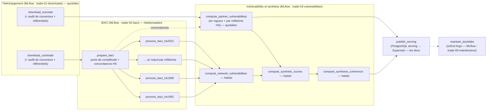

# Architecture du pipeline de production — Kedro · Argo · MLflow · DuckLake · Superset

> **Statut** : référence de conception, rédigée le 2026-09-15 à partir de la lecture du
> code de la branche `qb-vulnerabilities` (commit `6f24c6c`), des dépendances installées
> (`statflows 0.1.0`, `dt-ducklake-manager 0.3.1`, `duckdb 1.5.3`) et du code source des
> plugins `argo-kedro 0.1.41`, `kedro-mlflow 2.0.3`, `kedro-viz 12.4.0` (`kedro 1.6.0`).
> **Révision 1 du 2026-09-18** (voir le journal ci-dessous). Aucune vérification n'a pu
> être faite sur le cluster (cf. C-20) : tout ce qui touche à Onyxia est une
> **hypothèse**, recensée en §8 (questions ouvertes) ; les opérations qui **doivent** être
> exécutées depuis Onyxia sont listées en §12.
>
> **Compagnon** : `PIPELINE_PROMPTS.md` (liste de prompts d'implémentation, chacun
> exécutable dans une session Claude Code séparée). Ce document fait foi en cas de
> divergence.

### Journal des révisions

| Date | Changement | Sections touchées |
|---|---|---|
| 2026-09-15 | Version initiale | — |
| 2026-09-18 | Dates de début par source : **1988** (Comext) et **1994** (Comtrade) au lieu de 1992 ; millésimes BACI recalés | C-02, PD-08, PS-04, PQ-05 |
| 2026-09-18 | BACI : **estimation exacte par passes et statistiques suffisantes** (mémoire bornée à une année, aucune approximation) ; unité de fraîcheur = millésime ; rafraîchissement hebdomadaire | C-06, C-24, PD-05, PD-10, PD-22, PS-14, PQ-10 |
| 2026-09-18 | `dt-ducklake-manager 0.3.1` : ajout de colonnes natif (`allow_new_columns`, `add_columns`) | C-13, PD-11, PS-16 |
| 2026-09-18 | Métriques d'export `CDI2` / `CDI3` retenues ; `FLOWS: [import, export]` par défaut | C-12, PD-09, PS-15, PQ-06 |
| 2026-09-18 | **Millésimes de nomenclature** : une seule table par famille, clé `classification`, drapeau `in_force` ; métriques partenaires calculées aussi par millésime HS | C-11, C-25, PD-20, PS-28 |
| 2026-09-18 | Téléchargement : **ordre année-majeur**, plus de liste de produits prioritaires, même comportement en `demo` et en production | PD-06, PD-07, PS-12 |
| 2026-09-18 | Paquet Kedro renommé **`kedro_pipeline/`** (ex-`kedro_pipeline/`) ; **suppression des scripts** en fin de migration | PD-01, PD-02, PS-01 |
| 2026-09-18 | **Couche de restitution** : schéma PostgreSQL `serving` alimenté par le pipeline, tableaux de bord **Superset** (vulnérabilités + supervision par étape) | C-22, C-23, PD-13, PD-21, PS-29 à PS-31, §5.8 |
| 2026-09-18 | **Deux cadences** (quotidienne / hebdomadaire) sur un même `WorkflowTemplate` ; cohérence sans approximation | PD-12, PD-14, PD-23, PS-21 |
| 2026-09-18 | Ressources Onyxia connues (100 pods, 0,1–30 CPU, 1–200 Gi) | PS-20, PQ-01 |
| 2026-09-18 | Nouvelle section §12 : opérations à exécuter depuis Onyxia | §12 |

## Sommaire

0. [Conventions de lecture](#0-conventions-de-lecture)
1. [État des lieux : constats sur le code actuel](#1-état-des-lieux--constats-sur-le-code-actuel)
2. [Vue d'ensemble de la cible](#2-vue-densemble-de-la-cible)
3. [Décisions d'architecture](#3-décisions-darchitecture)
4. [Spécifications détaillées](#4-spécifications-détaillées)
5. [Runbooks d'exploitation](#5-runbooks-dexploitation)
6. [Stratégie de tests](#6-stratégie-de-tests)
7. [Risques](#7-risques)
8. [Questions ouvertes et hypothèses retenues](#8-questions-ouvertes-et-hypothèses-retenues)
9. [Actions manuelles à la charge de l'utilisateur](#9-actions-manuelles-à-la-charge-de-lutilisateur)
10. [Phasage et planning jusqu'à la présentation](#10-phasage-et-planning-jusquà-la-présentation)
11. [Références](#11-références)
12. [Opérations à exécuter depuis Onyxia](#12-opérations-à-exécuter-depuis-onyxia)

---

## 0. Conventions de lecture

| Préfixe | Signification |
|---|---|
| `C-xx` | Constat sur le code existant (§1) |
| `PD-xx` | Décision d'architecture (§3) : décision, justification, alternatives écartées, conséquences |
| `PS-xx` | Spécification détaillée (§4) : contrat d'implémentation, avec exemples |
| `PR-xx` | Risque (§7) |
| `PQ-xx` | Question ouverte (§8), toujours accompagnée de l'**hypothèse retenue par défaut** |
| `K-xx` | Prompt d'implémentation (`PIPELINE_PROMPTS.md`) |

Les préfixes `D-xx`, `S-x`, `M-xx` sans `P` renvoient à `AGREGATION_ARCHITECTURE.md`
(synthèse multicritère) et ne sont pas redéfinis ici.

Vocabulaire :

- **étape** : l'une des neuf unités fonctionnelles du pipeline (téléchargement Eurostat,
  téléchargement Comtrade, BACI, vulnérabilités partenaires, vulnérabilités réseau,
  synthèse, cohérence, publication de service, maintenance) ;
- **nœud** : un nœud Kedro ; **tâche** : une tâche du DAG Argo (= un pod) ;
- **unité de fraîcheur** : la maille à laquelle une étape décide de (re)calculer
  (couple reporter × produit, millésime HS, contexte de synthèse…) ;
- **empreinte méthodologique** (*fingerprint*) : hachage de la version de code déclarée
  et des paramètres méthodologiques d'une métrique, d'une méthode ou d'une étape (PS-10) ;
- **millésime** (*vintage*) : une édition du Système harmonisé (`HS1992` … `HS2022`) ;
  **nomenclature en vigueur** : le millésime dans lequel les codes d'une année donnée
  sont déclarés (PD-20) ;
- **tranche** : sous-ensemble d'une année (ou une année entière) traité en mémoire par
  BACI (PS-14) ; **passe** : une lecture complète des tranches d'un millésime ;
- **couche de service** (*serving*) : tables PostgreSQL dérivées, lues par Superset
  (PD-21).

Conventions de code inchangées (cf. `CLAUDE.md`) : commentaires en français à formulation
nominale, docstrings Google Style en anglais, type hints systématiques, API sklearn pour
les transformations, **aucune valeur méthodologique en dur** dans `macroforecast/`.

---

## 1. État des lieux : constats sur le code actuel

Les constats ci-dessous motivent les décisions. Chacun indique où il se trouve et sa
gravité pour la mise en production (🔴 bloquant, 🟠 à traiter avant le régime nominal,
🟡 dette).

| ID | Gravité | Constat | Localisation |
|---|---|---|---|
| C-01 | 🔴 | Restrictions de test codées en dur : `queries = queries[:10]` (Comtrade) et `queries[:5]` (Eurostat). En l'état, la production ne téléchargerait que 15 requêtes. | `scripts/download_comtrade.py:226`, `scripts/download_eurostat_comext.py:216` |
| C-02 | 🔴 | Profondeur historique insuffisante : `period_start: "2010"` pour Comtrade ; les millésimes BACI configurés commencent en 2012 (`HS2012`). Les objectifs de couverture — **1988** pour Comext (et les indicateurs partenaires), **1994** pour Comtrade (et BACI, conformément à la couverture déclarative jugée satisfaisante par le CEPII à partir de 1994) — ne sont couverts ni au téléchargement ni au redressement. *(Révision : 1992 → 1988/1994.)* | `config/datasets/comtrade.yaml:41`, `config/baci.yaml:108-111` |
| C-03 | 🔴 | `os.environ["AWS_SESSION_TOKEN"]` est lu sans défaut dans les neuf constructions de connecteur. Avec les **clés Minio permanentes** du secret `trade-s3-credentials`, il n'y a pas de jeton de session : `KeyError` au démarrage de chaque pod. | tous les `scripts/*.py` |
| C-04 | 🟠 | La construction `DuckLakeConnector.from_postgres(...)` est dupliquée neuf fois, avec des divergences : `admin_user="postgres"` codé en dur (absent de `process_baci*.py`), `admin_dbname=os.environ["PGDATABASE"]`. | `scripts/*.py` |
| C-05 | 🟠 | Identifiants de dataflow en dur (`DATAFLOW = "C_A_HS"`, `"DS-045409"`) dans les `main()`, contraire à la règle « aucune valeur en dur qui présage de l'exécution ». | `scripts/*.py` |
| C-06 | 🔴 | `process_baci*.py` lit **toute** la table de faits Comtrade dans un DataFrame pandas (`SELECT cols FROM comtrade.fact_table`), puis `run_baci` enchaîne les six étapes sur ce bloc unique. À partir de 1994 et en HS6 bilatéral (≈ 10 à 13 millions de flux miroirs par année récente), un millésime long comme `HS1992` (1994 → aujourd'hui) représente plusieurs centaines de millions de lignes : dépassement mémoire certain. Or **quatre estimations sont mises en commun sur toutes les années du millésime** (taux de conversion en tonnes, médiane mondiale des valeurs unitaires, équation de gravité avec indicatrices d'année, ANOVA de qualité des déclarants), ce qui interdit un simple traitement année par année. La solution retenue est l'expression de ces estimateurs par **statistiques suffisantes accumulées tranche par tranche** (PD-22, PS-14) : exacte et à mémoire bornée. | `scripts/process_baci_hs.py:484`, `scripts/process_baci.py:288`, `macroforecast/trade/processing/baci.py` |
| C-07 | 🟠 | Les registres de fraîcheur sont des fichiers JSON uniques, **relus puis réécrits en entier** à chaque mise à jour, sans verrou. Deux pods parallèles qui écrivent le même registre (ex. deux millésimes BACI) perdent des entrées (*last writer wins*). | `process_baci_hs.py:608-622`, `compute_*` |
| C-08 | 🔴 | Dans `statflows.core.download.SDMXDownloader._process_query`, le registre des téléchargements est **réécrit intégralement sur S3 après chaque requête**, et chaque requête non vide déclenche un upsert DuckLake avec `compact_after_update=True`. Pour 10⁴ à 10⁵ requêtes, le coût devient quadratique (PUT de fichiers de plusieurs Mo, compaction répétée, un snapshot par requête). | `statflows/core/download.py:593-602`, `statflows/storage/ducklake/tables.py:171-175` |
| C-09 | 🟠 | Le client Eurostat décide de l'incrémental à partir de la date de mise à jour **du dataflow entier** (`get_data_last_update`) : après chaque publication Comext, toutes les requêtes déjà téléchargées redeviennent éligibles (10 dernières observations chacune). Le client Comtrade décide, lui, par période (`lastReleased`). | `statflows/sources/eurostat/client.py:733-786`, `statflows/sources/comtrade/client.py:871-925` |
| C-10 | 🟠 | Les règles de fraîcheur ignorent les **changements de méthodologie** : corriger une formule ou ajouter une métrique ne déclenche aucun recalcul. Seuls `SYNTHESIS.FORCE` et `COHERENCE.FORCE` existent ; les étapes partenaires, réseau et BACI n'ont pas de forçage. | `scripts/compute_*.py` |
| C-11 | 🟠 | La synthèse filtre en dur le flux import (`p."flow" = 1`) et les 5 dernières périodes. La jointure réseau ne retient que `HS2022`, y compris pour les années antérieures à 2022, dont les codes Comext sont pourtant déclarés dans un millésime plus ancien : la jointure `substr(product,1,6)` est alors **fausse pour tout code redéfini entre les millésimes** (PD-20). | `config/synthesis.yaml:55-64` |
| C-12 | 🟡 | Côté partenaires, `HHI` est calculé pour les deux flux ; `CDI2` et `CDI3` ne sont définis que pour l'import (valeur nulle ailleurs). Aucune métrique d'export dédiée n'existe. Les métriques de réseau portent sur le graphe mondial d'un produit : elles ne dépendent pas du sens du flux. *(Révision : définitions d'export retenues, PD-09.)* | `macroforecast/trade/vulnerabilities/metrics.py` |
| C-13 | ✅ | ~~L'upsert de `dt_ducklake_manager` ne sait pas ajouter une colonne~~ **Résolu par `dt-ducklake-manager 0.3.1`** : `DatabaseUpdater.update_database(..., allow_new_columns=True)` ajoute les colonnes absentes (`ALTER TABLE … ADD COLUMN … DEFAULT NULL` + ligne de métadonnées) avant l'upsert, et `add_columns(df)` diffuse une nouvelle colonne sur les lignes existantes par clé primaire en une seule mise à jour. Reste à faire : `statflows.write_dataframe` ne transmet ni `allow_new_columns` ni `compact_after_update` (PS-27, PD-11). | `dt_ducklake_manager/operations/updater.py:176-372`, `statflows/storage/ducklake/tables.py:165-175` |
| C-14 | 🔴 | Le `Dockerfile` part de `python:3.12-slim` alors que `requires-python = ">=3.13"`, copie un dossier `parameters/` inexistant, n'installe aucun extra (`tracking`, `optimal-transport`) et utilise `uv:latest` (non reproductible). | `docker/Dockerfile` |
| C-15 | 🔴 | `kubernetes/workflow.yaml` déclare `kind: Workflow` avec des champs de `CronWorkflow` (`schedule`, `concurrencyPolicy`…), invalides pour ce type ; il référence un script `trade-script` inexistant et un secret `comtrade-credentials` qui ne correspond pas aux secrets créés (`comtrade-api-credentials`, `trade-s3-credentials`). À traiter comme un exemple, pas comme une base. | `kubernetes/workflow.yaml` |
| C-16 | 🟡 | `config/base/catalog.yaml` et `config/base/parameters.yaml` existent mais sont vides : amorce d'une arborescence Kedro. | `config/base/` |
| C-17 | 🟡 | Incohérence des chemins CEPII : `process_baci.py` préfixe `s3://{bucket}/` **et** passe `bucket=`, alors que `process_baci_hs.py` passe le chemin relatif et `bucket=`. | `process_baci.py:257-264` vs `process_baci_hs.py:453-454` |
| C-18 | 🟡 | `scripts/test_baci.py` (écriture `df_reconciled.xlsx` en local) est un script de mise au point, hors pipeline. | `scripts/test_baci.py` |
| C-19 | 🟡 | Le suivi MLflow crée une expérience par script, avec des noms de métriques séparés par des points (`gravity.r2`) : l'interface MLflow ne regroupe pas automatiquement les graphiques par étape. | `macroforecast/tracking/` |
| C-20 | 🔴 | **Accès au cluster impossible depuis le poste local** : le jeton de rafraîchissement OIDC de `sspcloud_access_script.txt` est lié à une preuve DPoP (`oauth2: "invalid_grant" "DPoP proof is missing"`), que le fournisseur `oidc` de `kubectl` ne sait pas produire. Voir PQ-09. | `sspcloud_access_script.txt` |
| C-21 | 🟡 | Aucune documentation mkdocs, aucun workflow GitHub Actions, aucun `.dockerignore` dans le dépôt. `sspcloud_access_script.txt` et `Trade deployment.md` sont bien ignorés par git, mais **seraient copiés dans une image** construite avec `COPY . .`. | racine |
| C-22 | 🟠 | **Aucune table de référence** (libellés de produits par millésime, libellés de pays, tables de passage HS exposées) n'est produite : un tableau de bord ne peut afficher que des codes. Les codelists sont pourtant téléchargées à chaque exécution (`fetch_dimension_codelists`) et les concordances UNSD sont en cache Parquet. | `scripts/download_*.py`, `scripts/process_baci_hs.py:_ensure_concordances` |
| C-23 | 🔴 | **Aucune couche de restitution** : les résultats ne sont lisibles que par une session DuckDB attachée au catalogue DuckLake (extensions, identifiants S3 et PostgreSQL). Un outil de tableau de bord comme Superset n'a pas de pilote DuckLake prêt à l'emploi (PQ-13). | — |
| C-24 | 🔴 | La fraîcheur BACI envisagée initialement (unité = millésime × **année**) est **méthodologiquement fausse** : les paramètres estimés sur l'ensemble des années du millésime (C-06) changent dès qu'une année est ajoutée ou révisée, donc toutes les années du millésime doivent être réécrites. C'est aussi la pratique du CEPII, qui republie chaque année la totalité de chaque millésime. | ce document, PS-14 v0 |
| C-25 | 🟠 | Les tables de résultats partenaires (`indicators`, `synthesis`, `synthesis_diagnostics`) n'ont **pas de dimension de nomenclature** : un code produit y désigne des définitions différentes selon l'année (SH6 révisé tous les ~5 ans, NC8 chaque année), ce qui rend toute lecture temporelle d'un produit ambiguë. | `config/vulnerabilities.yaml`, `config/synthesis.yaml` |
| C-26 | 🟠 | L'ordre de construction des requêtes Comtrade est **produit-majeur** (`for lot in produits: for période …`, `build_split_queries`), et la période n'est pas une dimension de découpage (`period_start` fixé dans `fixed_dims`) : une requête rapporte toutes les années d'un lot. BACI ayant besoin d'**années complètes** (PD-06), c'est l'ordre inverse qui est utile. | `scripts/download_comtrade.py:163-190` |

Points solides sur lesquels on s'appuie :

- séparation nette méthodologie pure (`macroforecast/trade/*`, sans I/O) / scripts (I/O) ;
- runners isolant l'échec d'une unité (millésime, contexte) sans interrompre les autres ;
- registres écrits **après** succès de l'écriture, date capturée **avant** le calcul ;
- rapports structurés (`to_metrics()`) et protocole `RunTracker` pensé pour kedro-mlflow ;
- `download_updates` qui traite d'abord les requêtes jamais téléchargées, puis les plus
  anciennes, et s'arrête proprement à l'expiration de `max_runtime` ;
- tests de caractérisation (`tests/`), qui servent de contrat de non-régression.

---

## 2. Vue d'ensemble de la cible

### 2.1 Couches

```
┌──────────────────────────────────────────────────────────────────────────────┐
│ Restitution : Superset (Onyxia) ← PostgreSQL `trade_serving` (schéma serving) │
│               tableaux de bord « Vulnérabilités » et « Supervision pipeline » │
├──────────────────────────────────────────────────────────────────────────────┤
│ Infrastructure : GHCR (image) · Argo Workflows (WorkflowTemplate + 2 CronWorkflow)│
│                  MLflow (Onyxia) · PostgreSQL (catalogues DuckLake) · Minio S3 │
├──────────────────────────────────────────────────────────────────────────────┤
│ kedro_pipeline/  (NOUVEAU — projet Kedro : orchestration + I/O)               │
│   settings.py · pipeline_registry.py · pipelines/* (nœuds fins)               │
│   steps/*   (logique d'étape ; seule implémentation)                          │
│   io/*      (fabrique de connecteurs, datasets Kedro, registres, serving)     │
│   deploy/*  (rendu des manifestes Argo à partir du DAG argo-kedro)            │
├──────────────────────────────────────────────────────────────────────────────┤
│ scripts/   (TRANSITOIRES — enveloppes CLI de la phase 0, supprimées en K-18)   │
├──────────────────────────────────────────────────────────────────────────────┤
│ macroforecast/  (INCHANGÉ dans son rôle — méthodologie pure, sans I/O ;       │
│                  BACI réécrit en estimateurs « par passes », PS-14)           │
├──────────────────────────────────────────────────────────────────────────────┤
│ statflows (dépendance externe — acquisition, registres de téléchargement,     │
│            écriture DuckLake)  · dt-ducklake-manager (connecteur, maintenance) │
└──────────────────────────────────────────────────────────────────────────────┘
```

### 2.2 DAG cible (pipeline `__default__`)



Chaque flèche est une dépendance de **données** portée par un dataset Kedro (PS-07). En
local, `kedro run` exécute tout le DAG dans un seul processus. Sur Argo, chaque nœud (ou
`FusedPipeline`) devient une tâche, donc un pod (PD-05). Le DAG est unique ; deux
**points d'entrée** Argo en exécutent des sous-ensembles à des cadences différentes
(PD-23) :

| Point d'entrée | Nœuds | Cadence | Justification |
|---|---|---|---|
| `daily` | téléchargements, partenaires, `publish_serving` | quotidienne (01:00) | acquisition incrémentale, métriques partenaires bon marché, tableau de bord rafraîchi |
| `weekly` | `prepare_baci`, `process_baci_*`, réseau, synthèse, cohérence, `publish_serving` | hebdomadaire (`WEEKLY_DAY`), fenêtre de 6 jours | BACI réestime tout un millésime (PD-22) ; cohérence **sans approximation** (PD-12) : la justesse prime sur la fraîcheur |

### 2.3 Flux de contrôle

1. 01:00 Europe/Paris : le `CronWorkflow` `trade-pipeline-daily` instancie le
   `WorkflowTemplate` `trade-pipeline` (point d'entrée `daily`). Le samedi à 02:00, le
   `CronWorkflow` `trade-pipeline-weekly` l'instancie avec le point d'entrée `weekly`
   (PS-21.2). Les deux peuvent se recouvrir : ils n'écrivent jamais la même table, et
   `publish_serving` comme la maintenance sont protégés par un **mutex Argo**.
2. Les deux téléchargements tournent en parallèle, chacun dans un **budget de temps**
   (`MAX_RUNTIME`, 10 h par défaut) : ils s'arrêtent proprement une fois le budget épuisé.
3. Les étapes aval s'exécutent **même si un téléchargement a échoué** : elles ne lisent
   que des données commitées et décident seules, par leurs registres de fraîcheur, de ce
   qui est à recalculer (PD-06, PD-10).
4. En fin de workflow, qu'il ait réussi ou non, le gestionnaire `onExit` lance la
   maintenance DuckLake (PD-16).
5. Tous les pods journalisent dans MLflow sous un même `workflow_id` (PD-13) **et**
   dans la table `serving.pipeline_metrics` lue par le tableau de bord de supervision
   (PS-31).

---

## 3. Décisions d'architecture

### PD-01 — Projet Kedro `kedro_pipeline` à la racine, configuration dans `config/`

**Décision.**
- Nouveau package Python **`kedro_pipeline/`** à la racine du dépôt, à côté de
  `macroforecast/` et (transitoirement) `scripts/`. Déclaration dans `pyproject.toml` :
  `[tool.kedro] package_name = "kedro_pipeline"`, `project_name = "trade-analysis"`,
  `kedro_init_version = "1.6.0"`, `source_dir = "."`.
- *Nom.* `kedro_pipeline` (et non `kedro_pipeline`, ni `pipeline`) : le nom dit ce que
  contient le dossier — le projet Kedro et rien d'autre — et le distingue sans ambiguïté
  de `macroforecast/` (la méthodologie) et de `kedro.pipeline` (module de la
  bibliothèque, sans conflit d'import puisque le paquet racine diffère). Un simple
  `pipeline/` serait trop générique ; `kedro_pipeline` laissait croire que la
  méthodologie « trade » y vivait. Les noms des ressources Kubernetes (`trade-pipeline`,
  `trade-pipeline-daily`) désignent, eux, l'application, et sont conservés.
- Source de configuration Kedro : **`config/`** (`CONF_SOURCE = "config"` dans
  `settings.py`), avec les environnements :
  - `base` : paramètres de production, versionnés ;
  - `local` : surcharges de poste (non versionné, sauf `.gitkeep`) ;
  - `cloud` : surcharges d'exécution dans Argo (chemins S3, `n_jobs`, budgets) ;
  - `demo` : périmètre réduit pour la présentation (PD-19, PS-04.4).
- `macroforecast/` reste de la méthodologie pure : **aucune dépendance à Kedro** n'y est
  introduite.

**Justification.** Kedro impose un package projet qui contient `settings.py` et
`pipeline_registry.py`. Le placer dans `macroforecast/` mêlerait orchestration et
méthodologie, alors que `CLAUDE.md` exige de les séparer. `source_dir = "."` évite de
déplacer `macroforecast/` et `scripts/` sous `src/`, ce qui casserait les entrées
`[project.scripts]` et les imports des tests. Enfin, le dossier `config/` existe déjà et
contient l'amorce `config/base/` (C-16).

**Alternatives écartées.** Un layout `src/` standard (déplacements massifs, imports
cassés) ; un dépôt Kedro séparé (deux images, deux versions de configuration).

**Conséquences.** `hatchling` doit empaqueter `macroforecast`, `scripts` et
`kedro_pipeline` (PS-02). Les scripts voient leurs chemins de configuration par défaut
changer (PD-03).

### PD-02 — Implémentation unique dans `kedro_pipeline/steps/` ; les scripts sont transitoires et supprimés en fin de migration

**Décision.** La logique d'orchestration de chaque script (lecture des registres,
sélection des unités, boucle d'isolation des échecs, écriture, mise à jour du registre)
est déplacée dans des **fonctions d'étape** de `kedro_pipeline/steps/<étape>.py`. Ces
fonctions reçoivent des **objets résolus** (paramètres typés, poignées de tables,
registres, tracker) et ne lisent **ni fichier YAML ni variable d'environnement**.

Cycle de vie des scripts :

| Phase | Rôle de `scripts/` |
|---|---|
| 0 (démonstration) | Seul moteur d'exécution : le workflow de transition (K-03) les appelle. Les nouveaux modules (`kedro_pipeline/io`, `kedro_pipeline/steps/serving.py`) sont écrits **sans dépendance à Kedro** pour être appelés par les scripts. |
| 3 (Kedro) | Enveloppes CLI minces (chargement des paramètres, poignées, appel de l'étape) qui **ré-exportent** les helpers importés par `tests/test_scripts_*.py`, afin que la suite de caractérisation reste verte pendant le refactoring (K-11). |
| 4 (production, K-18) | **Supprimés**, ainsi que les entrées `[project.scripts]`. Les tests de caractérisation sont déplacés vers `tests/pipeline/` et importent directement les fonctions d'étape (mêmes assertions). |

**Justification.** Une fois les nœuds Kedro en place, un script n'est plus qu'un second
chemin d'appel de la même fonction d'étape : deux chargeurs de configuration, deux jeux
de variables d'environnement, deux points d'entrée à tester, pour un besoin — déboguer
une étape seule — que Kedro couvre déjà (`kedro run --pipeline baci --nodes
process_baci_hs2017 --env local`, ou `--from-nodes`/`--to-nodes`). Conserver les
scripts, c'est garantir qu'ils finissent **redondants puis inopérants** (paramètre ajouté
au nœud et oublié dans le script). Les seuls utilitaires hors pipeline (mesures
ponctuelles, migrations de registres) vivent dans `tools/` et ne sont pas des points
d'entrée du paquet.

**Conséquences.** Le refactoring (K-11) doit laisser `uv run pytest` vert à l'identique ;
K-18 supprime `scripts/` et migre les tests. Toute exécution ponctuelle en production
passe par `argo submit` (PS-11) ou `kedro run` depuis un service Onyxia (§12).

### PD-03 — Configuration : fichiers `parameters_*.yml` à clé racine, secrets par `credentials.yml`

**Décision.**
1. Les fichiers méthodologiques migrent vers `config/base/`, **un fichier par domaine,
   chacun encapsulé sous une clé racine unique** (le chargeur Kedro fusionne tous les
   `parameters*` dans un seul dictionnaire et refuse les clés dupliquées ; or `MLFLOW`,
   `DOWNLOADS`, `fixed_dims`… existent déjà dans plusieurs fichiers) :

   | Ancien fichier | Nouveau fichier | Clé racine |
   |---|---|---|
   | `config/datasets/comtrade.yaml` | `config/base/parameters_comtrade.yml` | `comtrade` |
   | `config/datasets/eurostat.yaml` | `config/base/parameters_eurostat.yml` | `eurostat` |
   | `config/datasets/oecd.yaml` | `config/base/parameters_oecd.yml` | `oecd` |
   | `config/baci.yaml` | `config/base/parameters_baci.yml` | `baci` |
   | `config/vulnerabilities.yaml` | `config/base/parameters_vulnerabilities.yml` | `vulnerabilities` |
   | `config/synthesis.yaml` | `config/base/parameters_synthesis.yml` | `synthesis` |
   | *(nouveau)* | `config/base/parameters_runtime.yml` | `runtime` (dont les millésimes de nomenclature, PS-04.1) |
   | *(nouveau)* | `config/base/parameters_maintenance.yml` | `maintenance` |
   | *(nouveau)* | `config/base/parameters_serving.yml` | `serving` (PS-29) |

   Les ancres YAML restent valides car chaque fichier est analysé isolément.
2. Les identifiants de dataflow sortent du code (C-05) : clé `DATAFLOW` dans chaque bloc
   (`comtrade.DATAFLOW: "C_A_HS"`, `eurostat.DATAFLOW: "DS-045409"`).
3. Les blocs `MLFLOW` par script disparaissent au profit de `config/base/mlflow.yml`
   (kedro-mlflow, PD-13). Les options de journalisation (`LOG_ARTIFACTS`, `DRIFT`)
   restent dans les blocs d'étape sous `TRACKING`.
4. Les secrets et variables d'environnement passent exclusivement par
   `config/base/credentials.yml`, avec le résolveur `oc.env` (PS-05). Aucun
   `os.environ[...]` ne subsiste dans `steps/` ni dans les nœuds.
5. Tant qu'ils existent (PD-02), les scripts lisent les nouveaux fichiers via
   `kedro_pipeline.config.load_parameters(env="base")`, qui reproduit la fusion Kedro
   (`OmegaConfigLoader`). Leurs variables d'environnement historiques
   (`BACI_CONFIG_PATH`…) sont supprimées, **`KEDRO_ENV`** les remplace.

**Justification.** On conserve la paramétrisation externe voulue, tout en la rendant
native pour Kedro (`params:baci.CLASSIFICATIONS`) et visible dans kedro-viz.

### PD-04 — Datasets Kedro : poignées paresseuses de tables DuckLake et registres JSON

**Décision.** Le catalogue ne matérialise **jamais** une table DuckLake complète en
mémoire. Deux types de datasets personnalisés vivent dans `kedro_pipeline/io/datasets.py` :

- **`DuckLakeTableDataset`** : `load()` renvoie une **poignée** `DuckLakeTable` (catalogue,
  schéma, table, fabrique de connecteur ; aucune connexion ouverte), qui expose
  `connect()`, `query(sql) -> pd.DataFrame`, `upsert(df, primary_keys)`, `exists()`,
  `add_missing_columns(df)` (PD-11). `save(obj)` accepte une poignée (cas nominal : le
  nœud a écrit via la poignée et la renvoie pour matérialiser la lignée) et vérifie
  qu'elle désigne bien la même table ; il **refuse un DataFrame**, afin que toute écriture
  passe par l'upsert explicite du nœud.
- **`FreshnessRegistryDataset`** : `load()` renvoie un `FreshnessRegistry` (PS-10) adossé
  à des fichiers JSON **fragmentés** sur S3 ; `save(registry)` persiste les seuls
  fragments modifiés.

Les nœuds reçoivent donc des poignées en entrée et **renvoient** des poignées en sortie.
Kedro en déduit les dépendances du DAG, kedro-viz affiche la lignée et argo-kedro calcule
les dépendances entre tâches (il rapproche les sorties d'un nœud des entrées d'un autre).

**Justification.**
1. Les étapes font des **upserts incrémentaux** par lots (un contexte, un millésime),
   incompatibles avec la sémantique « un `save` = un DataFrame complet » de Kedro.
2. Les volumes Comtrade/BACI interdisent le chargement complet (C-06).
3. argo-kedro **n'accepte pas de `MemoryDataset` entre tâches** : toute entrée/sortie doit
   être déclarée au catalogue, et une poignée se recharge à l'identique dans un autre pod.

**Alternatives écartées.** `kedro_datasets.ibis.TableDataset` (pas d'upsert DuckLake) ;
un DataFrame en sortie de nœud (explosion mémoire, pas d'incrémental) ; des nœuds sans
sorties (plus de lignée, plus de dépendances Argo).

**Conséquences.** Les datasets ne se connectent **jamais** dans `__init__` : `kedro viz
build` en CI (sans secrets) doit pouvoir instancier le catalogue.

### PD-05 — Parallélisme : où couper en pods, où paralléliser dans le pod

C'est la décision centrale demandée. Règle générale : **une frontière de pod se justifie
si les trois conditions suivantes sont réunies** :

1. **pas d'écrivain partagé** : les deux branches n'écrivent pas la même table DuckLake ni
   le même fragment de registre (DuckLake gère la concurrence de façon optimiste, et deux
   commits sur la même table entrent en conflit) ;
2. **domaine d'échec ou profil de ressources distinct** : API et quota différents, besoin
   mémoire différent, risque d'OOM à isoler ;
3. **durée ≫ coût de démarrage d'un pod** (≈ 30 à 90 s : tirage d'image, import de
   `macroforecast`, connexion au catalogue), soit plus de 10 minutes environ.

Dans le cas contraire, on parallélise **à l'intérieur du pod** (processus `joblib`/`loky`,
un seul écrivain qui collecte les résultats et écrit par lots).

| Étape | Tâches Argo (pods) | Parallélisme intra-pod | Justification |
|---|---|---|---|
| Téléchargement Eurostat | **1 pod** (`FusedPipeline` téléchargement + audit de couverture) | Aucun : séquentiel, sous rate limiter | API à débit limité par IP ; un seul écrivain du registre `statflows` et de la table `DS_045409` ; paralléliser n'accélère pas un débit plafonné. |
| Téléchargement Comtrade | **1 pod** (idem), **en parallèle** d'Eurostat | Aucun | Autre API, autre quota (clé premium) ; les deux sources sont indépendantes. |
| Préparation BACI | **1 pod léger** (porte de complétude + cache des tables HS) | — | Écrivain unique du cache de concordances (partagé avec les partenaires par millésime, PD-20) ; évite une course entre millésimes. |
| Redressement BACI | **1 pod par millésime HS** (fan-out) | Passes séquentielles sur les tranches annuelles (PS-14) ; BLAS multi-thread ; `n_jobs` limité par `NUM_CPU` | Chaque millésime écrit son propre schéma (`baci_hs2017`…), donc sans écrivain partagé ; mémoire bornée à **une tranche** grâce aux statistiques suffisantes (PD-22) ; un OOM ne doit emporter qu'un millésime ; le fan-out divise le temps écoulé. |
| Vulnérabilités réseau | **1 pod** | `joblib` sur les groupes (millésime × année × produit), écrivain unique | Tous les millésimes écrivent la même table `network_indicators`. |
| Vulnérabilités partenaires | **1 pod**, en parallèle du bloc BACI/réseau | Boucle sur les millésimes (en vigueur puis historiques, PD-20) et découpage par reporter ; calcul vectorisé narwhals ; backend `polars` multi-thread en option | Table unique `indicators`, clé étendue par `classification`. |
| Synthèse | **1 pod** | `joblib` sur les contextes (`n_jobs = NUM_CPU`), écriture par lots de K contextes | Table unique `synthesis` ; grand nombre de petites unités CPU (contextes). |
| Cohérence | **1 pod** | Idem | Table unique `synthesis_diagnostics`. |
| Publication de service | **1 pod** (mutex `trade-serving`) | Séquentiel par table de service | Écrivain unique du schéma PostgreSQL `serving` (PD-21). |
| Maintenance | **1 pod** (`onExit`, mutex `trade-maintenance`) | Séquentiel par table | Les opérations de maintenance DuckLake doivent être sérialisées sur un catalogue. |

Conséquences : 2 + 1 + *n*<sub>millésimes</sub> + 4 + 1 + 1 tâches, soit **16 pods**
avec les sept millésimes HS1992, HS1996, HS2002, HS2007, HS2012, HS2017, HS2022 (le point
d'entrée `daily` n'en instancie que 4 : deux téléchargements, partenaires, publication).
Le chemin critique du point d'entrée `weekly` est `prepare_baci → max(process_baci_*) →
network → synthesis → coherence → publish_serving`. Ressources Onyxia constatées par
l'utilisateur : au plus **100 pods** simultanés, de **0,1 à 30 CPU** et de **1 à 200 Gi**
par pod, le délai de démarrage croissant avec la demande (PS-20, PQ-01).

**Alternatives écartées.**
- *Un pod par étape pour BACI (millésimes séquentiels)* : temps écoulé multiplié par six,
  et le premier OOM emporte tout.
- *Réseau fan-out par millésime* : conflits d'écriture sur `network_indicators` (on
  pourrait ajouter des tentatives, mais le calcul réseau est court comparé à BACI).
- *Téléchargement fragmenté en N pods* : même IP et même quota, registre partagé ;
  aucun gain.

### PD-06 — Rattrapage historique : calcul progressif par unité, ordre de téléchargement année-majeur, porte de complétude BACI

**Décision.** On n'attend **pas** la fin du téléchargement pour calculer. On combine :

1. **Calcul progressif** : chaque jour, chaque étape aval calcule ce qui est devenu
   disponible depuis la veille, grâce aux registres de fraîcheur (PD-10). Concrètement :
   - *partenaires (Eurostat)* : un couple reporter × produit est calculable dès que sa
     requête a été téléchargée une fois. Le couple est complet, puisque la requête
     rapporte tous les partenaires, les deux flux et tous les indicateurs. Le calcul
     progresse donc **produit par produit** ;
   - *synthèse / cohérence* : les contextes s'enrichissent au fil des semaines. Une
     cellule absente un jour J apparaît au jour J+k et fait recalculer le contexte
     (PS-17). Les niveaux `by_reporter` et `global` bougent tant que la couverture
     progresse : c'est attendu, et c'est tracé dans MLflow (`coverage/*`).
2. **Ordre de téléchargement année-majeur, sans liste de produits prioritaires.**
   `download_updates` traite en premier les requêtes jamais téléchargées, **dans l'ordre
   de la liste fournie** (tri stable, `SDMXDownloader._prioritize`). La liste est donc
   construite pour que l'on complète **un lot de produits pour une année, puis tous les
   lots de cette année, puis l'année suivante** : boucle externe sur les années (ordre
   `periods_order`, `desc` par défaut : années récentes d'abord), boucle interne sur les
   lots de produits dans l'**ordre naturel des codes** (PS-12). Il n'y a **pas** de liste
   de produits prioritaires : le périmètre produit d'un environnement est fixé par les
   filtres `include_regex`/`include` (`demo` : une centaine de codes), et **le
   comportement de téléchargement est identique en `demo` et en production** — seul le
   périmètre change. Pourquoi l'année plutôt que le produit comme unité de complétion :
   - BACI n'est calculable que sur des **années complètes** (point 3) et réestime **tout
     le millésime** à chaque passe (PD-22) : disposer tôt d'une année entière débloque
     un premier BACI, alors qu'un produit complet sur toutes les années ne débloque rien ;
   - la décision incrémentale du client Comtrade (`lastReleased`) est prise **par
     période** : une requête = une année rend cette décision exacte (PD-07) ;
   - la table BACI est partitionnée par année (PD-16), et une année arrive d'un bloc ;
   - les indicateurs partenaires (Eurostat) sont calculés par couple reporter × produit
     sur **toutes les années** rapportées par la requête : côté Eurostat, la période
     n'est pas une dimension de découpage (PD-07), l'ordre année-majeur ne s'y applique
     donc qu'à travers `PERIOD_WINDOWS` s'il est activé.
3. **Porte de complétude BACI** : BACI estime la gravité et la qualité des déclarants
   sur l'ensemble des flux du millésime : une année à moitié téléchargée biaiserait
   toutes les autres. Le nœud `prepare_baci` ne retient donc que les **années
   complètes**, c'est-à-dire celles dont toutes les requêtes (lots de produits) ont été
   téléchargées au moins une fois, selon le registre `statflows` (PS-14). Le seuil est
   paramétrable (`baci.COMPLETENESS.MIN_SHARE`, 1.0 en production). En environnement
   `demo`, le périmètre produit est restreint (une centaine de codes), donc les années
   sont rapidement complètes **au sens de ce périmètre**, et le résultat est **étiqueté
   provisoire** dans MLflow et dans une colonne `is_provisional` (un BACI sur un
   sous-ensemble de produits n'est pas le BACI complet : la qualité des déclarants est
   estimée sur tous les produits).

**Justification.** À l'échelle complète (1994 → aujourd'hui pour Comtrade, 1988 → pour
Comext, HS6, tous reporters), le rattrapage prendra **plusieurs jours à semaines**
(PR-01). Attendre la fin pour calculer repousserait tout résultat après la présentation.
Le calcul progressif est déjà dans l'ADN des scripts (registres par unité) ; il suffit
de l'étendre. L'ordre année-majeur est celui qui rend le plus vite une année utile à
BACI, et il supprime toute différence de comportement entre la démonstration et la
production.

### PD-07 — Granularité des requêtes de téléchargement

**Décision.**
- **Comtrade** : une requête = **(année × lot de `PRODUCTS_STEP` produits HS6)**, tous
  reporters (`reporters=None`), flux `M` et `X` ; liste **année-majeure** (PD-06,
  PS-12.1).
  - La période devient une dimension de découpage (C-26) : la décision `lastReleased` de
    `fetch_updates` est prise par période, ce qui la rend exacte et permet d'ordonner par
    année.
  - On ne télécharge que les **sous-positions à 6 chiffres** (`include_regex: '^\d{6}$'`) :
    BACI et le réseau travaillent en HS6, et les agrégats HS2/HS4 se déduisent par somme,
    sans raison de les télécharger (3 à 4 fois moins de requêtes).
- **Eurostat** : une requête = **(reporter × lot de `PRODUCTS_STEP` codes produits)**,
  les codes d'un lot appartenant au même chapitre HS2, **toutes les années** en une
  requête. La réponse contient `product` par ligne : le couple reporter × produit reste
  reconstituable. Liste **produit-majeure** (lot de produits, puis reporters).
  - Pourquoi la période n'est pas une dimension de découpage ici : la réponse d'un
    reporter × produit sur 37 ans reste petite (quelques centaines de partenaires × 2
    flux × 2 indicateurs), alors que l'API est bornée par le **nombre de requêtes**
    (limiteur de débit par IP) ; découper par année multiplierait les requêtes par ~37
    sans accélérer quoi que ce soit, et la décision incrémentale Eurostat est prise par
    dataflow, pas par période (C-09).
  - Paramètre optionnel **`PERIOD_WINDOWS`** (`null` par défaut) : liste ordonnée de
    fenêtres `[[2015, null], [1988, 2014]]` transmises par `startPeriod`/`endPeriod`.
    Quand il est renseigné, la fenêtre devient la boucle externe (ordre année-majeur
    par fenêtres), au prix d'autant de requêtes que de fenêtres. À réserver au cas où
    l'on voudrait des années récentes très tôt sur tout le périmètre ; **hors `demo`
    et hors `base` par défaut**. Sa prise en charge par `EurostatQueryRequestV30`
    est à vérifier (PQ-15).
  - `PRODUCTS_STEP` est un paramètre ; sa valeur de production sera fixée par une mesure
    (longueur d'URL et taille de réponse SDMX acceptées, PR-03).
  - Le lecteur du registre de téléchargement côté partenaires éclate les lots en couples
    (PS-12.3).
- Les plafonds de test (C-01) sont remplacés par un paramètre `MAX_QUERIES` (`null` en
  production **et** en `demo` : le périmètre `demo` est borné par ses filtres de codes,
  pas par un plafond de requêtes).
- **Référentiels** : les codelists récupérées pour construire les requêtes (produits par
  millésime, reporters, partenaires, avec leurs libellés) sont **persistées** dans le
  schéma `reference` du catalogue de la source (C-22, PS-28.4) à chaque exécution du
  téléchargement (upsert idempotent).

**Justification.** Le nombre de requêtes gouverne à la fois la durée du rattrapage, le
coût des registres (C-08) et la volumétrie de petits fichiers DuckLake. Réduire la
cardinalité d'un facteur 20 à 50 côté Eurostat rend la réactualisation post-publication
(C-09) tenable en une journée.

### PD-08 — Couverture historique par source (1988 Comext, 1994 Comtrade) et audit de couverture

**Décision.**
- **Deux dates de début**, une par source, après vérification de la disponibilité
  réelle des données par l'utilisateur :
  - `runtime.ANALYSIS_START_YEAR.eurostat: 1988` — Comext DS-045409 commence en 1988
    (entrée en vigueur du Système harmonisé) ; les indicateurs partenaires couvrent
    donc 1988 → aujourd'hui ;
  - `runtime.ANALYSIS_START_YEAR.comtrade: 1994` — couverture déclarative HS jugée
    satisfaisante à partir de 1994 (Gaulier & Zignago 2010, §2.1, figure 1 : le
    nombre de déclarants en HS passe de ~30 en 1989 à ~110 en 1994) ; BACI et le
    réseau couvrent 1994 → aujourd'hui.
  Ces valeurs sont référencées par interpolation OmegaConf dans
  `comtrade.split_filters.C_A_HS.periods.start`, `eurostat.fixed_dims.DS-045409`
  (`startPeriod`, si le client l'accepte, PQ-15) et `baci.PARAMETERS.period_start`.
- **Millésimes de nomenclature** (référentiel partagé `runtime.NOMENCLATURES.HS`,
  PS-04.1) : `HS1992` (en vigueur dès **1988**, dit H0), `HS1996`, `HS2002`, `HS2007`,
  `HS2012`, `HS2017`, `HS2022`, chacun avec son année d'entrée en vigueur. Le
  `START_YEAR` d'une cible BACI vaut `max(entrée en vigueur, ANALYSIS_START_YEAR.comtrade)`,
  soit **1994 pour HS1992** et l'année d'entrée pour les autres. Seul `HS1992` couvre
  toute la période d'analyse ; les millésimes récents offrent une nomenclature plus
  fine sur une période plus courte (PD-20 pour l'usage de ces millésimes dans les
  restitutions). PQ-05 (étiquette `low_coverage` pour 1992-1994) est **sans objet**.
- **Audit de couverture** en fin de nœud de téléchargement (PS-13) : pour chaque source,
  première et dernière période observées par reporter (et par chapitre HS2), nombre de
  requêtes jamais téléchargées, part téléchargée par année. Il est publié dans MLflow
  (`coverage/*` et artefact CSV). Une **alerte** (tag `coverage_alert=true` + log
  WARNING) se déclenche si `min(period) > ANALYSIS_START_YEAR.<source>` pour un
  reporter censé couvrir la période (liste `EXPECTED_FULL_HISTORY_REPORTERS`).

**Justification.** « Télécharger depuis 1988 (resp. 1994) » ne se vérifie que par les
données effectivement écrites. Les pays entrés tardivement dans l'UE ou ayant adopté le
SH tardivement auront légitimement une couverture plus courte : d'où une liste explicite
plutôt qu'une règle universelle.

### PD-09 — Paramétrage import / export

**Décision.**

| Étape | Paramétrable import/export ? | Comportement retenu |
|---|---|---|
| Téléchargement Comtrade | **Non** | Toujours `M` et `X` : la réconciliation miroir BACI a besoin des deux déclarations (import de A = export de B). |
| Téléchargement Eurostat | **Non** | Toujours flux `1` et `2` : `CDI3` (import) utilise les exports ; les métriques d'export ont besoin des deux. |
| BACI | **Non** | Produit une matrice bilatérale unique exportateur → importateur ; les vulnérabilités à l'import d'un pays lisent sa colonne, à l'export sa ligne. |
| Réseau | **Non** | Métriques du graphe mondial d'un produit, indépendantes du sens. Partagées par les deux sens dans la synthèse. |
| Partenaires (Eurostat) | **Oui** : `vulnerabilities.FLOWS: [import, export]` | Chaque métrique déclare `supported_flows` ; seules les combinaisons (métrique × flux) supportées et demandées sont calculées. |
| Synthèse / cohérence | **Oui** : `synthesis.FLOWS: [import, export]` | Le filtre SQL sur le flux est **généré** à partir de `FLOWS` (plus de `p."flow" = 1` en dur). `flow` fait déjà partie de `context_columns` : import et export ne sont jamais comparés entre eux. |

Métriques d'export (**retenues**, PQ-06 tranchée par l'utilisateur le 2026-09-18) :

| Métrique | Import (existant) | Export (retenu) | Lecture à l'export |
|---|---|---|---|
| `HHI` | concentration des fournisseurs | concentration des débouchés (déjà calculée pour le flux 2) | plus les débouchés sont concentrés, plus l'exportateur est exposé à un choc de demande |
| `CDI2` | imports extra-UE / imports totaux | **exports extra-UE / exports totaux** | part des débouchés situés hors du marché intérieur : dépendance aux marchés tiers |
| `CDI3` | imports extra-UE / exports totaux | **exports extra-UE / imports totaux** | exposition extra-UE rapportée à la capacité d'absorption du pays (ses importations) : image miroir exacte de `CDI3` import, obtenue en permutant les rôles de M et X |

Les deux définitions sont les **miroirs formels** des définitions à l'import (échange
`M ↔ X`), ce qui a trois avantages : une seule classe par métrique, paramétrée par le
sens (`flow_role`), donc une seule version d'empreinte ; la **polarité** reste « plus
élevé = plus vulnérable », donc rien ne change dans la synthèse ; les seuils d'alerte
(`0.5` pour `CDI2`, `1.0` — parité — pour `CDI3`) conservent la même lecture. Deux
réserves à documenter dans les docstrings : `CDI3` export n'a pas d'ancrage dans la
littérature (il est proposé par analogie) ; pour un reporter agrégé `EU27_2020` (PD-21),
`CDI2` vaut 1 par construction (ses flux sont extra-UE par définition) et doit être
exclu de la synthèse par le filtre de contexte.

`FLOWS: [import, export]` devient la valeur de `base` (partenaires et synthèse). Les
métriques réseau sont jointes aux deux sens.

**Justification.** Le paramètre n'a de sens que là où la méthodologie distingue le sens
du flux. L'exposer ailleurs créerait des combinaisons fausses (BACI sans exports).

### PD-10 — Registres de fraîcheur v2 : fragmentés, dotés d'empreintes méthodologiques, forçables

**Décision.** Un module générique `kedro_pipeline/io/freshness.py` remplace les six
lecteurs/écrivains de registres dupliqués. Chaque étape aval tient un registre dont les
entrées sont indexées par **unité de fraîcheur** et portent :

- `last_computed` (instant UTC capturé **avant** le calcul) ;
- `upstream_watermark` (instant amont pris en compte) ;
- `fingerprints` : `{nom_métrique_ou_méthode: empreinte}` (PS-10.2) ;
- `reason` : `new_data` | `fingerprint` | `forced` | `first` ;
- des compteurs (`n_rows`, `n_cells`…).

Une unité est recalculée si **au moins une** des conditions suivantes est vraie :
1. elle n'a jamais été calculée ;
2. son amont est plus récent que `upstream_watermark` ;
3. l'empreinte d'une métrique/méthode **demandée** diffère de celle enregistrée : la
   métrique a été ajoutée ou sa formule/version a changé ;
4. elle entre dans le périmètre d'un **forçage** (PS-11).

Les registres sont **fragmentés** (un fichier JSON par fragment : reporter, millésime,
période…) afin de ne jamais réécrire un fichier géant (C-08) et de supprimer toute course
entre pods (C-07). Chaque étape a son préfixe :
`trade/state/<étape>/<fragment>.json`.

**Cas particulier de BACI** (C-24) : l'unité de fraîcheur est le **millésime entier**,
car ses paramètres sont estimés sur toutes ses années (PD-22). L'entrée porte en plus un
`fit_id` (identifiant de la passe d'estimation) et la liste des **années écrites** sous
ce `fit_id`, qui sert de point de reprise : une passe interrompue laisse une table mixte
(années de deux ajustements), détectable par `fit_id` en colonne, et la passe suivante
repart du début du millésime (les années déjà écrites sous le `fit_id` courant sont
réécrites à l'identique, ce qui est idempotent). Une **cadence** (`baci.REFRESH`) évite
de réestimer sept millésimes chaque jour pendant le rattrapage (PS-14.6).

**Justification.** C'est la réponse aux deux besoins exprimés :
- *ajouter une métrique ou une méthode* : nouvelle empreinte, donc recalcul **de cette
  métrique/méthode** sur **toutes** les unités existantes, sans rien d'autre ;
- *corriger une formule* : on incrémente la `version` déclarée de la métrique (PS-10.2),
  ce qui provoque le recalcul automatique partout. On peut aussi, ponctuellement, forcer
  une étape entière via les paramètres d'exécution (PS-11).

**Alternative écartée.** Hacher le *code source* des classes : trop sensible (un
commentaire modifié recalculerait tout), et invisible pour l'utilisateur. On retient une
**version déclarée explicitement** (`version: ClassVar[str]`) plus les paramètres.

### PD-11 — Évolution de schéma pour les nouvelles métriques (via `dt-ducklake-manager 0.3.1`)

**Décision.** La poignée `DuckLakeTable.upsert(df, keys)` s'appuie sur l'API native de
`dt-ducklake-manager 0.3.1` (C-13 résolu) et **n'exécute plus d'`ALTER TABLE` maison** :

- **cas nominal** (ajout d'une métrique, recalcul de lignes entières par l'empreinte,
  PD-10) : `DatabaseUpdater.update_database(df, allow_new_columns=True,
  compact_after_update=False, run_id=<workflow_id>, commit_message=<étape/unité>)`.
  Les colonnes de `df` absentes de la table sont ajoutées (`ALTER TABLE … ADD COLUMN …
  DEFAULT NULL` + ligne de métadonnées) **avant** l'upsert ; les lignes non touchées
  prennent `NULL` jusqu'à leur recalcul ;
- **cas « diffusion d'une colonne »** (une métrique calculée à part sur des lignes déjà
  présentes, sans réécrire les autres colonnes) : `DatabaseUpdater.add_columns(df)`, qui
  n'exige que les clés primaires et les colonnes à ajouter, en une seule `UPDATE … FROM`
  puis un `INSERT` des clés inconnues. Réservé aux migrations ponctuelles (runbook §5.3) :
  le pipeline recalcule des lignes entières.

`run_id` et `commit_message` sont renseignés systématiquement (ils apparaissent sur le
snapshot DuckLake : traçabilité gratuite d'une écriture vers son exécution Argo).
Suppressions et renommages de colonnes ne sont **jamais** automatiques (runbook §5.3).

Pour les tables **longues** (`synthesis`, `synthesis_diagnostics`, clé incluant `method`
ou `statistic`), ajouter une méthode n'ajoute que des lignes : aucune évolution de schéma
n'est nécessaire.

**Justification.** C-13 est résolu en amont ; réimplémenter l'ajout de colonne dans
`kedro_pipeline` dupliquerait la gestion des métadonnées de `dt-ducklake-manager`
(table `metadata`, drapeau catégoriel) et divergerait. `statflows.write_dataframe` doit
seulement **transmettre** ces options (PS-27, point 4).

**À vérifier dans K-08** (test empirique sur catalogue fichier) : le comportement de
`update_database` quand `df` ne contient qu'un **sous-ensemble** des colonnes de la
table (colonnes absentes préservées, mises à `NULL`, ou erreur) ; selon le résultat,
compléter `df` par relecture des colonnes manquantes des lignes ciblées avant l'upsert.

### PD-12 — Synthèse et cohérence incrémentales, par contexte et par méthode

**Décision.** L'unité de fraîcheur de la synthèse devient le **contexte**
`(freq, flow, indicators, TIME_PERIOD)`. Le registre stocke une entrée par contexte, avec
une empreinte par méthode.

- *Nouvelle méthode ou méthode modifiée* : recalcul de **cette seule méthode** sur tous
  les contextes filtrés, plus les pseudo-méthodes de consensus (`borda`, `copeland`) qui
  dépendent de toutes les autres.
- *Amont partenaires `new_data`* : recalcul des contextes des **`RECENT_PERIODS`**
  dernières périodes (par défaut `eurostat.DOWNLOADS.*.N_LAST_OBSERVATIONS`, puisque
  l'incrémental ne rapporte que ces périodes), plus les contextes **jamais calculés**.
- *Amont partenaires `fingerprint` ou `forced`, ou amont réseau modifié* : recalcul de
  tous les contextes filtrés. Un redressement BACI réestime en effet toutes les années de
  son millésime.
- **Cadence plutôt que budget** : la synthèse et la cohérence tournent dans le point
  d'entrée **`weekly`** (PD-23), dans une fenêtre de six jours, **sans approximation**
  (`MAX_CONTEXTS_PER_RUN: null`, toutes les statistiques de cohérence, tous les tirages
  SMAA et bootstrap configurés). La justesse des chiffres présentés prime sur la
  fraîcheur : des données annuelles n'évoluent pas au jour le jour une fois le
  rattrapage terminé. Un budget `MAX_CONTEXTS_PER_RUN` reste disponible **uniquement**
  pour la phase de rattrapage (les contextes périmés les plus récents passent en
  premier, le reste à la passe suivante), et vaut `null` en régime nominal.
- **Périmètre par défaut** : les contextes de la nomenclature **en vigueur**
  (`p."in_force"`, PD-20). `SYNTHESIS.VINTAGES: "in_force" | "all"` étend la synthèse
  aux millésimes historiques, avec `classification` dans `context_columns` (jamais de
  comparaison entre millésimes).
- `FILTERS.LAST_N_PERIODS` disparaît de `base` (null) : on synthétise toutes les périodes
  depuis `ANALYSIS_START_YEAR.eurostat`, mais seulement celles qui sont périmées.
- La cohérence suit la synthèse : un contexte est recalculé si sa synthèse l'a été depuis
  (watermark par contexte), si l'empreinte de la configuration de cohérence a changé, ou
  en cas de forçage. L'empreinte de cohérence est globale : pas de granularité par
  statistique.

**Justification.** Sur toute la période, avec 15 méthodes (SMAA 2 000 tirages, bootstrap,
Kantorovitch), une synthèse complète ne tient pas dans 24 h ; plutôt que d'approximer
(moins de tirages, statistiques de cohérence tronquées), on **espace** les exécutions.
Le registre global actuel (C-10) serait « tout ou rien ».

### PD-13 — Suivi d'exécution : kedro-mlflow pour le détail, table `serving.pipeline_metrics` pour le tableau de bord de supervision

**Décision.**
- **Serveur** : service MLflow Onyxia (lancé par l'utilisateur, §9), métadonnées en
  PostgreSQL et artefacts sur S3. MLflow reste le magasin de **détail** (paramètres,
  artefacts, comparaison de runs).
- **kedro-mlflow 2.0.3** (MLflow ≥ 3) gère le cycle de vie des runs : un run par
  exécution de `kedro run`, soit **un run par tâche Argo**. Il fournit la configuration du
  serveur (`config/base/mlflow.yml`) et les datasets de journalisation.
- **Tableau de bord de supervision** : l'utilisateur veut **un** tableau de bord à
  onglets (téléchargement, BACI, vulnérabilités, synthèse, cohérence), pas une
  navigation run par run dans MLflow ni un tableau par étape de BACI. L'interface MLflow
  ne sait pas composer un tel tableau multi-expériences. Chaque métrique est donc
  journalisée **deux fois par le même tracker composite** : dans MLflow et dans la table
  PostgreSQL `serving.pipeline_metrics` (une ligne par run × métrique × pas), lue par un
  tableau de bord **Superset** « Supervision du pipeline » (PS-31). Les artefacts
  (tables CSV, coefficients) restent dans MLflow seulement. Les pages HTML Plotly par
  étape BACI prévues initialement sont **abandonnées** : leur contenu (distribution des
  taux de fret, `σ̂` par pays, parts réallouées NES…) devient des graphiques de l'onglet
  BACI, alimentés par les métriques et par de petites tables d'artefacts publiées dans
  `serving` (PS-31.3).
- **Expériences** : l'expérience est choisie par la variable `MLFLOW_EXPERIMENT_NAME`,
  que le rendu Argo injecte **par tâche** d'après le tag Kedro `experiment:<nom>` du nœud
  (PS-21). Correspondance :

  | Expérience | Nœuds | Runs |
  |---|---|---|
  | `trade-01-downloads` | `download_eurostat`, `download_comtrade` | 1 run par source par jour |
  | `trade-02-baci` | `prepare_baci`, `process_baci_<millésime>` | 1 run par millésime par passe hebdomadaire |
  | `trade-03-vulnerabilities` | partenaires, réseau, synthèse, cohérence | 1 run par nœud par exécution |
  | `trade-04-serving` | `publish_serving` | 1 run par exécution |
  | `trade-00-maintenance` | `maintain_ducklake` | 1 run par exécution |

- **Regroupement** : tous les runs d'une même exécution portent le tag
  `workflow_id=<WORKFLOW_ID>` (injecté par argo-kedro), `run_name =
  <nœud>-<WORKFLOW_ID>`, `git_sha`, `image_tag`, `kedro_env`.
- **Noms de métriques hiérarchisés par `/`**, que l'interface MLflow (vue *Chart*)
  regroupe automatiquement en sections :
  `conversion/…`, `gravity/…`, `quality/…`, `valuation/…`, `reconciliation/…`,
  `nes/…`, `harmonization/…`, `output/…`, `timing/…` pour BACI ;
  `download/…`, `http/…`, `rate_limit/…`, `coverage/…` pour les téléchargements ;
  `partners/…`, `network/…`, `synthesis/<niveau>/…`, `coherence/<niveau>/…`,
  `drift/…`, `freshness/…` pour le bloc 3 ; `ducklake/<catalogue>/<schéma>/…` pour la
  maintenance.
- Le protocole `RunTracker` est conservé. Deux implémentations s'ajoutent dans
  `macroforecast/tracking/` (sans dépendance à PostgreSQL ni à Kedro) :
  **`ActiveRunTracker`** journalise dans le run actif ouvert par kedro-mlflow ;
  **`TableTracker(sink)`** accumule les métriques (nom, valeur, pas, horodatage) et les
  remet à un `sink: Callable[[pd.DataFrame], None]` fourni par l'appelant ;
  **`CompositeTracker(trackers)`** diffuse chaque appel à plusieurs trackers, chacun
  isolé (un échec de journalisation n'interrompt jamais un calcul). Le puits PostgreSQL
  (`kedro_pipeline/io/serving.py`) écrit dans `serving.pipeline_metrics`. `get_tracker()`
  renvoie le composite lorsqu'un run est actif.
- `flatten_metrics(payload, prefix, sep=".")` gagne un paramètre `sep`. Le pipeline
  utilise `sep="/"` ; le défaut `"."` préserve les tests existants.

**Justification.** La demande est de présenter, dans un même tableau de bord, un onglet
par étape (téléchargement, BACI, vulnérabilités, synthèse, cohérence), sans avoir à
ouvrir les artefacts de chaque run. Les expériences MLflow séparent les blocs pour
l'analyse fine ; la table `pipeline_metrics` et Superset donnent la vue d'ensemble ; le
tag `workflow_id` (présent dans les deux) recolle une exécution complète.

### PD-14 — Ordonnancement : argo-kedro pour le DAG, rendu maison en `WorkflowTemplate` + `CronWorkflow`

**Décision.**
- `argo-kedro==0.1.41` (version épinglée : paquet 0.x, API mouvante) sert à :
  1. **calculer le DAG** Argo à partir des pipelines Kedro (`get_argo_dag`), en
     respectant `FusedPipeline` et le `machine_type` par nœud ;
  2. fournir la configuration `config/base/argo.yml` (types de machines, image) ;
  3. exposer `kedro argo submit --dry_run` pour inspecter le rendu brut.
- argo-kedro **ne sait pas** produire de `CronWorkflow` (seul `kind: Workflow` est rendu
  et soumis). Il ne transmet ni `--env` ni `--params` à `kedro run`, ni
  `serviceAccountName`, TTL, `onExit`, politiques de reprise ou dépendances tolérantes à
  l'échec. On ajoute donc un **rendu maison** `kedro_pipeline/deploy/render.py`
  (commande `kedro trade render-argo`), qui :
  - appelle `get_argo_dag` (import de bibliothèque, pas de sous-processus) ;
  - produit, par un gabarit Jinja versionné, **trois manifestes** :
    `kubernetes/generated/workflowtemplate.yaml` (`WorkflowTemplate trade-pipeline`, avec
    deux templates DAG `daily` et `weekly`, PD-23), `kubernetes/generated/cronworkflow-daily.yaml`
    (`CronWorkflow trade-pipeline-daily`) et `kubernetes/generated/cronworkflow-weekly.yaml`
    (`CronWorkflow trade-pipeline-weekly`), les deux CronWorkflow référençant le template
    avec leur point d'entrée ;
  - injecte les paramètres de workflow (`kedro-env`, `image-tag`, `force-steps`,
    `force-metrics`, `force-methods`, `max-runtime-hours`) transmis à
    `kedro run --env … --params …` ;
  - injecte les secrets et l'environnement (PS-05), `MLFLOW_EXPERIMENT_NAME` par tâche,
    les ressources par `machine_type`, `retryStrategy`, `activeDeadlineSeconds`, et les
    **mutex** (`synchronization.mutex`) des tâches taguées `mutex:<nom>` ;
  - convertit le nœud tagué `onexit` (maintenance) en gestionnaire `onExit` ;
  - rend les dépendances **tolérantes à l'échec amont**
    (`depends: "(a.Succeeded || a.Failed)"`) pour les étapes idempotentes pilotées par
    registre (§2.3). Le workflow reste marqué `Failed` si une tâche a échoué ;
  - affecte chaque nœud à un ou plusieurs points d'entrée d'après son tag Kedro
    `cadence:daily` / `cadence:weekly` (un nœud peut porter les deux, comme
    `publish_serving`).
- Les manifestes générés sont **versionnés**. Un job de CI vérifie qu'ils correspondent au
  code (`render-argo --check`). Le déploiement se fait par `kubectl apply -f
  kubernetes/generated/`.
- Pour une exécution ponctuelle (rattrapage, forçage) :
  `argo submit --from workflowtemplate/trade-pipeline --entrypoint weekly -p force-steps=synthesis`.
- Le pod appelle `kedro run --pipeline __default__ --nodes <nœud>` (commande générée par
  argo-kedro) complétée de `--env` et `--params`. **À vérifier dans K-15** : argo-kedro
  enregistre une commande globale `run` qui remplace `kedro run` par sa version
  `FusedRunner` ; il faut confirmer qu'elle coexiste avec les hooks kedro-mlflow.

**Justification.** Un seul workflow, voulu par l'utilisateur ; kedro reste la source de
vérité du DAG ; la planification quotidienne et les exécutions ponctuelles partagent le
même template. Le rendu maison est petit, testé et remplaçable si argo-kedro ajoute ces
fonctions.

### PD-15 — Image et intégration continue : GHCR public, GitHub Actions

**Décision.**
- Image **`ghcr.io/qbolliet/trade-analysis`**, visibilité **publique** (pas
  d'`imagePullSecret`, gratuit). Étiquettes : SHA court du commit (immuable, utilisée par
  Argo), `main`, `latest`, et tag git `vX.Y.Z` le cas échéant.
- `Dockerfile` à deux étages (PS-22) : `python:3.13-slim`, `uv` épinglé, `uv sync
  --frozen --no-dev --extra tracking --extra optimal-transport`, extensions DuckDB
  (`ducklake`, `postgres`, `httpfs`) **préinstallées** dans l'image, utilisateur non root.
- GitHub Actions (PS-23) : `ci.yml` (tests + `render-argo --check`), `image.yml`
  (construction avec cache `type=gha` et publication sur GHCR), `docs.yml` (site statique
  sur GitHub Pages).
- **Coût nul** si le dépôt est public (minutes Actions illimitées, Pages gratuit, stockage
  et bande passante GHCR gratuits pour les paquets publics). Si le dépôt reste privé :
  2 000 minutes/mois gratuites, et **Pages indisponible** sur un compte gratuit (PQ-08).

### PD-16 — Maintenance DuckLake quotidienne, sans intervention humaine

**Décision.**
1. **Écriture** : `compact_after_update` devient configurable et vaut `False` pendant les
   téléchargements (C-08). Les écritures du téléchargement sont **tamponnées** (flush
   toutes les N requêtes ou T secondes, PS-27). L'inlining des petites écritures dans le
   catalogue (`DATA_INLINING_ROW_LIMIT`) est activé si la version DuckLake embarquée le
   supporte (à vérifier sur DuckDB 1.5.3).
2. **Nœud `maintain_ducklake`** (`onExit`, chaque jour), par catalogue (`eurostat`,
   `comtrade`, `vulnerabilities`) et pour **chaque table écrite dans les 24 h** (d'après
   les snapshots) :
   | Opération | Fréquence | Paramètre |
   |---|---|---|
   | `ducklake_flush_inlined_data` | quotidienne | si l'inlining est actif |
   | `ducklake_merge_adjacent_files` | quotidienne | — |
   | `ducklake_rewrite_data_files` | quotidienne **si** part de lignes supprimées > seuil, sinon hebdomadaire | `DELETE_RATIO_THRESHOLD: 0.1`, `WEEKLY_DAY: 6` |
   | `ducklake_expire_snapshots` | quotidienne | `SNAPSHOT_RETENTION_DAYS: 7` |
   | `ducklake_cleanup_old_files` (+ fichiers orphelins) | quotidienne | `CLEANUP_OLDER_THAN_DAYS: 7` |
   | `VACUUM (ANALYZE)` du PostgreSQL du catalogue | hebdomadaire | `WEEKLY_DAY` |
   | Sauvegarde logique `pg_dump` du catalogue vers S3 | hebdomadaire, rétention 4 | `BACKUP.*` |
3. **Partitionnement**, posé une fois par le nœud à la création de la table (idempotent) :
   `comtrade/C_A_HS` par année (`refYear` ou `period`), `baci_hs*` par `year`,
   `eurostat/DS_045409` par `reporter`, `indicators` par `classification`,
   `network_indicators` par `classification`, `synthesis` par `TIME_PERIOD`.
4. **Observabilité** : avant/après chaque opération, le nœud relève le nombre de fichiers
   de données, leur taille moyenne, le nombre de fichiers de suppression et le nombre de
   snapshots (tables `__ducklake_metadata_*`), et les publie dans
   `trade-00-maintenance`. **Alerte** si le nombre de fichiers d'une table dépasse
   `MAX_FILES_PER_TABLE` après maintenance.
5. Les opérations sont non fatales une à une (sémantique déjà en place dans
   `DuckLakeMaintenance`) ; le nœud échoue seulement si **toutes** échouent sur un
   catalogue.

**Justification.** Un pipeline quotidien qui fait des upserts crée chaque jour des
petits fichiers, des tombstones et des snapshots. Sans compaction, expiration et
nettoyage réguliers, les lectures se dégradent et le stockage croît sans limite. Placer
la maintenance en `onExit` du même workflow respecte la préférence « un seul workflow »
et garantit qu'elle ne tourne jamais pendant une écriture du pipeline.

### PD-17 — Documentation : site statique mkdocs-material + kedro-viz

**Décision.** Site généré par `mkdocs build` (thème Material), avec le rendu statique
de `kedro viz build` copié dans `site/pipeline/` et lié depuis la navigation (« Pipeline
interactif »). Publié sur GitHub Pages par `docs.yml`. Contenu minimal : accueil (README),
architecture (ce document), runbooks (§5), configuration (référence des paramètres
générée depuis `config/base/`), méthodologies (liens vers les PDF LaTeX compilés, s'ils
sont publiés), pipeline (kedro-viz).

`kedro viz build` s'exécute en CI **sans secrets** : les datasets ne se connectent pas à
l'instanciation (PD-04), et `credentials.yml` résout vers des valeurs vides grâce aux
défauts `oc.env`.

### PD-18 — Contrat des secrets et de l'environnement d'exécution

**Décision.** Cinq secrets Kubernetes, exposés comme variables d'environnement dans
toutes les tâches (injectés par le rendu) :

| Secret | Clés | Statut |
|---|---|---|
| `trade-s3-credentials` | `S3_ACCESS_KEY`, `S3_SECRET_KEY` → exposées en `AWS_ACCESS_KEY_ID`, `AWS_SECRET_ACCESS_KEY` | **existe** |
| `comtrade-api-credentials` | `COMTRADE_FREE_SUBSCRIPTION_KEY`, `COMTRADE_PREMIUM_INSTITUTIONNAL_SUBSCRIPTION_KEY` | **existe** |
| `trade-postgres-credentials` | `PGHOST`, `PGPORT`, `PGUSER`, `PGPASSWORD`, `PGDATABASE`, `PGADMINUSER` | **à créer** (§9) |
| `trade-mlflow-credentials` | `MLFLOW_TRACKING_URI`, et si l'authentification est active `MLFLOW_TRACKING_USERNAME`, `MLFLOW_TRACKING_PASSWORD` | **à créer** (§9) |
| `trade-serving-credentials` | `SERVING_PGHOST`, `SERVING_PGPORT`, `SERVING_PGUSER`, `SERVING_PGPASSWORD`, `SERVING_PGDATABASE` (base `trade_serving`, PD-21) — peut pointer sur la même instance PostgreSQL que les catalogues, avec un rôle dédié en lecture pour Superset | **à créer** (§9) |

Variables non secrètes (valeurs dans le template) : `AWS_S3_ENDPOINT=minio.lab.sspcloud.fr`,
`AWS_DEFAULT_REGION=us-east-1`, `MLFLOW_S3_ENDPOINT_URL=https://minio.lab.sspcloud.fr`,
`KEDRO_ENV`, `PYTHONUNBUFFERED=1`, `WORKFLOW_ID` et `NUM_CPU` (injectées par argo-kedro).
`AWS_SESSION_TOKEN` devient **optionnelle** (C-03).

### PD-19 — Phasage : un « jalon démonstration » indépendant de la migration Kedro

**Décision.** La migration complète (Kedro, argo-kedro, kedro-mlflow, rendu, docs)
représente une douzaine de prompts, et **le rattrapage des données prend plusieurs
jours** : le téléchargement doit démarrer **avant** la fin de la migration. D'où deux
voies :

- **Phase 0 (J0–J3)** : corriger les bloquants des scripts (C-01, C-02, C-03, C-14),
  publier l'image, déployer un `WorkflowTemplate`/`CronWorkflow` **écrit à la main** qui
  enchaîne les scripts existants selon le DAG de §2.2, sur le **périmètre `demo`**
  (une centaine de codes produits, années récentes d'abord), puis **publier la couche de
  service et construire le tableau de bord Superset** (K-03b, K-03c). Les
  téléchargements tournent dès J1. Le workflow de transition est remplacé par le
  workflow généré en phase 4.
- **Phases 1 à 4** : robustesse `statflows`, méthodologie paramétrable, Kedro, puis
  déploiement généré (§10).

Le **jalon « tableau de bord »** (🎯 dans `PIPELINE_PROMPTS.md`) se situe **après K-03b
et avant K-04** : dès que les vulnérabilités, la synthèse et la cohérence existent pour
la centaine de produits `demo`, la couche de service est publiée et le tableau de bord
construit. Tout ce qui suit (phases 1 à 4) enrichit les tables sans changer leur contrat
de lecture, à l'exception des colonnes `classification` / `in_force` (PD-20), que la
couche de service dérive elle-même tant qu'elles n'existent pas (PS-29.3).

**Justification.** La présentation ne peut montrer « des résultats de chaque étape » que
si des données existent. Découpler garantit ce jalon, même si la migration Kedro prend
du retard.

### PD-20 — Millésimes de nomenclature : une table par famille, clé `classification`, drapeau `in_force`

**Problème.** Les codes déclarables changent dans le temps (SH6 tous les ~5 ans, NC8
chaque année) et la plupart des codes gardent la même définition entre deux révisions.
Les restitutions portent sur une année donnée et doivent parler la nomenclature de
cette année ; mais un graphique d'**évolution temporelle** d'un produit exige une
nomenclature **fixe**. L'option envisagée — une seconde table avec une clé « année du
système de nomenclature », chaque année étant recalculée dans chaque système — multiplie
la base par le nombre de systèmes (×20 avec les NC8 annuelles) et duplique des valeurs
identiques pour les codes stables.

**Décision.**
1. **Un référentiel unique des millésimes**, `runtime.NOMENCLATURES.HS` (PS-04.1) :
   `{HS1992: 1988, HS1996: 1996, HS2002: 2002, HS2007: 2007, HS2012: 2012, HS2017: 2017,
   HS2022: 2022}` (année d'entrée en vigueur). La fonction
   `vintage_in_force(year)` renvoie le millésime SH en vigueur une année donnée.
2. **Une seule table par famille de résultats**, dont la clé primaire gagne
   `classification`, et **pas** de seconde table « par système » :
   - `indicators` (partenaires) : clé `(classification, reporter, product, flow, freq,
     indicators, TIME_PERIOD)` ; colonnes ajoutées `hs_vintage` (millésime SH de
     rattachement du code), `in_force BOOLEAN`, `is_provisional BOOLEAN` ;
   - `network_indicators` : déjà clé par `classification` ; colonne `in_force` ajoutée ;
   - `synthesis`, `synthesis_diagnostics` : `classification` entre dans
     `context_columns` (deux millésimes ne sont jamais comparés).
3. **Quelles lignes existent** dans `indicators`, pour un reporter et une période `t` :
   - les lignes **« en vigueur »** (`in_force = true`) : tous les codes tels que
     déclarés dans Comext pour `t`, à tous les niveaux (SH2, SH4, SH6, NC8), avec
     `classification = vintage_in_force(t)` pour les codes SH et
     `classification = "CN<t>"` pour les codes NC8 (`hs_vintage = vintage_in_force(t)`
     dans les deux cas) ;
   - les lignes **« historiques »** (`in_force = false`) : pour chaque millésime SH `V`
     antérieur au millésime en vigueur et tel que `t ≥ entrée(V)`, les métriques
     recalculées sur les flux Comext de `t` **convertis vers `V`** (codes SH6
     seulement) par le même `HsHarmonizer` et les mêmes tables de passage UNSD que BACI.
     La conversion est **rétrograde** (codes récents → millésime plus ancien), c'est-à-
     dire presque toujours une agrégation (n → 1), exacte pour des valeurs ; les
     rares cas 1 → n suivent la règle déjà implémentée dans `HsHarmonizer` (même
     règle que BACI, donc cohérence entre familles).
   Ainsi, pour la période `t`, la ligne `in_force` **est** la ligne du millésime
   `vintage_in_force(t)` : il n'y a pas de duplication entre « table principale » et
   « table temporelle », la première n'est qu'un **filtre** sur la seconde.
4. **Lecture** :
   - vue d'une année (tableau de bord, page « pays » ou « produit ») : `in_force = true` ;
   - évolution temporelle d'un produit : choisir un millésime de référence `V`
     (par défaut, celui en vigueur l'année sélectionnée) et lire
     `classification = V` sur `t ≥ entrée(V)` ; un millésime plus ancien donne une
     série plus longue au prix d'une nomenclature plus grossière (c'est exactement la
     convention BACI du CEPII, où HS92 offre la plus longue série). La table de
     passage `reference.hs_concordance` (PS-28.4) permet de retrouver le code du
     produit dans `V`.
5. **Volumétrie** : les lignes historiques n'existent qu'au niveau SH6 et qu'à partir de
   l'entrée en vigueur de chaque millésime ; sur 1988-2025, cela représente
   Σ<sub>V</sub>(années ≥ entrée(V)) ≈ 38 + 30 + 24 + 19 + 14 + 9 + 4 = **138
   années-millésimes contre 38** pour les seules lignes en vigueur, soit environ **×3,6
   au niveau SH6** (et rien de plus aux niveaux SH2/SH4/NC8), loin du ×20 redouté. Les
   valeurs identiques entre millésimes (codes stables) sont compressées efficacement
   par le stockage colonnaire Parquet, et `classification` est clé de partition
   (PD-16). La synthèse ne tourne par défaut que sur `in_force` (PD-12).
6. **Calcul** : dans le nœud partenaires, l'unité de fraîcheur devient
   `(classification, reporter, product)` ; pour une ligne historique, la source d'un
   produit cible est l'ensemble des codes de la nomenclature en vigueur qui s'y
   projettent (préimage de la table de passage), et son watermark est le maximum de
   leurs `last_download`. Une unité historique n'est calculée que lorsque **tous** ses
   codes sources ont été téléchargés au moins une fois (sinon `freshness/units_waiting_sources`).
   Paramètre `vulnerabilities.VINTAGES: "all"` (par défaut) ou liste explicite ; les
   millésimes NC8 (`CN<t>`) ne sont pas convertis tant qu'aucune table de passage NC8
   cohérente n'existe (extension prévue : même mécanisme, nouveau bloc
   `runtime.NOMENCLATURES.CN`).
7. **Jointure réseau dans la synthèse** : `n."classification" = p."hs_vintage" AND
   n."product" = substr(p."product", 1, 6)` remplace le `HS2022` en dur (C-11) : chaque
   ligne partenaires est jointe au BACI **de son propre millésime**, y compris pour les
   lignes historiques.

**Alternatives écartées.** Une table par système de nomenclature (×20, duplication) ;
une conversion **prograde** vers le millésime le plus récent pour allonger ses séries
(les scissions 1 → n obligeraient à ventiler des valeurs anciennes sans clé de
répartition : approximation que BACI lui-même refuse) ; ne rien convertir et tracer les
séries « à code constant » (fausses dès qu'un code est redéfini).

**Conséquences.** `prepare_baci` (tables de passage) devient un amont **partagé** des
partenaires historiques et de BACI ; les tables de passage et les libellés sont
exposés dans un schéma `reference` (PS-28.4) ; la clé primaire d'`indicators` change
(migration : recréation de la table, runbook §5.3).

### PD-21 — Couche de restitution : schéma PostgreSQL `serving` alimenté par le pipeline, tableaux de bord Superset

**Décision.**
- **Superset** (service Onyxia, PQ-13) est l'outil de restitution : tableau de bord
  « Vulnérabilités » (PS-30) et tableau de bord « Supervision du pipeline » (PS-31).
- Superset lit une base **PostgreSQL `trade_serving`** (schéma `serving`), et **non le
  catalogue DuckLake directement** : le pilote PostgreSQL est fourni dans toute
  distribution de Superset, alors qu'une lecture DuckLake exige un pilote DuckDB
  (`duckdb-engine`) à installer dans l'image Superset, un `ATTACH` du catalogue à
  chaque session avec des identifiants S3 et PostgreSQL, et une gestion des extensions :
  trois points de fragilité pour une démonstration dans une semaine. La lecture directe
  reste une évolution possible (PQ-13).
- Le nœud **`publish_serving`** (fonction d'étape `kedro_pipeline/steps/serving.py`,
  PS-29), en fin des deux points d'entrée, **dérive** des tables DuckLake les tables de
  service par des requêtes SQL DuckDB déclarées en configuration
  (`config/base/parameters_serving.yml`), et les écrit dans PostgreSQL via l'extension
  DuckDB `postgres` (`ATTACH … AS pg (TYPE postgres)` puis `CREATE TABLE pg.serving.x__new
  AS SELECT …`), avant un **basculement atomique** (`ALTER TABLE … RENAME`) exécuté par
  `psycopg2` (déjà dépendance transitive) dans une transaction. Les index sont recréés
  après basculement. Aucune écriture incrémentale en phase 0 (tables reconstruites à
  chaque exécution) ; en production, les tables volumineuses sont reconstruites **par
  année** (`SERVING.MODE: by_year`).
- Les tables de service sont **larges et prêtes à l'affichage** (une ligne par cellule,
  libellés joints, scores et rangs des méthodes de synthèse retenues en colonnes), pour
  qu'un utilisateur néophyte de Superset n'ait à écrire ni jointure ni requête (PS-29.2).
- L'**Union européenne dans son ensemble** est un reporter Comext à part entière
  (`EU27_2020`, dont les flux sont extra-UE par construction) ajouté à la liste
  `reporter.include` du téléchargement, et non une agrégation des États membres faite
  dans le pipeline : l'HHI des fournisseurs extra-UE de l'Union est la notion de
  dépendance pertinente à ce niveau, et l'agrégation des membres compterait le commerce
  intra-UE comme des « fournisseurs ». `CDI2` y vaut 1 par construction (PD-09) et est
  exclu de la synthèse pour ce reporter. Vérifier que le code existe dans la codelist
  `reporter` de DS-045409 (PQ-17).

**Justification.** Le pipeline produit des tables analytiques normalisées ; un tableau
de bord a besoin de tables dénormalisées, de libellés et d'un pilote standard. Séparer
les deux par un nœud de publication garde DuckLake comme source de vérité (les tables
de service sont jetables et reconstruites) et laisse Superset hors du chemin critique
du calcul.

### PD-22 — BACI : estimation exacte par passes et statistiques suffisantes ; réestimation du millésime entier

**Décision.** Le redressement BACI d'un millésime est réécrit en une **suite de passes
sur des tranches annuelles**, chaque estimateur mis en commun sur plusieurs années
(conversion en tonnes, médiane mondiale des valeurs unitaires, équation de gravité et
distance de Cook, ANOVA de qualité des déclarants) étant exprimé par des **statistiques
suffisantes additives** accumulées tranche par tranche (PS-14). Le résultat est
**identique** au traitement monobloc (à la tolérance numérique près, vérifiée par test),
la mémoire est bornée à une tranche, et **aucune approximation méthodologique** n'est
introduite : PQ-10 (fenêtres glissantes) est tranchée par la négative.

Corollaire (C-24) : une passe **réestime et réécrit tout le millésime**. Le millésime est
donc l'unité de fraîcheur (PD-10), et la passe tourne à cadence hebdomadaire (PD-23),
déclenchée seulement par l'entrée d'une **nouvelle année complète** dans le périmètre,
par une révision amont au-delà d'un intervalle minimal, par un changement d'empreinte ou
par un forçage (PS-14.6).

**Justification.** Charger « l'ensemble des flux d'une nomenclature » — ce qu'exigerait
une estimation monobloc fidèle — représente plusieurs centaines de millions de lignes
pour `HS1992` ; charger une seule année suffirait pour les étapes par flux mais
trahirait les estimations groupées. Les moindres carrés pondérés (avec ou sans effets
absorbés) ne dépendent des données que par des produits croisés `X'WX`, `X'Wy` et des
sommes par groupe, tous additifs ; la distance de Cook et les écarts-types robustes ne
demandent qu'une seconde lecture des mêmes tranches. C'est la seule manière de
respecter à la fois la méthodologie originale et la contrainte mémoire.

### PD-23 — Deux cadences sur un même template : `daily` et `weekly`

**Décision.** Le `WorkflowTemplate` `trade-pipeline` expose deux templates DAG (§2.2) :

| Point d'entrée | Contenu | Planification | `activeDeadlineSeconds` | `concurrencyPolicy` |
|---|---|---|---|---|
| `daily` | téléchargements ∥ partenaires → `publish_serving` ; `onExit` maintenance | `0 1 * * *` Europe/Paris | 82 800 (23 h) | `Forbid` |
| `weekly` | `prepare_baci` → `process_baci_*` → réseau → synthèse → cohérence → `publish_serving` ; `onExit` maintenance | `0 2 * * 6` (samedi 02:00 ; `WEEKLY_DAY` paramétrable) | 518 400 (6 jours) | `Forbid` |

Les deux exécutions peuvent se recouvrir : elles n'écrivent jamais la même table DuckLake
(la lecture concurrente est isolée par snapshot), et les deux tâches partagées —
`publish_serving` et la maintenance — sont sérialisées par des **mutex Argo**
(`trade-serving`, `trade-maintenance`). En phase de rattrapage, le `weekly` peut être
soumis à la main plus souvent (`argo submit --entrypoint weekly`).

**Justification.** L'utilisateur accepte explicitement des exécutions plus espacées
pour obtenir des chiffres de cohérence **sans approximation**, et BACI réestime un
millésime entier à chaque passe (PD-22) : les deux étapes n'ont rien à faire dans une
fenêtre de 24 h. Séparer les cadences évite qu'un calcul long bloque l'acquisition
quotidienne (`Forbid` sur un workflow unique aurait sauté les téléchargements pendant
toute la durée de la cohérence). Un seul template, un seul DAG Kedro : la préférence
pour « un seul workflow » est respectée dans sa substance.

---

## 4. Spécifications détaillées

### PS-01 — Arborescence cible

```
trade-analysis/
├── .github/workflows/{ci.yml, image.yml, docs.yml}
├── .dockerignore
├── config/
│   ├── base/
│   │   ├── catalog.yml                     # PS-07
│   │   ├── credentials.yml                 # PS-05 (oc.env uniquement, versionné)
│   │   ├── mlflow.yml                      # PS-19
│   │   ├── argo.yml                        # PS-20
│   │   ├── parameters_runtime.yml          # PS-04.1, PS-11
│   │   ├── parameters_comtrade.yml
│   │   ├── parameters_eurostat.yml
│   │   ├── parameters_oecd.yml
│   │   ├── parameters_baci.yml
│   │   ├── parameters_vulnerabilities.yml
│   │   ├── parameters_synthesis.yml
│   │   ├── parameters_serving.yml          # PS-29 (tables de service, requêtes SQL)
│   │   └── parameters_maintenance.yml
│   ├── cloud/  {parameters_runtime.yml, …}  # surcharges Argo
│   ├── demo/   {parameters_*.yml}           # périmètre présentation (supprimé en K-18)
│   ├── test/   {parameters_*.yml, catalog.yml}  # environnement des tests e2e
│   └── local/  .gitkeep
├── docker/Dockerfile
├── docs/ {index.md, architecture.md → lien, runbooks.md, configuration.md, dashboards.md}
├── mkdocs.yml
├── kubernetes/
│   ├── generated/{workflowtemplate.yaml, cronworkflow-daily.yaml, cronworkflow-weekly.yaml}  # rendus (PS-21)
│   ├── transition/{workflowtemplate.yaml, cronworkflow.yaml}  # phase 0 (PD-19), supprimé en K-18
│   └── examples/ (ancien workflow.yaml, configmap.yaml déplacés ; supprimé en K-18)
├── superset/
│   ├── README.md                            # guide pas à pas (PS-30, PS-31)
│   ├── vulnerabilites/                      # export Superset versionné (datasets, charts, dashboard)
│   └── supervision/                         # export Superset versionné
├── macroforecast/ (inchangé dans son rôle ; baci.py réorganisé en estimateurs par passes, PS-14)
├── scripts/ (phase 0 → enveloppes minces → supprimés en K-18, PD-02)
├── tools/ (utilitaires hors pipeline : migrations de registres, mesures ponctuelles)
├── kedro_pipeline/
│   ├── __init__.py
│   ├── __main__.py
│   ├── settings.py
│   ├── pipeline_registry.py
│   ├── config.py               # load_parameters(env), accès typé, vintage_in_force
│   ├── hooks.py                # hooks projet (tags MLflow, NUM_CPU → n_jobs)
│   ├── cli.py                  # commandes projet `kedro trade …`
│   ├── parallel.py             # resolve_n_jobs, parallel_map (PS-18)
│   ├── io/
│   │   ├── ducklake.py         # fabrique de connecteur, DuckLakeTable (PS-06)
│   │   ├── datasets.py         # DuckLakeTableDataset, FreshnessRegistryDataset, ServingDataset (PS-07)
│   │   ├── freshness.py        # FreshnessRegistry, empreintes, décision (PS-10)
│   │   ├── registry_views.py   # DownloadRegistryView (PS-12.3)
│   │   ├── serving.py          # connexion PostgreSQL serving, basculement atomique, puits de métriques (PS-29, PS-31)
│   │   └── tracking.py         # construction du tracker composite, conventions de nommage (PS-19)
│   ├── steps/
│   │   ├── downloads.py  baci.py  partners.py  network.py  coverage.py  reference.py
│   │   ├── synthesis.py  coherence.py  serving.py  maintenance.py
│   ├── pipelines/
│   │   ├── downloads/{__init__.py, pipeline.py, nodes.py}
│   │   ├── baci/… vulnerabilities/… synthesis/… serving/… maintenance/…
│   └── deploy/{render.py, templates/workflowtemplate.yaml.j2, templates/cronworkflow.yaml.j2}
├── tests/ (existants + tests/pipeline/, tests/deploy/, tests/serving/)
├── PIPELINE_ARCHITECTURE.md
└── PIPELINE_PROMPTS.md
```

### PS-02 — `pyproject.toml`

```toml
[project]
requires-python = ">=3.13"
dependencies = [
    # … existant …
    "kedro>=1.6,<2",
    "kedro-mlflow==2.0.3",
    "argo-kedro==0.1.41",
    "joblib>=1.4",
    "jinja2>=3.1",
]

[project.optional-dependencies]
tracking = ["mlflow>=3,<4"]              # aligné sur kedro-mlflow 2.x
optimal-transport = ["jax>=0.4.30", "ott-jax>=0.4.6"]
viz = ["kedro-viz==12.4.0"]              # hors image de production
docs = ["mkdocs-material>=9.5", "kedro-viz==12.4.0"]
dashboards = ["plotly>=5.24"]            # artefacts HTML BACI (inclus dans l'image)

[project.scripts]
# phase 0 → phase 3 : comtrade-script, eurostat-script, baci-hs-script,
# vulnerabilities-eurostat-script, vulnerabilities-network-script,
# vulnerabilities-synthesis-script, vulnerabilities-coherence-script,
# serving-script (K-03b) ; supprimés : test-baci-script (C-18), baci-script (doublon
# de baci-hs-script), puis TOUS en K-18 (PD-02)

[tool.kedro]
package_name = "kedro_pipeline"
project_name = "trade-analysis"
kedro_init_version = "1.6.0"
source_dir = "."

[tool.hatch.build.targets.wheel]
packages = ["macroforecast", "scripts", "kedro_pipeline"]   # "scripts" retiré en K-18
```

Remarques : l'extra `dashboards` (Plotly) est **abandonné** (PD-13) ; `psycopg2` est
déjà une dépendance transitive de `dt-ducklake-manager` et sert au basculement atomique
des tables de service (PD-21) ; `kedro-viz` n'est pas dans l'image (inutile à
l'exécution).

### PS-03 — `kedro_pipeline/settings.py`

```python
"""Kedro project settings for the trade vulnerability pipeline."""
# Importation des modules
from kedro.config import OmegaConfigLoader

from kedro_pipeline.hooks import TradeRunHooks

# Source de configuration : dossier existant `config/` (et non `conf/`)
CONF_SOURCE = "config"

# Chargeur de configuration et environnements
CONFIG_LOADER_CLASS = OmegaConfigLoader
CONFIG_LOADER_ARGS = {
    "base_env": "base",
    "default_run_env": "local",
    "merge_strategy": {"parameters": "soft"},
    "config_patterns": {
        "argo": ["argo*", "argo*/**"],
        "mlflow": ["mlflow*", "mlflow*/**"],
    },
}

# Hooks projet : les hooks kedro-mlflow et argo-kedro sont auto-enregistrés par entry points
HOOKS = (TradeRunHooks(),)
```

Remarques :
- `soft` permet à `config/demo/parameters_eurostat.yml` de ne surcharger que quelques clés
  du bloc `eurostat` ;
- les entry points de `kedro-mlflow` et `argo-kedro` enregistrent leurs hooks
  automatiquement : ne pas les dupliquer dans `HOOKS`.

### PS-04 — Paramètres

#### PS-04.1 `config/base/parameters_runtime.yml`

```yaml
runtime:
  # Première année de l'analyse, PAR SOURCE (PD-08), référencée par interpolation
  # dans les autres fichiers : Comext existe depuis 1988 ; la couverture déclarative
  # Comtrade en SH est jugée satisfaisante à partir de 1994 (Gaulier & Zignago 2010)
  ANALYSIS_START_YEAR:
    eurostat: 1988
    comtrade: 1994
  # Millésimes du Système harmonisé et année d'entrée en vigueur (PD-20). Source
  # unique pour les cibles BACI, les métriques partenaires historiques et la fonction
  # vintage_in_force(year). HS1992 (H0) est en vigueur depuis 1988.
  NOMENCLATURES:
    HS:
      HS1992: 1988
      HS1996: 1996
      HS2002: 2002
      HS2007: 2007
      HS2012: 2012
      HS2017: 2017
      HS2022: 2022
  # Jour de la cadence hebdomadaire (0 = lundi … 6 = dimanche), partagé par BACI,
  # la synthèse, la cohérence et la maintenance hebdomadaire (PD-23)
  WEEKLY_DAY: 5
  # Parallélisme intra-pod : null → NUM_CPU (injecté par Argo) ou os.cpu_count()
  N_JOBS: null
  # Forçage ponctuel (PS-11) : chaînes séparées par des virgules, vides par défaut
  FORCE_STEPS: ""        # ex. "partners,synthesis" ou "all"
  FORCE_METRICS: ""      # ex. "HHI,CDI2"
  FORCE_METHODS: ""      # ex. "critic_sum"
  FORCE_SCOPE:
    REPORTERS: ""        # ex. "FR,DE"
    PRODUCTS: ""         # préfixes acceptés : "28,8541"
    PERIODS: ""          # ex. "2020,2021"
    VINTAGES: ""         # ex. "HS2017"
```

#### PS-04.2 Extrait `config/base/parameters_comtrade.yml`

```yaml
comtrade:
  DATAFLOW: "C_A_HS"
  code_groups:
    majors_m49: &majors_m49 ["251", "276", "380", "724", "528"]
  parameters:
    C_A_HS: &params_c_a_hs
      products_step: 10
      # Plafond de requêtes (null en production ET en demo ; remplace queries[:10], C-01)
      max_queries: null
      # Ordre de la liste de requêtes (PS-12.1) : boucle externe sur les années
      # ("desc" = récentes d'abord), boucle interne sur les lots de produits dans
      # l'ordre naturel des codes. Pas de liste de produits prioritaires (PD-06).
      periods_order: "desc"
  fixed_dims:
    C_A_HS: &fixed_dims_c_a_hs
      frequency: annual
      flows: ["M", "X"]
      type_code: "C"
      classification: "HS"
  split_filters:
    C_A_HS:
      periods:
        start: ${runtime.ANALYSIS_START_YEAR.comtrade}
        end: null               # null → dernière année publiée (client)
      reporters: {include: null, include_regex: null, exclude: null, exclude_regex: null}
      products:
        include: null
        include_regex: '^\d{6}$'   # HS6 uniquement (PD-07)
        exclude: ["999999"]
        exclude_regex: null
  DOWNLOADS:
    DBNAME: "comtrade"
    CATALOG_ALIAS: "comtrade"
    C_A_HS:
      BUCKET: "qbollietdgddi"
      PATHS:
        DATA_PATH: "trade/datasets/comtrade"
        STRUCTURES_PATH: "trade/datasets/structures/comtrade.json"
        LAST_DOWNLOAD_PATH: "trade/datasets/last_downloads/comtrade.json"
      N_LAST_OBSERVATIONS: 10
      MAX_RUNTIME: {WEEKS: 0, DAYS: 0, HOURS: 10, MINUTES: 0, SECONDS: 0}
      COVERAGE:
        EXPECTED_FULL_HISTORY_REPORTERS: []   # PS-13
  TRACKING:
    LOG_ARTIFACTS: true
```

> L'interpolation `${runtime.ANALYSIS_START_YEAR.comtrade}` entre fichiers de paramètres
> est supportée par `OmegaConfigLoader`, qui résout après fusion. **À vérifier dans
> K-10** (sinon : `globals.yml` + résolveur `${globals:…}`).

Extrait `parameters_eurostat.yml` :

```yaml
eurostat:
  DATAFLOW: "DS-045409"
  parameters:
    DS-045409:
      products_step: 1          # > 1 après mesure (PR-03)
      max_queries: null
      # Fenêtres de périodes optionnelles (PD-07) : null → toutes les années en une
      # requête ; sinon liste ordonnée [[start, end|null], …] transmise par
      # startPeriod/endPeriod, la fenêtre devenant la boucle externe
      period_windows: null
  fixed_dims:
    DS-045409:
      freq: "A"
      partner: "*"
      flow: ["1", "2"]
      indicators: [QUANTITY_IN_100KG, VALUE_IN_EUROS]
      startPeriod: ${runtime.ANALYSIS_START_YEAR.eurostat}   # si accepté (PQ-15)
  split_filters:
    DS-045409:
      reporter:
        include: [*eu27, "EU27_2020"]   # États membres + Union (PD-21, PQ-17)
```

Extrait `parameters_baci.yml` :

```yaml
baci:
  COMPLETENESS: {MIN_SHARE: 1.0}
  # Cadence de réestimation d'un millésime (PD-22, PS-14.6)
  REFRESH:
    MIN_INTERVAL_DAYS: 7          # révisions amont : au plus une passe par semaine
    ON_NEW_COMPLETE_YEAR: true    # nouvelle année complète : passe immédiate
  # Mémoire : lignes maximales par tranche ; au-delà, l'année est découpée par blocs
  # de chapitres SH2 (PS-14.5)
  MAX_ROWS_PER_CHUNK: 20000000
  WORK_PATH: "trade/work/baci"    # Parquet de travail des flux miroirs (S3)
  CLASSIFICATIONS:
    TARGETS:                       # START_YEAR = max(entrée en vigueur, ANALYSIS_START_YEAR.comtrade)
      HS2022: {START_YEAR: 2022, RESULT_SCHEMA: "baci_hs2022"}
      HS2017: {START_YEAR: 2017, RESULT_SCHEMA: "baci_hs2017"}
      HS2012: {START_YEAR: 2012, RESULT_SCHEMA: "baci_hs2012"}
      HS2007: {START_YEAR: 2007, RESULT_SCHEMA: "baci_hs2007"}
      HS2002: {START_YEAR: 2002, RESULT_SCHEMA: "baci_hs2002"}
      HS1996: {START_YEAR: 1996, RESULT_SCHEMA: "baci_hs1996"}
      HS1992: {START_YEAR: ${runtime.ANALYSIS_START_YEAR.comtrade}, RESULT_SCHEMA: "baci_hs1992"}
```

#### PS-04.3 Extraits `parameters_vulnerabilities.yml` et `parameters_synthesis.yml`

```yaml
vulnerabilities:
  FLOWS: ["import", "export"]    # PD-09 (PQ-06 tranchée)
  FLOW_CODES: {import: 1, export: 2}
  # Millésimes SH pour lesquels les métriques historiques sont calculées (PD-20) :
  # "all" → tous ceux de runtime.NOMENCLATURES.HS ; liste → sous-ensemble ; [] → en
  # vigueur seulement
  VINTAGES: "all"
  DATAFLOW: "DS-045409"
  VULNERABILITIES: { … inchangé … }
  STATE:
    PATH_TEMPLATE: "trade/state/vulnerabilities/partners/{classification}/{reporter}.json"   # PS-10
    BUCKET: "qbollietdgddi"
  PARAMETERS: { … inchangé … }
  NETWORK_VULNERABILITIES:
    STATE:
      PATH_TEMPLATE: "trade/state/vulnerabilities/network/{vintage}.json"
    N_JOBS: ${runtime.N_JOBS}
    # … reste inchangé …

synthesis:
  SYNTHESIS:
    FLOWS: ${vulnerabilities.FLOWS}
    # "in_force" (défaut) : contextes de la nomenclature en vigueur ; "all" : aussi
    # les millésimes historiques (classification dans context_columns)
    VINTAGES: "in_force"
    RECENT_PERIODS: 10
    MAX_CONTEXTS_PER_RUN: null     # jamais de budget en régime nominal (PD-12)
    WRITE_BATCH_CONTEXTS: 8
    N_JOBS: ${runtime.N_JOBS}
    STATE:
      PATH_TEMPLATE: "trade/state/synthesis/scores/{period}.json"
    SOURCES:
      - {SCHEMA: "indicators", ALIAS: "p", COLUMNS: ["HHI", "CDI2", "CDI3"]}
      - SCHEMA: "network_indicators"
        ALIAS: "n"
        COLUMNS: ["EXPORT_HHI", "CENTRALITY_RISK", "CLUSTERING_W"]
        JOIN:
          "ON":
            - 'substr(p."product", 1, 6) = n."product"'
            - 'CAST(substr(p."TIME_PERIOD", 1, 4) AS INTEGER) = n."year"'
            - 'n."classification" = p."hs_vintage"'      # PD-20 (remplace HS2022 en dur)
    FILTERS:
      # Les prédicats sur le flux et sur in_force sont GÉNÉRÉS depuis FLOWS et VINTAGES
      WHERE: 'p."indicators" = ''VALUE_IN_EUROS'' AND p."freq" = ''A'' AND p."reporter" <> ''EU27_2020'''
      LAST_N_PERIODS: null
    PARAMETERS:
      context_columns: ["classification", "freq", "flow", "indicators", "TIME_PERIOD"]
      # … reste inchangé …
  COHERENCE:
    STATE:
      PATH_TEMPLATE: "trade/state/synthesis/coherence/{period}.json"
    # … inchangé …
```

#### PS-04.4 Environnement `demo` (présentation)

```yaml
# config/demo/parameters_comtrade.yml
comtrade:
  split_filters:
    C_A_HS:
      periods: {start: 2015, end: null}
      products:
        include_regex: '^(2805|2846|8105|8112|2844|3004|8541|8542|8507)\d{2}$'

# config/demo/parameters_eurostat.yml
eurostat:
  split_filters:
    DS-045409:
      product:
        include_regex: '^(2805|2846|8105|8112|2844|3004|8541|8542|8507)\d{2,4}$'

# config/demo/parameters_baci.yml
baci:
  COMPLETENESS: {MIN_SHARE: 1.0}
  REFRESH: {MIN_INTERVAL_DAYS: 0, ON_NEW_COMPLETE_YEAR: true}   # démonstration : passe à chaque exécution
  CLASSIFICATIONS:
    TARGETS:
      HS2017: {START_YEAR: 2017, RESULT_SCHEMA: "demo_baci_hs2017"}

# config/demo/parameters_vulnerabilities.yml
vulnerabilities:
  VINTAGES: ["HS2017"]           # une seule série historique pour la démonstration

# config/demo/parameters_synthesis.yml
synthesis:
  SYNTHESIS:
    PARAMETERS:
      min_group_size: 10
```

> La liste de produits ci-dessus est un **exemple** (terres rares, cobalt, gallium/germanium,
> uranium, médicaments, semi-conducteurs, batteries : ~100 codes SH6), à remplacer par
> la sélection de l'utilisateur (PQ-07). Le `demo` **ne diffère de `base` que par le
> périmètre** (codes, années, millésimes) : ni plafond de requêtes, ni ordre de
> téléchargement différent (PD-06). Attention : un BACI sur un sous-ensemble de produits
> n'est **pas** le BACI complet (la qualité des déclarants est estimée sur tous les
> produits). Les résultats `demo` sont écrits dans des schémas préfixés `demo_` et
> étiquetés `is_provisional`.

### PS-05 — `credentials.yml` et variables d'environnement

```yaml
# config/base/credentials.yml — versionné : ne contient QUE des références oc.env
ducklake_postgres:
  host: ${oc.env:PGHOST,""}
  port: ${oc.env:PGPORT,"5432"}
  user: ${oc.env:PGUSER,""}
  password: ${oc.env:PGPASSWORD,""}
  admin_dbname: ${oc.env:PGDATABASE,"postgres"}
  admin_user: ${oc.env:PGADMINUSER,"postgres"}
  admin_password: ${oc.env:PGPASSWORD,""}

s3:
  endpoint: ${oc.env:AWS_S3_ENDPOINT,"minio.lab.sspcloud.fr"}
  access_key_id: ${oc.env:AWS_ACCESS_KEY_ID,""}
  secret_access_key: ${oc.env:AWS_SECRET_ACCESS_KEY,""}
  session_token: ${oc.env:AWS_SESSION_TOKEN,null}   # optionnel (C-03)

comtrade_api:
  subscription_key: ${oc.env:COMTRADE_PREMIUM_INSTITUTIONNAL_SUBSCRIPTION_KEY,""}

serving_postgres:                      # PD-21, secret trade-serving-credentials
  host: ${oc.env:SERVING_PGHOST,""}
  port: ${oc.env:SERVING_PGPORT,"5432"}
  user: ${oc.env:SERVING_PGUSER,""}
  password: ${oc.env:SERVING_PGPASSWORD,""}
  dbname: ${oc.env:SERVING_PGDATABASE,"trade_serving"}
```

`OmegaConfigLoader` n'autorise `oc.env` que dans `credentials*` : c'est voulu, les
secrets ne transitent donc jamais par les paramètres (ni par les paramètres journalisés
dans MLflow). Les nœuds obtiennent les identifiants **via les datasets** (argument
`credentials:` du catalogue), jamais en paramètre.

Une valeur vide pour `host` ne provoque d'erreur qu'**à la connexion**, avec un message
explicite (`"PGHOST is not set: …"`) : `kedro viz build` passe sans secrets.

### PS-06 — Fabrique de connecteur et poignée de table (`kedro_pipeline/io/ducklake.py`)

```python
@dataclass(frozen=True)
class DuckLakeLocation:
    """Where a DuckLake schema lives (catalog identity + data path)."""
    dbname: str            # base PostgreSQL du catalogue (ex. "comtrade")
    catalog_alias: str     # alias ATTACH (ex. "comtrade")
    schema: str            # schéma assaini par _schema_name (ex. "C_A_HS")
    bucket: str
    data_path: str         # préfixe S3 des fichiers Parquet
    table: str = "fact_table"

def build_connector(location: DuckLakeLocation, pg: Mapping[str, Any],
                    s3: Mapping[str, Any]) -> DuckLakeConnector:
    """Build (never connect) the DuckLake connector — single replacement of the 9 copies (C-04)."""

class DuckLakeTable:
    """Lazy handle on a DuckLake fact table; opens connections on demand."""
    def __init__(self, location: DuckLakeLocation, pg: Mapping, s3: Mapping) -> None: ...
    @contextmanager
    def connect(self) -> Iterator[duckdb.DuckDBPyConnection]: ...
    def exists(self) -> bool: ...
    def query(self, sql: str, params: Sequence[Any] | None = None) -> pd.DataFrame: ...
    def add_missing_columns(self, df: pd.DataFrame) -> list[str]: ...   # PD-11
    def upsert(self, df: pd.DataFrame, primary_keys: Sequence[str], *,
               conn: duckdb.DuckDBPyConnection | None = None) -> bool: ...
    @property
    def qualified_name(self) -> str: ...   # '"alias"."schema"."fact_table"'
```

Exemple d'usage dans une étape :

```python
with baci_hs2017.connect() as conn:
    df_slice = comtrade_raw.query(
        f"SELECT {cols} FROM {comtrade_raw.qualified_name} WHERE CAST(\"refYear\" AS INT) = ?",
        params=[year],
    )  # lecture poussée en SQL, jamais la table entière (C-06)
    baci_hs2017.upsert(df_reconciled, primary_keys, conn=conn)
```

### PS-07 — Catalogue Kedro

```yaml
# config/base/catalog.yml
_pg: &pg {type: kedro_pipeline.io.datasets.DuckLakeTableDataset, credentials: ducklake_postgres}

eurostat.comext:
  <<: *pg
  location: {dbname: eurostat, catalog_alias: eurostat, schema: DS_045409,
             bucket: qbollietdgddi, data_path: trade/datasets/comext}

comtrade.tariffline:
  <<: *pg
  location: {dbname: comtrade, catalog_alias: comtrade, schema: C_A_HS,
             bucket: qbollietdgddi, data_path: trade/datasets/comtrade}

"baci.{vintage}":                      # dataset factory Kedro : baci.hs2017, baci.hs2022…
  <<: *pg
  location: {dbname: comtrade, catalog_alias: comtrade, schema: "baci_{vintage}",
             bucket: qbollietdgddi, data_path: trade/datasets/comtrade}

baci.scope:                            # sortie de prepare_baci : années éligibles par millésime
  type: kedro_datasets.json.JSONDataset   # ou dataset maison S3 via statflows
  filepath: s3://qbollietdgddi/trade/state/baci/scope.json

vulnerabilities.partners:
  <<: *pg
  location: {dbname: vulnerabilities, catalog_alias: vulnerabilities, schema: indicators,
             bucket: qbollietdgddi, data_path: trade/datasets/vulnerabilities/}

vulnerabilities.network:  { <<: *pg, location: { …, schema: network_indicators, … } }
synthesis.scores:         { <<: *pg, location: { …, schema: synthesis, … } }
synthesis.diagnostics:    { <<: *pg, location: { …, schema: synthesis_diagnostics, … } }

"reference.{source}":                  # référentiels (libellés, concordances), PS-28.4
  <<: *pg
  location: {dbname: "{source}", catalog_alias: "{source}", schema: reference, …}

"state.{step}":
  type: kedro_pipeline.io.datasets.FreshnessRegistryDataset
  credentials: s3
  path_template: "${…}"                # renseigné via paramètres (PS-10.1)

serving.tables:                        # poignée PostgreSQL du schéma serving (PS-29)
  type: kedro_pipeline.io.datasets.ServingDataset
  credentials: serving_postgres
  schema: serving

"mlflow.metrics.{node}":
  type: kedro_mlflow.io.metrics.MlflowMetricsHistoryDataset
"mlflow.artifacts.{node}":
  type: kedro_mlflow.io.artifacts.MlflowArtifactDataset
  dataset: {type: kedro_datasets.pandas.CSVDataset, filepath: "data/08_reporting/{node}.csv"}
```

> Les noms de schémas du catalogue doivent rester **identiques** aux `RESULT_SCHEMA` des
> paramètres. K-10 ajoute un test qui vérifie cette cohérence et fait échouer la CI en cas
> d'écart (le doublon est le prix de la lisibilité dans kedro-viz). La syntaxe exacte des
> dataset factories et de `kedro_mlflow` est à vérifier sur les versions épinglées.

### PS-08 — API des fonctions d'étape (`kedro_pipeline/steps/`)

Toutes les étapes renvoient un **`StepResult`** :

```python
@dataclass
class StepResult:
    """Outcome of one pipeline step, consumed by nodes (metrics/artifacts) and scripts (logs)."""
    step: str
    n_units_planned: int
    n_units_succeeded: int
    failures: dict[str, str]                 # unité → message (tronqué)
    metrics: dict[str, float]                # déjà préfixées « <famille>/… »
    artifacts: dict[str, pd.DataFrame]       # chemin d'artefact → table
    tags: dict[str, str]
    def raise_if_failed(self) -> None: ...   # RuntimeError si failures (après tentative de tout)
```

Signatures cibles :

```python
def run_download(client_factory: Callable[[], Any], table: DuckLakeTable, *, source: str,
                 params: Mapping[str, Any], tracker: RunTracker) -> StepResult
def audit_coverage(table: DuckLakeTable, registry_path: str, *, source: str,
                   params: Mapping[str, Any]) -> StepResult
def prepare_baci(comtrade: DuckLakeTable, *, params: Mapping[str, Any],
                 runtime: Mapping[str, Any]) -> BaciScope
def run_baci_vintage(vintage: str, scope: BaciScope, comtrade: DuckLakeTable,
                     result: DuckLakeTable, state: FreshnessRegistry, *,
                     params: Mapping[str, Any], runtime: Mapping[str, Any],
                     tracker: RunTracker) -> StepResult
def run_partner_vulnerabilities(source: DuckLakeTable, result: DuckLakeTable,
                                state: FreshnessRegistry, download_registry: DownloadRegistryView, *,
                                params: Mapping, runtime: Mapping, tracker: RunTracker) -> StepResult
def run_network_vulnerabilities(baci: Mapping[str, DuckLakeTable], result: DuckLakeTable,
                                state: FreshnessRegistry, baci_state: FreshnessRegistry, *,
                                params: Mapping, runtime: Mapping, tracker: RunTracker) -> StepResult
def run_synthesis(catalog: DuckLakeTable, scores: DuckLakeTable, diagnostics: DuckLakeTable,
                  state: FreshnessRegistry, upstream: Sequence[FreshnessRegistry], *,
                  params: Mapping, runtime: Mapping, tracker: RunTracker) -> StepResult
def run_coherence(catalog: DuckLakeTable, scores: DuckLakeTable, diagnostics: DuckLakeTable,
                  state: FreshnessRegistry, synthesis_state: FreshnessRegistry, *,
                  params: Mapping, runtime: Mapping, tracker: RunTracker) -> StepResult
def publish_reference(codelists: Mapping[str, pd.DataFrame], reference: DuckLakeTable, *,
                      source: str, params: Mapping) -> StepResult              # PS-28.4
def publish_serving(sources: Mapping[str, DuckLakeTable], serving: ServingHandle, *,
                    params: Mapping, runtime: Mapping, tracker: RunTracker) -> StepResult   # PS-29
def run_maintenance(tables: Sequence[DuckLakeTable], *, params: Mapping,
                    tracker: RunTracker) -> StepResult
```

`run_baci_vintage` orchestre les passes de PS-14 (préparation des tranches, passes
d'accumulation, résolutions, passe d'écriture) et n'appelle plus `run_baci` en bloc ;
`run_partner_vulnerabilities` boucle sur les millésimes demandés (en vigueur, puis
historiques avec conversion, PD-20).

Invariants communs (hérités des scripts, à conserver) :
1. l'instant de référence est capturé **avant** le calcul ;
2. le registre n'avance **qu'après** une écriture réussie, et seulement pour les unités
   réussies ;
3. l'échec d'une unité n'interrompt pas les autres ; `raise_if_failed()` est appelé par le
   nœud **après** la persistance du registre et la journalisation ;
4. aucune lecture de variable d'environnement, aucun chemin YAML.

### PS-09 — Pipelines et nœuds

| Pipeline | Nœud Kedro (nom) | Entrées | Sorties | Tags | `machine_type` |
|---|---|---|---|---|---|
| `downloads` | `download_eurostat` *(FusedPipeline avec `audit_coverage_eurostat` et `publish_reference_eurostat`)* | `params:eurostat`, `params:runtime` | `eurostat.comext`, `reference.eurostat`, `mlflow.metrics.download_eurostat`, `mlflow.artifacts.coverage_eurostat` | `experiment:trade-01-downloads`, `cadence:daily` | `io-small` |
| `downloads` | `download_comtrade` *(Fused avec `audit_coverage_comtrade` et `publish_reference_comtrade`)* | `params:comtrade`, `params:runtime` | `comtrade.tariffline`, `reference.comtrade`, metrics, artifacts | idem | `io-small` |
| `baci` | `prepare_baci` | `comtrade.tariffline`, `params:baci`, `params:comtrade`, `params:runtime` | `baci.scope`, `baci.concordances`, `reference.comtrade` (table `hs_concordance`) | `experiment:trade-02-baci`, `cadence:weekly` | `compute-medium` |
| `baci` | `process_baci_<vintage>` (un par `CLASSIFICATIONS.TARGETS`) | `baci.scope`, `baci.concordances`, `comtrade.tariffline`, `state.baci_<vintage>`, `params:baci`, `params:runtime` | `baci.<vintage>`, `state.baci_<vintage>`, metrics, artifacts | idem | `baci-large` |
| `vulnerabilities` | `compute_partner_vulnerabilities` | `eurostat.comext`, `baci.concordances`, `state.partners`, `params:eurostat`, `params:vulnerabilities`, `params:runtime` | `vulnerabilities.partners`, `state.partners`, metrics, artifacts | `experiment:trade-03-vulnerabilities`, `cadence:daily` | `compute-medium` |
| `vulnerabilities` | `compute_network_vulnerabilities` | `baci.<vintage>` (tous), `state.baci_*`, `state.network`, `params:vulnerabilities`, `params:runtime` | `vulnerabilities.network`, `state.network`, metrics, artifacts | `experiment:trade-03-vulnerabilities`, `cadence:weekly` | `compute-medium` |
| `synthesis` | `compute_synthetic_scores` | `vulnerabilities.partners`, `vulnerabilities.network`, `state.partners`, `state.network`, `state.synthesis`, `params:synthesis`, `params:runtime` | `synthesis.scores`, `state.synthesis`, metrics, artifacts | idem, `cadence:weekly` | `synthesis-cpu` |
| `synthesis` | `compute_synthesis_coherence` | `synthesis.scores`, `vulnerabilities.partners`, `vulnerabilities.network`, `state.synthesis`, `state.coherence`, `params:synthesis`, `params:runtime` | `synthesis.diagnostics`, `state.coherence`, metrics, artifacts | idem, `cadence:weekly` | `synthesis-cpu` |
| `serving` | `publish_serving` | `vulnerabilities.partners`, `vulnerabilities.network`, `synthesis.scores`, `synthesis.diagnostics`, `reference.*`, `eurostat.comext`, `params:serving`, `params:runtime` | `serving.tables`, metrics | `experiment:trade-04-serving`, `cadence:daily`, `cadence:weekly`, `mutex:trade-serving` | `compute-medium` |
| `maintenance` | `maintain_ducklake` | `params:maintenance` *(aucune entrée de données : exécuté en `onExit`)* | `mlflow.metrics.maintain_ducklake` | `experiment:trade-00-maintenance`, `onexit`, `mutex:trade-maintenance` | `io-small` |

Dans Kedro, `publish_serving` dépend de **toutes** les tables de résultats ; dans le
point d'entrée `daily`, seules les tâches `cadence:daily` sont instanciées et le rendu
Argo ne conserve que les dépendances **internes** au point d'entrée (les tables
hebdomadaires sont lues telles qu'elles sont). Les tags `cadence:*` et `mutex:*` sont
lus par le rendu (PD-14).

- `__default__` = somme de tous les pipelines (via `sum(pipelines)`, **pas** un
  `FusedPipeline` englobant : limitation argo-kedro) ;
- les nœuds `process_baci_<vintage>` sont générés dans `create_pipeline()` à partir de
  `baci.CLASSIFICATIONS.TARGETS`, lu par `kedro_pipeline.config.load_parameters(env)`
  avec l'environnement `KEDRO_ENV` ;
- le nœud `compute_synthesis_coherence` prend `synthesis.scores` en entrée : c'est ce qui
  fonde la dépendance synthèse → cohérence dans Argo.

### PS-10 — Registres de fraîcheur v2

#### PS-10.1 Format d'un fragment

Fichier `s3://qbollietdgddi/trade/state/vulnerabilities/partners/FR.json` :

```json
{
  "schema_version": 2,
  "step": "partners",
  "fragment": "FR",
  "entries": {
    "FR|280530": {
      "unit": {"reporter": "FR", "product": "280530"},
      "last_computed": "2026-09-16T03:12:44+00:00",
      "upstream_watermark": "2026-09-16T01:47:02+00:00",
      "fingerprints": {"HHI": "a3f9c1e04b7d2e11", "CDI2": "9be0417c55aa1f02", "CDI3": "0c77d1f3e9a24b58"},
      "reason": "new_data",
      "n_rows": 68
    }
  }
}
```

Maille et fragment par étape :

| Étape | Unité | Fragment | Watermark amont |
|---|---|---|---|
| BACI | **millésime** (entrée enrichie de `fit_id` et `years_written`, PD-10) | millésime | max `last_download` des requêtes Comtrade des années du périmètre |
| Partenaires | classification × reporter × produit | classification / reporter | en vigueur : `last_download` de la requête couvrant le couple ; historique : max des `last_download` des codes sources (PD-20.6) |
| Réseau | millésime | millésime | `last_computed` du millésime BACI |
| Synthèse | contexte `(classification, freq, flow, indicators, TIME_PERIOD)` | période | max des watermarks partenaires et réseau pertinents |
| Cohérence | contexte | période | `last_computed` synthèse du contexte |
| Publication de service | table de service (× année en mode `by_year`) | table | max `last_computed` des étapes sources de la table |

#### PS-10.2 Empreinte méthodologique

```python
def fingerprint(name: str, version: str, params: Mapping[str, Any]) -> str:
    """Stable 16-hex digest of a metric/method/step methodology.

    Examples:
        >>> fingerprint("HHI", "1", {"world_code": "WORLD"})
        '…'  # stable across runs and platforms
    """
    payload = json.dumps({"name": name, "version": version, "params": params},
                         sort_keys=True, default=str, separators=(",", ":"))
    return hashlib.sha256(payload.encode("utf-8")).hexdigest()[:16]
```

- **`version`** : attribut de classe `version: ClassVar[str] = "1"` ajouté à
  `VulnerabilityMetric`, `NetworkVulnerabilityMetric` et à chaque étape BACI. Pour les
  méthodes de synthèse, champ `version` (défaut `"1"`) dans l'entrée YAML de la méthode.
  **Une correction de formule = incrément de `version`** (runbook §5.3).
- **`params`** : paramètres qui influent sur le résultat de la métrique ou de la méthode
  (champs du dataclass de configuration **hors** options de journalisation : `artifact_*`,
  `drift_*`, `psi_n_bins`…, dont la liste d'exclusion est déclarée à côté du dataclass).
  Pour une méthode de synthèse : `kind`, `params`, `metrics`, `levels`, plus les champs de
  `SynthesisConfig` qui la concernent (`normalization`, `winsorize_quantile`,
  `polarities`, `min_group_size`, `metric_columns`).
- Pour BACI, l'empreinte est **unique par millésime** (toutes les étapes sont couplées).

#### PS-10.3 Décision

```python
def units_to_compute(planned: Iterable[Unit], registry: FreshnessRegistry,
                     upstream: Mapping[Unit, datetime], requested: Mapping[str, str],
                     force: ForceSpec) -> dict[Unit, UnitPlan]:
    """Return, per stale unit, the reason and the subset of metrics/methods to (re)compute.

    UnitPlan(reason, names) where names ⊆ requested:
      - 'first'       : unit absent from the registry → all names
      - 'forced'      : unit in force scope → force.names or all names
      - 'new_data'    : upstream[unit] > entry.upstream_watermark → all names
      - 'fingerprint' : names whose fingerprint differs or is missing → those names only
    Precedence: first > forced > new_data > fingerprint (a unit gets a single plan).
    """
```

- **Partenaires et réseau** (tables larges) : même si seule une métrique a changé, on
  recalcule **toutes** les métriques de l'unité (le coût est faible, et l'upsert porte
  sur des lignes entières). Le registre enregistre les nouvelles empreintes de toutes.
- **Synthèse** (table longue par méthode) : on ne recalcule **que** les méthodes de
  `names`, plus le consensus dès que `names` n'est pas vide.

### PS-11 — Forçage ponctuel (paramètres d'exécution)

| Besoin | Commande locale | Exécution Argo ponctuelle |
|---|---|---|
| Recalculer toute la synthèse | `kedro run --pipeline synthesis --params runtime.FORCE_STEPS=synthesis` | `argo submit --from workflowtemplate/trade-pipeline -p force-steps=synthesis` |
| Recalculer HHI partout | `--params runtime.FORCE_STEPS=partners,runtime.FORCE_METRICS=HHI` | `-p force-steps=partners -p force-metrics=HHI` |
| Recalculer une méthode | `--params runtime.FORCE_STEPS=synthesis,runtime.FORCE_METHODS=critic_sum` | `-p force-steps=synthesis -p force-methods=critic_sum` |
| Forcer BACI HS2017 sur 2020-2021 | `--params runtime.FORCE_STEPS=baci,runtime.FORCE_SCOPE.VINTAGES=HS2017,runtime.FORCE_SCOPE.PERIODS=2020,2021` | idem en paramètres |
| Tout recalculer | `--params runtime.FORCE_STEPS=all` | `-p force-steps=all` |

Règles :
- le forçage d'une étape **cascade** vers l'aval : les unités forcées sont inscrites avec
  `reason=forced`, et l'aval traite une raison `forced` amont comme un changement complet
  (PD-12) ;
- les valeurs sont des chaînes séparées par des virgules : pas de liste YAML dans
  `--params`, pour éviter les problèmes d'échappement dans Argo ;
- le `CronWorkflow` quotidien n'expose **jamais** de forçage (valeurs vides) ;
- toute exécution forcée pose le tag MLflow `forced=<steps>`.

> La syntaxe `--params` avec des virgules à l'intérieur d'une valeur doit être validée
> sur Kedro 1.6 (séparateur de paires). À défaut, utiliser `;` comme séparateur interne
> (`FORCE_SCOPE.PERIODS=2020;2021`). K-05 tranche et documente.

### PS-12 — Construction et ordonnancement des requêtes

#### PS-12.1 Comtrade

```python
def build_comtrade_queries(dims_codes, fixed_dims, split_filters, products_step,
                           periods, periods_order) -> list[ComtradeQueryRequest]:
    """One query per (period, product batch); period-major order, natural code order."""
```

Ordre de la liste retournée, exploité par le tri stable de `download_updates` (PD-06) :
1. **boucle externe** sur les années, selon `periods_order` (`desc` par défaut : années
   récentes d'abord) ;
2. **boucle interne** sur les lots de `products_step` codes, dans l'**ordre naturel des
   codes** (lots formés une fois, identiques pour toutes les années).

Il n'y a **pas** de liste de produits prioritaires : le périmètre est fixé par les
filtres `include`/`include_regex`/`exclude` (identiques en `demo` et en production dans
leur mécanisme, différents dans leur valeur).

Exemple : `products_step=2`, codes `[010121, 010129, 854140, 854150]`, années 2023-2024,
`periods_order="desc"` →
`[(2024,[010121,010129]), (2024,[854140,854150]), (2023,[010121,010129]), (2023,[854140,854150])]`.
Une année est ainsi **complète** (tous ses lots téléchargés) avant que l'année
suivante ne commence, ce que la porte de complétude BACI (PS-14.1) exploite.

#### PS-12.2 Eurostat

Une requête = (reporter × lot de `products_step` codes **d'un même chapitre HS2**),
toutes les années. Ordre : **boucle externe** sur les lots de produits (ordre naturel des
codes), **boucle interne** sur les reporters (ordre de la liste `reporter.include`) — un
produit est ainsi complet pour tous les reporters avant le suivant, ce qui est la maille
utile aux indicateurs partenaires (couple reporter × produit) et à leur comparaison
entre pays. Si `period_windows` est renseigné (PD-07), la fenêtre devient la boucle
externe. Tant que PR-03 n'est pas mesuré, `products_step: 1` en `base` (comportement
actuel).

#### PS-12.3 Lecture du registre de téléchargement par les étapes aval

`DownloadRegistryView` (dans `kedro_pipeline/io/freshness.py`) **éclate** chaque entrée
du registre `statflows` en unités :
- Eurostat : `dims.reporter` × chaque code de `dims.product` (chaîne ou liste, séparateurs
  `+` ou `,`) → `{(reporter, product): last_download}` ;
- Comtrade : chaque période de `params.periods` → `{year: [last_download de chaque lot]}`
  pour la porte de complétude (PS-14).

La vue passe par l'API de lecture de `statflows` (PS-27) et **ne suppose pas** le format
physique du registre (fichier unique ou fragments).

### PS-13 — Audit de couverture

Sorties publiées dans `trade-01-downloads` :

| Métrique | Définition |
|---|---|
| `coverage/queries_total` | nombre de requêtes planifiées |
| `coverage/queries_never_downloaded` | requêtes sans entrée de registre |
| `coverage/share_downloaded` | 1 − never / total |
| `coverage/min_period` | plus petite période présente dans la table |
| `coverage/reporters_below_start` | nombre de reporters de `EXPECTED_FULL_HISTORY_REPORTERS` dont `min(period) > ANALYSIS_START_YEAR.<source>` |
| `coverage/eta_days` | estimation naïve : `never / (requêtes traitées aujourd'hui)` |

Artefacts : `coverage/by_reporter.csv` (reporter, min_period, max_period, n_products,
n_rows) et `coverage/by_year.csv` (year, share_queries_downloaded). La lecture passe par
**une seule requête SQL agrégée** (`GROUP BY reporter`), jamais par un chargement de
table.

### PS-14 — BACI : porte de complétude, passes sur tranches annuelles et statistiques suffisantes

#### PS-14.1 Porte de complétude et périmètre

1. `prepare_baci` calcule, pour chaque année `y ≥ ANALYSIS_START_YEAR.comtrade`,
   `share(y) = (lots Comtrade de y téléchargés au moins une fois) / (lots planifiés de y)`,
   par `DownloadRegistryView`. Années éligibles : `share(y) ≥ COMPLETENESS.MIN_SHARE`.
2. Pour chaque millésime `V`, `scope[V] = {y éligible : y ≥ START_YEAR[V]}`.
   Sortie `baci.scope` :
   ```json
   {"HS2017": {"years": [2017, 2018, 2019, 2020, 2021, 2022, 2023],
               "provisional": false, "upstream_watermark": "2026-09-16T01:47:02+00:00"}}
   ```
3. `prepare_baci` télécharge aussi les tables de passage UNSD manquantes
   (`prepare_concordances`, écrivain unique du cache) et les publie dans
   `reference.hs_concordance` (PS-28.4).

#### PS-14.2 Analyse : quelles estimations mettent en commun plusieurs années

Lecture de `macroforecast/trade/processing/baci.py` (état au 2026-09-18), de la note
LaTeX et de Gaulier & Zignago (2010) :

| Étape (`run_baci`) | Objet estimé | Portée dans le code | Portée dans la méthodologie | Décomposable par tranche ? |
|---|---|---|---|---|
| Régime de valorisation (`infer_import_valuation_regime`) | part CIF par importateur (× année) | `country_year` : annuel ; `country` : toutes années | idem (choix de configuration) | oui : sommes de `cifvalue` et `fobvalue` par (importateur[, année]) |
| Conversion en tonnes (`TonnageConverter.fit`) | moyenne et écart-type des ratios par (produit, unité), filtres `n ≥ 10`, `σ < 2,5` | **toutes années** du millésime | « pour chaque produit », sans dimension temporelle | oui : `n`, `Σr`, `Σr²` par (produit, unité) |
| Médiane mondiale `UV^k` (`world_median_unit_values`) | médiane des valeurs unitaires (deux côtés empilés) par produit | **toutes années** | `UV^k` sans indice temporel (éq. 1 du papier) | non additive, mais calculable **en SQL** hors mémoire pandas (`median() GROUP BY product` sur les Parquet de travail) |
| Gravité (`CifGravityModel.fit`) | WLS `ln(UVm/UVx)` sur distance, contiguïté, enclavement, `ln UV^k`, **indicatrices d'année** ; retrait des observations influentes (Cook) puis second ajustement | **toutes années** (pooled) | « OLS on pooled data over the period » avec `time dummies` (papier §2.3.2) | oui : `X'WX`, `X'Wy`, `y'Wy`, `N` ; Cook en seconde passe |
| Fobisation (`Fobizer.transform`) | par flux (règles FAS, plancher) | par flux | par flux | oui (ligne à ligne) |
| Qualité (`ReportingQualityModel.fit`, `AbsorbingLS`) | ANOVA pondérée `RD ~ exportateur + importateur + année`, produit absorbé (within), erreurs-types **robustes** (défaut `cov_type="robust"` de `linearmodels`) | **toutes années** | éq. 5 du papier, `λ_t` effets d'année : pooled | oui : produits croisés globaux + sommes par produit ; « viande » robuste en seconde passe |
| Réconciliation (`MirrorReconciler`) | par flux, à `σ̂` donnés | par flux | par flux | oui |
| NES (`AreaNesReallocator`) | par (exportateur, produit, année) | par groupe | par groupe (appendice du papier) | oui, par tranche annuelle |
| Harmonisation HS (`HsHarmonizer`) | correspondance code → code, agrégation des mesures | ligne à ligne puis agrégation par clé (année incluse) | — | oui, par tranche annuelle |

Conclusion : **quatre** estimations sont groupées sur toutes les années (tonnage,
médiane `UV^k`, gravité, qualité). Aucune n'exige les lignes en mémoire : toutes se
réduisent à des **statistiques suffisantes additives** sur des partitions arbitraires
des observations (la médiane, non additive, est déléguée à DuckDB). Un traitement par
tranches est donc **exact** ; PQ-10 est tranchée : pas de fenêtres glissantes.

#### PS-14.3 Passes

Pour un millésime `V` et son périmètre `scope[V]`, `run_baci_vintage` enchaîne :

| Passe | Lecture | Travail par tranche | Accumulé | Résolution après la passe |
|---|---|---|---|---|
| **P0 préparation** | Comtrade, `WHERE year = y` (projection `required_columns` + classification) | harmonisation vers `V` ; `build_mirror_flows` ; écriture du Parquet de travail `WORK_PATH/<V>/mirror/year=<y>.parquet` (colonnes : clés, `v_x`, `v_m`, `q_x`, `q_m`, unités, `netwgt`, `cif/fob` par côté) ; flux NES écrits à part | régime : `Σ cif`, `Σ fob`, `n` par (importateur[, année]) ; tonnage : `n`, `Σr`, `Σr²` par (produit, unité source) | `df_regime` ; taux de conversion validés (`n ≥ min_mirror_flows`, `σ < max_conversion_std`, même estimateur d'écart-type que le code actuel) |
| **S1 médianes** | Parquet de travail, **en SQL** | — | — | `UV^k` = `median(uv)` par produit sur l'empilement des deux côtés, quantités converties par jointure avec la table des taux (petite) ; DuckDB calcule la médiane exacte hors mémoire pandas |
| **P1 gravité, 1er ajustement** | Parquet `year=y`, colonnes de l'échantillon | conversion en tonnes ; échantillon = flux miroirs complets à quantités > 0 ; design `x` (7 régresseurs + indicatrices d'année, colonnes fixées d'avance par `scope[V]`) ; `y = ln(UVm/UVx)` ; `w = min(Q)/max(Q)` ; lignes non finies retirées | `A = Σ w x xᵀ` (p×p), `b = Σ w x y`, `c = Σ w y²`, `N` | `β₁ = A⁻¹ b` ; `RSS₁ = c − βᵀ b` ; `s² = RSS₁/(N − p)` ; `A⁻¹` conservé |
| **P2 gravité, Cook** | idem | par observation : résidu blanchi `ẽ = √w (y − xβ₁)`, levier `h = w xᵀ A⁻¹ x`, `D = ẽ² h / (p s² (1−h)²)` ; conservation si `D < cook_factor / N` | `A`, `b`, `c`, `N` sur les observations **conservées** ; `n_cook_dropped` | `β₂` = ajustement final ; `r²`, coefficients → `GravityReport` |
| **P3 fobisation + qualité, 1er ajustement** | Parquet `year=y` | conversion en tonnes ; `τ̂ = exp(xβ₂) − 1` ; `Fobizer.transform` (règles FAS, plancher) ; pour `target ∈ {value, quantity}` : `RD = |ln(V_i/V_j)|`, poids `w = ln(v_x + v_m_fob)`, design `z` = indicatrices exportateur, importateur, année (référence retirée) ; groupe absorbé = produit | par cible : `G = Σ w z zᵀ`, `g = Σ w z RD`, `q = Σ w RD²`, `N` ; par produit `k` : `W_k = Σ w`, `s_k = Σ w z` (vecteur), `t_k = Σ w RD` | `G̃ = G − Σ_k s_k s_kᵀ / W_k`, `g̃ = g − Σ_k s_k t_k / W_k` ; `β_q = G̃⁻¹ g̃` ; moyennes de groupe `m_k = s_k / W_k`, `μ_k = t_k / W_k` conservées |
| **P4 qualité, covariance robuste** | idem | recalcul des mêmes `z`, `RD`, `w` ; démoyennage `z̃ = z − m_k`, `R̃D = RD − μ_k` ; résidu `e = R̃D − z̃ β_q` | « viande » `M = Σ (w e)² z̃ z̃ᵀ` (ou la forme exacte de `linearmodels` pour `cov_type="robust"` avec poids : à reproduire à l'identique, test à l'appui) | `Cov = G̃⁻¹ M G̃⁻¹` ; effets recentrés somme-nulle et erreurs-types de contraste (`_absorbed_anova_effects`) ; `σ̂` (éq. 12-13), plancher (`_sigma_floor`) |
| **P5 réconciliation + écriture** | Parquet `year=y` (+ NES de l'année) | conversion, fobisation (recalculées, déterministes), `MirrorReconciler.transform` avec `σ̂`, `AreaNesReallocator.transform`, nettoyage | compteurs des rapports (`MirrorReport`, `NesReport`, `FobisationReport`, sommes de `BaciReport`) | par année : transaction DuckLake `DELETE WHERE year = y` puis insertion (colonne `fit_id`) ; entrée de registre `years_written` mise à jour ; métriques MLflow avec `step = y` |

Six passes sur les Parquet de travail au lieu d'une sur un DataFrame géant ; chaque
passe est bornée en mémoire par **une tranche** et lit avec projection de colonnes
(DuckDB, `read_parquet`). Les passes P1/P2 et P3/P4 sont les deux lectures qu'exigent
respectivement la distance de Cook et la covariance robuste : c'est le prix exact de la
fidélité à l'implémentation actuelle.

#### PS-14.4 Formes des estimateurs (rappel, pour les tests d'équivalence)

- **WLS** : `β = (X'WX)⁻¹ X'Wy` ; tous les termes sont des sommes sur les observations,
  donc invariants par partition des observations en tranches.
- **Distance de Cook** sur le modèle blanchi (`OLSInfluence(sm.OLS(√w y, √w X))`,
  comme dans `CifGravityModel.fit`) : `D_i = ẽ_i² h_ii / (p · MSE · (1 − h_ii)²)` avec
  `MSE = RSS/(N − p)` ; elle ne dépend de l'échantillon complet que par `A⁻¹` et `MSE`,
  connus après P1.
- **Within à un facteur pondéré** : pour un groupe absorbé `k`, démoyenner par la
  moyenne pondérée du groupe, puis WLS sur les variables démoyennées ; les produits
  croisés démoyennés s'écrivent `Σ w z zᵀ − Σ_k s_k s_kᵀ / W_k` : additifs par tranche
  tant que `s_k` et `W_k` sont accumulés sur **toutes** les tranches (un produit s'étend
  sur toutes les années).
- **Dimensions** : gravité `p ≈ 7 + |scope[V]| − 1` (≤ 40) ; qualité `p ≈ 2 × ~230
  pays + |scope[V]|` (≤ 500) → `G` dense de 500², `s_k` : 5 000 × 500 flottants
  (20 Mo). Négligeable.
- **Tolérance** attendue entre monobloc et passes : `1e-8` relatif sur les
  coefficients, ensemble identique d'observations retirées par Cook, `σ̂` à `1e-8`.

#### PS-14.5 Tranches, mémoire et garde-fous

- Tranche par défaut = **une année**. Ordre de grandeur : 10 à 13 millions de flux
  miroirs pour une année récente, ~15 colonnes numériques → 1,5 à 2,5 Go en pandas.
  `machine_type: baci-large` (PS-20) le couvre avec marge.
- Si une année dépasse `MAX_ROWS_PER_CHUNK`, elle est **découpée par blocs de chapitres
  SH2** (`product BETWEEN … AND …`) : toutes les accumulations sont invariantes par
  partition, et les groupes de la réallocation NES (exportateur × produit × année)
  restent entiers. Aucun échec « OOM » silencieux : dépassement → découpage, puis
  échec explicite si un bloc d'un seul chapitre dépasse encore.
- Les Parquet de travail sont écrits sous `WORK_PATH/<V>/<fit_id>/…` et supprimés à la
  fin d'une passe réussie (paramètre `KEEP_WORK_FILES: false`) ; en cas d'échec, ils
  sont réutilisés par la reprise si `fit_id` est identique (même périmètre, même
  watermark), sinon régénérés.

#### PS-14.6 Fraîcheur et cadence du millésime

Une passe sur `V` est lancée (dans le point d'entrée `weekly`, ou à la main) si l'une
des conditions est vraie :
1. `V` n'a jamais été calculé, ou son entrée porte un `fit_id` dont `years_written ≠
   scope[V]` (passe interrompue) ;
2. `scope[V]` contient une **nouvelle année complète** (`REFRESH.ON_NEW_COMPLETE_YEAR`) ;
3. le watermark amont a bougé (révisions Comtrade) **et** `last_computed` remonte à plus
   de `REFRESH.MIN_INTERVAL_DAYS` ;
4. l'empreinte méthodologique du millésime a changé, ou `V` est dans la portée d'un
   forçage.

`fit_id = hash(V, scope[V], upstream_watermark, fingerprint)`. Le réseau (PS-10) lit
`last_computed` du millésime : toute passe BACI le rend périmé, ce qui est voulu (les
métriques réseau dépendent de toutes les années).

#### PS-14.7 Organisation du code (`macroforecast/`, sans I/O)

- `macroforecast/trade/processing/streaming.py` : accumulateurs réutilisables,
  convention sklearn `partial_fit(chunk) → self`, `finalize() → self` :
  `WelfordGroupStats` (tonnage, régimes), `WeightedLeastSquaresAccumulator` (`A`, `b`,
  `c`, `N` ; `solve()`), `CookFilter` (P2, à partir d'un ajustement P1),
  `AbsorbedWLSAccumulator` (P3/P4 : globaux + par groupe, `solve()`, `robust_cov(...)`).
- `baci.py` : `TonnageConverter`, `CifGravityModel`, `ReportingQualityModel` gagnent
  chacun un chemin `partial_fit`/`finalize` en plus de `fit` (qui reste et devient un
  simple `partial_fit(df) ; finalize()` : **une seule implémentation**, la version
  monobloc n'est que le cas d'une tranche unique). `run_baci` (monobloc) est conservé
  tel quel pour les tests et les petits jeux ; `run_baci_passes(chunks: Iterable[…],
  …)` orchestre les passes sur un itérateur de tranches fourni par l'appelant (aucune
  lecture de fichier dans `macroforecast/`).
- `kedro_pipeline/steps/baci.py` : fournit l'itérateur de tranches (requêtes DuckDB sur
  Comtrade puis sur les Parquet de travail), la médiane SQL (S1), l'écriture par année
  et le registre.

### PS-15 — Paramètre `FLOWS`

- `VulnerabilityMetric.supported_flows: ClassVar[frozenset[str]]` : `HHI`, `CDI2` et
  `CDI3` → `{"import", "export"}` (PD-09). Chaque classe est paramétrée par le sens :
  pour le flux `f`, on note `own(f)` le flux lui-même et `other(f)` l'autre sens ;
  `CDI2(f) = extra_UE(own) / monde(own)` et `CDI3(f) = extra_UE(own) / monde(other)`.
  À l'import, cela redonne exactement les définitions actuelles ; à l'export, les
  définitions retenues. `version` reste `"1"` pour l'import (valeurs inchangées) ;
- le runner filtre la grille sur `FLOW_CODES[f]` pour `f ∈ FLOWS` et met à `null` toute
  métrique non supportée pour un flux ;
- la synthèse génère `p."flow" IN (1, 2)` à partir de `FLOWS` et l'ajoute par conjonction
  à `FILTERS.WHERE` ; `build_source_query` reçoit un argument `flow_codes` optionnel (le
  test existant passe `None` et reste inchangé) ;
- MLflow : les métriques partenaires sont suffixées par flux
  (`partners/import/HHI/mean`, `partners/export/HHI/mean`).

### PS-16 — Évolution de schéma (délégation à `dt-ducklake-manager 0.3.1`)

```python
class DuckLakeTable:
    def upsert(self, df: pd.DataFrame, primary_keys: Sequence[str], *,
               allow_new_columns: bool = True, compact_after_update: bool = False,
               run_id: str | None = None, commit_message: str | None = None,
               conn: duckdb.DuckDBPyConnection | None = None) -> bool:
        """Create the schema on first write, else upsert through DatabaseUpdater.

        ``allow_new_columns`` lets columns of ``df`` absent from the fact table be
        added (``ALTER TABLE … ADD COLUMN`` + metadata row) before the upsert; columns
        are never dropped nor retyped. ``run_id``/``commit_message`` are recorded on
        the DuckLake snapshot.
        """
    def add_columns(self, df: pd.DataFrame, *, overwrite: bool = False) -> OperationReport:
        """Broadcast new value columns onto existing rows by primary key (migrations)."""
```

La poignée passe par `statflows.write_dataframe`, qui doit **transmettre** ces options
(PS-27, point 4) ; en attendant la nouvelle version de `statflows`, la poignée appelle
`DatabaseUpdater` directement pour la branche « table existante ».

Test obligatoire (catalogue DuckLake local) : table créée avec `HHI` → upsert d'un
DataFrame `HHI, NEW_METRIC` → la colonne existe, les anciennes lignes valent `NULL`, les
nouvelles portent la valeur ; puis upsert d'un DataFrame **sans** `NEW_METRIC` → les
valeurs existantes de `NEW_METRIC` sont **préservées** (sinon compléter le DataFrame avant
upsert, cf. PD-11) ; enfin `add_columns` d'une colonne `MIGRATED` sur la moitié des
clés → les autres lignes valent `NULL`, aucune ligne dupliquée.

### PS-17 — Synthèse incrémentale (algorithme)

```
entrées : registre synthèse S (fragments par période), registres amont P (partenaires) et N (réseau),
          méthodes demandées M (avec empreintes), FLOWS, VINTAGES, RECENT_PERIODS, budget B (null en nominal)
1. contextes_planifiés ← SELECT DISTINCT classification, freq, flow, indicators, TIME_PERIOD FROM grille
                          WHERE FILTERS.WHERE AND flow IN FLOWS
                            AND (VINTAGES = 'all' OR in_force)
2. changement_amont_complet ← ∃ entrée de P ou N plus récente que S.watermark_global
                               avec reason ∈ {fingerprint, forced}  OU  N a changé
3. pour chaque contexte c :
     si c ∉ S                                  → plan(c) = (first, M)
     sinon si c ∈ portée de forçage            → plan(c) = (forced, M_forcées ou M)
     sinon si changement_amont_complet         → plan(c) = (new_data, M)
     sinon si P a changé et période(c) ∈ RECENT_PERIODS dernières → plan(c) = (new_data, M)
     sinon m ← {méthodes dont l'empreinte diffère}; si m ≠ ∅ → plan(c) = (fingerprint, m ∪ consensus)
4. trier les contextes planifiés par période décroissante ; tronquer à B
5. joblib.Parallel(n_jobs) sur les contextes (lecture SQL du contexte dans le worker,
   run_synthesis restreint aux méthodes du plan) ; résultats collectés dans le processus parent
6. écriture par lots de WRITE_BATCH_CONTEXTS contextes (upsert scores + diagnostics fit),
   puis avancement des entrées de registre du lot
```

Le worker **n'écrit jamais** et ouvre sa propre connexion de lecture (les connexions
DuckDB ne se partagent pas entre processus). `run_synthesis` doit accepter un
sous-ensemble de méthodes (paramètre `methods: Sequence[str] | None`), ce qui ne change
pas les résultats des méthodes calculées : un test d'équivalence le vérifie.

### PS-18 — Contrat du parallélisme intra-pod

- `n_jobs = runtime.N_JOBS or int(os.environ.get("NUM_CPU", 0)) or os.cpu_count()`,
  résolu **dans le hook** `TradeRunHooks.before_node_run`, puis passé en paramètre (les
  étapes ne lisent pas l'environnement) ;
- backend `loky` (processus) pour le code Python/pandas ; `threading` interdit pour le
  CPU ;
- dans chaque worker : `OMP_NUM_THREADS=MKL_NUM_THREADS=OPENBLAS_NUM_THREADS=1`
  (sur-souscription) ; JAX : `XLA_PYTHON_CLIENT_PREALLOCATE=false` ;
- **un seul écrivain** par table (le processus parent) ;
- déterminisme : graine par unité dérivée de `random_state` et de la clé d'unité (pas de
  l'ordre d'exécution) ; un test vérifie l'égalité `n_jobs=1` / `n_jobs=2`.

### PS-19 — Journalisation MLflow

`config/base/mlflow.yml` (extrait) :

```yaml
server:
  mlflow_tracking_uri: ${oc.env:MLFLOW_TRACKING_URI, null}
tracking:
  disable_tracking:
    pipelines: []
  experiment:
    name: ${oc.env:MLFLOW_EXPERIMENT_NAME, trade-local}
    restore_if_deleted: true
  run:
    id: null
    name: ${oc.env:WORKFLOW_ID, local}
    nested: true
  params:
    dict_params: {flatten: true, recursive: true, sep: "."}
    long_params_strategy: truncate
```

> `oc.env` est interdit hors `credentials*` par défaut : `mlflow.yml` est lu par
> kedro-mlflow avec ses propres résolveurs. **À vérifier dans K-13** ; en cas de refus,
> déclarer `custom_resolvers={"oc.env": oc.env}` dans `CONFIG_LOADER_ARGS`.

Conventions :
- `TradeRunHooks.before_pipeline_run` pose les tags `workflow_id`, `git_sha` (variable
  `GIT_SHA` gravée dans l'image), `image_tag`, `kedro_env`, `node`, `forced` ;
- le nom du run est **`<nœud>-<WORKFLOW_ID>`** (surcharge du nom kedro-mlflow par le hook
  via `mlflow.set_tag("mlflow.runName", …)`) ;
- les nœuds renvoient `StepResult.metrics` vers `mlflow.metrics.<nœud>`
  (`MlflowMetricsHistoryDataset`, format `{nom: [{"value": v, "step": 0}]}`) et
  `StepResult.artifacts` vers des `MlflowArtifactDataset` ;
- les runners de `macroforecast` continuent de journaliser **pendant** le calcul via le
  `RunTracker` (métriques par étape BACI, artefacts) ; le tracker reçu par les étapes est
  un `CompositeTracker([ActiveRunTracker(), TableTracker(sink)])` construit par
  `kedro_pipeline/io/tracking.py::build_tracker(...)`, où `sink` écrit dans
  `serving.pipeline_metrics` (PS-31.2) ; chaque tracker membre est isolé (exception
  journalisée en WARNING, jamais propagée) ;
- **pas de paramètre sensible** : `credentials` n'est jamais passé en `params:` ;
- pas de tableau de bord HTML par étape (PD-13) : les graphiques de supervision sont
  construits dans Superset à partir de `pipeline_metrics` et des petites tables
  d'artefacts publiées (PS-31.3).

### PS-20 — `config/base/argo.yml`

```yaml
namespace: user-qbollietdgddi
deployment:
  image: ghcr.io/qbolliet/trade-analysis
  tag: ${oc.env:IMAGE_TAG, latest}      # surchargé au rendu par le SHA court
  target_platform: linux/amd64
  context: ./
  dockerfile: docker/Dockerfile
runner:
  use_memory_datasets: true              # uniquement à l'intérieur des FusedPipeline
# Limites Onyxia constatées (PQ-01) : ≤ 100 pods simultanés, 0,1 à 30 CPU et 1 à
# 200 Gi par pod, délai de démarrage croissant avec la demande → rester modeste
machine_types:
  io-small:       {mem: 2,  cpu: 1, num_gpu: 0, emph_storage: 5}
  compute-medium: {mem: 16, cpu: 4, num_gpu: 0, emph_storage: 20}
  baci-large:     {mem: 32, cpu: 4, num_gpu: 0, emph_storage: 80}   # une tranche annuelle ≈ 2,5 Go (PS-14.5)
  synthesis-cpu:  {mem: 32, cpu: 8, num_gpu: 0, emph_storage: 20}
default_machine_type: io-small
parallelism: 8                           # spec.parallelism du template (7 BACI + 1)
```

`mem` est en GiB, `emph_storage` en GiB. Le rendu maison fixe `requests = limits` pour la
mémoire (OOM prévisible) et `requests = cpu`, `limits = cpu` pour le CPU. Le
partitionnement par tranches (PS-14) rend inutiles les pods à très forte mémoire : la
taille `baci-large` est choisie pour démarrer vite ; elle se relève par configuration si
`memory/peak_mb` (MLflow) s'en approche. Le quota **total** du namespace (somme des
pods) reste à relever (PQ-16) : sept pods `baci-large` simultanés demandent 224 Gi.

### PS-21 — Manifestes générés

#### PS-21.1 `WorkflowTemplate` (extrait attendu)

```yaml
apiVersion: argoproj.io/v1alpha1
kind: WorkflowTemplate
metadata:
  name: trade-pipeline
  namespace: user-qbollietdgddi
  labels: {app: trade-analysis, generated-by: kedro_pipeline.deploy.render}
  annotations: {trade-analysis/git-sha: "6f24c6c"}
spec:
  entrypoint: daily                     # surchargé par chaque CronWorkflow (PD-23)
  serviceAccountName: workflow          # PQ-02
  onExit: maintain-ducklake
  activeDeadlineSeconds: 518400         # 6 jours (borne du weekly ; le daily est borné par ses budgets MAX_RUNTIME)
  ttlStrategy: {secondsAfterSuccess: 259200, secondsAfterFailure: 604800}
  podGC: {strategy: OnPodSuccess}
  parallelism: 8
  arguments:
    parameters:
      - {name: image-tag, value: "6f24c6c"}
      - {name: kedro-env, value: cloud}
      - {name: force-steps, value: ""}
      - {name: force-metrics, value: ""}
      - {name: force-methods, value: ""}
  templates:
    - name: kedro
      inputs:
        parameters: [{name: kedro-node}, {name: experiment}, {name: cpu}, {name: mem}]
      podSpecPatch: |
        containers:
          - name: main
            resources:
              requests: {cpu: "{{inputs.parameters.cpu}}", memory: "{{inputs.parameters.mem}}Gi"}
              limits:   {cpu: "{{inputs.parameters.cpu}}", memory: "{{inputs.parameters.mem}}Gi"}
      retryStrategy: {limit: 1, retryPolicy: OnError}
      container:
        image: "ghcr.io/qbolliet/trade-analysis:{{workflow.parameters.image-tag}}"
        command: [kedro]
        args:
          - run
          - --pipeline=__default__
          - --env={{workflow.parameters.kedro-env}}
          - --nodes={{inputs.parameters.kedro-node}}
          - >-
            --params=runtime.FORCE_STEPS={{workflow.parameters.force-steps}},runtime.FORCE_METRICS={{workflow.parameters.force-metrics}},runtime.FORCE_METHODS={{workflow.parameters.force-methods}}
        env:
          - {name: KEDRO_ENV, value: "{{workflow.parameters.kedro-env}}"}
          - {name: MLFLOW_EXPERIMENT_NAME, value: "{{inputs.parameters.experiment}}"}
          - {name: WORKFLOW_ID, valueFrom: {fieldRef: {fieldPath: "metadata.labels['workflows.argoproj.io/workflow']"}}}
          - {name: NUM_CPU, value: "{{inputs.parameters.cpu}}"}
          - {name: PYTHONUNBUFFERED, value: "1"}
          - {name: AWS_S3_ENDPOINT, value: minio.lab.sspcloud.fr}
          - {name: AWS_DEFAULT_REGION, value: us-east-1}
          - {name: MLFLOW_S3_ENDPOINT_URL, value: "https://minio.lab.sspcloud.fr"}
          - {name: AWS_ACCESS_KEY_ID, valueFrom: {secretKeyRef: {name: trade-s3-credentials, key: S3_ACCESS_KEY}}}
          - {name: AWS_SECRET_ACCESS_KEY, valueFrom: {secretKeyRef: {name: trade-s3-credentials, key: S3_SECRET_KEY}}}
          - {name: COMTRADE_PREMIUM_INSTITUTIONNAL_SUBSCRIPTION_KEY, valueFrom: {secretKeyRef: {name: comtrade-api-credentials, key: COMTRADE_PREMIUM_INSTITUTIONNAL_SUBSCRIPTION_KEY}}}
        envFrom:
          - secretRef: {name: trade-postgres-credentials}
          - secretRef: {name: trade-mlflow-credentials}
          - secretRef: {name: trade-serving-credentials}
    - name: kedro-serving                 # même conteneur, sérialisé (PD-23)
      synchronization: {mutex: {name: trade-serving}}
      # … identique à `kedro` …
    - name: daily
      dag:
        tasks:
          - {name: download-eurostat, template: kedro, arguments: {parameters: [{name: kedro-node, value: download_eurostat}, {name: experiment, value: trade-01-downloads}, {name: cpu, value: "1"}, {name: mem, value: "2"}]}}
          - {name: download-comtrade, template: kedro, arguments: {parameters: [ … ]}}
          - name: compute-partner-vulnerabilities
            depends: "(download-eurostat.Succeeded || download-eurostat.Failed)"
            template: kedro
            arguments: {parameters: [ … ]}
          - name: publish-serving
            depends: "(compute-partner-vulnerabilities.Succeeded || compute-partner-vulnerabilities.Failed)"
            template: kedro-serving
            arguments: {parameters: [ … ]}
    - name: weekly
      dag:
        tasks:
          - {name: prepare-baci, template: kedro, arguments: {parameters: [ … ]}}
          # … un process-baci-<millésime> par cible, dépendant de prepare-baci.Succeeded …
          - name: compute-network-vulnerabilities
            depends: "(process-baci-hs1992.Succeeded || process-baci-hs1992.Failed) && … "
            template: kedro
            arguments: {parameters: [ … ]}
          - name: compute-synthetic-scores
            depends: "(compute-network-vulnerabilities.Succeeded || compute-network-vulnerabilities.Failed)"
            template: kedro
            arguments: {parameters: [ … ]}
          - name: compute-synthesis-coherence
            depends: "(compute-synthetic-scores.Succeeded || compute-synthetic-scores.Failed)"
            template: kedro
            arguments: {parameters: [ … ]}
          - name: publish-serving
            depends: "(compute-synthesis-coherence.Succeeded || compute-synthesis-coherence.Failed)"
            template: kedro-serving
            arguments: {parameters: [ … ]}
    - name: maintain-ducklake
      synchronization: {mutex: {name: trade-maintenance}}
      steps: [[{name: run, template: kedro, arguments: {parameters: [{name: kedro-node, value: maintain_ducklake}, {name: experiment, value: trade-00-maintenance}, {name: cpu, value: "1"}, {name: mem, value: "2"}]}}]]
```

Exceptions de tolérance : `process-baci-*` dépendent de `prepare-baci.Succeeded`
**strict**, car sans périmètre valide rien n'est calculable. Les téléchargements ont
`retryStrategy: {limit: 0}` : une reprise dépasserait le budget horaire. Dans `daily`,
`compute-partner-vulnerabilities` lit `baci.concordances` **tel qu'il existe** (produit
par le `weekly`) : la dépendance Kedro est hors du point d'entrée, donc absente du DAG
Argo `daily`.

#### PS-21.2 `CronWorkflow` (deux)

```yaml
apiVersion: argoproj.io/v1alpha1
kind: CronWorkflow
metadata: {name: trade-pipeline-daily, namespace: user-qbollietdgddi}
spec:
  schedules: ["0 1 * * *"]
  timezone: Europe/Paris
  concurrencyPolicy: Forbid
  startingDeadlineSeconds: 3600
  successfulJobsHistoryLimit: 7
  failedJobsHistoryLimit: 7
  workflowSpec:
    workflowTemplateRef: {name: trade-pipeline}
    entrypoint: daily
    activeDeadlineSeconds: 82800
---
apiVersion: argoproj.io/v1alpha1
kind: CronWorkflow
metadata: {name: trade-pipeline-weekly, namespace: user-qbollietdgddi}
spec:
  schedules: ["0 2 * * 6"]             # samedi 02:00 ; dérivé de runtime.WEEKLY_DAY au rendu
  timezone: Europe/Paris
  concurrencyPolicy: Forbid
  startingDeadlineSeconds: 21600
  successfulJobsHistoryLimit: 4
  failedJobsHistoryLimit: 4
  workflowSpec:
    workflowTemplateRef: {name: trade-pipeline}
    entrypoint: weekly
    activeDeadlineSeconds: 518400
```

> `schedules` (liste) requiert Argo Workflows ≥ 3.6 ; sinon `schedule: "0 1 * * *"`. K-15
> lit la version du contrôleur (PQ-02) et choisit. La surcharge de `entrypoint` et
> d'`activeDeadlineSeconds` dans `workflowSpec` avec `workflowTemplateRef` est
> **à vérifier** sur la version déployée (repli : deux `WorkflowTemplate` rendus depuis
> le même gabarit).

#### PS-21.3 Commandes

```bash
uv run kedro trade render-argo --env cloud --image-tag "$(git rev-parse --short HEAD)"
uv run kedro trade render-argo --check      # CI : échoue si kubernetes/generated/ diffère
kubectl apply -f kubernetes/generated/
argo submit --from workflowtemplate/trade-pipeline --entrypoint daily  -p kedro-env=demo --watch
argo submit --from workflowtemplate/trade-pipeline --entrypoint weekly -p kedro-env=demo --watch
```

### PS-22 — `docker/Dockerfile`

```dockerfile
# syntax=docker/dockerfile:1.7
FROM ghcr.io/astral-sh/uv:0.8.17 AS uv

FROM python:3.13-slim AS builder
RUN apt-get update && apt-get install -y --no-install-recommends git && rm -rf /var/lib/apt/lists/*
COPY --from=uv /uv /bin/uv
ENV UV_COMPILE_BYTECODE=1 UV_LINK_MODE=copy UV_PROJECT_ENVIRONMENT=/app/.venv
WORKDIR /app
COPY pyproject.toml uv.lock README.md ./
RUN --mount=type=cache,target=/root/.cache/uv \
    uv sync --frozen --no-dev --no-install-project \
      --extra tracking --extra optimal-transport
COPY macroforecast/ macroforecast/
COPY scripts/ scripts/
COPY kedro_pipeline/ kedro_pipeline/
COPY config/base/ config/base/
COPY config/cloud/ config/cloud/
COPY config/demo/ config/demo/
RUN --mount=type=cache,target=/root/.cache/uv \
    uv sync --frozen --no-dev --extra tracking --extra optimal-transport
# Extensions DuckDB préinstallées (pas de téléchargement au démarrage des pods)
ENV HOME=/app
RUN /app/.venv/bin/python -c "import duckdb; c=duckdb.connect(); [c.install_extension(e) for e in ('ducklake','postgres','httpfs')]"

FROM python:3.13-slim
RUN apt-get update && apt-get install -y --no-install-recommends postgresql-client ca-certificates \
    && rm -rf /var/lib/apt/lists/* && useradd --uid 1000 --create-home --home-dir /app app
COPY --from=builder --chown=app:app /app /app
ARG GIT_SHA=unknown
ENV PATH="/app/.venv/bin:$PATH" HOME=/app PYTHONUNBUFFERED=1 GIT_SHA=${GIT_SHA} KEDRO_ENV=cloud
WORKDIR /app
USER 1000
ENTRYPOINT []
CMD ["kedro", "info"]
```

`.dockerignore` : `.git`, `.venv`, `**/__pycache__`, `notebooks/`, `tests/`, `*.tex`,
`*.pdf`, `*.bbl`, `data/`, `mlruns/`, `site/`, `sspcloud_access_script.txt`,
`Trade deployment.md`, `config/local/`, `.claude/`.

Remarques :
- `postgresql-client` est requis par la sauvegarde `pg_dump` (PD-16) ;
- la commande par défaut n'exécute rien de destructif ; les scripts restent appelables
  (`docker run … baci-hs-script`).

### PS-23 — GitHub Actions

| Workflow | Déclencheur | Tâches |
|---|---|---|
| `ci.yml` | push, pull_request | `uv sync --frozen --all-extras --group dev` (sans `optimal-transport` si trop lourd), `uv run pytest -m "not slow"`, `uv run kedro trade render-argo --check`, `uv run kedro registry list` |
| `image.yml` | push sur `main`, tags `v*`, `workflow_dispatch` | `docker/setup-buildx-action`, `docker/login-action` (`ghcr.io`, `${{ github.actor }}`, `${{ secrets.GITHUB_TOKEN }}`), `docker/metadata-action` (tags `sha-<court>`, `main`, `latest`, semver), `docker/build-push-action` (`cache-from/to: type=gha,mode=max`, `build-args: GIT_SHA=${{ github.sha }}`) ; permissions `packages: write`, `contents: read` |
| `docs.yml` | push sur `main` (chemins `docs/**`, `kedro_pipeline/**`, `config/base/**`, `mkdocs.yml`) | `uv sync --extra docs`, `kedro viz build`, `mkdocs build`, copie de `build/` dans `site/pipeline/`, `actions/upload-pages-artifact` + `actions/deploy-pages` |

L'étiquette immuable utilisée par Argo est le **SHA court** (`sha-6f24c6c` → paramètre
`image-tag`). `latest` sert au confort local uniquement.

### PS-24 — Nœud de maintenance

```yaml
# config/base/parameters_maintenance.yml
maintenance:
  CATALOGS:
    - {dbname: eurostat,        catalog_alias: eurostat,        bucket: qbollietdgddi, data_path: trade/datasets/comext}
    - {dbname: comtrade,        catalog_alias: comtrade,        bucket: qbollietdgddi, data_path: trade/datasets/comtrade}
    - {dbname: vulnerabilities, catalog_alias: vulnerabilities, bucket: qbollietdgddi, data_path: trade/datasets/vulnerabilities/}
  ONLY_TABLES_WRITTEN_WITHIN_HOURS: 24
  DELETE_RATIO_THRESHOLD: 0.1
  WEEKLY_DAY: 6                       # 0 = lundi … 6 = dimanche (Europe/Paris)
  SNAPSHOT_RETENTION_DAYS: 7
  CLEANUP_OLDER_THAN_DAYS: 7
  MAX_FILES_PER_TABLE: 2000
  DATA_INLINING_ROW_LIMIT: 1000       # null → désactivé
  PARTITIONS:
    comtrade.C_A_HS: ["refYear"]
    comtrade.baci_hs*: ["year"]
    eurostat.DS_045409: ["reporter"]
    vulnerabilities.indicators: ["classification"]
    vulnerabilities.network_indicators: ["classification"]
    vulnerabilities.synthesis: ["TIME_PERIOD"]
  BACKUP:
    ENABLED: true
    WEEKLY_DAY: 6
    PATH_TEMPLATE: "trade/backups/postgres/{dbname}/{date}.sql.gz"
    RETENTION: 4
```

Ordre par table : `flush_inlined` → `merge_adjacent_files` → `rewrite_data_files`
(conditionnel) ; puis par catalogue : `expire_snapshots` → `cleanup_old_files` ; puis
`VACUUM ANALYZE` et la sauvegarde si c'est le jour hebdomadaire. Les requêtes
d'inspection lisent les tables de métadonnées DuckLake (`ducklake_data_file`,
`ducklake_delete_file`, `ducklake_snapshot`) : leurs noms exacts sont **à vérifier sur
la version DuckLake embarquée** (K-14).

### PS-25 — Documentation

`mkdocs.yml` : thème `material`, navigation `Accueil` (README), `Architecture`
(`PIPELINE_ARCHITECTURE.md` inclus par `pymdownx.snippets` ou copié au build),
`Exploitation` (runbooks §5), `Configuration` (page générée par
`kedro_pipeline.cli docs-config` : tableau clé/valeur/commentaire depuis
`config/base/parameters_*.yml`), `Pipeline interactif` (lien `pipeline/index.html`).
La navigation référence la page kedro-viz via un lien relatif (pas d'iframe).

### PS-26 — Rappel : aucune valeur méthodologique en dur

Tout nouveau seuil, toute nouvelle liste ou tout nouveau budget introduit par ces
spécifications (complétude, budgets, rétentions, tailles de lots, `n_jobs`…) est un
**paramètre** de `config/base/`, avec un commentaire en français. Les défauts des
dataclasses restent possibles, mais la valeur de production vit dans le YAML.

### PS-27 — Évolutions à apporter à `statflows` (dépôt `qbolliet/statflows`)

Ces changements relèvent de la frontière « acquisition et persistance » : ils sont
réalisés **dans le dépôt `statflows`** (K-04), puis la dépendance est mise à jour
(`uv lock --upgrade-package statflows`).

1. **Registre de téléchargement tamponné** : `SDMXDownloader(registry_flush_every=500,
   registry_flush_seconds=300)`. Persistance à la fin du run, dans le `finally`, et sur
   `SIGTERM` (arrêt de pod) via un gestionnaire de signal restauré en sortie.
   Rétrocompatibilité : `registry_flush_every=1` reproduit le comportement actuel.
2. **Registre fragmenté** (optionnel, activé par `registry_shard_key: Callable[[query], str]`) :
   un fichier par fragment (reporter pour Eurostat, année pour Comtrade), et une **API de
   lecture** `iter_registry_entries(path, bucket) -> Iterator[RegistryEntry]` qui masque
   le format physique (fichier unique ou fragments).
3. **Écritures DuckLake tamponnées** : accumulation des DataFrames non vides jusqu'à
   `write_batch_rows` lignes (ou `write_batch_queries` requêtes), puis une seule écriture.
   Le registre n'avance **qu'après** l'écriture du lot qui contient la requête (invariant
   d'ordre préservé).
4. **`write_dataframe(..., compact_after_update: bool = True, allow_new_columns: bool =
   False, run_id: str | None = None, commit_message: str | None = None)`** transmis à
   `DatabaseUpdater.update_database` (API 0.3.1, C-13) ; le téléchargeur passe
   `compact_after_update=False` ; les étapes de calcul passent `allow_new_columns=True`
   (PD-11). `statflows` doit exiger `dt-ducklake-manager >= 0.3.1` dans son extra
   `ducklake`.
5. **`ducklake_options`** transmis à l'`ATTACH` (ex. `DATA_INLINING_ROW_LIMIT`) si
   `DuckLakeConnector` le permet ; sinon, ticket sur `dt-ducklake-manager`.
6. **Codelists persistées** : `SDMXDownloader` (ou un utilitaire de `statflows.core`)
   expose les codelists résolues (`code`, `label`, dimension, dataflow) sous forme de
   DataFrame, afin que le nœud de téléchargement les publie dans `reference` (PS-28.4)
   sans second appel réseau.
7. Tests : un faux client produisant 2 000 requêtes → nombre de PUT du registre ≤ 5,
   nombre de snapshots DuckLake ≤ 5, contenu final identique au mode non tamponné.

### PS-28 — Nomenclatures : référentiel des millésimes, conversion des flux Comext et tables de référence

#### PS-28.1 Fonctions pures (`kedro_pipeline/config.py`, sans I/O)

```python
def vintage_in_force(year: int, nomenclatures: Mapping[str, int]) -> str:
    """Return the HS vintage in force for ``year``.

    Examples:
        >>> hs = {"HS1992": 1988, "HS1996": 1996, "HS2002": 2002, "HS2022": 2022}
        >>> vintage_in_force(1990, hs), vintage_in_force(2001, hs), vintage_in_force(2024, hs)
        ('HS1992', 'HS1996', 'HS2022')
    """

def historical_vintages(year: int, nomenclatures: Mapping[str, int]) -> list[str]:
    """Vintages V with entry(V) <= year, excluding the one in force, oldest first."""

def classification_of(product: str, year: int, nomenclatures: Mapping[str, int]) -> str:
    """'HSxxxx' for 2/4/6-digit codes, 'CN<year>' for 8-digit codes (PD-20.3)."""
```

#### PS-28.2 Conversion des flux Comext vers un millésime historique

Pour un reporter `r`, un millésime cible `V` et une période `t ≥ entrée(V)` :

1. lecture SQL des lignes `(r, t)` de `DS_045409` aux codes **SH6** (`length(product) = 6`),
   tous partenaires, flux et indicateurs ;
2. `HsHarmonizer(source=vintage_in_force(t), target=V, concordances=…)` sur les colonnes
   de mesure (`OBS_VALUE`) avec clés `(reporter, partner, flow, indicators, TIME_PERIOD)`
   — même classe et mêmes tables que BACI ; les partenaires agrégés (`WORLD`, `EXT_EU`)
   sont des lignes comme les autres et s'agrègent de la même manière ;
3. calcul des métriques (`run_vulnerabilities`) sur le résultat, exactement comme pour
   les lignes en vigueur ;
4. colonnes ajoutées : `classification = V`, `hs_vintage = V`, `in_force = false`.

Quand `vintage_in_force(t) = V`, l'étape 2 est l'identité : les lignes « en vigueur »
sont produites par le même chemin (une seule implémentation).

#### PS-28.3 Unité de fraîcheur et gate des sources

Unité `(V, r, p_V)`. Sources : `S(p_V) = {codes c de vintage_in_force(t) : c ↦ p_V}` par
la table de passage (préimage). Watermark = `max(last_download(r, c), c ∈ S)`. Si un
code de `S` n'a jamais été téléchargé, l'unité est reportée
(`freshness/units_waiting_sources`). Empreinte : celle des métriques **plus** la somme de
contrôle de la table de passage utilisée (une table UNSD corrigée déclenche le recalcul).

#### PS-28.4 Tables de référence (schéma `reference` de chaque catalogue source)

| Table | Clé | Colonnes | Alimentée par |
|---|---|---|---|
| `products` | `(classification, code)` | `label`, `level` (2/4/6/8), `parent_code` | téléchargements (codelists `cmd:HS` par millésime pour Comtrade ; codelist `product` Comext, rattachée à `CN<année>`/`HS<millésime>` par `classification_of`) |
| `reporters` / `partners` | `(source, code)` | `label`, `iso3`, `m49`, `is_aggregate` | téléchargements (codelists `reporter`, `partner`) |
| `hs_concordance` | `(source_classification, source_code, target_classification, target_code)` | `relationship` (1:1, n:1, 1:n, n:n), `checksum` | `prepare_baci` (cache UNSD) |
| `hs_vintages` | `classification` | `entry_year`, `in_force_until` | `runtime.NOMENCLATURES` |

Ces tables sont recopiées telles quelles dans `serving` (PS-29) pour les libellés du
tableau de bord.

### PS-29 — Couche de service PostgreSQL (`serving`)

#### PS-29.1 Contrat

- Base `trade_serving`, schéma `serving`, identifiants `trade-serving-credentials`
  (PD-18) ; un rôle **lecture seule** `superset_reader` pour Superset.
- Écriture par `publish_serving` (PS-08) : pour chaque table déclarée dans
  `serving.TABLES`, exécution de la requête SQL DuckDB (catalogues DuckLake attachés)
  vers `pg.serving.<table>__new` via l'extension DuckDB `postgres`, puis basculement
  atomique (`psycopg2`, une transaction : `DROP … ; ALTER TABLE … RENAME`), puis
  création des index déclarés et `ANALYZE`. Mode `by_year` : `DELETE WHERE year = ?` +
  insertion, pour les tables volumineuses.
- Idempotence : reconstruire une table déjà à jour est sans effet visible ; la fraîcheur
  (PS-10) évite le travail inutile en régime nominal.

#### PS-29.2 Tables de service (`config/base/parameters_serving.yml`, extrait)

```yaml
serving:
  MODE: full                       # full | by_year (tables marquées PARTITIONED)
  METHODS: ["borda", "auto_sum", "critic_sum"]   # scores synthétiques exposés en colonnes
  LEVELS: ["by_reporter", "by_product"]          # niveaux exposés
  PRIMARY_METHOD: "borda"          # « indicateur synthétique le plus pertinent » (tri par défaut)
  TOP_PARTNERS: 12                 # partenaires conservés par cellule dans flows
  TABLES:
    cell_scores:                   # une ligne par cellule (classification, reporter, product, flow, year)
      PARTITIONED: true
      INDEXES: [["reporter", "year", "flow"], ["product", "year", "flow"], ["classification"]]
      SQL: |
        SELECT p.classification, p.hs_vintage, p.in_force, p.reporter, rr.label AS reporter_label,
               p.product, pr.label AS product_label, pr.level AS product_level,
               p.flow, CAST(substr(p."TIME_PERIOD",1,4) AS INTEGER) AS year,
               p."HHI", p."CDI2", p."CDI3", p."HHI_ALERT", p."CDI2_ALERT", p."CDI3_ALERT",
               n."EXPORT_HHI", n."CENTRALITY_RISK", n."CLUSTERING_W", n."SPOF",
               s_b.score AS borda_score_by_reporter, s_b.rank AS borda_rank_by_reporter,
               s_p.score AS borda_score_by_product,  s_p.rank AS borda_rank_by_product,
               … (une paire score/rank par METHODS × LEVELS)
        FROM vulnerabilities.indicators p
        LEFT JOIN reference_eurostat.products pr ON …
        LEFT JOIN reference_eurostat.reporters rr ON …
        LEFT JOIN vulnerabilities.network_indicators n ON …   # PD-20.7
        LEFT JOIN vulnerabilities.synthesis s_b ON … AND s_b.method = 'borda' AND s_b.level = 'by_reporter'
        …
        WHERE p."indicators" = 'VALUE_IN_EUROS' AND p."freq" = 'A'
    coherence_metrics:             # cohérence entre métriques : (classification, reporter|NULL, product|NULL, flow, year, metric_a, metric_b, statistic, value)
      SQL: SELECT … FROM vulnerabilities.synthesis_diagnostics WHERE family = 'metrics'
    coherence_methods:             # cohérence entre méthodes : (…, method_a, method_b, statistic, value)
      SQL: SELECT … FROM vulnerabilities.synthesis_diagnostics WHERE family = 'methods'
    flows:                         # parts des partenaires : (reporter, product, flow, year, partner, partner_label, value, share, rank) — TOP_PARTNERS + WORLD + EXT_EU
      PARTITIONED: true
      SQL: SELECT … FROM eurostat.DS_045409 QUALIFY rank() OVER (…) <= ${serving.TOP_PARTNERS} …
    products:   {SQL: SELECT * FROM reference_eurostat.products}
    countries:  {SQL: SELECT * FROM reference_eurostat.reporters UNION … partners}
    hs_concordance: {SQL: SELECT * FROM reference_comtrade.hs_concordance}
    hs_vintages:    {SQL: SELECT * FROM reference_comtrade.hs_vintages}
```

> Les noms de colonnes de `synthesis_diagnostics` (`family`, `statistic`, `method_a`…)
> sont ceux d'`AGREGATION_ARCHITECTURE.md` et **à vérifier** contre le schéma réel dans
> K-03b. Les libellés viennent de `reference` (C-22) : sans eux, Superset n'affiche
> que des codes.

#### PS-29.3 Phase 0 (avant PD-20)

Tant que `indicators` n'a pas de colonnes `classification`/`hs_vintage`/`in_force`, la
requête de `cell_scores` les **dérive** : `vintage_in_force(year)` (fonction SQL
générée depuis `runtime.NOMENCLATURES`), `in_force = true`. La jointure réseau utilise
ce millésime dérivé (ce qui corrige déjà C-11 côté tableau de bord). Le contrat de
lecture du tableau de bord est donc **stable** de la phase 0 à la production.

#### PS-29.4 Volumétrie

| Table | Démonstration (~100 produits) | Production (SH6 + NC8, en vigueur) | Production avec historiques |
|---|---|---|---|
| `cell_scores` | ~0,3 M lignes | ~30 M | ~45 M (SH6 historiques seulement) |
| `flows` | ~3 M | ~80 M (12 partenaires/cellule) | idem |
| `coherence_*` | faible | quelques M | idem |

PostgreSQL tient ces volumes avec les index déclarés ; au-delà (années mensuelles,
`TOP_PARTNERS` élevé), la lecture directe DuckLake par Superset devient préférable
(PQ-13, PR-15).

### PS-30 — Tableau de bord Superset « Vulnérabilités »

#### PS-30.1 Connexion et jeux de données

1. Superset (service Onyxia, PQ-13) → *Settings → Database Connections → + Database →
   PostgreSQL* ; URI `postgresql://superset_reader:…@<hôte>:5432/trade_serving` ;
   cocher *Allow DML* **non**, *Expose in SQL Lab* oui.
2. *Datasets → + Dataset* : schéma `serving`, tables `cell_scores`, `flows`,
   `coherence_metrics`, `coherence_methods`, `products`, `countries`. Dans chaque
   dataset, marquer `year` comme **temporel** (type entier → *Is temporal* avec
   expression `make_date(year,1,1)` dans une **colonne calculée** `period`), et définir
   des **métriques** : `MAX(HHI)`, `MAX(CDI2)`… (les tables sont déjà à la maille
   cellule ; `MAX` = valeur elle-même).
3. Superset ≥ 3 : les *cross-filters* de tableau de bord et les *native filters* sont
   actifs par défaut ; la *drill to detail* aussi.

#### PS-30.2 Structure : un tableau de bord, deux onglets, un parcours

**Filtres natifs** (barre de gauche, appliqués aux deux onglets) : `reporter` (défaut
`FR`), `year` (défaut : dernière année disponible, via *Default value → Last value*
… ou valeur fixe), `flow` (défaut `import`), `classification` (défaut : *Filter value is
required = non*, prérempli par le millésime en vigueur ; l'onglet Produit s'en sert pour
la profondeur des séries), `in_force` (masqué, défaut `true`).

**Onglet 1 — « Pays »** (le reporter sélectionné, puis l'Union) :

| # | Graphique (type Superset) | Dataset | Contenu |
|---|---|---|---|
| 1 | *Big Number* × 4 | `cell_scores` | nombre de produits en alerte HHI, en alerte CDI2, part des importations en alerte, score synthétique médian |
| 2 | **Table** « Produits classés » | `cell_scores` | colonnes `product`, `product_label`, `borda_rank_by_reporter` (tri croissant, rang 1 = plus vulnérable), `borda_score_by_reporter`, `HHI`, `CDI2`, `CDI3`, `EXPORT_HHI`, `CENTRALITY_RISK`, `CLUSTERING_W`, alertes en *conditional formatting* ; **Emit dashboard cross filters** activé sur `product` → clic = filtre global |
| 3 | *Bar chart* horizontal | `cell_scores` | top 20 produits par score synthétique |
| 4 | *Heatmap* | `cell_scores` (top 30) | produits × métriques, valeurs normalisées 0-1 (colonnes `*_norm` à ajouter à `cell_scores`) |
| 5 | **Table** « Cohérence des métriques » | `coherence_metrics` filtré `reporter = <filtre>` | `metric_a`, `metric_b`, `statistic` (Spearman, Kendall…), `value` ; ou *Heatmap* métriques × métriques |
| 6 | Même bloc 2 + 5 pour **l'Union** | mêmes datasets, filtre **fixe** `reporter = 'EU27_2020'` (*Filter → Custom SQL* dans le graphique, et *Ignore dashboard filter* sur `reporter` via *scoping* du filtre natif) | |
| 7 | **Table** « Cohérence pays × produit » | `coherence_metrics` sans filtre reporter | `reporter`, `product`, statistiques par paire de métriques (colonnes pivotées : *Pivot Table v2*) |

**Onglet 2 — « Produit »** (activé par le cross-filter `product` de l'onglet 1 ou par un
filtre natif `product` avec recherche sur le libellé) :

| # | Graphique | Dataset | Contenu |
|---|---|---|---|
| 8 | *Big Number* + *Markdown* | `products` | libellé, millésime, niveau |
| 9 | **Table** « Pays classés » | `cell_scores` | `reporter_label`, `borda_rank_by_product`, `borda_score_by_product`, métriques ; cross-filter sur `reporter` |
| 10 | *World Map* (choroplèthe ISO-3) | `cell_scores` | score synthétique par pays (`countries.iso3`) |
| 11 | **Table** « Flux » | `flows` | `reporter_label`, `partner_label`, `flow`, `value`, `share`, `rank` ; *Bar chart* empilé des parts des 12 premiers fournisseurs (explique visuellement l'HHI) |
| 12 | *Line chart* « Évolution d'une métrique » | `cell_scores` avec `in_force = false OR in_force = true`, `classification = <filtre>` | X = `period`, Y = métrique choisie (*Dashboard native filter* de type *Value* sur une colonne `metric` d'une **vue longue** `cell_scores_long`, ou un graphique par métrique), une série par `reporter` (multi-sélection) |
| 13 | *Line chart* « Évolution des flux » | `flows` agrégé (`WORLD`, `EXT_EU`) | valeurs import/export par pays sélectionné |

Pour 12 et 13, un **second filtre natif** `reporters_compare` (multi-valeurs, *scope*
limité à l'onglet 2) évite de perturber l'onglet 1.

#### PS-30.3 Autres idées de restitution (à retenir ou non)

- *Scatter* `HHI` × `CDI2` (taille = valeur importée, couleur = alerte) : positionne
  chaque produit dans un plan « concentration / dépendance extra-UE », lisible en
  présentation ;
- *Sankey* reporter → partenaires pour un produit (flux de l'onglet 2) ;
- *Bullet / Gauge* de l'écart entre le rang du reporter et la médiane UE pour le produit ;
- graphique « **concordance des méthodes** » : *Heatmap* méthodes × méthodes (corrélation
  de rangs) depuis `coherence_methods`, et *Table* des produits sur lesquels les méthodes
  divergent le plus (rang max − rang min) — le message « la synthèse est robuste (ou
  pas) » en un coup d'œil ;
- *Time-series* du **rang** d'un produit (avec `classification` fixé) plutôt que de la
  métrique brute : plus stable et plus parlant ;
- **encadré méthodologique** (*Markdown*) par onglet : définitions des métriques et
  convention « rang 1 = plus vulnérable ».

#### PS-30.4 Parcours utilisateur retenu

1. Arrivée sur « Pays » (France, dernière année, import) : chiffres clés, tableau des
   produits classés, cohérence ; comparaison immédiate avec l'Union en dessous.
2. Clic sur un produit → cross-filter → onglet « Produit » : classement des pays, carte,
   fournisseurs, puis choix des pays et de la métrique pour les évolutions.
3. Retour à « Pays » : le cross-filter se retire d'un clic dans la barre de filtres.

#### PS-30.5 Versionnement

Une fois construit, le tableau de bord est **exporté** (*Dashboards → Export*, ZIP de
YAML : base, datasets, charts, dashboard) et commité sous `superset/vulnerabilites/`.
Réimport : *Dashboards → Import* (ou `superset import-dashboards -p …` dans le conteneur
Superset). Les identifiants de connexion ne sont pas dans l'export (mot de passe
demandé à l'import).

### PS-31 — Tableau de bord Superset « Supervision du pipeline »

#### PS-31.1 Source

Table `serving.pipeline_metrics` (écrite par `TableTracker`, PD-13) :

| Colonne | Contenu |
|---|---|
| `run_id`, `workflow_id`, `experiment`, `node`, `kedro_env`, `git_sha`, `image_tag` | identité du run (tags) |
| `vintage`, `source`, `flow` | dimensions optionnelles (tags de run) |
| `metric` | nom hiérarchisé (`gravity/mean_freight_rate`, `download/errors`…) |
| `step` | pas (année pour BACI, index de requête pour les téléchargements, 0 sinon) |
| `value` | valeur |
| `recorded_at` | horodatage UTC |

Table `serving.pipeline_runs` : un enregistrement par run (début, fin, statut, raison
d'échec tronquée, `n_units_planned/succeeded`, `reason` de fraîcheur agrégée).

#### PS-31.2 Écriture

`TableTracker` accumule en mémoire ; le puits (`kedro_pipeline/io/serving.py::
MetricsSink`) insère par lots (`COPY`/`executemany`) à chaque `log_metrics` et à la
fermeture du run. Aucune écriture ne bloque un calcul : erreur → WARNING et
mise en file locale (fichier JSONL dans `data/`) rejouée à la prochaine exécution.

#### PS-31.3 Onglets et graphiques

| Onglet | Graphiques (dataset `pipeline_metrics` sauf mention) |
|---|---|
| **Téléchargement** | `coverage/share_downloaded` par source dans le temps ; `coverage/queries_never_downloaded` ; `download/errors`, `http/*`, `rate_limit/*` par run ; `coverage/eta_days` (*Big Number*) ; table des derniers runs (`pipeline_runs`) |
| **BACI** | par millésime (filtre) : `gravity/mean_freight_rate`, `gravity/r_squared`, `gravity/n_cook_dropped` ; `quality/sigma_*_median`, `quality/sigma_floor` ; `conversion/share_converted` ; `fobisation/share_reverted_fas`, `share_clipped_to_zero` ; `nes/value_reallocated` ; `output/rows` et `timing/seconds` par `step` = année ; `memory/peak_mb` ; distribution des `σ̂` par pays et coefficients de gravité depuis les tables d'artefacts publiées `serving.baci_sigma_by_country`, `serving.baci_gravity_coefficients` (extraits des artefacts MLflow par `publish_serving`) |
| **Vulnérabilités** | `partners/<flux>/<métrique>/mean`, comptes d'alertes, `drift/*`, `freshness/units_*` par raison ; réseau : `network/<métrique>/*` par millésime |
| **Synthèse** | `synthesis/<niveau>/*`, `freshness/*`, `timing/wall_seconds`, `parallel/n_jobs`, nombre de contextes par run |
| **Cohérence** | `coherence/<niveau>/*`, durée, contextes ; et un rappel des statistiques principales depuis `coherence_methods` (dataset de PS-29) |
| **Maintenance** (bonus) | `ducklake/<catalogue>/<schéma>/files_{before,after}`, snapshots, alertes `MAX_FILES_PER_TABLE` |

Filtres natifs : `workflow_id` (dernier par défaut), `kedro_env`, `vintage`. Chaque
onglet commence par une ligne de *Big Numbers* « dernier run » (statut, durée, unités
calculées / échouées).

---

## 5. Runbooks d'exploitation

### 5.1 Exécution quotidienne (rien à faire)

Le `CronWorkflow` se lance à 01:00. Contrôles recommandés, sans obligation :
- interface Argo : statut du dernier `trade-pipeline-daily-*` ;
- MLflow `trade-01-downloads` : `coverage/share_downloaded` progresse, `download/errors`
  reste stable ;
- MLflow `trade-00-maintenance` : `ducklake/*/files_after` reste sous
  `MAX_FILES_PER_TABLE`.

### 5.2 Ajouter une métrique de vulnérabilité ou une méthode de synthèse

1. Implémenter la classe (métrique) ou déclarer l'entrée `methods` (méthode), avec
   `version = "1"`.
2. L'ajouter à la configuration : `metric_columns`, `SOURCES.COLUMNS` pour la synthèse,
   entrée `methods`.
3. Pousser sur `main` : l'image est publiée, puis mettre à jour le template
   (`render-argo`, `kubectl apply`).
4. Au prochain run quotidien, l'empreinte absente déclenche le calcul de la nouvelle
   métrique ou méthode **sur toutes les unités**. L'évolution de schéma ajoute la colonne
   (métrique). Pour la synthèse, seule la nouvelle méthode et le consensus sont calculés.
5. Pour ne pas attendre : `argo submit --from workflowtemplate/trade-pipeline -p
   kedro-env=cloud` (sans forçage : l'empreinte suffit).

### 5.3 Corriger une formule (métrique, méthode, cohérence, étape BACI)

1. Corriger le code **et incrémenter `version`** (`"1"` → `"2"`) de la classe ou de la
   méthode concernée.
2. Publier l'image et appliquer le template.
3. Le recalcul est automatique au prochain run, sur toutes les unités, avec cascade vers
   l'aval (`reason=fingerprint`).
4. Pour une correction **qui ne change pas le code**, par exemple une donnée amont
   corrigée à la main : forcer
   `argo submit … -p force-steps=partners,synthesis,coherence`.
5. Renommer ou supprimer une colonne de métrique : **opération manuelle**, jamais
   automatique. Faire `ALTER TABLE … RENAME COLUMN` dans une session DuckDB, puis mettre
   à jour la configuration, puis forcer l'étape.
6. Diffuser une colonne calculée à part sur des lignes existantes (migration
   ponctuelle) : `DuckLakeTable.add_columns(df)` (PD-11), depuis un service Onyxia.
7. Changer la **clé primaire** d'une table (ex. ajout de `classification` à
   `indicators`, PD-20) : script de migration dans `tools/` qui recrée la table à partir
   de l'ancienne (testé sur catalogue fichier), exécuté depuis Onyxia (§12), puis
   forçage de l'étape pour les colonnes nouvelles.

### 5.4 Rattrapage (backfill) et suivi de l'avancement

- Suivre `coverage/eta_days` et `coverage/by_year.csv` dans MLflow.
- Accélérer temporairement : `argo submit --from workflowtemplate/trade-pipeline -p
  kedro-env=cloud` avec une surcharge de `MAX_RUNTIME` via `config/cloud`, en respectant
  `concurrencyPolicy` : **ne pas** lancer pendant un run quotidien.
- Changer le périmètre ou l'ordre : éditer les filtres de codes (`include*`) et
  `periods_order` dans `config/base` (ou `demo`), puis republier ; il n'y a pas de liste
  de produits prioritaires (PD-06).

### 5.5 Relancer une exécution échouée

`argo retry <workflow>` relance les seules tâches échouées ; les registres garantissent
l'idempotence. Pour repartir de zéro : `argo submit --from workflowtemplate/trade-pipeline`.

### 5.6 Changer d'image

`render-argo --image-tag <sha>` puis `kubectl apply -f kubernetes/generated/`. Retour
arrière : réappliquer le manifeste du commit précédent (`git checkout <sha> --
kubernetes/generated/`).

### 5.7 Faire tourner les secrets

`kubectl create secret generic <nom> --from-literal=… --dry-run=client -o yaml | kubectl
apply -f -` : les pods suivants lisent les nouvelles valeurs, aucun redéploiement
nécessaire.

### 5.8 Tableaux de bord Superset

- **Supervision** : tableau de bord « Supervision du pipeline » (PS-31), un onglet par
  étape ; filtrer par `workflow_id` pour une exécution donnée. Le détail (artefacts,
  paramètres) reste dans MLflow, expérience correspondante, run `<nœud>-<workflow_id>`.
- **Vulnérabilités** : tableau de bord « Vulnérabilités » (PS-30). Il lit `serving`,
  rafraîchi par `publish_serving` à la fin de chaque exécution `daily` (métriques
  partenaires) et `weekly` (synthèse, cohérence, réseau).
- Après modification d'un tableau de bord dans l'interface : *Export* → remplacer le
  dossier `superset/<nom>/` → commit. Après changement de tables de service
  (`parameters_serving.yml`) : republier (`argo submit … --entrypoint daily`) puis, dans
  Superset, *Datasets → Sync columns from source*.

### 5.9 Relancer BACI à la main (rattrapage ou après correction)

`argo submit --from workflowtemplate/trade-pipeline --entrypoint weekly -p
force-steps=baci -p force-vintages=HS2017` : réestime le millésime complet (PD-22), puis
le réseau, la synthèse et la cohérence en cascade. Durée indicative à consigner après la
première passe complète (K-17).

---

## 6. Stratégie de tests

| Niveau | Contenu | Emplacement | Marqueur |
|---|---|---|---|
| Caractérisation existante | inchangée, **doit rester verte** à chaque prompt | `tests/` | — |
| Unitaires nouveaux | empreintes, décision de fraîcheur, ordre des requêtes, rendu Argo (golden files), évolution de schéma, `FLOWS` | `tests/pipeline/`, `tests/deploy/` | — |
| Intégration locale | catalogue DuckLake **fichier** (`DuckLakeConnector` sur fichier `.ducklake` + dossier temporaire) et S3 simulé `moto` : chaque étape sur données fictives, en séquence, deux fois (idempotence : 2ᵉ passage = 0 unité recalculée) | `tests/pipeline/test_e2e_*.py` | `slow` |
| Kedro | `kedro run --env test` sur jeu fictif (environnement `config/test/`, datasets pointant sur des catalogues fichiers) | `tests/pipeline/test_kedro_run.py` | `slow` |
| BACI par passes | égalité monobloc / passes (PS-14.4) sur données fictives multi-années ; découpage par chapitres ; reprise après interruption (`fit_id`) | `tests/processing/test_baci_streaming.py` | — / `slow` |
| Nomenclatures | `vintage_in_force`, conversion Comext → millésime (n:1 exact, 1:n selon la règle `HsHarmonizer`), égalité ligne en vigueur / ligne du millésime en vigueur | `tests/pipeline/test_vintages.py` | — |
| Couche de service | PostgreSQL éphémère (`testing.postgresql` ou conteneur si disponible, sinon **SQLite en repli** pour la logique de basculement) : tables construites, basculement atomique, index, `pipeline_metrics` rejouée après échec | `tests/serving/` | `slow` |
| Rendu | `render-argo --check` en CI ; validation de schéma `argo lint` si le binaire est disponible ; deux points d'entrée, mutex, `onExit` | CI | — |
| Recette cluster | exécution `demo` réelle (K-17), check-list §9 | manuel | — |

Les données fictives sont générées dans `tests/pipeline/fixtures.py` : 3 reporters,
5 produits HS6 de 2 chapitres, 4 années, 2 flux, partenaires `WORLD` / `EXT_EU` /
individuels, et un Comtrade miroir cohérent pour BACI. Aucun test ne requiert le réseau
ni le cluster.

---

## 7. Risques

| ID | Risque | Probabilité / impact | Mitigation |
|---|---|---|---|
| PR-01 | Rattrapage complet long (Eurostat : dizaines à centaines de milliers de requêtes ; Comtrade : ~ 540 lots × 34 ans ≈ 18 000 requêtes) : plusieurs jours à semaines | Certaine / fort | Calcul progressif (PD-06), priorités (PS-12), lots de produits (PD-07), périmètre `demo` pour la présentation, `coverage/eta_days` |
| PR-02 | Coût quadratique des registres et écritures par requête (C-08) | Certaine à grande échelle / fort | PS-27 **avant** le rattrapage complet ; en phase 0, périmètre `demo` limité |
| PR-03 | Limites de l'API Eurostat (longueur d'URL, taille de réponse, bascule asynchrone SDMX 3.0) avec des lots de produits | Moyenne / moyen | Mesure dans K-01 : lots de 1, 10, 50 codes sur un reporter ; valeur retenue documentée |
| PR-04 | Quotas de la clé Comtrade premium (appels/jour, enregistrements par appel) | Moyenne / fort | Rate limiter `statflows`, métriques `rate_limit/*`, budget `MAX_RUNTIME` ; découper plus finement si `max_records` est atteint |
| PR-05 | BACI : une tranche annuelle récente dépasse la mémoire du pod | Faible / moyen | Découpage par chapitres SH2 (PS-14.5), `MAX_ROWS_PER_CHUNK`, `memory/peak_mb` suivi ; `baci-large` relevable jusqu'à 200 Gi |
| PR-05b | BACI : écart numérique entre l'implémentation par passes et l'ancienne (covariance robuste de `linearmodels`, distance de Cook) | Moyenne / moyen | Tests d'équivalence à `1e-8` (PS-14.4) ; reproduction de la formule exacte de `linearmodels` lue dans son code ; en cas d'écart irréductible documenté, incrément de `version` BACI |
| PR-05c | BACI : six passes sur les Parquet de travail → durée d'une passe hebdomadaire de plusieurs heures par millésime | Élevée / faible | Cadence hebdomadaire (PD-23), fan-out par millésime, projection de colonnes, `KEEP_WORK_FILES` pour la reprise ; durée mesurée en K-17 |
| PR-06 | Quota **total** du namespace insuffisant pour 7 pods BACI simultanés (7 × 32 Gi) | Moyenne / moyen | `parallelism` du template ; machine types de PS-20 ; PQ-16 |
| PR-07 | Service PostgreSQL Onyxia non persistant ou supprimé → perte des catalogues DuckLake | Faible / critique | Sauvegarde hebdomadaire `pg_dump` vers S3 (PD-16) ; données Parquet conservées sur S3 ; procédure de restauration à documenter (K-17) |
| PR-08 | argo-kedro 0.1.x : API instable, commande `run` globale remplacée | Moyenne / moyen | Version épinglée, rendu maison n'utilisant que `get_argo_dag`, tests golden ; repli possible sur un calcul de DAG maison (`pipeline.grouped_nodes`) |
| PR-09 | Dépendances aval tolérantes à l'échec : calculs sur des données partielles pendant un incident prolongé | Faible / moyen | Registres et watermarks, alertes MLflow, workflow marqué `Failed` |
| PR-10 | Accès au cluster : jetons liés DPoP, impossible depuis le poste | Certaine / moyen | Déployer depuis un terminal de service Onyxia (VSCode) ou avec un jeton court copié de l'interface (PQ-09) |
| PR-11 | Métriques d'export non validées méthodologiquement | Moyenne / moyen | `FLOWS: [import]` par défaut (PD-09) |
| PR-12 | Coût mémoire de JAX/Kantorovitch en parallèle `loky` | Moyenne / moyen | `n_jobs` spécifique à la méthode (`kantorovich` exécuté en séquentiel dans le processus parent), préallocation XLA désactivée |
| PR-13 | Image lourde (JAX + MLflow 3) : démarrage de pod lent | Certaine / faible | Cache de nœud, `imagePullPolicy: IfNotPresent` avec étiquettes immuables (SHA) |
| PR-14 | Superset indisponible dans le catalogue Onyxia, ou sans droit d'installer un pilote | Moyenne / fort pour la démonstration | Cible PostgreSQL (pilote natif, PD-21) ; repli : image `apache/superset` lancée comme service générique Onyxia ; dernier repli : `superset` en local (Docker) connecté au PostgreSQL Onyxia via port-forward |
| PR-15 | Tables de service trop volumineuses pour PostgreSQL en production (`flows`) | Moyenne / moyen | `TOP_PARTNERS`, mode `by_year`, années limitées (`serving.YEARS_BACK`) ; lecture directe DuckLake (PQ-13) |
| PR-16 | Tables `indicators` multipliées par ~3,6 au niveau SH6 (PD-20) : durée du calcul partenaires et volume | Certaine / faible | `VINTAGES` configurable, calcul incrémental par unité, partition par `classification` |
| PR-17 | Recouvrement `daily`/`weekly` : `publish_serving` lu pendant un basculement | Faible / faible | Basculement atomique par transaction PostgreSQL ; mutex Argo |
| PR-18 | Code reporter `EU27_2020` absent ou différent dans DS-045409 | Moyenne / moyen | PQ-17 : vérification de la codelist au premier téléchargement ; repli : agrégation des membres avec partenaires extra-UE seulement (documentée comme approximation) |

---

## 8. Questions ouvertes et hypothèses retenues

| ID | Question | Hypothèse retenue par défaut (le travail avance avec) |
|---|---|---|
| PQ-01 | ~~Quelles sont les ressources maximales du namespace ?~~ **Résolu (2026-09-18)** : ≤ 100 pods actifs, 100 m à 30 000 m CPU et 1 à 200 Gi par pod, délai de démarrage croissant avec la demande. Reste le quota **total** (PQ-16). | Machine types de PS-20 ; `parallelism: 8` |
| PQ-02 | Le service **Argo Workflows** est-il lancé dans le namespace, dans quelle version, avec quel **service account** ? | Argo ≥ 3.5, service account `workflow` (celui de l'ancien projet) |
| PQ-03 | Service **MLflow** : URL interne au cluster, authentification, bucket d'artefacts ? | Service lancé par l'utilisateur ; URL interne `http://<service>.user-qbollietdgddi.svc.cluster.local:5000`, sans authentification, artefacts `s3://qbollietdgddi/mlflow` |
| PQ-04 | Service **PostgreSQL** des catalogues DuckLake : existe-t-il déjà (les scripts tournaient sur Onyxia avec `PGHOST`…) ? Volume persistant ? Nom d'hôte interne ? | Service Onyxia PostgreSQL existant et persistant ; ses identifiants seront placés dans `trade-postgres-credentials` |
| PQ-05 | ~~Millésimes BACI : faut-il HS1992 dès 1992 ?~~ **Résolu (2026-09-18)** : l'analyse Comtrade commence en **1994** ; `HS1992` a `START_YEAR: 1994`, plus d'étiquette `low_coverage`. | — |
| PQ-06 | ~~Définition des vulnérabilités à l'export~~ **Résolu (2026-09-18)** : `CDI2` export = exports extra-UE / exports totaux ; `CDI3` export = exports extra-UE / imports totaux (miroirs formels, PD-09) ; `FLOWS: [import, export]` en `base`. | — |
| PQ-07 | **Périmètre de la présentation** : quels produits (une dizaine à une centaine de codes SH6), quelles années, quels pays ? | Liste d'exemple de PS-04.4, années ≥ 2015, EU27 + `EU27_2020` |
| PQ-08 | Le dépôt `qbolliet/trade-analysis` est-il (ou peut-il devenir) **public** ? (Pages gratuit, minutes Actions illimitées) | Public. Sinon : site de documentation publié comme artefact de CI ou via un service Onyxia statique |
| PQ-09 | Comment obtenir un accès `kubectl` utilisable par Claude Code ? | Exécuter les prompts de déploiement depuis un **terminal VSCode Onyxia** (service account du pod) ou coller un jeton court frais |
| PQ-10 | ~~Accepte-t-on un traitement BACI par fenêtres glissantes ?~~ **Résolu (2026-09-18)** : **non** ; fidélité à la méthodologie originale par statistiques suffisantes (PD-22, PS-14), aucune approximation. | — |
| PQ-11 | Faut-il calculer des **métriques partenaires pour les pays non-UE**, à partir de BACI (Eurostat ne couvre que les reporters UE) ? | Hors périmètre de cette architecture ; prévu comme extension (nouvelle source de grille `baci_partners`) |
| PQ-12 | Faut-il conserver les **flux mensuels** (`C_M_HS`) ? | Non : seul l'annuel est ordonnancé |
| PQ-13 | **Superset** est-il disponible dans le catalogue Onyxia (version, possibilité d'installer `duckdb-engine`) ? | Superset ≥ 3 lancé depuis le catalogue ; connexion PostgreSQL seulement (PD-21) ; lecture DuckLake directe = évolution ultérieure |
| PQ-14 | La base `trade_serving` peut-elle vivre sur la **même instance PostgreSQL** que les catalogues DuckLake (taille du volume, charge) ? | Oui, même instance, base séparée, rôle lecture seule pour Superset |
| PQ-15 | Le client Eurostat de `statflows` accepte-t-il `startPeriod`/`endPeriod` (nécessaire à `PERIOD_WINDOWS` et au filtre 1988) ? | Oui (SDMX 3.0 `c[TIME_PERIOD]`) ; sinon, filtrage après téléchargement et `PERIOD_WINDOWS` non supporté |
| PQ-16 | **Quota total** du namespace (somme CPU/mémoire des pods actifs) ? | Suffisant pour `parallelism: 8` × `baci-large` ; à relever (`kubectl describe resourcequota`) en K-03 |
| PQ-17 | Le reporter agrégé **`EU27_2020`** existe-t-il dans la codelist `reporter` de DS-045409 avec des flux extra-UE ? | Oui ; sinon repli de PR-18 |
| PQ-18 | Quelle **statistique de cohérence** et quelle **méthode de synthèse** afficher par défaut dans le tableau de bord (« indicateur synthétique le plus pertinent ») ? | `PRIMARY_METHOD: borda` (consensus) et corrélation de Spearman ; changeable en configuration `serving` |

---

## 9. Actions manuelles à la charge de l'utilisateur

Claude Code ne peut pas les faire à votre place : interface Onyxia, secrets saisis à la
main, réglages GitHub. À faire **avant** K-03 (phase 0), sauf mention contraire.

1. **Accès cluster** (PQ-09) : ouvrir un service VSCode Onyxia avec un rôle Kubernetes
   `admin` sur le namespace, y cloner le dépôt et y lancer Claude Code pour les prompts
   K-03, K-15 et K-17 ; ou fournir un kubeconfig à jeton court valide.
2. **PostgreSQL** (PQ-04) : vérifier que le service existe et est persistant ; relever
   hôte, port, utilisateur, mot de passe, base d'administration, puis :
   ```bash
   kubectl create secret generic trade-postgres-credentials \
     --from-literal=PGHOST='…' --from-literal=PGPORT='5432' \
     --from-literal=PGUSER='…' --from-literal=PGPASSWORD='…' \
     --from-literal=PGDATABASE='defaultdb' --from-literal=PGADMINUSER='…'
   ```
3. **MLflow** (PQ-03) : lancer le service MLflow depuis le catalogue Onyxia (persistance
   activée), relever son URL **interne** au cluster, puis :
   ```bash
   kubectl create secret generic trade-mlflow-credentials \
     --from-literal=MLFLOW_TRACKING_URI='http://…:5000'
   ```
4. **Argo Workflows** (PQ-02) : vérifier que le service est lancé ; relever sa version
   (`argo version`) et le service account utilisable par les workflows.
5. **Secrets existants** : vérifier les noms `trade-s3-credentials` et
   `comtrade-api-credentials` (`kubectl get secrets`).
6. **GitHub** : rendre le dépôt public ou confirmer qu'il reste privé (PQ-08) ; après le
   premier `image.yml`, passer le paquet GHCR `trade-analysis` en **Public** (*Package
   settings → Change visibility*) ; activer Pages (*Settings → Pages → GitHub Actions*).
7. **Périmètre de présentation** (PQ-07) : valider ou remplacer la liste de produits de
   PS-04.4.
8. ~~Méthodologie export (PQ-06) et HS1992 (PQ-05)~~ : tranchées le 2026-09-18.
9. **Quota total** (PQ-16) : relever `kubectl describe resourcequota` (K-03 le fait).
10. **Base de service** (PQ-14, PD-21) : créer la base `trade_serving` et le rôle
    `superset_reader` sur l'instance PostgreSQL, puis :
    ```bash
    kubectl create secret generic trade-serving-credentials \
      --from-literal=SERVING_PGHOST='…' --from-literal=SERVING_PGPORT='5432' \
      --from-literal=SERVING_PGUSER='…' --from-literal=SERVING_PGPASSWORD='…' \
      --from-literal=SERVING_PGDATABASE='trade_serving'
    ```
11. **Superset** (PQ-13) : lancer le service depuis le catalogue Onyxia (persistance
    activée), relever son URL, créer la connexion PostgreSQL vers `trade_serving`
    (PS-30.1). À faire **avant K-03c**.

---

## 10. Phasage et planning jusqu'à la présentation

Révision du **vendredi 2026-09-18**. Présentation : **semaine du 2026-09-21**.

| Phase | Prompts | Objectif | Échéance cible |
|---|---|---|---|
| **0 — Démonstration** | K-01, K-02, K-03 🔌 (+ §9 points 1 à 5, 7, 10, 11) | Scripts corrigés, image GHCR, workflow de transition sur le périmètre `demo` : **téléchargements lancés** | J+1 |
| 0 bis | K-03b, **K-03c 🔌** | Couche de service publiée, **tableau de bord Superset** « Vulnérabilités » construit sur les produits `demo` ; supervision minimale | J+2 → J+4 |
| 🎯 **Jalon tableau de bord** | — | Vulnérabilités + synthèse + cohérence pour ~100 produits visibles dans Superset | avant la présentation |
| **1 — Robustesse de l'acquisition** | K-04 (dépôt `statflows`), K-04b | Registres et écritures tamponnés, options d'écriture 0.3.1 : prérequis du rattrapage complet | après la présentation |
| **2 — Méthodologie paramétrable** | K-05, K-06, K-06b, K-07, K-08, K-09 | Fraîcheur v2, import/export, millésimes de nomenclature, BACI exact par passes, évolution de schéma et synthèse incrémentale, parallélisme | après la présentation |
| **3 — Kedro** | K-10, K-11, K-12, K-13, K-14 | Projet Kedro `kedro_pipeline`, étapes partagées, pipelines (deux cadences), suivi composite, maintenance | après la présentation |
| **4 — Production** | K-15, K-16, K-17 🔌, K-18 | Rendu Argo (deux CronWorkflow), documentation, recette, suppression des scripts et des fichiers de démonstration | après la présentation |

Ce qui sera montrable à la présentation (phase 0 seule) : le tableau de bord Superset
(page pays avec la France et l'Union, page produit, cohérence), la supervision par
onglet sur les runs de la semaine, métriques partenaires sur les produits `demo`, BACI
`demo` sur au moins une année complète, réseau sur ce BACI, scores synthétiques et
diagnostics de cohérence sur les contextes disponibles, avec la mention explicite du
caractère **provisoire** (périmètre réduit). Les évolutions temporelles (PS-30, blocs
12-13) n'auront qu'une profondeur de quelques années en `demo` (2015+), ce qui est
accepté.

---

## 11. Références

- Code : `scripts/*.py`, `macroforecast/tracking/`, `macroforecast/trade/vulnerabilities/`,
  `macroforecast/trade/processing/baci.py`, `macroforecast/trade/aggregation/`.
- Dépendances : `statflows/core/download.py` (`SDMXDownloader`, `download_updates`),
  `statflows/sources/{comtrade,eurostat}/client.py` (`fetch_updates`),
  `statflows/storage/ducklake/tables.py` (`write_dataframe`),
  `dt_ducklake_manager/maintenance/compaction.py` (`DuckLakeMaintenance`).
- Plugins : argo-kedro <https://github.com/everycure-org/kedro-argo> (`argo_kedro/argo/__init__.py:get_argo_dag`,
  `templates/argo_wf_spec.tmpl`, `config/kedro_argo_config.py`) ; kedro-mlflow
  <https://github.com/Galileo-Galilei/kedro-mlflow> ; kedro-viz (`kedro viz build`).
- Documents du dépôt : `AGREGATION_ARCHITECTURE.md` (décisions D-xx de la synthèse),
  `Methodologie synthese multicritere.tex`, `BACI - Méthodologie détaillée succinte.tex`,
  `ssrn-1994500.pdf` (Gaulier G., Zignago S., *BACI: International Trade Database at
  the Product-level — The 1994-2007 Version*, CEPII WP 2010-23 : §2.3.2 équation de
  gravité sur données empilées avec indicatrices d'année, §2.4 ANOVA de qualité avec
  produit absorbé par transformation within, appendice sur les zones NES),
  `Trade deployment.md` (création des secrets).
- `dt-ducklake-manager 0.3.1` : `DatabaseUpdater.update_database(allow_new_columns=…)`,
  `DatabaseUpdater.add_columns`, `delete_rows`, `run_id`/`commit_message` sur snapshot.
- DuckLake : procédures `ducklake_merge_adjacent_files`, `ducklake_rewrite_data_files`,
  `ducklake_expire_snapshots`, `ducklake_cleanup_old_files`, `ducklake_flush_inlined_data`
  (disponibilité à vérifier sur la version embarquée par DuckDB 1.5.3).
- Superset : documentation *Creating your first dashboard*, *Cross-filtering*,
  *Native filters*, *Importing and exporting datasources and dashboards*
  (<https://superset.apache.org/docs/>). Extension DuckDB `postgres`
  (<https://duckdb.org/docs/extensions/postgres>) pour l'écriture des tables de service.

---

## 12. Opérations à exécuter depuis Onyxia

Ces opérations ne peuvent pas être réalisées (ou pas sans risque d'erreur) depuis le
poste local : elles touchent au cluster, aux services Onyxia ou aux données réelles. Les
prompts marqués 🔌 dans `PIPELINE_PROMPTS.md` doivent être lancés depuis un **service
VSCode Onyxia** (rôle Kubernetes `admin` sur le namespace, dépôt cloné, `uv` installé),
les autres depuis le poste local.

| Opération | Quand | Prompt / action | Pourquoi Onyxia |
|---|---|---|---|
| Création des secrets (`trade-postgres-credentials`, `trade-mlflow-credentials`, `trade-serving-credentials`) | avant K-03 | §9, à la main | valeurs secrètes saisies dans le cluster |
| Lancement des services MLflow, PostgreSQL (vérification), Superset | avant K-03 / K-03c | §9, catalogue Onyxia | services du namespace |
| Création de la base `trade_serving` et du rôle `superset_reader` | avant K-03b | §9 point 10 | accès réseau à PostgreSQL |
| Relevé des quotas (`resourcequota`, `limitrange`), version d'Argo, service account | K-03 étape 0 | K-03 🔌 | `kubectl` |
| Déploiement et première exécution du workflow de transition ; diagnostic des pods | K-03 | K-03 🔌 | `kubectl`, logs |
| Première publication de la couche de service et vérification des volumes | K-03b (exécution), K-03c | `argo submit`, `psql` | données réelles, PostgreSQL |
| Construction du tableau de bord Superset, export versionné | K-03c | K-03c 🔌 | interface Superset du namespace |
| Mesure des limites de l'API Eurostat pour `products_step` (PR-03) | K-01 ou K-04b | local possible (réseau public), **mais** l'adresse IP et le limiteur diffèrent en production → mesurer aussi depuis un pod | débit réel |
| Migration des registres v1 → v2 sur S3 (`adopt_legacy_fingerprints`) | après K-05 | `tools/migrate_registries.py` depuis un pod ou VSCode Onyxia | S3 réel, irréversible : sauvegarder le préfixe avant |
| Recréation de la table `indicators` avec la nouvelle clé (`classification`) | après K-06b | runbook §5.3, depuis un service Onyxia | catalogue et Parquet réels |
| Première passe BACI par millésime sur données réelles ; relevé de `memory/peak_mb` et de la durée | après K-07 | `argo submit --entrypoint weekly` | seul moyen d'avoir les vraies volumétries |
| Déploiement des manifestes générés, bascule, recette, runbooks | K-17 | K-17 🔌 | `kubectl apply`, `argo` |
| Suppression du workflow de transition et des fichiers de démonstration | K-18 (après validation) | K-18 + `kubectl delete` | ressources du cluster |
| Restauration d'une sauvegarde PostgreSQL (test) | K-17 | K-17 🔌 | instance réelle |

Tout ce qui n'est pas dans cette table (code, tests sur données fictives, rendu des
manifestes, image Docker, documentation) se fait en local.
