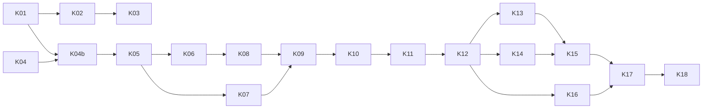

# Prompts d'implémentation — pipeline de production Kedro · Argo · MLflow

> Compagnon de **`PIPELINE_ARCHITECTURE.md`** (ci-après « ARCH »), qui fait foi. Chaque
> prompt est conçu pour être collé **tel quel** dans une **nouvelle session Claude Code**,
> ouverte à la racine du dépôt indiqué. Il contient le contexte nécessaire et renvoie aux
> sections d'ARCH que la session doit lire.
>
> Rédigé le 2026-09-15. Identifiants : `K-xx` (prompts), `PD-xx` / `PS-xx` / `PR-xx` /
> `PQ-xx` / `C-xx` (ARCH).

## Mode d'emploi

1. Respecter l'ordre du tableau ci-dessous (colonne « Dépend de »). Les prompts d'une même
   ligne de phase sans dépendance mutuelle peuvent tourner en parallèle, **sur des branches
   distinctes**.
2. Choisir le modèle avec `/model` avant de coller le prompt ; activer le mode plan
   (`Shift+Tab` jusqu'à « plan mode ») quand c'est indiqué, puis relire et valider le plan
   avant exécution.
3. Chaque prompt se termine par des **critères d'acceptation** : ne pas considérer le
   prompt terminé tant qu'ils ne sont pas vérifiés.
4. Après chaque prompt : relire le diff, lancer `uv run pytest -m "not slow"`, commiter.
5. Si une session découvre qu'une hypothèse d'ARCH est fausse, elle **met à jour ARCH**
   (section concernée + §8) dans le même travail et le signale dans son résumé final.
6. Les prompts marqués 🔌 nécessitent l'accès au cluster : les lancer depuis un terminal
   où `kubectl get pods` fonctionne (ARCH §9 point 1, PQ-09).

## Vue d'ensemble

| ID | Titre | Phase | Modèle | Mode plan | Dépend de | Dépôt |
|---|---|---|---|---|---|---|
| K-01 | Durcissement des scripts pour la production et profil `demo` | 0 | **Opus** | **Oui** | — | trade-analysis |
| K-02 | Image Docker et publication GHCR | 0 | Sonnet | Non | K-01 | trade-analysis |
| K-03 🔌 | Workflow Argo de transition (scripts) et lancement `demo` | 0 | Sonnet | **Oui** | K-02, ARCH §9 | trade-analysis |
| K-04 | Registre et écritures tamponnés dans `statflows` | 1 | **Opus** | **Oui** | — | **statflows** |
| K-04b | Adoption de la nouvelle version de `statflows` | 1 | Sonnet | Non | K-01, K-04 | trade-analysis |
| K-05 | Registres de fraîcheur v2 (fragments, empreintes, forçage) | 2 | **Opus** | **Oui** | K-04b | trade-analysis |
| K-06 | Paramétrage import / export (`FLOWS`) | 2 | **Opus** | **Oui** | K-05 | trade-analysis |
| K-07 | BACI scalable : lecture SQL, porte de complétude, découpage, millésimes 1992+ | 2 | **Opus** | **Oui** | K-05 | trade-analysis |
| K-08 | Évolution de schéma et synthèse/cohérence incrémentales | 2 | **Opus** | **Oui** | K-05, K-06 | trade-analysis |
| K-09 | Parallélisme intra-pod (réseau, synthèse, cohérence) | 2 | Sonnet | **Oui** | K-07, K-08 | trade-analysis |
| K-10 | Squelette Kedro, migration de la configuration, datasets | 3 | **Opus** | **Oui** | K-09 | trade-analysis |
| K-11 | Fonctions d'étape partagées ; scripts en enveloppes minces | 3 | **Opus** | **Oui** | K-10 | trade-analysis |
| K-12 | Pipelines et nœuds Kedro, test de bout en bout local | 3 | **Opus** | **Oui** | K-11 | trade-analysis |
| K-13 | Intégration kedro-mlflow et tableaux de bord BACI | 3 | Sonnet | **Oui** | K-12 | trade-analysis |
| K-14 | Maintenance DuckLake quotidienne | 3 | Sonnet | **Oui** | K-12 | trade-analysis |
| K-15 | Rendu Argo (argo-kedro → WorkflowTemplate + CronWorkflow) | 4 | **Opus** | **Oui** | K-13, K-14 | trade-analysis |
| K-16 | Site de documentation (mkdocs + kedro-viz) | 4 | Sonnet | Non | K-12 | trade-analysis |
| K-17 🔌 | Déploiement, recette sur Onyxia et runbooks | 4 | Sonnet | **Oui** | K-15, K-16 | trade-analysis |
| K-18 | Nettoyage final et mise à jour de la documentation projet | 4 | Sonnet | Non | K-17 | trade-analysis |



Justification des choix de modèle : **Opus** pour les prompts qui demandent des arbitrages
méthodologiques, touchent plusieurs couches ou exigent de préserver des invariants subtils
(fraîcheur, idempotence, contrat de tests) ; **Sonnet** pour les prompts dont la
spécification est suffisamment précise pour être appliquée (Docker, CI, docs, maintenance,
câblage MLflow). Le **mode plan** est activé partout où un mauvais départ coûte cher
(refactoring multi-fichiers, déploiement cluster).

---

## K-01 — Durcissement des scripts pour la production et profil `demo`

- **Modèle** : Opus · **Mode plan** : Oui · **Phase** : 0 · **Dépend de** : —
- **Dépôt** : `trade-analysis`

````text
Tu travailles dans le dépôt `trade-analysis` (pipeline de calcul de vulnérabilités du
commerce international). Lis d'abord `CLAUDE.md` (conventions : commentaires en français à
formulation nominale, docstrings Google Style en anglais, type hints, aucune valeur
méthodologique en dur, API sklearn), puis dans `PIPELINE_ARCHITECTURE.md` (ARCH) : §1
(constats C-01 à C-06, C-17), PD-05, PD-06, PD-07, PD-08, PD-19, PS-06, PS-12, PS-14
(points 1 et 3 seulement) et PS-04.4.

OBJECTIF : rendre les scripts de `scripts/` exécutables en production dans un pod Argo, et
préparer un profil de configuration `demo` pour une présentation dans une semaine. C'est le
« jalon démonstration » (PD-19) : on NE migre PAS vers Kedro ici, on corrige les scripts
existants de façon compatible avec la cible.

CONTRAINTES GÉNÉRALES
- Je n'ai pas accès au S3 ni au cluster depuis ce poste : valide tout sur données fictives
  (catalogue DuckLake fichier local, `moto` pour S3 ; voir `tests/conftest.py` et
  `tests/test_scripts_synthesis_e2e.py` pour les patterns existants).
- `uv run pytest` doit rester vert À L'IDENTIQUE (tests de caractérisation = contrat de
  non-régression). Tu peux ajouter des tests, pas relâcher des assertions existantes.
- Ne crée pas de commit.

TRAVAIL À RÉALISER
1. Fabrique de connecteur unique (C-03, C-04, PS-06) : crée le package `trade_pipeline/`
   (fichier `__init__.py` + `trade_pipeline/io/__init__.py` + `trade_pipeline/io/ducklake.py`)
   SANS dépendance à Kedro. Implémente `DuckLakeLocation` (dataclass gelée) et
   `build_connector(location, pg, s3)` ainsi qu'un helper `pg_credentials_from_env()` /
   `s3_credentials_from_env()` (seul endroit, en phase 0, où l'environnement est lu).
   `AWS_SESSION_TOKEN` est OPTIONNEL (None si absent) ; `admin_user` vient de `PGADMINUSER`
   (défaut "postgres"). Remplace les neuf constructions `DuckLakeConnector.from_postgres`
   des scripts par cette fabrique. Ajoute `trade_pipeline` aux paquets construits par
   hatchling dans `pyproject.toml` (`[tool.hatch.build.targets.wheel] packages`).
2. Identifiants de dataflow en configuration (C-05) : ajoute une clé `DATAFLOW` dans
   `config/datasets/comtrade.yaml` ("C_A_HS") et `config/datasets/eurostat.yaml`
   ("DS-045409") et lis-la dans les scripts à la place des constantes.
3. Suppression des plafonds de test (C-01) : remplace `queries[:10]` / `queries[:5]` par
   un paramètre `max_queries` (null = pas de plafond) dans la section `parameters` de
   chaque fichier de dataset.
4. Profondeur historique (C-02, PD-08) : `period_start: "1992"` pour Comtrade. Ajoute les
   millésimes BACI `HS1992` (START_YEAR 1992), `HS1996` (1996), `HS2002` (2002), `HS2007`
   (2007) dans `config/baci.yaml` en plus de HS2012/2017/2022, schémas `baci_hs1992`…
5. Découpage et priorités des requêtes (PD-07, PS-12.1, PS-12.2) :
   - Comtrade : une requête par (année × lot de `products_step` produits), produits HS6
     uniquement (`include_regex: '^\d{6}$'`), liste ordonnée selon
     `parameters.C_A_HS.priority` (`products`: préfixes prioritaires dans l'ordre ;
     `periods_order`: "desc"|"asc"). Les lots sont formés après le tri pour qu'un lot
     prioritaire ne contienne que des produits prioritaires. Vérifie dans
     `.venv/Lib/site-packages/statflows/sources/comtrade/` comment `ComtradeQueryRequest`
     accepte `periods` et comment la liste d'années disponibles s'obtient
     (`get_valid_periods`), et corrige au passage le bug de la branche `else` de
     `build_split_queries` (variable `products` indéfinie).
   - Eurostat : ordre de la liste selon `parameters.DS-045409.priority.products`
     (préfixes) puis ordre des reporters. NE change PAS la granularité (1 produit par
     requête) : l'étude des lots de produits est un risque ouvert (PR-03) ; ajoute
     seulement le paramètre `products_step: 1` documenté comme « non encore supporté si
     > 1 » et lève une `NotImplementedError` explicite s'il est > 1.
   - Rappel : `statflows.core.download.SDMXDownloader._prioritize` trie de façon STABLE
     les requêtes jamais téléchargées en tête, puis les plus anciennes : l'ordre de ta
     liste fait donc foi pour le rattrapage. Écris des tests unitaires d'ordonnancement
     (exemple de PS-12.1).
6. BACI (C-06 partiel, C-17, PS-14 points 1 et 3) :
   - lecture Comtrade poussée en SQL : ne lire que les années ≥ min(START_YEAR des cibles)
     et ≤ `PARAMETERS.period_end` si renseigné, et, par millésime, filtrer ensuite en
     pandas comme aujourd'hui ; utilise des paramètres liés (pas de f-string de valeurs) ;
   - porte de complétude simple : lis le registre de téléchargement Comtrade
     (`LAST_DOWNLOAD_PATH`, racine "DOWNLOADS", entrées avec `params.periods` et
     `params.products`) via `statflows.storage.json.Loader`, calcule pour chaque année la
     part de lots téléchargés au moins une fois parmi les lots PLANIFIÉS (reconstruis la
     liste planifiée avec la même fonction que le script de téléchargement), et ne traite
     que les années avec part ≥ `COMPLETENESS.MIN_SHARE` (nouveau bloc de
     `config/baci.yaml`, 1.0 par défaut). Journalise et trace dans MLflow
     (`coverage/years_eligible`, `coverage/share_min`) ;
   - harmonise la lecture des fichiers CEPII entre `process_baci.py` et
     `process_baci_hs.py` (chemin relatif + `bucket`, C-17) ;
   - `process_baci_hs.py` doit écrire un registre par millésime SANS course entre
     millésimes (aujourd'hui une seule écriture fusionnée en fin de script : conserve ce
     schéma, il est correct en séquentiel ; ajoute un commentaire renvoyant à PD-10).
7. Profil `demo` (PS-04.4, PD-19) : crée `config/profiles/demo/` contenant des copies
   COMPLÈTES de `comtrade.yaml`, `eurostat.yaml`, `baci.yaml`, `vulnerabilities.yaml`,
   `synthesis.yaml` (les scripts les liront via leurs variables d'environnement
   existantes `COMTRADE_CONFIG_PATH`, `EUROSTAT_CONFIG_PATH`, `BACI_CONFIG_PATH`,
   `VULNERABILITIES_CONFIG_PATH`, `SYNTHESIS_CONFIG_PATH`). Périmètre : produits dont le
   code commence par 2805, 2846, 8105, 8112, 2844, 3004, 8541, 8542, 8507 ; Comtrade
   années ≥ 2015 ; BACI cible unique HS2017 (schéma `demo_baci_hs2017`) ; schémas résultats
   et chemins de registres préfixés `demo_` / `demo/` pour ne jamais mélanger avec la
   production ; `min_group_size: 10` en synthèse ; `LAST_N_PERIODS: null`. Mets en tête de
   chaque fichier un commentaire indiquant que le périmètre est provisoire (PQ-07). Ajoute
   un test qui vérifie que chaque profil `demo` se charge, et que toutes les clés présentes
   dans le fichier de production existent aussi dans le profil (pas de clé manquante).
8. `MAX_RUNTIME` : 10 heures par défaut dans les deux fichiers de dataset (ARCH §2.3).

CRITÈRES D'ACCEPTATION
- `uv run pytest` vert ; nouveaux tests pour : la fabrique de connecteur (sans connexion
  réelle : vérifier les arguments passés à `DuckLakeConnector.from_postgres` avec un
  mock, notamment `s3_session_token=None` sans variable), l'ordonnancement Comtrade et
  Eurostat, la porte de complétude (registre fictif), le chargement des profils `demo`.
- `grep -rn "AWS_SESSION_TOKEN\"\]" scripts/` ne renvoie rien ; plus aucun
  `from_postgres(` dans `scripts/`.
- Aucun `queries[:` dans `scripts/`.
- Un résumé final listant : fichiers modifiés, décisions prises, écarts éventuels avec
  ARCH (et mise à jour d'ARCH si une hypothèse s'est révélée fausse).
````

---

## K-02 — Image Docker et publication GHCR

- **Modèle** : Sonnet · **Mode plan** : Non · **Phase** : 0 · **Dépend de** : K-01
- **Dépôt** : `trade-analysis`

````text
Dépôt `trade-analysis`. Lis `CLAUDE.md`, puis dans `PIPELINE_ARCHITECTURE.md` : C-14,
C-21, PD-15, PS-22, PS-23 (ligne `image.yml` et `ci.yml` uniquement).

OBJECTIF : produire une image Docker reproductible de production, publiée gratuitement sur
GitHub Container Registry (`ghcr.io/qbolliet/trade-analysis`, visibilité publique), et une
CI minimale. Le projet Kedro N'EXISTE PAS encore : l'image doit fonctionner avec les
scripts actuels (`uv run baci-hs-script` etc.) et ne pas dépendre de kedro.

TRAVAIL
1. Réécris `docker/Dockerfile` selon PS-22 avec les adaptations de phase 0 :
   - `python:3.13-slim` (le projet exige Python ≥ 3.13), `uv` épinglé à une version
     précise (vérifie la dernière version stable disponible sur ghcr.io/astral-sh/uv et
     épingle-la), build multi-étage, `uv sync --frozen --no-dev` avec les extras
     `tracking` et `optimal-transport` (vérifie qu'ils existent dans `pyproject.toml`) ;
   - copie `macroforecast/`, `scripts/`, `trade_pipeline/`, et TOUT `config/` (le dossier
     `config/local/` éventuel est exclu par `.dockerignore`) ;
   - préinstallation des extensions DuckDB `ducklake`, `postgres`, `httpfs` dans l'image,
     avec `HOME=/app` pour que le cache d'extensions soit dans l'image et lisible par
     l'utilisateur non root ;
   - `postgresql-client` et `ca-certificates` dans l'étage final ; utilisateur uid 1000 ;
   - `ARG GIT_SHA` → `ENV GIT_SHA` ; `ENTRYPOINT []` et une commande par défaut inoffensive
     (`python -c "import macroforecast; print('ok')"`). Les pods Argo appelleront
     explicitement la commande (`comtrade-script`, …) : vérifie que les entrées
     `[project.scripts]` sont bien dans le PATH du venv.
   - ATTENTION : `dt-ducklake-manager` et `statflows` viennent de dépôts git
     (`[tool.uv.sources]`) : `git` est requis dans l'étage de build.
2. Crée `.dockerignore` (liste de PS-22) — vérifie en particulier que
   `sspcloud_access_script.txt` et `Trade deployment.md` (secrets) sont exclus.
3. Crée `.github/workflows/image.yml` (PS-23) : déclenché sur push `main`, tags `v*` et
   `workflow_dispatch` ; permissions `contents: read`, `packages: write` ; actions
   `docker/setup-buildx-action`, `docker/login-action` (registry ghcr.io, user
   `${{ github.actor }}`, password `${{ secrets.GITHUB_TOKEN }}`),
   `docker/metadata-action` (tags : `sha-<court>`, nom de branche, `latest` sur la branche
   par défaut, semver sur tag), `docker/build-push-action` avec cache `type=gha,mode=max`,
   `build-args: GIT_SHA=${{ github.sha }}`, `platforms: linux/amd64`. Épingle chaque
   action à une version majeure explicite (`@v3`, `@v5`, `@v6` : vérifie les versions
   courantes).
   Ajoute aussi un déclenchement sur la branche de travail courante
   (`qb-vulnerabilities`) pour pouvoir publier avant fusion.
4. Crée `.github/workflows/ci.yml` minimal : `astral-sh/setup-uv`, `uv sync --frozen
   --group dev --extra tracking` (sans `optimal-transport` pour la vitesse), `uv run
   pytest -m "not slow"`.
5. Vérifie localement ce qui est vérifiable : si Docker est disponible (`docker version`),
   construis l'image et exécute `docker run --rm <image> python -c "import duckdb,
   macroforecast, scripts.process_baci_hs; c=duckdb.connect(); c.load_extension('ducklake'); print('ok')"`
   ainsi que `docker run --rm <image> comtrade-script --help || true` pour vérifier la
   présence de l'exécutable. Si Docker n'est pas disponible, dis-le clairement et valide
   au minimum la syntaxe avec `docker buildx build --check` si possible, sinon relis
   attentivement.
6. Ajoute à la fin du README une courte section « Image Docker » (commande `docker pull`,
   rappel qu'il faut rendre le paquet GHCR public une fois dans les réglages GitHub).

CRITÈRES D'ACCEPTATION
- Dockerfile conforme à PS-22 (adaptations de phase 0 comprises), `.dockerignore` présent.
- Workflows YAML valides (vérifie la syntaxe avec `python -c "import yaml,sys;
  yaml.safe_load(open(sys.argv[1]))"` sur chacun).
- Résumé final : ce qui a été testé réellement vs relu seulement ; rappel des actions
  manuelles GitHub (visibilité du paquet).
- Ne crée pas de commit.
````

---

## K-03 🔌 — Workflow Argo de transition (scripts) et lancement `demo`

- **Modèle** : Sonnet · **Mode plan** : Oui · **Phase** : 0 · **Dépend de** : K-02, actions ARCH §9 (points 1 à 5, 7)
- **Dépôt** : `trade-analysis` — **session lancée depuis un terminal avec accès `kubectl`**

````text
Dépôt `trade-analysis`. Lis `CLAUDE.md`, puis dans `PIPELINE_ARCHITECTURE.md` : §2.2,
§2.3, C-15, PD-05, PD-14 (sémantique des dépendances tolérantes), PD-18, PD-19, PS-21
(comme modèle de forme), §9. Regarde `kubernetes/workflow.yaml` (ancien exemple, contient
des erreurs listées en C-15) et `Trade deployment.md` (création des secrets ; fichier
ignoré par git, ne le recopie nulle part).

OBJECTIF : déployer sur Onyxia (namespace `user-qbollietdgddi`) un WorkflowTemplate +
CronWorkflow « de transition », écrits à la main, qui enchaînent les scripts existants
selon le DAG cible, sur le profil `demo` (`config/profiles/demo/`), puis lancer une
première exécution. Ce workflow sera remplacé plus tard par un workflow généré depuis
Kedro (K-15) : reste simple et lisible.

ÉTAPE 0 — VÉRIFICATIONS (lecture seule, rapporte les résultats avant d'aller plus loin)
- `kubectl config current-context`, `kubectl get pods`, `kubectl get secrets` (noms
  seulement), `kubectl get serviceaccounts`, `kubectl api-resources | grep argoproj`,
  version d'Argo (`argo version` si le binaire existe, sinon image du contrôleur :
  `kubectl get pods -o jsonpath='{..image}'` sur le pod argo), `kubectl describe
  resourcequota` et `kubectl describe limitrange`.
- Vérifie la présence des secrets `trade-s3-credentials`, `comtrade-api-credentials`,
  `trade-postgres-credentials`, `trade-mlflow-credentials` (clés attendues : PD-18). S'il
  en manque un, ARRÊTE-TOI et donne-moi la commande exacte à exécuter (je saisirai les
  valeurs moi-même ; ne me demande jamais de te coller une valeur secrète).
- Vérifie que l'image `ghcr.io/qbolliet/trade-analysis:<tag>` est tirable anonymement
  (`docker manifest inspect` ou `crane manifest` si disponibles, sinon on le verra au
  premier pod).
- Mets à jour ARCH §8 (PQ-01, PQ-02) avec les valeurs constatées.

ÉTAPE 1 — MANIFESTES dans `kubernetes/transition/`
- `workflowtemplate.yaml` : `WorkflowTemplate` `trade-pipeline-transition` ;
  `serviceAccountName` = celui constaté ; paramètres `image-tag` (défaut : SHA court du
  HEAD publié), `profile` (défaut `demo`), `max-runtime-hours` ; un template conteneur
  générique `script` (inputs : nom de commande, cpu, mémoire) avec `podSpecPatch` pour les
  ressources ; environnement de PD-18 (secrets par `secretKeyRef`/`envFrom`, variables
  non secrètes) ; variables `COMTRADE_CONFIG_PATH`, `EUROSTAT_CONFIG_PATH`,
  `BACI_CONFIG_PATH`, `VULNERABILITIES_CONFIG_PATH`, `SYNTHESIS_CONFIG_PATH` pointant vers
  `config/profiles/{{workflow.parameters.profile}}/…` (si profile vaut `base`, pointer vers
  les chemins historiques : gère-le avec deux jeux de variables ou un petit script shell
  d'entrée — choisis le plus simple et explique) ; `MLFLOW_TRACKING_URI` depuis le secret.
- DAG :
  `download-eurostat` (eurostat-script) ∥ `download-comtrade` (comtrade-script) ;
  `baci` (baci-hs-script) dépend de download-comtrade (Succeeded || Failed) ;
  `network` (vulnerabilities-network-script) dépend de baci (Succeeded || Failed) ;
  `partners` (vulnerabilities-eurostat-script) dépend de download-eurostat (Succeeded || Failed) ;
  `synthesis` (vulnerabilities-synthesis-script) dépend de partners ET network (chacun Succeeded || Failed) ;
  `coherence` (vulnerabilities-coherence-script) dépend de synthesis (Succeeded || Failed).
  Ressources de départ : téléchargements 1 CPU / 2 GiB ; baci 4 CPU / 32 GiB ; autres
  4 CPU / 16 GiB — à réduire si les quotas constatés l'exigent (documente le choix).
  `retryStrategy: {limit: 1, retryPolicy: OnError}` sauf téléchargements (limit 0).
  `activeDeadlineSeconds: 82800`, `ttlStrategy`, `podGC: OnPodSuccess`.
- `cronworkflow.yaml` : `CronWorkflow` `trade-pipeline-transition-daily`, 01:00
  Europe/Paris, `concurrencyPolicy: Forbid`, `startingDeadlineSeconds: 3600`, historiques
  7/7, `workflowTemplateRef` vers le template ; `schedules:` (liste) si Argo ≥ 3.6 sinon
  `schedule:`.
- Déplace `kubernetes/workflow.yaml` et `kubernetes/configmap.yaml` dans
  `kubernetes/examples/` avec un en-tête « exemple historique, non déployé (cf. C-15) ».

ÉTAPE 2 — VALIDATION ET DÉPLOIEMENT
- `argo lint kubernetes/transition/` si `argo` est disponible, sinon `kubectl apply
  --dry-run=server -f kubernetes/transition/`.
- Montre-moi le diff et ATTENDS ma confirmation avant `kubectl apply`.
- Après confirmation : `kubectl apply -f kubernetes/transition/`, puis soumets une
  exécution manuelle `argo submit --from workflowtemplate/trade-pipeline-transition -p
  profile=demo` (ou `kubectl create` d'un Workflow référençant le template si `argo`
  manque). Suis les premiers pods (`kubectl logs -f`), diagnostique et corrige les erreurs
  de démarrage (imports, variables, secrets, extensions DuckDB). Ne laisse pas tourner une
  exécution qui échoue en boucle.

ÉTAPE 3 — DOCUMENTATION
- Crée `kubernetes/transition/README.md` : ce que fait le workflow, comment le soumettre,
  le suspendre (`argo cron suspend`), changer d'image, lire les logs, et comment il sera
  remplacé (K-15).

CRITÈRES D'ACCEPTATION
- Les deux manifestes passent la validation serveur ; le CronWorkflow est créé.
- Une exécution `demo` a démarré ; les deux téléchargements tournent et écrivent (vérifie
  un log « Upserted » ou « Created schema ») ; le reste du DAG s'exécute sans erreur de
  configuration (les étapes aval peuvent légitimement ne rien calculer au premier passage).
- Rapport final : état des tâches, erreurs rencontrées et corrections, valeurs de quotas,
  mises à jour d'ARCH §8.
- Ne crée pas de commit.
````

---

## K-04 — Registre et écritures tamponnés dans `statflows`

- **Modèle** : Opus · **Mode plan** : Oui · **Phase** : 1 · **Dépend de** : —
- **Dépôt** : **`statflows`** (`https://github.com/qbolliet/statflows`, branche `main`) — cloner le dépôt et ouvrir la session à sa racine

````text
Tu travailles dans le dépôt `statflows` (bibliothèque d'acquisition de données
statistiques : clients SDMX Eurostat/OECD, Comtrade, UNSD ; orchestration des
téléchargements incrémentaux vers DuckLake ; stockage JSON local/S3). Il est consommé par
le projet `trade-analysis`, dont l'architecture de production est décrite dans
`PIPELINE_ARCHITECTURE.md` de ce projet-là (non disponible ici). Les passages utiles sont
recopiés ci-dessous. Lis d'abord les conventions du dépôt (README, CLAUDE.md s'il existe)
et respecte-les (en l'absence de règle : commentaires en français, docstrings Google Style
en anglais, type hints).

PROBLÈME (constat C-08 de l'architecture)
Dans `statflows/core/download.py`, `SDMXDownloader._process_query` :
- réécrit le registre JSON des téléchargements EN ENTIER sur S3 après CHAQUE requête
  (`self._save_registry()`), alors que le rattrapage complet représente 10⁴ à 10⁵ requêtes
  (registre de plusieurs dizaines de Mo réécrit à chaque requête → coût quadratique) ;
- écrit chaque DataFrame non vide immédiatement via
  `statflows.storage.ducklake.tables.write_dataframe`, qui appelle
  `DatabaseUpdater.update_database(..., compact_after_update=True)` : un snapshot DuckLake,
  un fichier Parquet et une compaction PAR requête.
Par ailleurs, les étapes aval du projet lisent ce registre (entrées
`{"agency", "dataflow", "params", "last_download"}` sous la racine "DOWNLOADS") pour
décider de ce qui est à recalculer.

OBJECTIF (spécification PS-27, recopiée)
1. Registre tamponné : `SDMXDownloader(..., registry_flush_every: int = 1,
   registry_flush_seconds: float | None = None)`. Persistance quand l'un des seuils est
   atteint, à la fin du run (bloc `finally`), et sur SIGTERM (arrêt de pod Kubernetes)
   via un gestionnaire de signal installé pendant `run()` et restauré en sortie (seulement
   dans le thread principal ; sinon, pas de gestionnaire et un avertissement).
   Rétrocompatibilité stricte : les valeurs par défaut reproduisent le comportement
   actuel.
2. Registre fragmenté (optionnel) : `registry_shard_key: Callable[[query], str] | None`.
   Si fourni, un fichier par fragment (`<last_download_path sans extension>/<fragment>.json`),
   seuls les fragments modifiés sont réécrits. Fournis une API de LECTURE publique
   indépendante du format physique :
   `iter_registry_entries(last_download_path, bucket=None, storage_options=None) ->
   Iterator[RegistryEntry]` (dataclass gelée : `identity_key`, `agency`, `dataflow`,
   `params`, `last_download: datetime`), qui lit indifféremment le fichier unique
   historique ou les fragments. Exporte-la depuis `statflows.core.download` et
   `statflows`. Le chargement initial du downloader doit lire les deux formats (migration
   transparente d'un registre existant vers les fragments à la première écriture).
3. Écritures DuckLake tamponnées : `write_batch_rows: int | None = None`,
   `write_batch_queries: int | None = None`. Les DataFrames sont accumulés PAR schéma
   (dataflow) et écrits en une fois (concaténation) quand un seuil est atteint, à la fin
   du run, sur deadline et sur SIGTERM. INVARIANT CRITIQUE À PRÉSERVER : une entrée de
   registre n'avance JAMAIS avant que les données de sa requête aient été écrites avec
   succès. Les entrées des requêtes du lot en attente sont donc elles aussi mises en
   attente, puis validées après l'écriture du lot. Si l'écriture d'un lot échoue, aucune
   entrée du lot n'avance, l'erreur est comptée pour chaque requête du lot dans le
   `DownloadReport`, et le run continue. Attention aux clés primaires : deux requêtes d'un
   même lot ne se recouvrent pas, mais dédoublonne par clé primaire (dernier gagnant)
   avant écriture, par sécurité.
4. `write_dataframe(..., compact_after_update: bool = True)` transmis à
   `DatabaseUpdater.update_database` ; `SDMXDownloader(..., compact_after_update: bool =
   True)` le relaie. Vérifie dans `dt_ducklake_manager` (dépendance installée) ce que fait
   réellement `compact_after_update` et documente-le dans la docstring.
5. Si `DuckLakeConnector` (dt_ducklake_manager) permet de passer des options d'ATTACH,
   expose `ducklake_options: dict | None` pour activer `DATA_INLINING_ROW_LIMIT` ; sinon,
   N'IMPLÉMENTE RIEN et consigne la limite dans le README (section « Performance »).
6. `download_updates(...)` expose tous les nouveaux paramètres.
7. Diagnostics : ajoute au `DownloadReport` `n_registry_flushes`, `n_write_batches`,
   `rows_pending_at_stop` (0 attendu), et reflète-les dans `to_metrics()`.

TESTS (obligatoires, sans réseau)
- Faux client implémentant l'interface minimale (`fetch_updates`,
  `resolve_query_structure`, `structure_registry`) et 2 000 fausses requêtes, catalogue
  DuckLake fichier local, S3 simulé avec `moto` si le dépôt l'utilise déjà (sinon registre
  local) :
  a) mode par défaut : contenu final identique à la version actuelle (test de
     caractérisation écrit AVANT tes modifications, qui doit passer avant et après) ;
  b) mode tamponné (`registry_flush_every=500`, `write_batch_queries=500`) : ≤ 5
     écritures du registre (compte les appels au Saver), ≤ 5 snapshots DuckLake créés,
     contenu de la table et du registre identique au mode a) ;
  c) échec d'écriture d'un lot (Saver/DuckLake mocké qui lève) : aucune entrée du lot
     n'avance, les autres lots oui ;
  d) arrêt sur deadline au milieu d'un lot : lot écrit, entrées validées,
     `rows_pending_at_stop == 0` ;
  e) SIGTERM simulé (appel direct du gestionnaire) : même garantie que d) ;
  f) fragmentation : `iter_registry_entries` renvoie les mêmes entrées depuis un fichier
     unique et depuis des fragments ; migration fichier unique → fragments.
- Toute la suite existante reste verte.

LIVRABLES
- Code, tests, section README « Performance et volumétrie » avec un exemple de
  configuration recommandée pour 10⁵ requêtes.
- Entrée de CHANGELOG (ou section de README) et incrément de version mineure dans
  `pyproject.toml`.
- Résumé final : API ajoutée (signatures), comportements par défaut, résultats des tests.
- Ne crée pas de commit ni de tag.
````

---

## K-04b — Adoption de la nouvelle version de `statflows`

- **Modèle** : Sonnet · **Mode plan** : Non · **Phase** : 1 · **Dépend de** : K-01, K-04 (publiée sur `main` de `statflows`)
- **Dépôt** : `trade-analysis`

````text
Dépôt `trade-analysis`. Lis `CLAUDE.md`, puis dans `PIPELINE_ARCHITECTURE.md` : C-08,
PD-07, PS-12.3, PS-27.

CONTEXTE : `statflows` (dépendance git, `[tool.uv.sources]`) a reçu une nouvelle version
qui ajoute à `download_updates` : `registry_flush_every`, `registry_flush_seconds`,
`registry_shard_key`, `write_batch_rows`, `write_batch_queries`, `compact_after_update`
(éventuellement `ducklake_options`), et une API de lecture `iter_registry_entries`.
Commence par lire le code réellement installé après mise à jour pour connaître les
signatures exactes (elles font foi sur ce prompt).

TRAVAIL
1. `uv lock --upgrade-package statflows && uv sync` ; vérifie la version installée.
2. Paramètres de configuration (dans `config/datasets/{comtrade,eurostat}.yaml` ET dans
   `config/profiles/demo/`) sous `DOWNLOADS.<DATAFLOW>.BUFFERING` :
   `REGISTRY_FLUSH_EVERY: 500`, `REGISTRY_FLUSH_SECONDS: 300`,
   `WRITE_BATCH_QUERIES: 200`, `WRITE_BATCH_ROWS: 500000`, `COMPACT_AFTER_UPDATE: false`,
   `SHARD_REGISTRY: true`, avec commentaires français (renvoi PS-27).
3. Scripts `download_comtrade.py` et `download_eurostat_comext.py` : passe ces paramètres
   à `download_updates`. Clé de fragment : reporter pour Eurostat
   (`query.dimensions["reporter"]`), année pour Comtrade (`query.periods`) — adapte aux
   attributs réels des objets requête.
4. Remplace TOUTES les lectures directes du registre de téléchargement par
   `iter_registry_entries` :
   - `scripts/compute_trade_vulnerabilities.py::load_last_download_dates` (conserve la
     signature et le type de retour ; les tests existants doivent passer) ;
   - la porte de complétude BACI ajoutée par K-01 dans `scripts/process_baci_hs.py`.
   Crée pour cela `trade_pipeline/io/registry_views.py` avec `DownloadRegistryView`
   (PS-12.3) : `pairs_last_download()` (Eurostat : reporter × produit, en éclatant un
   produit multiple si la valeur est une liste ou contient `+`/`,`) et
   `batches_by_year()` (Comtrade). Tests unitaires sur registres fictifs (fichier unique
   ET fragments).
5. Vérifie la suite : `uv run pytest`.

CRITÈRES D'ACCEPTATION
- Aucune lecture de `["DOWNLOADS"]` en dur hors de `trade_pipeline/io/registry_views.py`.
- Tests verts, dont les nouveaux tests des vues.
- Résumé : signatures utilisées, paramètres ajoutés, points d'attention pour la
  migration du registre existant sur S3 (première exécution).
- Ne crée pas de commit.
````

---

## K-05 — Registres de fraîcheur v2 (fragments, empreintes, forçage)

- **Modèle** : Opus · **Mode plan** : Oui · **Phase** : 2 · **Dépend de** : K-04b
- **Dépôt** : `trade-analysis`

````text
Dépôt `trade-analysis`. Lis `CLAUDE.md`, puis dans `PIPELINE_ARCHITECTURE.md` : C-07,
C-10, PD-10, PD-12 (règles de recalcul, pour préparer K-08), PS-04.1, PS-10 (en entier),
PS-11. Lis les scripts `scripts/compute_trade_vulnerabilities.py`,
`scripts/compute_network_vulnerabilities.py`, `scripts/process_baci_hs.py`,
`scripts/compute_synthetic_scores.py`, `scripts/compute_synthesis_coherence.py` (fonctions
de registre et de sélection), et `trade_pipeline/io/registry_views.py`.

OBJECTIF : remplacer les registres JSON globaux (un fichier réécrit en entier, sans notion
de méthodologie) par un module générique de fraîcheur, pour que :
(a) ajouter une métrique ou une méthode déclenche son calcul sur toutes les unités
    existantes ;
(b) corriger une formule (incrément de `version`) déclenche le recalcul partout, en
    cascade vers l'aval ;
(c) un forçage ponctuel par paramètres d'exécution soit possible ;
(d) deux pods parallèles ne se marchent pas dessus (fragments).
Ce prompt couvre les étapes BACI, partenaires et réseau. La synthèse et la cohérence
passent au modèle par contexte dans K-08 : ici, on les branche seulement sur l'API
(registre global conservé comme fragment unique, empreinte globale), afin de ne pas
diverger.

TRAVAIL
1. `trade_pipeline/io/freshness.py` :
   - `fingerprint(name, version, params)` (PS-10.2, doctest) ;
   - `Unit` = tuple nommé ou dataclass gelée hachable ; `RegistryEntry` ;
   - `FreshnessRegistry(path_template, bucket, step, shard_of: Callable[[Unit], str])` :
     chargement paresseux des seuls fragments nécessaires, `get(unit)`, `upsert(unit,
     entry)`, `save()` qui n'écrit que les fragments modifiés, format de PS-10.1 avec
     `schema_version: 2` ; lecture tolérante des registres v1 existants (migration : les
     entrées v1 sont lues avec `fingerprints={}` et `reason="first"` → recalcul des
     empreintes sans recalcul complet ? NON : une empreinte manquante signifie « jamais
     calculé avec cette méthodologie » ; documente ce choix et fournis un paramètre
     `adopt_legacy_fingerprints: bool` qui, s'il est vrai, recopie les empreintes
     courantes sur les entrées v1 sans recalcul — utile pour ne pas tout recalculer au
     déploiement) ;
   - `ForceSpec.from_runtime(runtime_params)` : parse les chaînes séparées par des
     virgules de PS-04.1 (teste aussi le séparateur `;` et documente celui qui fonctionne
     avec `kedro run --params` en Kedro 1.6 — si Kedro n'est pas encore installé, écris un
     parseur qui accepte les deux) ;
   - `units_to_compute(planned, registry, upstream, requested, force) -> dict[Unit,
     UnitPlan]` (PS-10.3, priorités first > forced > new_data > fingerprint) ;
   - tests unitaires exhaustifs des cas (tableaux paramétrés pytest).
2. Versions déclarées : ajoute `version: ClassVar[str] = "1"` à `VulnerabilityMetric` et
   `NetworkVulnerabilityMetric` (surchargeable par sous-classe), et une constante de
   version de la méthodologie BACI (module `macroforecast/trade/processing/baci.py`,
   attribut ou constante documentée). Pour chaque dataclass de configuration
   (`VulnerabilityConfig`, `NetworkVulnerabilityConfig`, `BaciConfig`), déclare à côté la
   liste des champs EXCLUS de l'empreinte (options de journalisation/diagnostic :
   `artifact_top_n`, `artifact_max_rows`, `drift_relative_change`, `psi_n_bins`,
   `ranking_metric`, seuils d'alerte ? → réfléchis : les seuils d'alerte changent des
   colonnes `_ALERT` écrites en table, donc ils ENTRENT dans l'empreinte). Fournis
   `methodology_params(config) -> dict`. Ces ajouts sont dans `macroforecast/` : aucune
   dépendance à `trade_pipeline`.
3. Paramètres : crée `config/runtime.yaml` (contenu de PS-04.1 sous clé `runtime`) et une
   copie dans `config/profiles/demo/`. Les scripts le lisent via
   `RUNTIME_CONFIG_PATH` (défaut `config/runtime.yaml`), et acceptent en plus des
   surcharges par variables d'environnement `FORCE_STEPS`, `FORCE_METRICS`,
   `FORCE_METHODS`, `FORCE_REPORTERS`, `FORCE_PRODUCTS`, `FORCE_PERIODS`,
   `FORCE_VINTAGES` (utile tant que le workflow de transition appelle les scripts).
4. Branchement des étapes (dans les scripts, en isolant la logique dans des fonctions
   pures testables) :
   - partenaires : unité (reporter, product), fragment = reporter, watermark amont =
     `DownloadRegistryView.pairs_last_download()`, noms demandés = métriques du registre
     de métriques pour les flux supportés ; recalcul de toutes les métriques d'une unité
     planifiée ; nouveaux chemins `trade/state/vulnerabilities/partners/{reporter}.json`
     (paramètre `STATE.PATH_TEMPLATE`) ;
   - réseau : unité = millésime, fragment = millésime, watermark = max `last_computed` du
     fragment BACI du millésime ;
   - BACI : unité = (millésime, année), fragment = millésime, watermark = max
     `last_download` des lots Comtrade de l'année ; écrit par millésime → plus de course
     entre millésimes ;
   - synthèse et cohérence : unité unique `("global",)`, empreinte = hachage de la liste
     complète des méthodes (resp. de la config de cohérence) ; `FORCE` YAML historique
     conservé ET `FORCE_STEPS` pris en compte.
   Les fonctions historiques (`pairs_to_recompute`, `vintages_to_recompute`,
   `contexts_to_recompute`, `load_last_*`) restent présentes et testées (contrat), mais
   `main()` utilise la nouvelle API.
5. Cascade : quand une unité est calculée pour une raison `fingerprint` ou `forced`, son
   entrée porte cette raison ; les étapes aval exposent l'information (lecture) pour K-08.
6. MLflow : métriques `freshness/units_planned`, `freshness/units_first`,
   `freshness/units_forced`, `freshness/units_new_data`, `freshness/units_fingerprint`,
   tag `forced`.

CRITÈRES D'ACCEPTATION
- Suite de tests verte ; tests nouveaux pour `freshness.py` (≥ 20 cas), pour chaque étape
  branchée (registres fictifs : première passe = tout, deuxième passe = rien, incrément
  de `version` d'une métrique = tout, forçage d'un reporter = ce reporter seulement).
- Test e2e `slow` réutilisant `tests/test_scripts_synthesis_e2e.py` comme modèle :
  partenaires sur catalogue DuckLake local, deux exécutions successives, la seconde ne
  recalcule rien.
- ARCH mise à jour si un détail de PS-10 a dû évoluer (séparateur de forçage notamment).
- Résumé final avec la procédure de déploiement (migration des registres v1,
  `adopt_legacy_fingerprints`).
- Ne crée pas de commit.
````

---

## K-06 — Paramétrage import / export (`FLOWS`)

- **Modèle** : Opus · **Mode plan** : Oui · **Phase** : 2 · **Dépend de** : K-05
- **Dépôt** : `trade-analysis`

````text
Dépôt `trade-analysis`. Lis `CLAUDE.md`, puis dans `PIPELINE_ARCHITECTURE.md` : C-11,
C-12, PD-09, PQ-06, PS-15. Lis `macroforecast/trade/vulnerabilities/{base,metrics,runner,
diagnostics}.py`, `scripts/compute_trade_vulnerabilities.py`,
`scripts/compute_synthetic_scores.py` (`build_source_query`), `config/vulnerabilities.yaml`,
`config/synthesis.yaml`, et `AGREGATION_ARCHITECTURE.md` pour la convention « rang 1 = plus
vulnérable » et les polarités.

OBJECTIF : pouvoir calculer les vulnérabilités partenaires et la synthèse à l'import, à
l'export ou dans les deux cas, par configuration. Le téléchargement, BACI et les métriques
de réseau NE sont PAS paramétrés (justification PD-09 : réconciliation miroir, graphe
mondial indépendant du sens).

TRAVAIL
1. `macroforecast/trade/vulnerabilities/base.py` : attribut de classe
   `supported_flows: ClassVar[frozenset[str]]` sur `VulnerabilityMetric` (défaut
   `frozenset({"import"})` : sûr), `VulnerabilityConfig.flow_codes` si nécessaire (mapping
   nom → code ; défaut `{"import": 1, "export": 2}` cohérent avec `import_flow` /
   `export_flow` existants, sans les casser).
2. `metrics.py` : `HHI` → `{"import", "export"}` (déjà calculé pour les deux flux :
   vérifie) ; `CDI2` et `CDI3` → `{"import"}`.
   Métrique d'export `CDI2` (PQ-06, NON VALIDÉE) : implémente la généralisation dans la
   même classe, derrière un paramètre de configuration
   `experimental_export_metrics: tuple[str, ...] = ()` : si `"CDI2"` y figure,
   `supported_flows` inclut `"export"` et CDI2 est calculé sur le flux export (exports
   extra-UE / exports totaux). Docstring : définition, interprétation, statut
   « expérimental, à valider ». Ne crée PAS d'analogue de CDI3 à l'export.
3. Runner : paramètre `flows: Sequence[str]` (défaut `("import",)`) ; la grille est
   restreinte aux codes de flux demandés ; toute métrique non supportée pour un flux est
   `null` (comportement actuel) ; les diagnostics (`diagnostics.py`, notamment
   `import_only`) restent cohérents. L'empreinte (K-05) inclut `flows` et
   `experimental_export_metrics`.
4. Configuration : `FLOWS: ["import"]` dans `config/vulnerabilities.yaml` (bloc
   `PARAMETERS` ou racine : choisis et documente), `experimental_export_metrics: []` ;
   `config/synthesis.yaml` : `SYNTHESIS.FLOWS` (même valeur par défaut) et suppression de
   `p."flow" = 1` de `FILTERS.WHERE`. Même chose dans `config/profiles/demo/` avec
   `FLOWS: ["import", "export"]` pour pouvoir montrer les deux.
5. `build_source_query(sources, filters, catalog_alias, flow_codes=None)` : si
   `flow_codes` est fourni, ajoute `<alias grille>."flow" IN (…)` en conjonction. Le test
   existant (sans `flow_codes`) doit produire EXACTEMENT la même requête qu'avant.
   `compute_synthesis_coherence.py` réutilise ce paramètre.
6. Synthèse : vérifie que `flow` est bien dans `context_columns` (sinon, ÉCHEC explicite
   au chargement de la configuration quand `FLOWS` contient plus d'un flux : on ne doit
   jamais comparer import et export entre eux). Polarités : aucune différence entre import
   et export pour HHI/CDI2 (plus concentré = plus vulnérable) — documente-le.
7. MLflow : métriques partenaires préfixées par flux (`partners/import/...`,
   `partners/export/...`) côté script (le préfixe est appliqué par l'appelant, pas dans
   `macroforecast`).

TESTS
- Données fictives à deux flux : `FLOWS=["import"]` → aucune ligne export ;
  `FLOWS=["import","export"]` → HHI sur les deux, CDI2/CDI3 null à l'export ; avec
  `experimental_export_metrics=["CDI2"]` → CDI2 export = valeur calculée à la main.
- `build_source_query` avec et sans `flow_codes` (égalité stricte de l'ancien cas).
- Synthèse e2e `slow` avec deux flux : scores séparés par contexte de flux.
- Suite existante verte.

CRITÈRES D'ACCEPTATION
- Aucune constante de flux en dur hors des défauts de dataclass et du YAML.
- ARCH PD-09 / PS-15 mis à jour si l'implémentation a dû s'en écarter.
- Résumé final signalant clairement que la métrique export est expérimentale (PQ-06).
- Ne crée pas de commit.
````

---

## K-07 — BACI scalable : lecture SQL, porte de complétude, découpage, millésimes 1992+

- **Modèle** : Opus · **Mode plan** : Oui · **Phase** : 2 · **Dépend de** : K-05
- **Dépôt** : `trade-analysis`

````text
Dépôt `trade-analysis`. Lis `CLAUDE.md`, puis dans `PIPELINE_ARCHITECTURE.md` : C-06,
PD-05 (ligne BACI), PD-06 (point 3), PD-08, PQ-05, PQ-10, PR-05, PS-14 (en entier). Lis
`BACI - Méthodologie détaillée succinte.tex` (note méthodologique), le module
`macroforecast/trade/processing/baci.py` (en entier : c'est l'objet principal de l'analyse),
`macroforecast/trade/processing/classification.py`, et `scripts/process_baci_hs.py`
(incluant la porte de complétude de K-01 et les registres v2 de K-05).

OBJECTIF : rendre le redressement BACI exécutable sur toute la profondeur 1992 → dernière
année disponible, millésime par millésime (un pod par millésime en production), avec une
mémoire bornée, sans trahir la méthodologie.

ÉTAPE 1 — ANALYSE (à présenter dans le plan, AVANT tout code)
Établis, étape par étape de `run_baci` (conversion en tonnes et validation des taux,
gravité/fret et distance de Cook, qualité des déclarants et `sigma`, inférence du régime
de valorisation, réconciliation miroir, réallocation NES), et pour
`HsHarmonizer` :
- les estimations qui mettent en commun plusieurs années (ex. `regime_granularity:
  "country"`, `sigma` par pays toutes années confondues, taux de conversion…) et celles
  qui sont strictement annuelles ;
- la volumétrie en mémoire (colonnes, types) par année sur une année récente (estimation
  à partir du schéma Comtrade tariffline : ordre de grandeur du nombre de lignes par
  année en HS6 bilatéral, deux flux) ;
- ce que dit la note LaTeX sur la période d'estimation de chaque paramètre.
Propose ensuite UN mode de découpage parmi : (a) par année, exact ; (b) par année avec
paramètres pluriannuels estimés une fois sur une fenêtre puis gelés (deux passes) ;
(c) fenêtres glissantes centrées de `CHUNK_YEARS` années. Justifie, chiffre l'impact
mémoire et signale tout écart méthodologique (PQ-10). Attends ma validation du plan.

ÉTAPE 2 — IMPLÉMENTATION (après validation)
1. Méthodologie (dans `macroforecast/`, sans I/O) : si le mode choisi l'exige, sépare
   l'estimation des paramètres pluriannuels (ex. `fit` sur une fenêtre) de leur
   application annuelle (`transform`), dans l'esprit de l'API sklearn ; aucun paramètre
   en dur (`CHUNK`, `CHUNK_YEARS`, fenêtres d'estimation dans `BaciConfig` + YAML).
2. Script `process_baci_hs.py` :
   - lecture Comtrade par requête SQL filtrée par année (ou fenêtre), projection
     minimale, paramètres liés ; jamais de lecture de la table entière ;
   - pour chaque millésime cible, boucle sur les tranches ; écriture (upsert) par tranche ;
     registre v2 (unité millésime × année) avancé par tranche écrite ;
   - garde-fou `MAX_ROWS_PER_CHUNK` : échec explicite du millésime (message avec le
     nombre de lignes et le paramètre à ajuster) plutôt qu'un OOM ;
   - option CLI/variable `BACI_TARGETS` (liste de millésimes séparés par des virgules)
     pour qu'un pod ne traite qu'un millésime (préparation du fan-out Argo) ;
   - la porte de complétude devient une fonction pure réutilisable
     `eligible_years(view, planned_batches, min_share, start_year) -> dict[int, float]`.
3. Préparation séparée des tables de correspondance : fonction/commande
   `prepare_concordances` (lit les classifications présentes par année via une requête
   SQL `SELECT DISTINCT` et télécharge les paires manquantes), appelable seule — en
   production elle tournera dans le nœud `prepare_baci`, avant le fan-out (écrivain
   unique du cache).
4. Millésimes : vérifie avec `UNSDClient.list_available_tables()` (lecture du code
   client ; pas d'appel réseau en test) que les paires nécessaires jusqu'à HS1992 existent
   et documente les éventuels manques. Résultats 1992-1994 étiquetés (colonne
   `low_coverage` ou tag MLflow — choisis et justifie, PQ-05).
5. MLflow : un run par millésime (existant) ; métriques par tranche avec `step = année`
   (`output/rows`, `timing/seconds`, `memory/peak_mb` via `resource`/`tracemalloc` léger).

TESTS
- Données fictives multi-années et multi-classifications (réutilise/étends les fixtures
  existantes) : le résultat du mode de découpage choisi est IDENTIQUE (à tolérance
  numérique près, documentée) au traitement monobloc sur un petit jeu ; si le mode (c)
  est retenu, test de l'écart borné et explication.
- `eligible_years` : cas limites (aucune entrée, part exacte au seuil, années hors plage).
- `BACI_TARGETS` restreint bien le traitement.
- Suite existante verte.

CRITÈRES D'ACCEPTATION
- Plus aucune lecture intégrale de la table de faits Comtrade.
- Note d'analyse de l'étape 1 consignée dans ARCH (nouvelle sous-section de PS-14,
  « Analyse du découpage »), PQ-10 mise à jour avec la décision.
- Ne crée pas de commit.
````

---

## K-08 — Évolution de schéma et synthèse/cohérence incrémentales

- **Modèle** : Opus · **Mode plan** : Oui · **Phase** : 2 · **Dépend de** : K-05, K-06
- **Dépôt** : `trade-analysis`

````text
Dépôt `trade-analysis`. Lis `CLAUDE.md`, puis dans `PIPELINE_ARCHITECTURE.md` : C-13,
PD-10, PD-11, PD-12, PS-10, PS-16, PS-17. Lis `AGREGATION_ARCHITECTURE.md` (sections sur
le schéma `synthesis`, les clés primaires S-2.4/S-2.6 et le consensus), puis
`macroforecast/trade/aggregation/{runner,synthesis,methods,coherence}.py`,
`scripts/compute_synthetic_scores.py`, `scripts/compute_synthesis_coherence.py`,
`trade_pipeline/io/{freshness,ducklake}.py`, et les tests
`tests/test_scripts_synthesis*.py`, `tests/test_scripts_coherence*.py`,
`tests/aggregation/test_runner.py`.

OBJECTIF
(1) Ajouter une métrique de vulnérabilité (nouvelle colonne) sans casser l'upsert.
(2) Rendre la synthèse et la cohérence incrémentales PAR CONTEXTE et PAR MÉTHODE, avec un
    budget par exécution, pour qu'ajouter/corriger une méthode ne recalcule que ce qui est
    nécessaire sur tout l'historique.

PARTIE A — ÉVOLUTION DE SCHÉMA (PD-11, PS-16)
1. `trade_pipeline/io/ducklake.py::add_missing_columns(conn, qualified_table, df)` ;
   intègre-la dans un helper `upsert_with_schema_evolution(conn, df, primary_keys, *,
   catalog_alias, schema)` qui appelle ensuite `statflows...write_dataframe`.
2. Vérifie EMPIRIQUEMENT (test sur catalogue DuckLake fichier local) le comportement de
   `DatabaseUpdater.update_database` quand le DataFrame ne contient qu'un sous-ensemble
   des colonnes de la table : les colonnes absentes sont-elles préservées, mises à NULL,
   ou l'appel échoue-t-il ? Selon le résultat, complète le DataFrame en relisant les
   colonnes manquantes des lignes ciblées avant upsert. Consigne le résultat dans ARCH
   PD-11.
3. Remplace les appels à `write_dataframe` des scripts partenaires, réseau, BACI,
   synthèse, cohérence par ce helper.
4. Tests : scénario complet de PS-16.

PARTIE B — SYNTHÈSE INCRÉMENTALE (PD-12, PS-17)
1. `run_synthesis` (dans `macroforecast/trade/aggregation/runner.py`) accepte
   `methods: Sequence[str] | None = None` ; les méthodes non demandées ne sont ni
   ajustées ni scorées ; le consensus est recalculé à partir des scores FOURNIS — il faut
   donc pouvoir lui passer les scores déjà en base des méthodes non recalculées :
   introduis un argument `df_existing_scores: pd.DataFrame | None` (scores du contexte
   pour les méthodes non recalculées) utilisé uniquement par le consensus. Test
   d'équivalence : calcul complet == calcul en deux temps (méthodes A, puis méthode B avec
   les scores de A fournis), consensus compris.
2. Empreintes par méthode (PS-10.2) : champ optionnel `version` dans les entrées YAML
   `methods` (`MethodSpec`), paramètres pris en compte listés dans la docstring.
3. Script de synthèse :
   - unité = contexte `(freq, flow, indicators, TIME_PERIOD)`, fragment = période,
     `STATE.PATH_TEMPLATE` configurable ;
   - contextes planifiés = `SELECT DISTINCT` sur la grille filtrée (requête SQL, sans lire
     les métriques) ;
   - règles de PS-17 (first / forced / new_data complet / new_data récent /
     fingerprint), avec `RECENT_PERIODS`, `MAX_CONTEXTS_PER_RUN` (tri période
     décroissante), `WRITE_BATCH_CONTEXTS` ;
   - lecture des métriques PAR CONTEXTE (ou par lot de contextes) : ajoute à
     `build_source_query` un paramètre optionnel `contexts` qui restreint la grille par
     une liste `IN` de tuples (réutilise `build_scores_query` / `_sql_literal` du script
     de cohérence) — l'appel sans ce paramètre reste identique (tests) ;
   - écriture par lot, registre avancé par lot.
   - `FILTERS.LAST_N_PERIODS` : `null` en base (conserve le support du paramètre).
4. Script de cohérence : même modèle (unité contexte ; watermark = `last_computed`
   synthèse du contexte ; empreinte globale de `CoherenceConfig` ; budget).
5. Parallélisme : PAS dans ce prompt (K-09). Garde une boucle séquentielle, mais structure
   le code en « planification → calcul d'un contexte (fonction pure, sans écriture) →
   écriture par lots » pour que K-09 n'ait qu'à paralléliser l'étape du milieu.
6. MLflow : `freshness/*` par raison, `synthesis/contexts_budget_left`.

CRITÈRES D'ACCEPTATION
- Tests existants verts (les helpers purs appelés sans les nouveaux paramètres produisent
  exactement les mêmes sorties).
- Nouveaux tests : évolution de schéma, équivalence consensus, planification PS-17
  (tous les cas), e2e `slow` : 1) première passe complète ; 2) seconde passe = 0 contexte ;
  3) ajout d'une méthode dans la config → seuls cette méthode + consensus sont écrits,
  sur tous les contextes ; 4) incrément de `version` d'une métrique partenaire (cascade
  depuis K-05) → tous les contextes ; 5) budget = 2 → 2 contextes, puis les suivants à la
  passe d'après.
- ARCH PD-11/PD-12/PS-17 mis à jour si besoin.
- Ne crée pas de commit.
````

---

## K-09 — Parallélisme intra-pod (réseau, synthèse, cohérence)

- **Modèle** : Sonnet · **Mode plan** : Oui · **Phase** : 2 · **Dépend de** : K-07, K-08
- **Dépôt** : `trade-analysis`

````text
Dépôt `trade-analysis`. Lis `CLAUDE.md`, puis dans `PIPELINE_ARCHITECTURE.md` : PD-05
(tableau), PS-17 (étapes 5 et 6), PS-18, PR-12. Lis `scripts/compute_synthetic_scores.py`,
`scripts/compute_synthesis_coherence.py`, `scripts/compute_network_vulnerabilities.py`,
`macroforecast/trade/vulnerabilities/runner.py` (`run_network_vulnerabilities`),
`macroforecast/trade/aggregation/runner.py` (graines aléatoires).

OBJECTIF : paralléliser le calcul à l'intérieur d'un pod pour la synthèse, la cohérence et
le réseau, avec un écrivain unique et un résultat indépendant de `n_jobs`.

TRAVAIL
1. `trade_pipeline/parallel.py` : `resolve_n_jobs(configured: int | None) -> int`
   (configuré, sinon variable `NUM_CPU`, sinon `os.cpu_count()`, borné ≥ 1 ; en phase
   scripts, cette fonction est le seul point qui lit `NUM_CPU`) ;
   `parallel_map(func, items, n_jobs, *, backend="loky", initializer_env=…)` fondé sur
   `joblib.Parallel(return_as="generator_unordered")` qui fixe
   `OMP_NUM_THREADS=MKL_NUM_THREADS=OPENBLAS_NUM_THREADS=1` et
   `XLA_PYTHON_CLIENT_PREALLOCATE=false` dans les workers ; ajoute `joblib` aux
   dépendances.
2. Synthèse et cohérence : parallélise l'étape « calcul d'un contexte » préparée par K-08.
   Chaque worker ouvre sa propre connexion de LECTURE (fabrique de connecteur, jamais une
   connexion transmise entre processus), lit son contexte, calcule, renvoie
   `(context, df_scores, df_fit, report)` ou une exception sérialisable ; le parent
   écrit par lots et avance le registre. Méthodes marquées « séquentielles » en
   configuration (`SEQUENTIAL_METHODS: ["kantorovich"]`, PR-12) : calculées dans le
   processus parent après la phase parallèle, pour les mêmes contextes (vérifie que
   `run_synthesis(methods=…)` + `df_existing_scores` de K-08 le permet sans double
   écriture du consensus : le consensus est calculé en dernier, une fois toutes les
   méthodes disponibles).
3. Graines : vérifie que les graines par groupe dérivent de `random_state` et de la clé du
   groupe, pas de l'ordre d'exécution ; corrige sinon (dans `macroforecast`, avec test).
4. Réseau : parallélise par (millésime, année) si `run_network_vulnerabilities` le
   permet sans modifier la méthodologie (sinon par millésime) ; écrivain unique.
5. Paramètres `N_JOBS: null` dans `config/synthesis.yaml` (SYNTHESIS et COHERENCE) et
   `config/vulnerabilities.yaml` (NETWORK), et `SEQUENTIAL_METHODS`.
6. MLflow : `timing/wall_seconds`, `timing/cpu_seconds_sum`, `parallel/n_jobs`.

TESTS
- Égalité stricte des tables écrites avec `n_jobs=1` et `n_jobs=2` (e2e `slow`, catalogue
  DuckLake local, ≥ 4 contextes, méthodes aléatoires incluses : SMAA, bootstrap).
- Une exception dans un contexte n'empêche pas les autres (même sémantique qu'avant).
- `resolve_n_jobs` : cas unitaires.

CRITÈRES D'ACCEPTATION
- Tests verts, résumé avec mesure indicative du gain sur le jeu fictif (sans en tirer de
  conclusion de production).
- Ne crée pas de commit.
````

---

## K-10 — Squelette Kedro, migration de la configuration, datasets

- **Modèle** : Opus · **Mode plan** : Oui · **Phase** : 3 · **Dépend de** : K-09
- **Dépôt** : `trade-analysis`

````text
Dépôt `trade-analysis`. Lis `CLAUDE.md`, puis `PIPELINE_ARCHITECTURE.md` : §2, PD-01,
PD-03, PD-04, PD-18, PS-01, PS-02, PS-03, PS-04 (en entier), PS-05, PS-06, PS-07, PS-26.
Lis tous les fichiers de `config/` (dont `config/profiles/demo/` et `config/runtime.yaml`),
`trade_pipeline/` tel qu'il existe, et le chargement de configuration de chaque script.

OBJECTIF : créer le projet Kedro `trade_pipeline` (sans encore les pipelines métier),
migrer la configuration vers le format Kedro en conservant la paramétrisation externe,
et implémenter les datasets. Les scripts doivent continuer de fonctionner (lecture de la
nouvelle configuration).

TRAVAIL
1. Dépendances (PS-02) : `kedro>=1.6,<2`, `kedro-mlflow==2.0.3`, `argo-kedro==0.1.41`,
   `jinja2`, extras `viz`, `docs`, `dashboards`, `tracking = mlflow>=3,<4`. Vérifie la
   résolution (`uv lock`) et la compatibilité Python 3.13 ; si un conflit apparaît
   (pytest < 9 imposé par un extra de test de kedro-mlflow, par exemple), analyse-le et
   choisis la résolution la moins invasive, documentée dans ARCH.
   `[tool.kedro]` et `[tool.hatch.build.targets.wheel]` selon PS-02.
2. Squelette : `trade_pipeline/{__main__.py, settings.py, pipeline_registry.py,
   hooks.py, config.py, cli.py}`. `settings.py` selon PS-03. `pipeline_registry.py`
   renvoie pour l'instant `{"__default__": Pipeline([])}`. `hooks.py` : classe
   `TradeRunHooks` vide mais enregistrée. `cli.py` : groupe de commandes projet
   `kedro trade` (vide pour l'instant, une commande `kedro trade config-check`).
   Vérifie `uv run kedro info` et `uv run kedro registry list`.
3. Migration de configuration (PD-03) : crée les `config/base/parameters_*.yml` à clé
   racine à partir des fichiers actuels (contenu identique, clés racine ajoutées,
   `DATAFLOW` et blocs `STATE`/`BUFFERING`/`COMPLETENESS`/`FLOWS` conservés), plus
   `parameters_runtime.yml` et `parameters_maintenance.yml` (PS-24) ; `config/demo/`
   à partir de `config/profiles/demo/` en ne gardant QUE les surcharges (merge `soft`) ;
   `config/cloud/parameters_runtime.yml` ; `config/local/.gitkeep` (+ `.gitignore`) ;
   `config/base/credentials.yml` (PS-05) ; supprime `config/base/catalog.yaml` et
   `parameters.yaml` vides (C-16). Interpolation `${runtime.ANALYSIS_START_YEAR}` entre
   fichiers : vérifie qu'`OmegaConfigLoader` la résout ; sinon, utilise `globals.yml`.
   Blocs `MLFLOW` : déplace `TRACKING_URI`/`EXPERIMENT` hors des paramètres (ils
   deviendront `mlflow.yml` en K-13) et garde `LOG_ARTIFACTS`/`DRIFT` sous `TRACKING`.
4. `trade_pipeline/config.py::load_parameters(env: str | None = None) -> dict` :
   instancie `OmegaConfigLoader` avec les mêmes arguments que `settings.py` (source unique
   des arguments : importe-les), `env` par défaut = `KEDRO_ENV` ou `local`. Adapte TOUS
   les scripts pour lire leur bloc via cette fonction (ex. `load_parameters()["baci"]`).
   Supprime les anciennes variables `*_CONFIG_PATH` ; mets à jour
   `kubernetes/transition/` pour utiliser `KEDRO_ENV=demo`. Les fonctions `load_*_config`
   importées par des tests : conserve-les (signature inchangée) en les faisant lire le
   bloc correspondant si `config_path` est None, et le fichier fourni sinon.
   Supprime ensuite `config/datasets/`, `config/*.yaml` et `config/profiles/`.
5. Datasets (PD-04, PS-06, PS-07) dans `trade_pipeline/io/` :
   - `DuckLakeTable` (complète la fabrique existante : `connect()` gestionnaire de
     contexte, `exists`, `query` avec paramètres liés, `add_missing_columns`, `upsert` =
     helper de K-08, `qualified_name`) ;
   - `DuckLakeTableDataset(AbstractDataset)` : `load` → poignée, `save(poignée)` →
     vérification d'identité, refus d'un DataFrame (`DatasetError` explicite), `_describe`,
     AUCUNE connexion à l'instanciation ;
   - `FreshnessRegistryDataset` : `load` → `FreshnessRegistry` (K-05), `save` → `save()`
     du registre ;
   - `config/base/catalog.yml` selon PS-07 (dataset factories pour les millésimes et les
     registres) ; vérifie la syntaxe des factories sur Kedro 1.6.
6. Test de cohérence catalogue ↔ paramètres : pour chaque dataset DuckLake, le schéma du
   catalogue correspond au `RESULT_SCHEMA` (ou dataflow assaini) des paramètres.
7. Test « sans secrets » : avec un environnement vide, `KedroSession` se crée, le
   catalogue s'instancie, `catalog.load("comtrade.tariffline")` renvoie une poignée, et la
   première opération réelle échoue avec un message clair (`PGHOST is not set`).

CRITÈRES D'ACCEPTATION
- `uv run kedro info`, `uv run kedro registry list`, `uv run kedro catalog list` (ou
  équivalent 1.6) fonctionnent.
- `uv run pytest` vert (tests de scripts compris, via la nouvelle lecture de
  configuration).
- Les valeurs effectives de chaque script sont IDENTIQUES avant/après migration : écris un
  test (ou un script jetable exécuté une fois, résultat consigné dans le résumé) qui
  compare le dictionnaire chargé par l'ancien chemin YAML (depuis `git show HEAD:…`) à
  celui de `load_parameters("base")[bloc]`.
- ARCH mis à jour pour toute divergence (factories, interpolation, conflits de
  dépendances).
- Ne crée pas de commit.
````

---

## K-11 — Fonctions d'étape partagées ; scripts en enveloppes minces

- **Modèle** : Opus · **Mode plan** : Oui · **Phase** : 3 · **Dépend de** : K-10
- **Dépôt** : `trade-analysis`

````text
Dépôt `trade-analysis`. Lis `CLAUDE.md`, la mémoire de contrat de tests (les tests de
`tests/` figent le comportement : ils doivent passer à l'identique), puis
`PIPELINE_ARCHITECTURE.md` : PD-02, PS-01 (`trade_pipeline/steps/`), PS-08, PS-18. Lis
les huit scripts de `scripts/` et `trade_pipeline/` en entier.

OBJECTIF : déplacer la logique d'orchestration de chaque script dans
`trade_pipeline/steps/<étape>.py` (fonctions d'étape de PS-08, sans lecture de YAML ni de
variables d'environnement), et réduire chaque script à une enveloppe CLI (chargement des
paramètres, construction des poignées et du tracker, appel de l'étape, gestion du code de
sortie). Aucun changement de comportement.

TRAVAIL
1. `trade_pipeline/steps/result.py` : `StepResult` (PS-08) avec `raise_if_failed()`.
2. Une fonction d'étape par script (signatures PS-08, adaptées si nécessaire, écarts
   documentés dans ARCH) : `downloads.run_download` (+ `coverage.audit_coverage`, PS-13 :
   implémente-le ici, requêtes SQL agrégées), `baci.prepare_baci`,
   `baci.run_baci_vintage`, `partners.run_partner_vulnerabilities`,
   `network.run_network_vulnerabilities`, `synthesis.run_synthesis_step`,
   `coherence.run_coherence_step`. Les poignées (`DuckLakeTable`), registres
   (`FreshnessRegistry`), vues (`DownloadRegistryView`), `n_jobs` et `tracker` sont des
   arguments.
3. Les helpers purs actuellement définis dans les scripts et importés par les tests
   (`build_source_query`, `synthesis_config_from_params`, `contexts_to_recompute`,
   `load_synthesis_computation_date`, `read_source_metrics`, `_result_connector`,
   `distinct_contexts`, `build_scores_query`, `_sql_literal`,
   `coherence_config_from_params`, `pairs_to_recompute`, `vintages_to_recompute`,
   `baci_config_from_params`, `build_split_queries`, …) : déplace-les dans le module
   d'étape (ou un module `trade_pipeline/steps/_config.py` pour les fabriques de
   dataclasses) et RÉ-EXPORTE-LES depuis les scripts avec les mêmes noms. Liste
   exhaustive à établir par `grep -rn "from scripts" tests/`.
4. Scripts : `main()` ≤ ~40 lignes chacun ; code de sortie non nul si
   `StepResult.failures`. `BACI_TARGETS` (K-07) conservé en option CLI.
5. Tracker : l'étape reçoit un `RunTracker` ; l'enveloppe script construit
   `MlflowTracker` via `get_tracker` (comportement actuel).

CRITÈRES D'ACCEPTATION
- `uv run pytest` vert sans modifier une seule assertion existante (seuls des imports de
  tests peuvent changer s'ils visaient des symboles privés déplacés — à éviter : préfère le
  ré-export).
- Nouveaux tests unitaires des fonctions d'étape sur poignées vers catalogue DuckLake
  local (au moins partenaires et synthèse).
- `grep -rn "os.environ" trade_pipeline/steps/` ne renvoie rien.
- Ne crée pas de commit.
````

---

## K-12 — Pipelines et nœuds Kedro, test de bout en bout local

- **Modèle** : Opus · **Mode plan** : Oui · **Phase** : 3 · **Dépend de** : K-11
- **Dépôt** : `trade-analysis`

````text
Dépôt `trade-analysis`. Lis `CLAUDE.md`, puis `PIPELINE_ARCHITECTURE.md` : §2.2, PD-04,
PD-05, PD-14 (limites argo-kedro : pas de MemoryDataset hors FusedPipeline, `__default__`
par somme), PS-07, PS-08, PS-09 (en entier), PS-11, PS-18, §6. Lis le README d'argo-kedro
(https://github.com/everycure-org/kedro-argo, dossier `argo-kedro/`) et le code installé
de `argo_kedro.pipeline` (`Node`, `FusedPipeline`) pour la syntaxe exacte de
`machine_type`.

OBJECTIF : définir les pipelines Kedro `downloads`, `baci`, `vulnerabilities`,
`synthesis`, `maintenance` et `__default__` conformément à PS-09, avec des nœuds fins
qui appellent les fonctions d'étape, et un test de bout en bout local sur données
fictives.

TRAVAIL
1. `trade_pipeline/pipelines/<nom>/{__init__.py, pipeline.py, nodes.py}` pour chaque
   pipeline. Nœuds : noms, entrées, sorties, tags (`experiment:<nom>`, `onexit` pour la
   maintenance) et `machine_type` EXACTEMENT comme PS-09. Utilise `argo_kedro.pipeline.Node`
   / `FusedPipeline` (téléchargement + audit fusionnés). Le nœud de maintenance appelle
   pour l'instant une fonction d'étape minimale (K-14 la complète) : `StepResult` vide.
2. Nœuds BACI générés depuis `baci.CLASSIFICATIONS.TARGETS` via
   `trade_pipeline.config.load_parameters()` dans `create_pipeline()` ; noms
   `process_baci_hs2017`…
3. Entrées de métriques/artefacts : pour l'instant, les nœuds renvoient
   `StepResult.metrics` / `artifacts` vers des datasets JSON/CSV locaux de
   `data/08_reporting/` (K-13 les branchera sur kedro-mlflow) ; `data/` dans
   `.gitignore`.
4. Hook `TradeRunHooks.before_node_run` : résout `n_jobs` (PS-18) et le rend disponible
   aux nœuds (paramètre injecté : choisis le mécanisme Kedro 1.6 le plus simple — par
   exemple un dataset `runtime.n_jobs` alimenté par le hook, ou une fonction
   `trade_pipeline.parallel.resolve_n_jobs` appelée par le nœud avec `params:runtime` ;
   documente le choix) ; `ForceSpec` construit depuis `params:runtime`.
5. Échecs : le nœud appelle `raise_if_failed()` APRÈS la sauvegarde des registres et des
   métriques (l'ordre des sorties Kedro ne garantit pas cela : sauvegarde le registre
   explicitement dans le nœud via la poignée de registre, puis renvoie-la ; documente).
6. Environnement de test `config/test/` : catalogues DuckLake FICHIER dans un dossier
   temporaire (variable `TRADE_TEST_ROOT`), registres locaux (bucket null), clients de
   téléchargement FACTICES injectés (paramètre `client_factory` résolu depuis la
   configuration : `test` → classe factice de `tests/pipeline/fakes.py`), MLflow désactivé.
7. Test e2e `slow` `tests/pipeline/test_kedro_run.py` : `KedroSession.create(env="test")`
   puis `session.run()` (pipeline complet) deux fois : première passe = toutes les tables
   écrites ; seconde = aucune unité recalculée ; puis `run` avec
   `runtime.FORCE_STEPS=synthesis` = synthèse seule recalculée.
8. `kedro viz build` doit fonctionner (sans secrets) si `kedro-viz` est installé : vérifie
   avec `uv run --extra viz kedro viz build` et consigne le résultat.

CRITÈRES D'ACCEPTATION
- `uv run kedro registry list` liste les 5 pipelines + `__default__` ;
  `uv run kedro registry describe __default__` montre les 15 tâches attendues (7 millésimes
  en base : HS1992, HS1996, HS2002, HS2007, HS2012, HS2017, HS2022 ; les deux
  FusedPipeline de téléchargement comptent chacune pour une tâche) ; `kedro run --env test` passe.
- Tests verts (dont e2e `slow`).
- Ne crée pas de commit.
````

---

## K-13 — Intégration kedro-mlflow et tableaux de bord BACI

- **Modèle** : Sonnet · **Mode plan** : Oui · **Phase** : 3 · **Dépend de** : K-12
- **Dépôt** : `trade-analysis`

````text
Dépôt `trade-analysis`. Lis `CLAUDE.md`, puis `PIPELINE_ARCHITECTURE.md` : C-19, PD-13,
PS-19, §5.8. Lis `macroforecast/tracking/` (protocole `RunTracker`, `get_tracker`,
`flatten_metrics`), les rapports `to_metrics()` de BACI
(`macroforecast/trade/processing/baci.py`), des vulnérabilités et de la synthèse, et la
documentation de kedro-mlflow 2.0.3 (https://github.com/Galileo-Galilei/kedro-mlflow et
le code installé : `kedro_mlflow/io/metrics`, `kedro_mlflow/io/artifacts`,
`kedro_mlflow/framework/hooks`).

OBJECTIF : journaliser le pipeline Kedro dans MLflow selon PD-13 : une expérience par bloc
(choisie par variable d'environnement), un run par tâche, métriques hiérarchisées par `/`,
tags de regroupement par exécution quotidienne, et tableaux de bord HTML par étape BACI.

TRAVAIL
1. `config/base/mlflow.yml` (PS-19) ; vérifie que `oc.env` y est accepté, sinon ajoute le
   résolveur dans `CONFIG_LOADER_ARGS`. `config/test/mlflow.yml` : suivi désactivé ou
   `file:` temporaire.
2. `macroforecast/tracking/base.py::flatten_metrics(payload, prefix="", sep=".")` (défaut
   inchangé → tests existants verts) ; `macroforecast/tracking/mlflow.py` :
   `ActiveRunTracker` (écrit dans `mlflow.active_run()`, dégradé en no-op si aucun run
   actif) ; `get_tracker(...)` renvoie `ActiveRunTracker` si un run MLflow est actif
   (paramètre `prefer_active_run: bool = True`). Import de mlflow toujours paresseux.
3. Préfixes : dans les fonctions d'étape (pas dans `macroforecast`), applique les
   préfixes de PD-13 (`gravity/…`, `download/…`, `partners/import/…`, …) avec `sep="/"`.
   Établis la correspondance exacte des sections BACI à partir des champs réels du
   rapport BACI et consigne-la dans ARCH PD-13 (tableau).
4. Nœuds : sorties `mlflow.metrics.<nœud>` (`MlflowMetricsHistoryDataset`) et
   `mlflow.artifacts.<nœud>.*` (`MlflowArtifactDataset`) à la place des datasets locaux
   de K-12 (garde les locaux dans `config/test/`).
5. Hook `TradeRunHooks` : tags `workflow_id`, `git_sha`, `image_tag`, `kedro_env`, `node`,
   `forced` et nom de run `<nœud>-<WORKFLOW_ID>` ; vérifie qu'il s'exécute APRÈS
   l'ouverture du run par kedro-mlflow (ordre des hooks) et adapte (ex.
   `before_node_run`).
6. Tableaux de bord BACI : `macroforecast/trade/processing/dashboards.py`,
   `build_step_dashboards(report, artifacts) -> dict[str, str]` (HTML autonome, Plotly
   `include_plotlyjs="inline"`, une page par étape : conversion, gravité, qualité,
   valorisation, réconciliation, NES, harmonisation), fonction pure testée (présence des
   sections, HTML valide). Appelée par `run_baci_vintage` si
   `baci.TRACKING.DASHBOARDS: true`, journalisée en artefacts `dashboards/<étape>.html`.
   Plotly en import paresseux (extra `dashboards`).
7. Téléchargements : métriques par requête (`on_query_complete`, déjà en place pour
   Eurostat : généralise à Comtrade) + `coverage/*` (PS-13).
8. Test : `kedro run --env test` avec `MLFLOW_TRACKING_URI=file:<tmp>` et
   `MLFLOW_EXPERIMENT_NAME=trade-02-baci` : un run créé, métriques préfixées, tags posés,
   artefacts HTML présents.

CRITÈRES D'ACCEPTATION
- Tests verts ; aucun échec de suivi n'interrompt un calcul (serveur injoignable →
  avertissement).
- Section « Tableaux de bord MLflow » du runbook §5.8 complétée si l'interface MLflow 3
  impose une procédure différente.
- Ne crée pas de commit.
````

---

## K-14 — Maintenance DuckLake quotidienne

- **Modèle** : Sonnet · **Mode plan** : Oui · **Phase** : 3 · **Dépend de** : K-12
- **Dépôt** : `trade-analysis`

````text
Dépôt `trade-analysis`. Lis `CLAUDE.md`, puis `PIPELINE_ARCHITECTURE.md` : C-08, PD-16,
PS-24, PR-07, §5.1. Lis `.venv/Lib/site-packages/dt_ducklake_manager/maintenance/`
(`DuckLakeMaintenance`), `trade_pipeline/io/ducklake.py`, le nœud `maintain_ducklake`
(K-12) et `config/base/parameters_maintenance.yml`.

OBJECTIF : implémenter la fonction d'étape `trade_pipeline/steps/maintenance.py::
run_maintenance` et le nœud `maintain_ducklake`, pour que la base DuckLake reste
performante et de taille maîtrisée avec une exécution quotidienne, sans intervention
humaine.

TRAVAIL
1. VÉRIFICATIONS PRÉALABLES sur la version installée (DuckDB 1.5.3 + extension ducklake),
   par un script jetable sur catalogue fichier local : disponibilité et signature de
   `ducklake_merge_adjacent_files`, `ducklake_rewrite_data_files`,
   `ducklake_expire_snapshots`, `ducklake_cleanup_old_files`,
   `ducklake_delete_orphaned_files`, `ducklake_flush_inlined_data`, `CHECKPOINT`, option
   d'ATTACH `DATA_INLINING_ROW_LIMIT`, noms des tables de métadonnées (fichiers de
   données, fichiers de suppression, snapshots) et requête d'accès depuis une connexion
   attachée (préfixe `__ducklake_metadata_<alias>`). Consigne les résultats dans ARCH
   PS-24 (remplace les mentions « à vérifier »).
2. `run_maintenance(catalogs, *, params, tracker, now)` :
   - pour chaque catalogue : lister les tables écrites depuis
     `ONLY_TABLES_WRITTEN_WITHIN_HOURS` (via les snapshots) ;
   - par table : mesures avant (`files`, `avg_file_mb`, `delete_files`, `deleted_rows`,
     `rows`) → `flush_inlined` (si actif) → `merge_adjacent_files` →
     `rewrite_data_files` si part supprimée > `DELETE_RATIO_THRESHOLD` ou jour
     hebdomadaire → mesures après ;
   - par catalogue : `expire_snapshots(SNAPSHOT_RETENTION_DAYS)` →
     `cleanup_old_files(CLEANUP_OLDER_THAN_DAYS)` (+ orphelins) ;
   - jour hebdomadaire : `VACUUM (ANALYZE)` sur la base PostgreSQL du catalogue
     (connexion psycopg ou `postgres_execute` DuckDB — choisis ce qui est disponible sans
     nouvelle dépendance lourde) et sauvegarde `pg_dump | gzip` vers S3
     (`BACKUP.PATH_TEMPLATE`, rétention `RETENTION`) via `subprocess` + boto3 ; échec de
     sauvegarde = métrique + tag d'alerte, pas d'échec du nœud ;
   - partitionnement idempotent (`PARTITIONS`) : appliqué une seule fois si la table n'a
     pas le partitionnement demandé (lecture des métadonnées) ; jamais de réécriture
     automatique des fichiers existants (journalise la commande `repartition` à lancer
     manuellement) ;
   - chaque opération est non fatale ; le nœud échoue si TOUTES les opérations d'un
     catalogue échouent ;
   - métriques `ducklake/<catalogue>/<schéma>/<mesure>_{before,after}`,
     `ducklake/<catalogue>/snapshots`, alerte `MAX_FILES_PER_TABLE` (tag + WARNING).
   Utilise `DuckLakeMaintenance` de dt_ducklake_manager quand il couvre l'opération ;
   sinon, SQL direct.
3. Écritures : vérifie que toutes les écritures du pipeline passent
   `compact_after_update=False` (téléchargements) et documente la valeur retenue pour les
   autres étapes (lots moins nombreux : `True` acceptable ou maintenance seule — choisis
   et justifie avec une mesure sur jeu fictif).
4. Tests `slow` : catalogue fichier local, 200 petits upserts → maintenance → nombre de
   fichiers réduit, données identiques (checksum de `SELECT * ORDER BY`), snapshots
   expirés au-delà de la rétention (horloge injectée), idempotence (2ᵉ passage sans
   effet notable). Sauvegarde PostgreSQL : test unitaire par mock de `subprocess`.

CRITÈRES D'ACCEPTATION
- Tests verts ; ARCH PS-24 à jour avec les résultats de vérification.
- Ne crée pas de commit.
````

---

## K-15 — Rendu Argo (argo-kedro → WorkflowTemplate + CronWorkflow)

- **Modèle** : Opus · **Mode plan** : Oui · **Phase** : 4 · **Dépend de** : K-13, K-14
- **Dépôt** : `trade-analysis`

````text
Dépôt `trade-analysis`. Lis `CLAUDE.md`, puis `PIPELINE_ARCHITECTURE.md` : §2.3, PD-05,
PD-13 (expériences par tâche), PD-14, PD-18, PS-09, PS-11, PS-20, PS-21 (en entier),
PR-06, PR-08. Lis le code installé d'argo-kedro 0.1.41 : `argo_kedro/argo/__init__.py`
(`get_argo_dag`), `argo_kedro/templates/argo_wf_spec.tmpl`,
`argo_kedro/config/kedro_argo_config.py`, `argo_kedro/framework/cli/cli.py`,
`argo_kedro/pipeline/`. Lis aussi `kubernetes/transition/` (workflow de phase 0 réellement
déployé : il fait foi pour les noms de secrets, le service account et les ressources
validés sur le cluster).

OBJECTIF : générer, depuis les pipelines Kedro, les manifestes de production
`kubernetes/generated/workflowtemplate.yaml` et `kubernetes/generated/cronworkflow.yaml`,
reproductibles et vérifiés en CI.

TRAVAIL
1. `config/base/argo.yml` (PS-20) avec les machine types ajustés aux quotas consignés
   dans ARCH PQ-01 (K-03).
2. Vérifie comment argo-kedro remplace la commande `kedro run` (entry point
   `kedro.global_commands`) et que `kedro run --pipeline __default__ --nodes X --env cloud
   --params …` fonctionne avec ses hooks ET ceux de kedro-mlflow (test local sur l'env
   `test`). Si la commande globale gêne, documente la parade (ex. `python -m
   trade_pipeline run …`) et utilise-la dans le gabarit.
3. `trade_pipeline/deploy/render.py` :
   - `build_dag(pipeline, argo_config) -> list[TaskSpec]` fondé sur `get_argo_dag`
     (import de bibliothèque) ; si son API diffère de l'attendu, adapte-toi en isolant la
     dépendance dans cette seule fonction ;
   - enrichissement : expérience MLflow depuis le tag `experiment:*` du nœud ; ressources
     depuis `machine_type` ; dépendances tolérantes `(x.Succeeded || x.Failed)` sauf
     `process-baci-*` qui exigent `prepare-baci.Succeeded` ; `retryStrategy` (0 pour les
     téléchargements, 1 `OnError` ailleurs) ; nœud tagué `onexit` retiré du DAG et rendu
     en `onExit` ;
   - gabarits Jinja `trade_pipeline/deploy/templates/{workflowtemplate,cronworkflow}.yaml.j2`
     conformes à PS-21 (paramètres de workflow, environnement PD-18, `--params` de
     forçage PS-11 — reprends le séparateur retenu en K-05) ; `spec.parallelism` configurable ;
   - `schedules` vs `schedule` selon la version d'Argo consignée (PQ-02) ;
   - sortie déterministe (ordre stable des tâches, pas d'horodatage) pour permettre
     `--check`.
4. CLI projet : `kedro trade render-argo [--env cloud] [--image-tag SHA] [--check]`
   (`--check` : échec non nul si les fichiers générés diffèrent, avec diff affiché).
5. Tests `tests/deploy/` : golden files sur un pipeline jouet (3 nœuds dont un fusionné et
   un `onexit`) et sur le pipeline réel (nombre de tâches, dépendances clés, présence des
   secrets, expérience par tâche, onExit) ; validation de schéma si `argo lint` est
   disponible, sinon validation structurelle avec un schéma JSON minimal.
6. CI : ajoute `uv run kedro trade render-argo --check` à `.github/workflows/ci.yml`.
7. Documentation : `kubernetes/generated/README.md` (régénérer, appliquer, soumettre une
   exécution ponctuelle avec forçage, remplacer le workflow de transition : suspendre
   `trade-pipeline-transition-daily`, appliquer le nouveau, supprimer l'ancien après une
   exécution réussie).

CRITÈRES D'ACCEPTATION
- `render-argo` produit les deux manifestes ; `--check` passe en CI ; tests verts.
- Diff commenté entre le workflow de transition et le workflow généré (tableau dans le
  résumé final).
- Aucun `kubectl apply` dans ce prompt (déploiement = K-17).
- Ne crée pas de commit.
````

---

## K-16 — Site de documentation (mkdocs + kedro-viz)

- **Modèle** : Sonnet · **Mode plan** : Non · **Phase** : 4 · **Dépend de** : K-12
- **Dépôt** : `trade-analysis`

````text
Dépôt `trade-analysis`. Lis `CLAUDE.md`, `README.md`, puis `PIPELINE_ARCHITECTURE.md` :
PD-15 (coût), PD-17, PS-23 (ligne `docs.yml`), PS-25, PQ-08, §5.

OBJECTIF : publier un site statique qui réunit la documentation mkdocs et la
visualisation kedro-viz du pipeline, gratuitement (GitHub Pages).

TRAVAIL
1. `mkdocs.yml` (thème material, français, recherche, `pymdownx.superfences` avec mermaid,
   `pymdownx.snippets`) et `docs/` : `index.md` (depuis README), `architecture.md`
   (inclusion de `PIPELINE_ARCHITECTURE.md` par snippet), `exploitation.md` (§5 d'ARCH
   par snippet de section, ou copie générée), `configuration.md` (généré), `pipeline.md`
   (lien vers `pipeline/index.html` et courte explication), `methodologie.md` (liens vers
   les PDF des notes LaTeX s'ils sont commités, sinon mention).
2. `kedro trade docs-config` : génère `docs/configuration.md` à partir de
   `config/base/parameters_*.yml` (tableau clé pointée / valeur / commentaire YAML
   précédant la clé — utilise `ruamel.yaml` en dépendance du groupe `docs` si nécessaire
   pour lire les commentaires).
3. Script `tools/build_docs.sh` (ou commande `kedro trade build-docs`) : `kedro viz build`
   → `mkdocs build` → copie du rendu kedro-viz dans `site/pipeline/`. Vérifie le dossier
   de sortie réel de `kedro viz build` (version 12.4) et que les chemins relatifs des
   ressources fonctionnent depuis un sous-dossier (sinon, option de base URL si elle
   existe, ou page d'accueil kedro-viz à la racine d'un sous-domaine : documente).
4. `.github/workflows/docs.yml` (PS-23) : permissions `pages: write`, `id-token: write`,
   `actions/upload-pages-artifact` + `actions/deploy-pages` ; sans secrets.
5. Exécute le build localement (`uv run --extra docs …`) et vérifie que `site/index.html`
   et `site/pipeline/index.html` existent ; ouvre-les avec un serveur local si possible
   (`python -m http.server`) pour vérifier que kedro-viz se charge.
6. README : lien vers le site (URL GitHub Pages attendue `https://qbolliet.github.io/trade-analysis/`).

CRITÈRES D'ACCEPTATION
- Build local réussi ; `site/` dans `.gitignore`.
- Si le dépôt est privé (PQ-08), le résumé l'indique et propose l'alternative (artefact de
  CI téléchargeable).
- Ne crée pas de commit.
````

---

## K-17 🔌 — Déploiement, recette sur Onyxia et runbooks

- **Modèle** : Sonnet · **Mode plan** : Oui · **Phase** : 4 · **Dépend de** : K-15, K-16, image publiée à jour
- **Dépôt** : `trade-analysis` — **session lancée depuis un terminal avec accès `kubectl`**

````text
Dépôt `trade-analysis`. Lis `CLAUDE.md`, puis `PIPELINE_ARCHITECTURE.md` : §2.3, PD-13,
PD-14, PD-16, PD-18, PS-21, §5 (runbooks), §7, §8, §9 ; `kubernetes/generated/README.md`,
`kubernetes/transition/README.md`.

OBJECTIF : remplacer le workflow de transition par le workflow généré, recetter le
pipeline de production sur Onyxia, et fiabiliser les runbooks à partir de ce qui a
réellement été observé.

RÈGLES : ne JAMAIS afficher ni recopier la valeur d'un secret ; toute commande qui modifie
le cluster (`apply`, `delete`, `suspend`, `submit`) est annoncée et CONFIRMÉE par moi
avant exécution.

ÉTAPES
1. Pré-vol (lecture seule) : contexte kubectl, secrets présents avec les bonnes clés
   (noms de clés seulement : `kubectl get secret X -o jsonpath='{.data}' | jq 'keys'`),
   image `ghcr.io/qbolliet/trade-analysis:<sha>` du HEAD publiée et publique, service
   MLflow joignable depuis un pod (`kubectl run --rm -it curl --image=curlimages/curl --
   curl -s $MLFLOW_TRACKING_URI/health` en utilisant l'URL depuis le secret dans le pod,
   sans l'afficher), Argo opérationnel, état des derniers runs de transition.
2. `uv run kedro trade render-argo --env cloud --image-tag <sha>` ; `--check` ; diff.
3. Déploiement (après confirmation) : `kubectl apply -f kubernetes/generated/` ;
   suspension du CronWorkflow de transition (`argo cron suspend` ou patch
   `spec.suspend: true`).
4. Exécution de recette `demo` : `argo submit --from workflowtemplate/trade-pipeline -p
   kedro-env=demo`. Suis chaque tâche ; pour chaque échec, diagnostique (logs, events,
   OOM, quotas), corrige dans le code ou la configuration (avec tests), republie l'image
   si nécessaire (push déclenchant `image.yml`, attente de la publication), régénère et
   réapplique. Documente chaque incident.
5. Vérifications MLflow : quatre expériences peuplées, runs taggés par le même
   `workflow_id`, sections de métriques BACI, artefacts HTML, maintenance.
6. Vérifications données (requêtes DuckLake en lecture depuis un pod ou un service
   Onyxia) : tables écrites, comptes de lignes, registres v2 fragmentés sur S3,
   idempotence (une 2ᵉ exécution `demo` ne recalcule rien : métriques `freshness/*`).
7. Forçage : exécution `-p force-steps=synthesis` → seule la synthèse (et la cohérence en
   cascade) recalcule.
8. Bascule de production (après confirmation) : `CronWorkflow` généré actif en env
   `cloud` ; suppression du workflow de transition après une exécution quotidienne réussie
   (sinon, laisser suspendu et me le signaler).
9. Runbooks : mets à jour ARCH §5 et `kubernetes/generated/README.md` avec les commandes
   EXACTES qui ont fonctionné (y compris restauration d'une sauvegarde PostgreSQL :
   procédure testée sur une base temporaire si possible, sinon marquée « non testée ») ;
   mets à jour §7 (risques observés) et §8 (questions résolues).

CRITÈRES D'ACCEPTATION
- Une exécution `demo` complète réussie (toutes tâches `Succeeded`, maintenance comprise)
  et une seconde exécution idempotente.
- Rapport final : tableau des tâches (durée, ressources max observées), incidents et
  corrections, état MLflow, décisions de bascule, questions restantes.
- Ne crée pas de commit sans demande (les corrections de code sont laissées en diff, sauf
  si une republication d'image l'exige : dans ce cas, demande-moi l'autorisation de
  commiter et pousser).
````

---

## K-18 — Nettoyage final et mise à jour de la documentation projet

- **Modèle** : Sonnet · **Mode plan** : Non · **Phase** : 4 · **Dépend de** : K-17
- **Dépôt** : `trade-analysis`

````text
Dépôt `trade-analysis`. Lis `CLAUDE.md`, `README.md`, `PIPELINE_ARCHITECTURE.md` (en
entier, survol) et `PIPELINE_PROMPTS.md` (tableau de synthèse).

OBJECTIF : laisser le dépôt dans un état cohérent après la migration.

TRAVAIL
1. Supprime `scripts/test_baci.py` et son entrée `[project.scripts]` (C-18) si ce n'est
   déjà fait ; supprime `kubernetes/transition/` si le workflow de transition a été retiré
   du cluster (vérifie dans ARCH §5/§10 ou demande-moi), sinon marque-le obsolète.
2. `README.md` : sections Structure (ajouter `trade_pipeline/`, `config/` Kedro,
   `kubernetes/generated/`), Exécution locale (`kedro run --env local`, scripts toujours
   disponibles), Production (Argo, MLflow, lien docs), Configuration (environnements
   base/local/cloud/demo/test, forçage), Maintenance ; retire la « feuille de route »
   Kedro devenue réalité.
3. `CLAUDE.md` : mets à jour la description du projet (Kedro réalisé ; rôles de
   `trade_pipeline/` vs `macroforecast/` ; emplacement de la configuration ; règle « toute
   nouvelle métrique/méthode déclare `version` » ; règle « un changement de pipeline
   implique `kedro trade render-argo` »). Reste concis, en français, dans le style actuel.
4. `PIPELINE_ARCHITECTURE.md` : statut en tête (« implémenté » + date), questions
   résolues déplacées dans une sous-section « Réponses », constats C-xx marqués résolus
   avec le prompt correspondant.
5. `uv run pytest` complet (y compris `slow`), `uv run kedro trade render-argo --check`,
   build docs : tout vert.

CRITÈRES D'ACCEPTATION
- Aucune référence morte à `config/datasets/`, `config/*.yaml`, `*_CONFIG_PATH`,
  `kubernetes/workflow.yaml` (`grep -rn`).
- Ne crée pas de commit.
````
