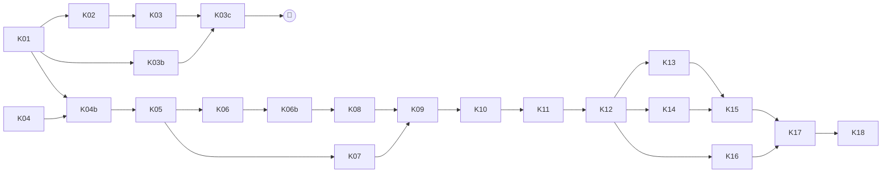

# Prompts d'implémentation — pipeline de production Kedro · Argo · MLflow

> Compagnon de **`PIPELINE_ARCHITECTURE.md`** (ci-après « ARCH »), qui fait foi. Chaque
> prompt est conçu pour être collé **tel quel** dans une **nouvelle session Claude Code**,
> ouverte à la racine du dépôt indiqué. Il contient le contexte nécessaire et renvoie aux
> sections d'ARCH que la session doit lire.
>
> Rédigé le 2026-09-15, **révisé le 2026-09-18** (révision 1 d'ARCH : dates de début
> 1988/1994, BACI exact par passes, millésimes de nomenclature, couche de service et
> tableaux de bord Superset, paquet `kedro_pipeline`, deux cadences, suppression des
> scripts). Identifiants : `K-xx` (prompts), `PD-xx` / `PS-xx` / `PR-xx` / `PQ-xx` /
> `C-xx` (ARCH).

## Mode d'emploi

1. Respecter l'ordre du tableau ci-dessous (colonne « Dépend de »). Les prompts d'une même
   ligne de phase sans dépendance mutuelle peuvent tourner en parallèle, **sur des branches
   distinctes**.
2. Choisir le modèle avec `/model` avant de coller le prompt ; activer le mode plan
   (`Shift+Tab` jusqu'à « plan mode ») quand c'est indiqué, puis relire et valider le plan
   avant exécution.
3. Chaque prompt se termine par des **critères d'acceptation** : ne pas considérer le
   prompt terminé tant qu'ils ne sont pas vérifiés.
4. Après chaque prompt : relire le diff, lancer `uv run pytest -m "not slow"`, commiter.
5. Si une session découvre qu'une hypothèse d'ARCH est fausse, elle **met à jour ARCH**
   (section concernée + §8) dans le même travail et le signale dans son résumé final.
6. Les prompts marqués 🔌 **doivent être lancés depuis Onyxia** (service VSCode du
   namespace, où `kubectl get pods` fonctionne — ARCH §9 point 1, §12, PQ-09) : ils
   touchent au cluster, aux services ou aux données réelles. Les autres se lancent en
   local. La table d'ARCH §12 liste en outre les **actions manuelles** à faire sur
   Onyxia entre deux prompts.
7. 🎯 marque le **jalon « tableau de bord »** : à partir de là, la démonstration peut
   être préparée dans Superset ; les prompts suivants n'en changent pas le contrat de
   lecture (ARCH PD-19, PS-29.3).

## Vue d'ensemble

| ID | Titre | Phase | Modèle | Mode plan | Dépend de | Dépôt |
|---|---|---|---|---|---|---|
| K-01 | Durcissement des scripts pour la production et profil `demo` | 0 | **Opus** | **Oui** | — | trade-analysis |
| K-02 | Image Docker et publication GHCR | 0 | Sonnet | Non | K-01 | trade-analysis |
| K-03 🔌 | Workflow Argo de transition (scripts) et lancement `demo` | 0 | Sonnet | **Oui** | K-02, ARCH §9 | trade-analysis |
| K-03b | Couche de service PostgreSQL, référentiels et métriques de supervision (phase 0) | 0 | **Opus** | **Oui** | K-01 (K-03 pour l'exécution réelle) | trade-analysis |
| K-03c 🔌 | Tableaux de bord Superset « Vulnérabilités » et « Supervision » | 0 | Sonnet | Non | K-03b exécuté sur Onyxia, ARCH §9 point 11 | trade-analysis |
| 🎯 | **Jalon tableau de bord** — démonstration préparable | — | — | — | K-03c | — |
| K-04 | Registre et écritures tamponnés dans `statflows`, options d'écriture 0.3.1, codelists | 1 | **Opus** | **Oui** | — | **statflows** |
| K-04b | Adoption de la nouvelle version de `statflows` | 1 | Sonnet | Non | K-01, K-04 | trade-analysis |
| K-05 | Registres de fraîcheur v2 (fragments, empreintes, forçage) | 2 | **Opus** | **Oui** | K-04b | trade-analysis |
| K-06 | Paramétrage import / export (`FLOWS`) et métriques d'export | 2 | **Opus** | **Oui** | K-05 | trade-analysis |
| K-06b | Millésimes de nomenclature : métriques partenaires par millésime, `in_force`, référentiels | 2 | **Opus** | **Oui** | K-05, K-06 | trade-analysis |
| K-07 | BACI exact par passes et statistiques suffisantes (mémoire bornée, millésimes 1994+) | 2 | **Opus** | **Oui** | K-05 | trade-analysis |
| K-08 | Évolution de schéma (0.3.1) et synthèse/cohérence incrémentales à cadence hebdomadaire | 2 | **Opus** | **Oui** | K-05, K-06, K-06b | trade-analysis |
| K-09 | Parallélisme intra-pod (réseau, synthèse, cohérence) | 2 | Sonnet | **Oui** | K-07, K-08 | trade-analysis |
| K-10 | Squelette Kedro `kedro_pipeline`, migration de la configuration, datasets | 3 | **Opus** | **Oui** | K-09 | trade-analysis |
| K-11 | Fonctions d'étape partagées ; scripts en enveloppes minces | 3 | **Opus** | **Oui** | K-10 | trade-analysis |
| K-12 | Pipelines et nœuds Kedro (deux cadences), test de bout en bout local | 3 | **Opus** | **Oui** | K-11 | trade-analysis |
| K-13 | Intégration kedro-mlflow et tracker composite (`pipeline_metrics`) | 3 | Sonnet | **Oui** | K-12 | trade-analysis |
| K-14 | Maintenance DuckLake quotidienne | 3 | Sonnet | **Oui** | K-12 | trade-analysis |
| K-15 | Rendu Argo (argo-kedro → WorkflowTemplate + 2 CronWorkflow) | 4 | **Opus** | **Oui** | K-13, K-14 | trade-analysis |
| K-16 | Site de documentation (mkdocs + kedro-viz) | 4 | Sonnet | Non | K-12 | trade-analysis |
| K-17 🔌 | Déploiement, recette sur Onyxia et runbooks | 4 | Sonnet | **Oui** | K-15, K-16 | trade-analysis |
| K-18 | Nettoyage final : suppression des scripts et des fichiers de démonstration, documentation | 4 | Sonnet | Non | K-17 | trade-analysis |



Justification des choix de modèle : **Opus** pour les prompts qui demandent des arbitrages
méthodologiques, touchent plusieurs couches ou exigent de préserver des invariants subtils
(fraîcheur, idempotence, contrat de tests) ; **Sonnet** pour les prompts dont la
spécification est suffisamment précise pour être appliquée (Docker, CI, docs, maintenance,
câblage MLflow). Le **mode plan** est activé partout où un mauvais départ coûte cher
(refactoring multi-fichiers, déploiement cluster).

---

## K-01 — Durcissement des scripts pour la production et profil `demo`

- **Modèle** : Opus · **Mode plan** : Oui · **Phase** : 0 · **Dépend de** : —
- **Dépôt** : `trade-analysis`

````text
Tu travailles dans le dépôt `trade-analysis` (pipeline de calcul de vulnérabilités du
commerce international). Lis d'abord `CLAUDE.md` (conventions : commentaires en français à
formulation nominale, docstrings Google Style en anglais, type hints, aucune valeur
méthodologique en dur, API sklearn), puis dans `PIPELINE_ARCHITECTURE.md` (ARCH) : §1
(constats C-01 à C-06, C-17, C-26), PD-05, PD-06, PD-07, PD-08, PD-19, PD-21 (point sur
`EU27_2020`), PS-06, PS-12, PS-14.1 et PS-04.4.

OBJECTIF : rendre les scripts de `scripts/` exécutables en production dans un pod Argo, et
préparer un profil de configuration `demo` pour une présentation dans une semaine. C'est le
« jalon démonstration » (PD-19) : on NE migre PAS vers Kedro ici, on corrige les scripts
existants de façon compatible avec la cible.

CONTRAINTES GÉNÉRALES
- Je n'ai pas accès au S3 ni au cluster depuis ce poste : valide tout sur données fictives
  (catalogue DuckLake fichier local, `moto` pour S3 ; voir `tests/conftest.py` et
  `tests/test_scripts_synthesis_e2e.py` pour les patterns existants).
- `uv run pytest` doit rester vert À L'IDENTIQUE (tests de caractérisation = contrat de
  non-régression). Tu peux ajouter des tests, pas relâcher des assertions existantes.
- Ne crée pas de commit.

TRAVAIL À RÉALISER
1. Fabrique de connecteur unique (C-03, C-04, PS-06) : crée le package `kedro_pipeline/`
   (fichier `__init__.py` + `kedro_pipeline/io/__init__.py` + `kedro_pipeline/io/ducklake.py`)
   SANS dépendance à Kedro (le nom annonce le futur projet Kedro, PD-01 ; en phase 0, il
   n'héberge que des modules purs). Implémente `DuckLakeLocation` (dataclass gelée) et
   `build_connector(location, pg, s3)` ainsi qu'un helper `pg_credentials_from_env()` /
   `s3_credentials_from_env()` (seul endroit, en phase 0, où l'environnement est lu).
   `AWS_SESSION_TOKEN` est OPTIONNEL (None si absent) ; `admin_user` vient de `PGADMINUSER`
   (défaut "postgres"). Remplace les neuf constructions `DuckLakeConnector.from_postgres`
   des scripts par cette fabrique. Ajoute `kedro_pipeline` aux paquets construits par
   hatchling dans `pyproject.toml` (`[tool.hatch.build.targets.wheel] packages`).
   Supprime `scripts/process_baci.py` et son entrée `baci-script` (doublon mono-millésime
   de `baci-hs-script`, jamais ordonnancé) ainsi que `scripts/test_baci.py` (C-18) ; si
   des tests les importent, déplace les helpers concernés vers `process_baci_hs.py`.
2. Identifiants de dataflow en configuration (C-05) : ajoute une clé `DATAFLOW` dans
   `config/datasets/comtrade.yaml` ("C_A_HS") et `config/datasets/eurostat.yaml`
   ("DS-045409") et lis-la dans les scripts à la place des constantes.
3. Suppression des plafonds de test (C-01) : remplace `queries[:10]` / `queries[:5]` par
   un paramètre `max_queries` (null = pas de plafond) dans la section `parameters` de
   chaque fichier de dataset. Il vaut null PARTOUT, y compris en `demo` (le périmètre
   `demo` est borné par ses filtres de codes, PD-07).
4. Profondeur historique (C-02, PD-08) : crée `config/runtime.yaml` (clé racine
   `runtime`, contenu de PS-04.1 : `ANALYSIS_START_YEAR: {eurostat: 1988, comtrade: 1994}`,
   `NOMENCLATURES.HS` avec les années d'entrée en vigueur, `WEEKLY_DAY`, `N_JOBS`,
   forçages vides), lu par tous les scripts via `RUNTIME_CONFIG_PATH` (défaut
   `config/runtime.yaml`). Comtrade : `periods.start` = `runtime.ANALYSIS_START_YEAR.comtrade`
   (les YAML ne sont pas encore fusionnés par OmegaConf : le script lit les deux fichiers
   et applique la valeur ; ne duplique pas la constante dans `comtrade.yaml`). Eurostat :
   `startPeriod` = `runtime.ANALYSIS_START_YEAR.eurostat` si `EurostatQueryRequestV30`
   / le client acceptent une borne de période (vérifie dans
   `.venv/Lib/site-packages/statflows/sources/eurostat/` ; consigne le résultat dans ARCH
   PQ-15). Ajoute les millésimes BACI `HS1992` (START_YEAR 1994 = début Comtrade),
   `HS1996` (1996), `HS2002` (2002), `HS2007` (2007) dans `config/baci.yaml` en plus de
   HS2012/2017/2022, schémas `baci_hs1992`… (ordre : du plus récent au plus ancien).
5. Découpage et ordre des requêtes (C-26, PD-06, PD-07, PS-12.1, PS-12.2) — SANS liste
   de produits prioritaires :
   - Comtrade : une requête par (année × lot de `products_step` produits), produits HS6
     uniquement (`include_regex: '^\d{6}$'`), liste ANNÉE-MAJEURE : boucle externe sur
     les années selon `parameters.C_A_HS.periods_order` ("desc" par défaut), boucle
     interne sur les lots dans l'ordre naturel des codes (lots formés une fois). Vérifie
     dans `.venv/Lib/site-packages/statflows/sources/comtrade/` comment
     `ComtradeQueryRequest` accepte `periods` et comment la liste d'années disponibles
     s'obtient (`get_valid_periods`), et corrige au passage le bug de la branche `else`
     de `build_split_queries` (variable `products` indéfinie).
   - Eurostat : liste PRODUIT-MAJEURE (boucle externe sur les produits dans l'ordre
     naturel des codes, boucle interne sur les reporters dans l'ordre de
     `reporter.include`), toutes les années par requête. Ajoute le reporter agrégé
     `EU27_2020` à `reporter.include` (PD-21) après avoir vérifié qu'il figure dans la
     codelist `reporter` de DS-045409 (lecture du code client ou d'un fichier de
     structure en cache ; si tu ne peux pas le vérifier hors ligne, ajoute-le et
     consigne PQ-17 « à vérifier au premier téléchargement »). NE change PAS la
     granularité (1 produit par requête) : l'étude des lots de produits est un risque
     ouvert (PR-03) ; ajoute seulement le paramètre `products_step: 1` documenté comme
     « non encore supporté si > 1 » et lève une `NotImplementedError` explicite s'il
     est > 1. Ajoute `period_windows: null` (PD-07) documenté, non implémenté si non
     null (`NotImplementedError`).
   - Rappel : `statflows.core.download.SDMXDownloader._prioritize` trie de façon STABLE
     les requêtes jamais téléchargées en tête, puis les plus anciennes : l'ordre de ta
     liste fait donc foi pour le rattrapage. Écris des tests unitaires d'ordonnancement
     (exemple de PS-12.1 : une année complète avant la suivante).
6. BACI (C-06 partiel, C-17, PS-14.1) — le traitement par passes est l'objet de K-07 ;
   ici, on borne seulement le périmètre :
   - lecture Comtrade poussée en SQL : ne lire que les années ≥ min(START_YEAR des cibles)
     et ≤ `PARAMETERS.period_end` si renseigné, et, par millésime, filtrer ensuite en
     pandas comme aujourd'hui ; utilise des paramètres liés (pas de f-string de valeurs) ;
     en `demo` (≈ 100 produits, années ≥ 2015) le monobloc tient en mémoire ;
   - porte de complétude simple : lis le registre de téléchargement Comtrade
     (`LAST_DOWNLOAD_PATH`, racine "DOWNLOADS", entrées avec `params.periods` et
     `params.products`) via `statflows.storage.json.Loader`, calcule pour chaque année la
     part de lots téléchargés au moins une fois parmi les lots PLANIFIÉS (reconstruis la
     liste planifiée avec la même fonction que le script de téléchargement), et ne traite
     que les années avec part ≥ `COMPLETENESS.MIN_SHARE` (nouveau bloc de
     `config/baci.yaml`, 1.0 par défaut). Journalise et trace dans MLflow
     (`coverage/years_eligible`, `coverage/share_min`) ;
   - ajoute la colonne `is_provisional` (vrai quand le périmètre produit est restreint
     par un filtre `include*` du téléchargement, PD-06 point 3) au résultat BACI ;
   - `process_baci_hs.py` doit écrire un registre par millésime SANS course entre
     millésimes (aujourd'hui une seule écriture fusionnée en fin de script : conserve ce
     schéma, il est correct en séquentiel ; ajoute un commentaire renvoyant à PD-10).
7. Profil `demo` (PS-04.4, PD-19) : crée `config/profiles/demo/` contenant des copies
   COMPLÈTES de `comtrade.yaml`, `eurostat.yaml`, `baci.yaml`, `vulnerabilities.yaml`,
   `synthesis.yaml`, `runtime.yaml` (les scripts les liront via leurs variables
   d'environnement existantes `COMTRADE_CONFIG_PATH`, `EUROSTAT_CONFIG_PATH`,
   `BACI_CONFIG_PATH`, `VULNERABILITIES_CONFIG_PATH`, `SYNTHESIS_CONFIG_PATH`,
   `RUNTIME_CONFIG_PATH`). Périmètre : produits dont le code commence par 2805, 2846,
   8105, 8112, 2844, 3004, 8541, 8542, 8507 (≈ 100 codes SH6) ; Comtrade années ≥ 2015 ;
   BACI cible unique HS2017 (schéma `demo_baci_hs2017`) ; schémas résultats et chemins
   de registres préfixés `demo_` / `demo/` pour ne jamais mélanger avec la production ;
   `min_group_size: 10` en synthèse ; `LAST_N_PERIODS: null`. Le `demo` ne diffère de
   la production QUE par le périmètre : même ordre de téléchargement, `max_queries:
   null`. Mets en tête de chaque fichier un commentaire indiquant que le périmètre est
   provisoire (PQ-07). Ajoute un test qui vérifie que chaque profil `demo` se charge, et
   que toutes les clés présentes dans le fichier de production existent aussi dans le
   profil (pas de clé manquante).
8. `MAX_RUNTIME` : 10 heures par défaut dans les deux fichiers de dataset (ARCH §2.3).

CRITÈRES D'ACCEPTATION
- `uv run pytest` vert ; nouveaux tests pour : la fabrique de connecteur (sans connexion
  réelle : vérifier les arguments passés à `DuckLakeConnector.from_postgres` avec un
  mock, notamment `s3_session_token=None` sans variable), l'ordonnancement Comtrade
  (année-majeur) et Eurostat (produit-majeur), la porte de complétude (registre fictif),
  le chargement des profils `demo` et de `runtime.yaml`.
- `grep -rn "AWS_SESSION_TOKEN\"\]" scripts/` ne renvoie rien ; plus aucun
  `from_postgres(` dans `scripts/`.
- Aucun `queries[:` dans `scripts/` ; aucune clé `priority` dans `config/`.
- Un résumé final listant : fichiers modifiés, décisions prises, écarts éventuels avec
  ARCH (et mise à jour d'ARCH si une hypothèse s'est révélée fausse, notamment PQ-15 et
  PQ-17).
````

---

## K-02 — Image Docker et publication GHCR

- **Modèle** : Sonnet · **Mode plan** : Non · **Phase** : 0 · **Dépend de** : K-01
- **Dépôt** : `trade-analysis`

````text
Dépôt `trade-analysis`. Lis `CLAUDE.md`, puis dans `PIPELINE_ARCHITECTURE.md` : C-14,
C-21, PD-15, PS-22, PS-23 (ligne `image.yml` et `ci.yml` uniquement).

OBJECTIF : produire une image Docker reproductible de production, publiée gratuitement sur
GitHub Container Registry (`ghcr.io/qbolliet/trade-analysis`, visibilité publique), et une
CI minimale. Le projet Kedro N'EXISTE PAS encore : l'image doit fonctionner avec les
scripts actuels (`uv run baci-hs-script` etc.) et ne pas dépendre de kedro.

TRAVAIL
1. Réécris `docker/Dockerfile` selon PS-22 avec les adaptations de phase 0 :
   - `python:3.13-slim` (le projet exige Python ≥ 3.13), `uv` épinglé à une version
     précise (vérifie la dernière version stable disponible sur ghcr.io/astral-sh/uv et
     épingle-la), build multi-étage, `uv sync --frozen --no-dev` avec les extras
     `tracking` et `optimal-transport` (vérifie qu'ils existent dans `pyproject.toml`) ;
   - copie `macroforecast/`, `scripts/`, `kedro_pipeline/`, et TOUT `config/` (le dossier
     `config/local/` éventuel est exclu par `.dockerignore`) ; pas d'extra `dashboards`
     (abandonné, ARCH PD-13) ;
   - préinstallation des extensions DuckDB `ducklake`, `postgres`, `httpfs` dans l'image,
     avec `HOME=/app` pour que le cache d'extensions soit dans l'image et lisible par
     l'utilisateur non root ;
   - `postgresql-client` et `ca-certificates` dans l'étage final ; utilisateur uid 1000 ;
   - `ARG GIT_SHA` → `ENV GIT_SHA` ; `ENTRYPOINT []` et une commande par défaut inoffensive
     (`python -c "import macroforecast; print('ok')"`). Les pods Argo appelleront
     explicitement la commande (`comtrade-script`, …) : vérifie que les entrées
     `[project.scripts]` sont bien dans le PATH du venv.
   - ATTENTION : `dt-ducklake-manager` et `statflows` viennent de dépôts git
     (`[tool.uv.sources]`) : `git` est requis dans l'étage de build.
2. Crée `.dockerignore` (liste de PS-22) — vérifie en particulier que
   `sspcloud_access_script.txt` et `Trade deployment.md` (secrets) sont exclus.
3. Crée `.github/workflows/image.yml` (PS-23) : déclenché sur push `main`, tags `v*` et
   `workflow_dispatch` ; permissions `contents: read`, `packages: write` ; actions
   `docker/setup-buildx-action`, `docker/login-action` (registry ghcr.io, user
   `${{ github.actor }}`, password `${{ secrets.GITHUB_TOKEN }}`),
   `docker/metadata-action` (tags : `sha-<court>`, nom de branche, `latest` sur la branche
   par défaut, semver sur tag), `docker/build-push-action` avec cache `type=gha,mode=max`,
   `build-args: GIT_SHA=${{ github.sha }}`, `platforms: linux/amd64`. Épingle chaque
   action à une version majeure explicite (`@v3`, `@v5`, `@v6` : vérifie les versions
   courantes).
   Ajoute aussi un déclenchement sur la branche de travail courante
   (`qb-vulnerabilities`) pour pouvoir publier avant fusion.
4. Crée `.github/workflows/ci.yml` minimal : `astral-sh/setup-uv`, `uv sync --frozen
   --group dev --extra tracking` (sans `optimal-transport` pour la vitesse), `uv run
   pytest -m "not slow"`.
5. Vérifie localement ce qui est vérifiable : si Docker est disponible (`docker version`),
   construis l'image et exécute `docker run --rm <image> python -c "import duckdb,
   macroforecast, scripts.process_baci_hs; c=duckdb.connect(); c.load_extension('ducklake'); print('ok')"`
   ainsi que `docker run --rm <image> comtrade-script --help || true` pour vérifier la
   présence de l'exécutable. Si Docker n'est pas disponible, dis-le clairement et valide
   au minimum la syntaxe avec `docker buildx build --check` si possible, sinon relis
   attentivement.
6. Ajoute à la fin du README une courte section « Image Docker » (commande `docker pull`,
   rappel qu'il faut rendre le paquet GHCR public une fois dans les réglages GitHub).

CRITÈRES D'ACCEPTATION
- Dockerfile conforme à PS-22 (adaptations de phase 0 comprises), `.dockerignore` présent.
- Workflows YAML valides (vérifie la syntaxe avec `python -c "import yaml,sys;
  yaml.safe_load(open(sys.argv[1]))"` sur chacun).
- Résumé final : ce qui a été testé réellement vs relu seulement ; rappel des actions
  manuelles GitHub (visibilité du paquet).
- Ne crée pas de commit.
````

---

## K-03 🔌 — Workflow Argo de transition (scripts) et lancement `demo`

- **Modèle** : Sonnet · **Mode plan** : Oui · **Phase** : 0 · **Dépend de** : K-02, actions ARCH §9 (points 1 à 5, 7)
- **Dépôt** : `trade-analysis` — **session lancée depuis un terminal avec accès `kubectl`**

````text
Dépôt `trade-analysis`. Lis `CLAUDE.md`, puis dans `PIPELINE_ARCHITECTURE.md` : §2.2,
§2.3, C-15, PD-05, PD-14 (sémantique des dépendances tolérantes), PD-18, PD-19, PS-21
(comme modèle de forme), §9. Regarde `kubernetes/workflow.yaml` (ancien exemple, contient
des erreurs listées en C-15) et `Trade deployment.md` (création des secrets ; fichier
ignoré par git, ne le recopie nulle part).

OBJECTIF : déployer sur Onyxia (namespace `user-qbollietdgddi`) un WorkflowTemplate +
CronWorkflow « de transition », écrits à la main, qui enchaînent les scripts existants
selon le DAG cible, sur le profil `demo` (`config/profiles/demo/`), puis lancer une
première exécution. Ce workflow sera remplacé plus tard par un workflow généré depuis
Kedro (K-15) : reste simple et lisible.

ÉTAPE 0 — VÉRIFICATIONS (lecture seule, rapporte les résultats avant d'aller plus loin)
- `kubectl config current-context`, `kubectl get pods`, `kubectl get secrets` (noms
  seulement), `kubectl get serviceaccounts`, `kubectl api-resources | grep argoproj`,
  version d'Argo (`argo version` si le binaire existe, sinon image du contrôleur :
  `kubectl get pods -o jsonpath='{..image}'` sur le pod argo), `kubectl describe
  resourcequota` et `kubectl describe limitrange`.
- Vérifie la présence des secrets `trade-s3-credentials`, `comtrade-api-credentials`,
  `trade-postgres-credentials`, `trade-mlflow-credentials`, `trade-serving-credentials`
  (clés attendues : PD-18). S'il en manque un, ARRÊTE-TOI et donne-moi la commande
  exacte à exécuter (je saisirai les valeurs moi-même ; ne me demande jamais de te coller
  une valeur secrète). `trade-serving-credentials` n'est requis que par la tâche
  `serving` (K-03b) : s'il manque, rends cette tâche optionnelle (paramètre
  `publish-serving: "false"`) plutôt que de bloquer.
- Vérifie que l'image `ghcr.io/qbolliet/trade-analysis:<tag>` est tirable anonymement
  (`docker manifest inspect` ou `crane manifest` si disponibles, sinon on le verra au
  premier pod).
- Mets à jour ARCH §8 (PQ-02, PQ-16 : quota TOTAL du namespace — les limites par pod
  sont déjà connues, PQ-01) avec les valeurs constatées.

ÉTAPE 1 — MANIFESTES dans `kubernetes/transition/`
- `workflowtemplate.yaml` : `WorkflowTemplate` `trade-pipeline-transition` ;
  `serviceAccountName` = celui constaté ; paramètres `image-tag` (défaut : SHA court du
  HEAD publié), `profile` (défaut `demo`), `max-runtime-hours` ; un template conteneur
  générique `script` (inputs : nom de commande, cpu, mémoire) avec `podSpecPatch` pour les
  ressources ; environnement de PD-18 (secrets par `secretKeyRef`/`envFrom`, variables
  non secrètes) ; variables `COMTRADE_CONFIG_PATH`, `EUROSTAT_CONFIG_PATH`,
  `BACI_CONFIG_PATH`, `VULNERABILITIES_CONFIG_PATH`, `SYNTHESIS_CONFIG_PATH` pointant vers
  `config/profiles/{{workflow.parameters.profile}}/…` (si profile vaut `base`, pointer vers
  les chemins historiques : gère-le avec deux jeux de variables ou un petit script shell
  d'entrée — choisis le plus simple et explique) ; `MLFLOW_TRACKING_URI` depuis le secret.
- DAG :
  `download-eurostat` (eurostat-script) ∥ `download-comtrade` (comtrade-script) ;
  `baci` (baci-hs-script) dépend de download-comtrade (Succeeded || Failed) ;
  `network` (vulnerabilities-network-script) dépend de baci (Succeeded || Failed) ;
  `partners` (vulnerabilities-eurostat-script) dépend de download-eurostat (Succeeded || Failed) ;
  `synthesis` (vulnerabilities-synthesis-script) dépend de partners ET network (chacun Succeeded || Failed) ;
  `coherence` (vulnerabilities-coherence-script) dépend de synthesis (Succeeded || Failed) ;
  `serving` (serving-script, K-03b ; si le script n'existe pas encore, prévois la tâche
  avec `when: "{{workflow.parameters.publish-serving}} == true"` et le paramètre à
  `false`) dépend de coherence (Succeeded || Failed).
  Ressources de départ : téléchargements 1 CPU / 2 GiB ; baci 4 CPU / 32 GiB ; autres
  4 CPU / 16 GiB (limites Onyxia : 0,1-30 CPU, 1-200 GiB par pod, PQ-01) — à réduire si
  le quota total constaté l'exige (documente le choix).
  `retryStrategy: {limit: 1, retryPolicy: OnError}` sauf téléchargements (limit 0).
  `activeDeadlineSeconds: 82800`, `ttlStrategy`, `podGC: OnPodSuccess`.
- `cronworkflow.yaml` : `CronWorkflow` `trade-pipeline-transition-daily`, 01:00
  Europe/Paris, `concurrencyPolicy: Forbid`, `startingDeadlineSeconds: 3600`, historiques
  7/7, `workflowTemplateRef` vers le template ; `schedules:` (liste) si Argo ≥ 3.6 sinon
  `schedule:`.
- Déplace `kubernetes/workflow.yaml` et `kubernetes/configmap.yaml` dans
  `kubernetes/examples/` avec un en-tête « exemple historique, non déployé (cf. C-15) ».

ÉTAPE 2 — VALIDATION ET DÉPLOIEMENT
- `argo lint kubernetes/transition/` si `argo` est disponible, sinon `kubectl apply
  --dry-run=server -f kubernetes/transition/`.
- Montre-moi le diff et ATTENDS ma confirmation avant `kubectl apply`.
- Après confirmation : `kubectl apply -f kubernetes/transition/`, puis soumets une
  exécution manuelle `argo submit --from workflowtemplate/trade-pipeline-transition -p
  profile=demo` (ou `kubectl create` d'un Workflow référençant le template si `argo`
  manque). Suis les premiers pods (`kubectl logs -f`), diagnostique et corrige les erreurs
  de démarrage (imports, variables, secrets, extensions DuckDB). Ne laisse pas tourner une
  exécution qui échoue en boucle.

ÉTAPE 3 — DOCUMENTATION
- Crée `kubernetes/transition/README.md` : ce que fait le workflow, comment le soumettre,
  le suspendre (`argo cron suspend`), changer d'image, lire les logs, et comment il sera
  remplacé (K-15).

CRITÈRES D'ACCEPTATION
- Les deux manifestes passent la validation serveur ; le CronWorkflow est créé.
- Une exécution `demo` a démarré ; les deux téléchargements tournent et écrivent (vérifie
  un log « Upserted » ou « Created schema ») ; le reste du DAG s'exécute sans erreur de
  configuration (les étapes aval peuvent légitimement ne rien calculer au premier passage).
- Rapport final : état des tâches, erreurs rencontrées et corrections, valeurs de quotas,
  mises à jour d'ARCH §8.
- Ne crée pas de commit.
````

---

## K-03b — Couche de service PostgreSQL, référentiels et métriques de supervision (phase 0)

- **Modèle** : Opus · **Mode plan** : Oui · **Phase** : 0 · **Dépend de** : K-01 (code) ; K-03 et ARCH §9 point 10 pour l'exécution réelle
- **Dépôt** : `trade-analysis` — développement et tests en local ; la première exécution réelle se fait sur Onyxia (ARCH §12)

````text
Dépôt `trade-analysis`. Lis `CLAUDE.md`, puis dans `PIPELINE_ARCHITECTURE.md` : C-22,
C-23, PD-13, PD-18, PD-19 (jalon tableau de bord), PD-20 (points 1, 3, 4 et 7 : tu
n'implémentes PAS les millésimes ici, mais la couche de service doit en dériver les
colonnes, PS-29.3), PD-21, PS-28.1, PS-28.4, PS-29 (en entier), PS-31.1, PS-31.2, §12.
Lis `AGREGATION_ARCHITECTURE.md` pour le schéma réel des tables `synthesis` et
`synthesis_diagnostics` (clés, colonnes `method`, `level`, `statistic`…), et
`config/vulnerabilities.yaml`, `config/synthesis.yaml`, `config/baci.yaml`,
`config/runtime.yaml` (K-01). Regarde `scripts/download_*.py` (codelists) et
`scripts/process_baci_hs.py` (`_ensure_concordances`, cache UNSD).

OBJECTIF : rendre les résultats lisibles par Superset SANS pilote DuckLake, via un schéma
PostgreSQL `serving` reconstruit par le pipeline, avec les libellés nécessaires, et
poser la table de métriques de supervision. C'est le prérequis du jalon « tableau de
bord » de la présentation (K-03c). Tout est écrit dans `kedro_pipeline/` SANS dépendance
à Kedro (phase 0, PD-02), avec un script enveloppe `scripts/publish_serving.py`
(`serving-script` dans `[project.scripts]`).

TRAVAIL
1. `kedro_pipeline/config.py` (phase 0 : module pur) : `vintage_in_force`,
   `historical_vintages`, `classification_of` (PS-28.1, doctests), lisant
   `runtime.NOMENCLATURES.HS`.
2. Référentiels (PS-28.4, schéma `reference` du catalogue de chaque source) :
   - `kedro_pipeline/steps/reference.py::publish_reference(codelists, table, *, source,
     params)` qui écrit `products` (classification, code, label, level, parent_code),
     `reporters`/`partners` (source, code, label, iso3, m49, is_aggregate) par upsert
     idempotent (clés primaires) via `statflows.write_dataframe` ;
   - appelée depuis `download_comtrade.py` et `download_eurostat_comext.py` avec les
     codelists DÉJÀ récupérées par `fetch_dimension_codelists` (vérifie que les libellés
     sont disponibles dans ce que renvoient les clients ; sinon, lis la structure /
     codelist SDMX qui les contient — `parse_codelist_response` côté Eurostat — et
     documente ce qui manque pour Comtrade dans ARCH PS-27 point 6) ;
   - `hs_concordance` et `hs_vintages` écrites par `process_baci_hs.py` depuis le cache
     UNSD et `runtime.NOMENCLATURES`.
3. `kedro_pipeline/io/serving.py` :
   - `ServingHandle(credentials)` : connexion `psycopg2`, `ensure_schema()`,
     `swap_table(name)` (transaction : `DROP TABLE IF EXISTS name ; ALTER TABLE
     name__new RENAME TO name`), `create_indexes(name, indexes)`, `analyze(name)` ;
   - `attach_serving(conn_duckdb, credentials)` : `ATTACH 'dbname=… user=… host=…' AS pg
     (TYPE postgres)` via l'extension DuckDB `postgres` (préinstallée dans l'image,
     K-02) ; `write_table(conn, name, sql)` : `CREATE TABLE pg.serving.<name>__new AS
     <sql>` ;
   - `MetricsSink(credentials)` : `write(df)` par lots dans `serving.pipeline_metrics`
     (PS-31.1 ; crée la table si absente), file locale JSONL rejouée si l'insertion
     échoue (PS-31.2).
4. `kedro_pipeline/steps/serving.py::publish_serving(sources, serving, *, params,
   runtime, tracker)` : pour chaque table de `serving.TABLES` (nouveau fichier
   `config/serving.yaml`, clé racine `serving`, contenu de PS-29.2 adapté aux schémas
   RÉELS ; copie complète dans `config/profiles/demo/`), rend la requête SQL (gabarit
   avec les paramètres `METHODS`, `LEVELS`, `PRIMARY_METHOD`, `TOP_PARTNERS`, les
   schémas `demo_*` du profil et la fonction SQL `vintage_in_force` GÉNÉRÉE depuis
   `runtime.NOMENCLATURES` sous forme de `CASE WHEN`), exécute, bascule, indexe, mesure
   (`serving/<table>/rows`, `serving/<table>/seconds`). Tables : `cell_scores`
   (colonnes de PS-29.2, dont `classification`, `hs_vintage`, `in_force` DÉRIVÉES en
   phase 0 — PS-29.3 —, les scores/rangs des `METHODS` × `LEVELS` en colonnes, les
   alertes, et des colonnes normalisées `<métrique>_norm` min-max par contexte pour la
   heatmap), `coherence_metrics`, `coherence_methods`, `flows` (TOP_PARTNERS + WORLD +
   EXT_EU, parts et rangs), `products`, `countries`, `hs_concordance`, `hs_vintages`.
   La jointure réseau utilise `n.classification = vintage_in_force(year)` (corrige C-11
   côté restitution).
5. `kedro_pipeline/steps/serving.py::publish_artifact_tables(...)` : petites tables
   d'artefacts pour la supervision BACI (PS-31.3) : `baci_sigma_by_country`,
   `baci_gravity_coefficients`, `baci_conversion_rates` — écrites par
   `process_baci_hs.py` en fin de millésime (les mêmes DataFrames que ceux journalisés
   en artefacts MLflow), clés (vintage, fit/run, …), remplacement par millésime.
6. `macroforecast/tracking/base.py` : `TableTracker(sink)` et `CompositeTracker(trackers)`
   (PD-13 ; protocole `RunTracker` inchangé, chaque membre isolé par try/except +
   WARNING) ; `get_tracker(...)` accepte `extra_trackers`. Les scripts construisent
   `CompositeTracker([MlflowTracker, TableTracker(MetricsSink)])` quand
   `SERVING_PGHOST` est défini (helper `kedro_pipeline/io/tracking.py::build_tracker`),
   et posent les tags `workflow_id` (variable `WORKFLOW_ID` si présente), `node`,
   `kedro_env`/profil.
7. Script `scripts/publish_serving.py` (`serving-script`) : charge les configurations,
   construit poignées et tracker, appelle `publish_serving` ; code de sortie non nul en
   cas d'échec d'une table. Ajoute la tâche `serving` au workflow de transition
   (`kubernetes/transition/`, dépend de `coherence` Succeeded || Failed) si K-03 est
   déjà passé, sinon note-le pour K-03.
8. `docker/Dockerfile` : vérifie que l'extension DuckDB `postgres` est préinstallée
   (K-02) et que `psycopg2` est dans l'environnement (dépendance de
   `dt-ducklake-manager` ; sinon ajoute `psycopg2-binary`).

TESTS
- Sans PostgreSQL disponible : les requêtes de service sont validées sur un catalogue
  DuckLake fichier (données fictives de `tests/`) en les exécutant dans DuckDB vers une
  table DuckDB locale (`CREATE TABLE tmp.<name> AS <sql>`) : colonnes attendues, une
  ligne par cellule, rangs cohérents (rang 1 = plus vulnérable), `in_force` dérivé,
  jointure réseau par millésime en vigueur, `flows` borné à `TOP_PARTNERS`.
- Avec PostgreSQL éphémère si disponible (`pg_ctl`/conteneur ; sinon marque `slow` et
  documente) : basculement atomique, index, `MetricsSink` avec rejeu après une panne
  simulée.
- `TableTracker`/`CompositeTracker` : unitaires (isolation des échecs).

CRITÈRES D'ACCEPTATION
- `uv run pytest` vert ; `uv run serving-script --help` fonctionne.
- `config/serving.yaml` documenté (commentaires français) ; ARCH PS-29.2 mis à jour avec
  les noms de colonnes RÉELS de `synthesis`/`synthesis_diagnostics`.
- Résumé final : liste des tables de service et de leurs colonnes (ce sera la référence
  de K-03c), volumétrie attendue en `demo`, ce qui a été testé avec/sans PostgreSQL,
  et la commande à lancer sur Onyxia pour la première publication.
- Ne crée pas de commit.
````

---

## K-03c 🔌 — Tableaux de bord Superset « Vulnérabilités » et « Supervision »

- **Modèle** : Sonnet · **Mode plan** : Non · **Phase** : 0 · **Dépend de** : K-03b exécuté au moins une fois sur Onyxia (tables `serving` remplies), ARCH §9 point 11 (service Superset lancé, connexion PostgreSQL créée)
- **Dépôt** : `trade-analysis` — **session lancée depuis un service VSCode Onyxia** (accès réseau à PostgreSQL `trade_serving` et à l'URL Superset du namespace)

````text
Dépôt `trade-analysis`. Lis `CLAUDE.md`, puis dans `PIPELINE_ARCHITECTURE.md` : PD-21,
PS-29.2 (tables de service et colonnes, telles que mises à jour par K-03b), PS-30 (en
entier), PS-31 (en entier), §5.8, PQ-13, PQ-18. Lis le résumé de K-03b (liste des
tables et colonnes) s'il a été consigné, sinon interroge PostgreSQL :
`psql "$SERVING_DSN" -c '\dt serving.*'` et `\d serving.cell_scores` (DSN construit
depuis les variables d'environnement ; n'affiche jamais le mot de passe).

CONTEXTE : je suis néophyte sur Superset. Je veux, pour une présentation dans quelques
jours, un tableau de bord « Vulnérabilités » (page Pays avec la France par défaut, une
année, un flux ; produits classés selon l'indicateur synthétique principal avec le
détail des métriques ; même tableau pour l'Union européenne ; cohérence des métriques
pour la France, pour l'Union, puis par pays × produit ; clic sur un produit → page
Produit : pays classés, flux import/export par pays, évolutions temporelles d'une
métrique et des flux pour des pays choisis) et un tableau de bord « Supervision du
pipeline » à onglets (téléchargement, BACI, vulnérabilités, synthèse, cohérence).

TRAVAIL (deux voies, dans cet ordre)
A. VOIE « ASSETS AS CODE » (préférée si l'API Superset est accessible depuis la session)
1. Vérifie l'accès : `curl -s $SUPERSET_URL/health` ; authentification
   `POST /api/v1/security/login` (identifiants demandés à l'utilisateur, jamais écrits
   dans le dépôt), puis `GET /api/v1/database/` pour retrouver l'identifiant de la
   connexion `trade_serving`.
2. Crée les datasets (`POST /api/v1/dataset/`) pour `cell_scores`, `flows`,
   `coherence_metrics`, `coherence_methods`, `products`, `countries`, avec une colonne
   calculée `period` = `make_date(year, 1, 1)` marquée temporelle, et les métriques
   `MAX(<colonne>)` pour chaque métrique de vulnérabilité et chaque score.
3. Crée les graphiques (`POST /api/v1/chart/`) et les deux tableaux de bord
   (`POST /api/v1/dashboard/`) selon PS-30.2 (onglets « Pays », « Produit », filtres
   natifs `reporter`=FR, `year`=max, `flow`=import, `classification`, `in_force`
   masqué, `reporters_compare` limité à l'onglet Produit ; cross-filter émis par la
   table des produits ; bloc « Union » avec filtre fixe `reporter = 'EU27_2020'`) et
   PS-31.3 (un onglet par étape, `Big Numbers` du dernier run, filtres `workflow_id`,
   `kedro_env`, `vintage`). Les `params` JSON des graphiques : pars d'un graphique créé
   à la main dans l'interface (exporte-le pour connaître le format exact de la version
   déployée) plutôt que de deviner le schéma.
4. Exporte (`GET /api/v1/dashboard/export/?q=[<ids>]`) et commite les ZIP décompressés
   sous `superset/vulnerabilites/` et `superset/supervision/` (sans mot de passe :
   vérifie le contenu de `databases/*.yaml`).
B. VOIE MANUELLE (si l'API n'est pas accessible, ou en complément)
5. Rédige `superset/README.md` : guide PAS À PAS pour néophyte, avec le chemin de menu
   exact de la version déployée (relève-la dans *Settings → About*) pour : connexion
   base, création d'un dataset et de ses métriques, création de chaque graphique de
   PS-30.2 et PS-31.3 (type, dataset, dimensions, métriques, tri, formatage
   conditionnel, option *Emit dashboard cross filters*), assemblage du tableau de bord
   (onglets, filtres natifs et leur portée, valeurs par défaut), export/import. Une
   section « pièges » : colonnes entières non temporelles, `MAX` vs `AVG` sur une
   table à la maille cellule, portée des filtres natifs par onglet, cache des
   graphiques (*Settings → Cache*), droits du rôle `superset_reader`.
6. Guide-moi en direct pour construire au moins la page « Pays » et vérifie le résultat
   avec moi (captures ou description) ; je ferai le reste avec le README.
C. DANS LES DEUX CAS
7. Propose et, si j'accepte, ajoute deux ou trois graphiques de PS-30.3 (nuage HHI ×
   CDI2, concordance des méthodes, encadré méthodologique).
8. Consigne dans ARCH PS-30/PS-31 ce qui diffère de la spécification (version Superset,
   noms de menus, limitations rencontrées) et dans PQ-13 la version et le mode d'accès.

CRITÈRES D'ACCEPTATION
- Le tableau de bord « Vulnérabilités » s'ouvre avec la France, la dernière année et le
  flux import ; le tableau des produits est trié rang 1 en tête ; le clic sur un produit
  filtre l'onglet Produit ; le bloc Union affiche `EU27_2020` (ou le repli PR-18 si le
  reporter manque).
- Le tableau de bord « Supervision » affiche au moins un run par onglet à partir de
  `serving.pipeline_metrics`.
- Exports commités (voie A) ou README complet (voie B) ; aucun secret dans le dépôt.
- Résumé final : ce qui est construit, ce qui reste à faire à la main, et les
  graphiques d'évolution temporelle disponibles avec la profondeur `demo` (2015+).
````

---

## K-04 — Registre et écritures tamponnés dans `statflows`

- **Modèle** : Opus · **Mode plan** : Oui · **Phase** : 1 · **Dépend de** : —
- **Dépôt** : **`statflows`** (`https://github.com/qbolliet/statflows`, branche `main`) — cloner le dépôt et ouvrir la session à sa racine

````text
Tu travailles dans le dépôt `statflows` (bibliothèque d'acquisition de données
statistiques : clients SDMX Eurostat/OECD, Comtrade, UNSD ; orchestration des
téléchargements incrémentaux vers DuckLake ; stockage JSON local/S3). Il est consommé par
le projet `trade-analysis`, dont l'architecture de production est décrite dans
`PIPELINE_ARCHITECTURE.md` de ce projet-là (non disponible ici). Les passages utiles sont
recopiés ci-dessous. Lis d'abord les conventions du dépôt (README, CLAUDE.md s'il existe)
et respecte-les (en l'absence de règle : commentaires en français, docstrings Google Style
en anglais, type hints).

PROBLÈME (constat C-08 de l'architecture)
Dans `statflows/core/download.py`, `SDMXDownloader._process_query` :
- réécrit le registre JSON des téléchargements EN ENTIER sur S3 après CHAQUE requête
  (`self._save_registry()`), alors que le rattrapage complet représente 10⁴ à 10⁵ requêtes
  (registre de plusieurs dizaines de Mo réécrit à chaque requête → coût quadratique) ;
- écrit chaque DataFrame non vide immédiatement via
  `statflows.storage.ducklake.tables.write_dataframe`, qui appelle
  `DatabaseUpdater.update_database(..., compact_after_update=True)` : un snapshot DuckLake,
  un fichier Parquet et une compaction PAR requête.
Par ailleurs, les étapes aval du projet lisent ce registre (entrées
`{"agency", "dataflow", "params", "last_download"}` sous la racine "DOWNLOADS") pour
décider de ce qui est à recalculer.

OBJECTIF (spécification PS-27, recopiée)
1. Registre tamponné : `SDMXDownloader(..., registry_flush_every: int = 1,
   registry_flush_seconds: float | None = None)`. Persistance quand l'un des seuils est
   atteint, à la fin du run (bloc `finally`), et sur SIGTERM (arrêt de pod Kubernetes)
   via un gestionnaire de signal installé pendant `run()` et restauré en sortie (seulement
   dans le thread principal ; sinon, pas de gestionnaire et un avertissement).
   Rétrocompatibilité stricte : les valeurs par défaut reproduisent le comportement
   actuel.
2. Registre fragmenté (optionnel) : `registry_shard_key: Callable[[query], str] | None`.
   Si fourni, un fichier par fragment (`<last_download_path sans extension>/<fragment>.json`),
   seuls les fragments modifiés sont réécrits. Fournis une API de LECTURE publique
   indépendante du format physique :
   `iter_registry_entries(last_download_path, bucket=None, storage_options=None) ->
   Iterator[RegistryEntry]` (dataclass gelée : `identity_key`, `agency`, `dataflow`,
   `params`, `last_download: datetime`), qui lit indifféremment le fichier unique
   historique ou les fragments. Exporte-la depuis `statflows.core.download` et
   `statflows`. Le chargement initial du downloader doit lire les deux formats (migration
   transparente d'un registre existant vers les fragments à la première écriture).
3. Écritures DuckLake tamponnées : `write_batch_rows: int | None = None`,
   `write_batch_queries: int | None = None`. Les DataFrames sont accumulés PAR schéma
   (dataflow) et écrits en une fois (concaténation) quand un seuil est atteint, à la fin
   du run, sur deadline et sur SIGTERM. INVARIANT CRITIQUE À PRÉSERVER : une entrée de
   registre n'avance JAMAIS avant que les données de sa requête aient été écrites avec
   succès. Les entrées des requêtes du lot en attente sont donc elles aussi mises en
   attente, puis validées après l'écriture du lot. Si l'écriture d'un lot échoue, aucune
   entrée du lot n'avance, l'erreur est comptée pour chaque requête du lot dans le
   `DownloadReport`, et le run continue. Attention aux clés primaires : deux requêtes d'un
   même lot ne se recouvrent pas, mais dédoublonne par clé primaire (dernier gagnant)
   avant écriture, par sécurité.
4. `write_dataframe(..., compact_after_update: bool = True, allow_new_columns: bool =
   False, run_id: str | None = None, commit_message: str | None = None)` transmis à
   `DatabaseUpdater.update_database` (API de `dt-ducklake-manager` **0.3.1** : lis
   `operations/updater.py` — `update_database` accepte ces quatre arguments, et
   `add_columns` existe pour diffuser une colonne par clé primaire) ; `SDMXDownloader(...,
   compact_after_update: bool = True)` le relaie. Vérifie ce que fait réellement
   `compact_after_update` et documente-le dans la docstring. Relève la contrainte de
   version `dt-ducklake-manager>=0.3.1` dans l'extra `ducklake` de `pyproject.toml`.
5. Si `DuckLakeConnector` (dt_ducklake_manager) permet de passer des options d'ATTACH,
   expose `ducklake_options: dict | None` pour activer `DATA_INLINING_ROW_LIMIT` ; sinon,
   N'IMPLÉMENTE RIEN et consigne la limite dans le README (section « Performance »).
6. `download_updates(...)` expose tous les nouveaux paramètres.
7. Diagnostics : ajoute au `DownloadReport` `n_registry_flushes`, `n_write_batches`,
   `rows_pending_at_stop` (0 attendu), et reflète-les dans `to_metrics()`.
8. Codelists avec libellés : expose une fonction publique (ex.
   `statflows.core.factory.codelist_frame(client, dimension | structure) ->
   pd.DataFrame` avec colonnes `code`, `label`, et `parent` si disponible) pour les
   clients Eurostat ET Comtrade, réutilisant les appels déjà faits pour construire les
   requêtes (aucun second appel réseau quand la codelist est en cache). Le projet aval
   s'en sert pour publier des tables de référence (libellés de produits et de pays).

TESTS (obligatoires, sans réseau)
- Faux client implémentant l'interface minimale (`fetch_updates`,
  `resolve_query_structure`, `structure_registry`) et 2 000 fausses requêtes, catalogue
  DuckLake fichier local, S3 simulé avec `moto` si le dépôt l'utilise déjà (sinon registre
  local) :
  a) mode par défaut : contenu final identique à la version actuelle (test de
     caractérisation écrit AVANT tes modifications, qui doit passer avant et après) ;
  b) mode tamponné (`registry_flush_every=500`, `write_batch_queries=500`) : ≤ 5
     écritures du registre (compte les appels au Saver), ≤ 5 snapshots DuckLake créés,
     contenu de la table et du registre identique au mode a) ;
  c) échec d'écriture d'un lot (Saver/DuckLake mocké qui lève) : aucune entrée du lot
     n'avance, les autres lots oui ;
  d) arrêt sur deadline au milieu d'un lot : lot écrit, entrées validées,
     `rows_pending_at_stop == 0` ;
  e) SIGTERM simulé (appel direct du gestionnaire) : même garantie que d) ;
  f) fragmentation : `iter_registry_entries` renvoie les mêmes entrées depuis un fichier
     unique et depuis des fragments ; migration fichier unique → fragments.
- Toute la suite existante reste verte.

LIVRABLES
- Code, tests, section README « Performance et volumétrie » avec un exemple de
  configuration recommandée pour 10⁵ requêtes.
- Entrée de CHANGELOG (ou section de README) et incrément de version mineure dans
  `pyproject.toml`.
- Résumé final : API ajoutée (signatures), comportements par défaut, résultats des tests.
- Ne crée pas de commit ni de tag.
````

---

## K-04b — Adoption de la nouvelle version de `statflows`

- **Modèle** : Sonnet · **Mode plan** : Non · **Phase** : 1 · **Dépend de** : K-01, K-04 (publiée sur `main` de `statflows`)
- **Dépôt** : `trade-analysis`

````text
Dépôt `trade-analysis`. Lis `CLAUDE.md`, puis dans `PIPELINE_ARCHITECTURE.md` : C-08,
PD-07, PS-12.3, PS-27.

CONTEXTE : `statflows` (dépendance git, `[tool.uv.sources]`) a reçu une nouvelle version
qui ajoute à `download_updates` : `registry_flush_every`, `registry_flush_seconds`,
`registry_shard_key`, `write_batch_rows`, `write_batch_queries`, `compact_after_update`
(éventuellement `ducklake_options`), à `write_dataframe` : `allow_new_columns`,
`run_id`, `commit_message` (ARCH PD-11), une API de lecture `iter_registry_entries` et
une fonction de codelists avec libellés. Commence par lire le code réellement installé
après mise à jour pour connaître les signatures exactes (elles font foi sur ce prompt).

TRAVAIL
1. `uv lock --upgrade-package statflows && uv sync` ; vérifie la version installée.
2. Paramètres de configuration (dans `config/datasets/{comtrade,eurostat}.yaml` ET dans
   `config/profiles/demo/`) sous `DOWNLOADS.<DATAFLOW>.BUFFERING` :
   `REGISTRY_FLUSH_EVERY: 500`, `REGISTRY_FLUSH_SECONDS: 300`,
   `WRITE_BATCH_QUERIES: 200`, `WRITE_BATCH_ROWS: 500000`, `COMPACT_AFTER_UPDATE: false`,
   `SHARD_REGISTRY: true`, avec commentaires français (renvoi PS-27).
3. Scripts `download_comtrade.py` et `download_eurostat_comext.py` : passe ces paramètres
   à `download_updates`. Clé de fragment : reporter pour Eurostat
   (`query.dimensions["reporter"]`), année pour Comtrade (`query.periods`) — adapte aux
   attributs réels des objets requête.
4. Remplace TOUTES les lectures directes du registre de téléchargement par
   `iter_registry_entries` :
   - `scripts/compute_trade_vulnerabilities.py::load_last_download_dates` (conserve la
     signature et le type de retour ; les tests existants doivent passer) ;
   - la porte de complétude BACI ajoutée par K-01 dans `scripts/process_baci_hs.py`.
   Crée pour cela `kedro_pipeline/io/registry_views.py` avec `DownloadRegistryView`
   (PS-12.3) : `pairs_last_download()` (Eurostat : reporter × produit, en éclatant un
   produit multiple si la valeur est une liste ou contient `+`/`,`) et
   `batches_by_year()` (Comtrade). Tests unitaires sur registres fictifs (fichier unique
   ET fragments).
5. Écritures des étapes de calcul : passe `allow_new_columns=True`,
   `compact_after_update=False`, `run_id=WORKFLOW_ID` (si défini) et un
   `commit_message` explicite (`"<script> <unité>"`) à `write_dataframe` dans les
   scripts partenaires, réseau, BACI, synthèse, cohérence (PD-11) ; les téléchargements
   gardent `compact_after_update=False` sans `allow_new_columns`.
6. Référentiels : remplace la récupération de libellés de K-03b par la fonction de
   codelists de `statflows` si elle couvre le besoin.
7. Vérifie la suite : `uv run pytest`.

CRITÈRES D'ACCEPTATION
- Aucune lecture de `["DOWNLOADS"]` en dur hors de `kedro_pipeline/io/registry_views.py`.
- Tests verts, dont les nouveaux tests des vues.
- Résumé : signatures utilisées, paramètres ajoutés, points d'attention pour la
  migration du registre existant sur S3 (première exécution).
- Ne crée pas de commit.
````

---

## K-05 — Registres de fraîcheur v2 (fragments, empreintes, forçage)

- **Modèle** : Opus · **Mode plan** : Oui · **Phase** : 2 · **Dépend de** : K-04b
- **Dépôt** : `trade-analysis`

````text
Dépôt `trade-analysis`. Lis `CLAUDE.md`, puis dans `PIPELINE_ARCHITECTURE.md` : C-07,
C-10, C-24, PD-10 (dont le cas BACI), PD-12 (règles de recalcul, pour préparer K-08),
PD-22, PS-04.1, PS-10 (en entier), PS-11, PS-14.6. Lis les scripts
`scripts/compute_trade_vulnerabilities.py`, `scripts/compute_network_vulnerabilities.py`,
`scripts/process_baci_hs.py`, `scripts/compute_synthetic_scores.py`,
`scripts/compute_synthesis_coherence.py` (fonctions de registre et de sélection), et
`kedro_pipeline/io/registry_views.py`.

OBJECTIF : remplacer les registres JSON globaux (un fichier réécrit en entier, sans notion
de méthodologie) par un module générique de fraîcheur, pour que :
(a) ajouter une métrique ou une méthode déclenche son calcul sur toutes les unités
    existantes ;
(b) corriger une formule (incrément de `version`) déclenche le recalcul partout, en
    cascade vers l'aval ;
(c) un forçage ponctuel par paramètres d'exécution soit possible ;
(d) deux pods parallèles ne se marchent pas dessus (fragments).
Ce prompt couvre les étapes BACI, partenaires et réseau. La synthèse et la cohérence
passent au modèle par contexte dans K-08 : ici, on les branche seulement sur l'API
(registre global conservé comme fragment unique, empreinte globale), afin de ne pas
diverger.

TRAVAIL
1. `kedro_pipeline/io/freshness.py` :
   - `fingerprint(name, version, params)` (PS-10.2, doctest) ;
   - `Unit` = tuple nommé ou dataclass gelée hachable ; `RegistryEntry` ;
   - `FreshnessRegistry(path_template, bucket, step, shard_of: Callable[[Unit], str])` :
     chargement paresseux des seuls fragments nécessaires, `get(unit)`, `upsert(unit,
     entry)`, `save()` qui n'écrit que les fragments modifiés, format de PS-10.1 avec
     `schema_version: 2` ; lecture tolérante des registres v1 existants (migration : les
     entrées v1 sont lues avec `fingerprints={}` et `reason="first"` → recalcul des
     empreintes sans recalcul complet ? NON : une empreinte manquante signifie « jamais
     calculé avec cette méthodologie » ; documente ce choix et fournis un paramètre
     `adopt_legacy_fingerprints: bool` qui, s'il est vrai, recopie les empreintes
     courantes sur les entrées v1 sans recalcul — utile pour ne pas tout recalculer au
     déploiement) ;
   - `ForceSpec.from_runtime(runtime_params)` : parse les chaînes séparées par des
     virgules de PS-04.1 (teste aussi le séparateur `;` et documente celui qui fonctionne
     avec `kedro run --params` en Kedro 1.6 — si Kedro n'est pas encore installé, écris un
     parseur qui accepte les deux) ;
   - `units_to_compute(planned, registry, upstream, requested, force) -> dict[Unit,
     UnitPlan]` (PS-10.3, priorités first > forced > new_data > fingerprint) ;
   - tests unitaires exhaustifs des cas (tableaux paramétrés pytest).
2. Versions déclarées : ajoute `version: ClassVar[str] = "1"` à `VulnerabilityMetric` et
   `NetworkVulnerabilityMetric` (surchargeable par sous-classe), et une constante de
   version de la méthodologie BACI (module `macroforecast/trade/processing/baci.py`,
   attribut ou constante documentée). Pour chaque dataclass de configuration
   (`VulnerabilityConfig`, `NetworkVulnerabilityConfig`, `BaciConfig`), déclare à côté la
   liste des champs EXCLUS de l'empreinte (options de journalisation/diagnostic :
   `artifact_top_n`, `artifact_max_rows`, `drift_relative_change`, `psi_n_bins`,
   `ranking_metric`, seuils d'alerte ? → réfléchis : les seuils d'alerte changent des
   colonnes `_ALERT` écrites en table, donc ils ENTRENT dans l'empreinte). Fournis
   `methodology_params(config) -> dict`. Ces ajouts sont dans `macroforecast/` : aucune
   dépendance à `kedro_pipeline`.
3. Paramètres : complète `config/runtime.yaml` (créé en K-01) avec les blocs de forçage
   de PS-04.1 (`FORCE_STEPS`, `FORCE_METRICS`, `FORCE_METHODS`, `FORCE_SCOPE`) et
   répercute dans `config/profiles/demo/`. Les scripts acceptent en plus des surcharges
   par variables d'environnement `FORCE_STEPS`, `FORCE_METRICS`, `FORCE_METHODS`,
   `FORCE_REPORTERS`, `FORCE_PRODUCTS`, `FORCE_PERIODS`, `FORCE_VINTAGES` (utile tant que
   le workflow de transition appelle les scripts).
4. Branchement des étapes (dans les scripts, en isolant la logique dans des fonctions
   pures testables) :
   - partenaires : unité (classification, reporter, product) — en attendant K-06b,
     `classification` vaut `vintage_in_force(année)` pour les codes SH et `CN<année>`
     pour les NC8 (fonctions de `kedro_pipeline/config.py`, K-03b) ; fragment =
     classification/reporter, watermark amont = `DownloadRegistryView.pairs_last_download()`,
     noms demandés = métriques du registre de métriques pour les flux supportés ;
     recalcul de toutes les métriques d'une unité planifiée ; nouveaux chemins
     `trade/state/vulnerabilities/partners/{classification}/{reporter}.json`
     (paramètre `STATE.PATH_TEMPLATE`) ;
   - réseau : unité = millésime, fragment = millésime, watermark = `last_computed` du
     millésime BACI ;
   - BACI (C-24, PD-22, PS-14.6) : unité = **millésime**, fragment = millésime ;
     l'entrée porte `fit_id`, `years_scope`, `years_written` et le watermark = max
     `last_download` des lots Comtrade des années du périmètre. Décision de passe :
     jamais calculé, ou `years_written ≠ years_scope` (reprise), ou nouvelle année
     complète (`REFRESH.ON_NEW_COMPLETE_YEAR`), ou watermark plus récent ET
     `last_computed` plus vieux que `REFRESH.MIN_INTERVAL_DAYS`, ou empreinte changée,
     ou forçage. Ajoute le bloc `REFRESH` à `config/baci.yaml` (PS-04.2). Tant que
     K-07 n'est pas fait, le script écrit le millésime d'un bloc et renseigne
     `years_written` en une fois ; écrit par millésime → plus de course entre millésimes ;
   - synthèse et cohérence : unité unique `("global",)`, empreinte = hachage de la liste
     complète des méthodes (resp. de la config de cohérence) ; `FORCE` YAML historique
     conservé ET `FORCE_STEPS` pris en compte.
   Les fonctions historiques (`pairs_to_recompute`, `vintages_to_recompute`,
   `contexts_to_recompute`, `load_last_*`) restent présentes et testées (contrat), mais
   `main()` utilise la nouvelle API.
5. Cascade : quand une unité est calculée pour une raison `fingerprint` ou `forced`, son
   entrée porte cette raison ; les étapes aval exposent l'information (lecture) pour K-08.
6. MLflow : métriques `freshness/units_planned`, `freshness/units_first`,
   `freshness/units_forced`, `freshness/units_new_data`, `freshness/units_fingerprint`,
   tag `forced`.

CRITÈRES D'ACCEPTATION
- Suite de tests verte ; tests nouveaux pour `freshness.py` (≥ 20 cas), pour chaque étape
  branchée (registres fictifs : première passe = tout, deuxième passe = rien, incrément
  de `version` d'une métrique = tout, forçage d'un reporter = ce reporter seulement ;
  BACI : nouvelle année complète = passe, révision amont sous `MIN_INTERVAL_DAYS` = pas
  de passe, `years_written` incomplet = passe).
- Test e2e `slow` réutilisant `tests/test_scripts_synthesis_e2e.py` comme modèle :
  partenaires sur catalogue DuckLake local, deux exécutions successives, la seconde ne
  recalcule rien.
- ARCH mise à jour si un détail de PS-10 a dû évoluer (séparateur de forçage notamment).
- Résumé final avec la procédure de déploiement (migration des registres v1,
  `adopt_legacy_fingerprints`).
- Ne crée pas de commit.
````

---

## K-06 — Paramétrage import / export (`FLOWS`)

- **Modèle** : Opus · **Mode plan** : Oui · **Phase** : 2 · **Dépend de** : K-05
- **Dépôt** : `trade-analysis`

````text
Dépôt `trade-analysis`. Lis `CLAUDE.md`, puis dans `PIPELINE_ARCHITECTURE.md` : C-11,
C-12, PD-09, PD-21 (reporter `EU27_2020`), PQ-06 (résolue), PS-15. Lis
`macroforecast/trade/vulnerabilities/{base,metrics,runner,diagnostics}.py`,
`scripts/compute_trade_vulnerabilities.py`, `scripts/compute_synthetic_scores.py`
(`build_source_query`), `config/vulnerabilities.yaml`, `config/synthesis.yaml`, et
`AGREGATION_ARCHITECTURE.md` pour la convention « rang 1 = plus vulnérable » et les
polarités.

OBJECTIF : calculer les vulnérabilités partenaires et la synthèse à l'import, à l'export
ou dans les deux cas, par configuration, avec les métriques d'export RETENUES par
l'utilisateur (PD-09) : `CDI2` export = exports extra-UE / exports totaux ; `CDI3`
export = exports extra-UE / imports totaux (miroirs formels des définitions import,
obtenus en permutant les rôles de M et X). Le téléchargement, BACI et les métriques de
réseau NE sont PAS paramétrés (justification PD-09 : réconciliation miroir, graphe
mondial indépendant du sens).

TRAVAIL
1. `macroforecast/trade/vulnerabilities/base.py` : attribut de classe
   `supported_flows: ClassVar[frozenset[str]]` sur `VulnerabilityMetric` (défaut
   `frozenset({"import"})` : sûr), `VulnerabilityConfig.flow_codes` si nécessaire (mapping
   nom → code ; défaut `{"import": 1, "export": 2}` cohérent avec `import_flow` /
   `export_flow` existants, sans les casser).
2. `metrics.py` : `HHI`, `CDI2`, `CDI3` → `{"import", "export"}`. Généralise `CDI2` et
   `CDI3` dans leur classe actuelle avec la notion « flux propre / flux opposé »
   (PS-15) : pour le flux `f` demandé, `own = f`, `other = l'autre` ;
   `CDI2 = extra_UE(own) / monde(own)`, `CDI3 = extra_UE(own) / monde(other)`. À l'import,
   les valeurs sont STRICTEMENT identiques à aujourd'hui (test d'égalité sur les
   fixtures existantes ; `version` reste "1"). Docstrings : définitions des deux sens,
   lecture (PD-09), réserve « `CDI3` export proposé par analogie, sans ancrage dans la
   littérature », et note sur `EU27_2020` (`CDI2` vaut 1 par construction).
3. Runner : paramètre `flows: Sequence[str]` (défaut `("import",)` pour la
   rétrocompatibilité des appels directs) ; la grille est restreinte aux codes de flux
   demandés ; toute métrique non supportée pour un flux est `null` ; les diagnostics
   (`diagnostics.py`, notamment `import_only`) restent cohérents. L'empreinte (K-05)
   inclut `flows`.
4. Configuration : `FLOWS: ["import", "export"]` dans `config/vulnerabilities.yaml` (bloc
   `PARAMETERS` ou racine : choisis et documente) ; `config/synthesis.yaml` :
   `SYNTHESIS.FLOWS` (même valeur) et suppression de `p."flow" = 1` de `FILTERS.WHERE`,
   ajout de `p."reporter" <> 'EU27_2020'` (le reporter agrégé est exclu de la synthèse,
   pas des métriques). Même chose dans `config/profiles/demo/`.
5. `build_source_query(sources, filters, catalog_alias, flow_codes=None)` : si
   `flow_codes` est fourni, ajoute `<alias grille>."flow" IN (…)` en conjonction. Le test
   existant (sans `flow_codes`) doit produire EXACTEMENT la même requête qu'avant.
   `compute_synthesis_coherence.py` réutilise ce paramètre.
6. Synthèse : vérifie que `flow` est bien dans `context_columns` (sinon, ÉCHEC explicite
   au chargement de la configuration quand `FLOWS` contient plus d'un flux : on ne doit
   jamais comparer import et export entre eux). Polarités : aucune différence entre import
   et export pour HHI/CDI2 (plus concentré = plus vulnérable) — documente-le.
7. MLflow : métriques partenaires préfixées par flux (`partners/import/...`,
   `partners/export/...`) côté script (le préfixe est appliqué par l'appelant, pas dans
   `macroforecast`).

TESTS
- Données fictives à deux flux : `FLOWS=["import"]` → aucune ligne export, valeurs
  import identiques à la version précédente ; `FLOWS=["import","export"]` → HHI, CDI2,
  CDI3 sur les deux flux, valeurs export égales à un calcul à la main (exports extra-UE
  / exports totaux ; exports extra-UE / imports totaux).
- `build_source_query` avec et sans `flow_codes` (égalité stricte de l'ancien cas).
- Synthèse e2e `slow` avec deux flux : scores séparés par contexte de flux.
- Suite existante verte.

CRITÈRES D'ACCEPTATION
- Aucune constante de flux en dur hors des défauts de dataclass et du YAML.
- ARCH PD-09 / PS-15 mis à jour si l'implémentation a dû s'en écarter.
- Ne crée pas de commit.
````

---

## K-06b — Millésimes de nomenclature : métriques partenaires par millésime, `in_force`, référentiels

- **Modèle** : Opus · **Mode plan** : Oui · **Phase** : 2 · **Dépend de** : K-05, K-06 (K-03b pour `vintage_in_force` et les référentiels)
- **Dépôt** : `trade-analysis`

````text
Dépôt `trade-analysis`. Lis `CLAUDE.md`, puis dans `PIPELINE_ARCHITECTURE.md` : C-11,
C-22, C-25, PD-16 (partitions), PD-20 (en entier), PS-04.1 (`NOMENCLATURES`), PS-04.3,
PS-10.1, PS-28 (en entier), PS-29.3, §5.3 (migration de table). Lis
`macroforecast/trade/processing/classification.py` (`HsHarmonizer`, `build_conversion_map`,
règles 1:1 / n:1 / 1:n / n:n), `scripts/process_baci_hs.py` (`_ensure_concordances`,
cache UNSD), `scripts/compute_trade_vulnerabilities.py`,
`macroforecast/trade/vulnerabilities/runner.py`, `kedro_pipeline/config.py` (K-03b),
`kedro_pipeline/io/freshness.py` (K-05), `config/vulnerabilities.yaml`,
`config/synthesis.yaml`.

OBJECTIF : donner une dimension de nomenclature aux résultats partenaires et à la
synthèse, sans seconde table : une seule table `indicators` dont la clé gagne
`classification`, des lignes « en vigueur » (`in_force = true`, codes tels que déclarés)
et des lignes « historiques » (`in_force = false`, flux Comext convertis vers chaque
millésime SH antérieur) — le même mécanisme que BACI par millésime, appliqué à Eurostat.
La jointure réseau de la synthèse utilise le millésime de chaque ligne.

TRAVAIL
1. Référentiel : `runtime.NOMENCLATURES.HS` (K-01) fait foi ; `vintage_in_force`,
   `historical_vintages`, `classification_of` (K-03b) sont réutilisés. Ajoute
   `vulnerabilities.VINTAGES` ("all" | liste | []) et le nouveau `STATE.PATH_TEMPLATE`
   avec `{classification}` (PS-04.3), y compris dans `config/profiles/demo/`
   (`VINTAGES: ["HS2017"]`).
2. Conversion des flux Comext (PS-28.2), dans `macroforecast/` sans I/O : fonction
   `harmonize_partner_flows(df_flows, *, source_vintage, target_vintage, concordances,
   key_columns, measure_columns) -> pd.DataFrame` fondée sur `HsHarmonizer` (même
   classe, même règle pour les cas 1:n ; si `HsHarmonizer` est trop couplé au schéma
   Comtrade, extrais un cœur commun et garde un test d'équivalence sur BACI). Les
   partenaires agrégés (`WORLD`, `EXT_EU`, codes de `VulnerabilityConfig.world_code` /
   `extra_eu_code`) sont convertis comme les autres lignes (vérifie qu'après conversion
   la somme des partenaires individuels reste ≤ WORLD, test).
3. Étape partenaires (`compute_trade_vulnerabilities.py`, logique dans des fonctions
   pures) : pour chaque reporter, (a) lignes en vigueur : chemin actuel, colonnes
   `classification = classification_of(product, year)`, `hs_vintage =
   vintage_in_force(year)`, `in_force = true` ; (b) pour chaque millésime historique `V`
   demandé et chaque période `t ≥ entrée(V)` : lecture SQL des codes SH6 de `(reporter,
   t)`, conversion vers `V`, `run_vulnerabilities`, colonnes `classification = V`,
   `hs_vintage = V`, `in_force = false`. Une seule implémentation : le cas (a) est le
   cas (b) avec conversion identité (vérifie l'égalité sur fixtures).
4. Fraîcheur (PS-28.3) : unité `(classification, reporter, product)` ; pour une unité
   historique, sources = préimage du code cible par la table de passage, watermark =
   max des `last_download` des sources, report si une source n'a jamais été téléchargée
   (`freshness/units_waiting_sources`) ; empreinte = métriques + somme de contrôle de la
   table de passage.
5. Tables de passage : `prepare_concordances` (K-07 ; si K-07 n'est pas encore passé,
   réutilise `_ensure_concordances` de `process_baci_hs.py` en l'extrayant dans
   `kedro_pipeline/steps/baci.py`) devient un prérequis des partenaires historiques ;
   les tables sont lues depuis le cache Parquet S3 ; `reference.hs_concordance`
   (K-03b) est alimentée depuis ce cache.
6. Schéma : `indicators` — clé primaire `(classification, reporter, product, flow,
   freq, indicators, TIME_PERIOD)` (vérifie les clés actuelles dans le script),
   colonnes `hs_vintage`, `in_force`, `is_provisional` ; partition `classification`
   (PD-16, posée à la création). Migration (§5.3) : script `tools/migrate_indicators_key.py`
   qui recrée la table à partir de l'ancienne (colonnes dérivées via `vintage_in_force`,
   `in_force = true`), à exécuter sur Onyxia (ARCH §12) ; teste-le sur catalogue fichier.
   `network_indicators` : colonne `in_force` (= `classification = vintage_in_force(year)`).
7. Synthèse et cohérence : `classification` dans `context_columns` ;
   `SYNTHESIS.VINTAGES: "in_force" | "all"` génère `p."in_force" = true` dans le filtre ;
   jointure réseau `n."classification" = p."hs_vintage"` (PS-04.3) ; `build_source_query`
   reçoit la condition de jointure depuis la configuration (déjà le cas : vérifie) et le
   test existant reste inchangé. `distinct_contexts` inclut `classification`.
8. Couche de service (K-03b) : `cell_scores` lit désormais les colonnes réelles au lieu
   de les dériver (PS-29.3) ; garde la dérivation en repli si les colonnes manquent
   (détection par `DESCRIBE`), avec un WARNING.
9. MLflow : `partners/<flux>/<métrique>/mean` par `classification` (tag), `freshness/*`.

TESTS
- Fixtures multi-millésimes : deux millésimes, un code scindé (1:n), deux codes
  fusionnés (n:1), un code stable ; vérifier : ligne en vigueur == ligne du millésime en
  vigueur ; n:1 = somme exacte des valeurs ; code stable → valeurs identiques entre
  millésimes ; 1:n → règle `HsHarmonizer` documentée.
- Fraîcheur : source manquante → unité reportée ; table de passage modifiée → recalcul.
- Synthèse e2e `slow` : `VINTAGES: in_force` → contextes en vigueur seulement ; `all` →
  un contexte par millésime, jamais mélangés ; jointure réseau au bon millésime (une
  ligne 2019 jointe à `HS2017`, pas à `HS2022`).
- Migration sur catalogue fichier : même nombre de lignes, clés uniques.
- Suite existante verte.

CRITÈRES D'ACCEPTATION
- Plus aucune référence à `HS2022` en dur dans `config/` ni dans le code.
- ARCH PD-20 / PS-28 mis à jour (règle 1:n retenue, volumétrie mesurée sur fixtures).
- Résumé final avec la procédure de migration à exécuter sur Onyxia (§12).
- Ne crée pas de commit.
````

---

## K-07 — BACI exact par passes et statistiques suffisantes (mémoire bornée, millésimes 1994+)

- **Modèle** : Opus · **Mode plan** : Oui · **Phase** : 2 · **Dépend de** : K-05
- **Dépôt** : `trade-analysis`

````text
Dépôt `trade-analysis`. Lis `CLAUDE.md`, puis dans `PIPELINE_ARCHITECTURE.md` : C-06,
C-24, PD-05 (ligne BACI), PD-06 (point 3), PD-08, PD-10 (cas BACI), PD-22, PD-23, PS-14
(EN ENTIER : c'est la spécification de ce prompt), PS-20, PR-05, PR-05b, PR-05c, PQ-10
(résolue). Lis `BACI - Méthodologie détaillée succinte.tex` (note méthodologique) et
`ssrn-1994500.pdf` (papier CEPII : §2.2 conversion, §2.3.2 équation de gravité « OLS on
pooled data » avec indicatrices d'année, §2.4 ANOVA de qualité avec produit absorbé par
transformation within, appendice NES), le module
`macroforecast/trade/processing/baci.py` EN ENTIER (objet principal du travail),
`macroforecast/trade/processing/classification.py`, `scripts/process_baci_hs.py`
(porte de complétude de K-01, registre v2 par millésime de K-05), et le code installé
de `linearmodels` (`.venv/Lib/site-packages/linearmodels/iv/absorbing.py` et
`covariance.py` : `AbsorbingLS.fit(cov_type="robust")`, pondération, degrés de
liberté) et de `statsmodels` (`OLSInfluence.cooks_distance`).

OBJECTIF : rendre le redressement BACI exécutable sur toute la profondeur 1994 →
dernière année disponible, millésime par millésime (un pod par millésime en
production), avec une mémoire bornée à UNE tranche annuelle, SANS AUCUNE approximation
méthodologique : les quatre estimations mises en commun sur toutes les années (taux de
conversion en tonnes, médiane mondiale des valeurs unitaires, gravité + Cook, ANOVA de
qualité + covariance robuste) sont exprimées par des statistiques suffisantes accumulées
tranche par tranche (PS-14.2 à PS-14.4). Le résultat doit être IDENTIQUE au traitement
monobloc actuel à 1e-8 près. L'utilisateur tient à la fidélité à la méthodologie
originale : ne propose ni fenêtres, ni sous-échantillonnage, ni gel de paramètres.

ÉTAPE 1 — PLAN (à présenter AVANT tout code, attends ma validation)
- Confirme, à la lecture du code, le tableau PS-14.2 (portée de chaque estimation) et
  signale tout point qui le contredit.
- Établis les formules exactes à reproduire, lues dans le code installé :
  (a) Cook : formule de `OLSInfluence.cooks_distance` sur le modèle blanchi, `MSE`
      utilisé, seuil `cook_factor / n` ;
  (b) `AbsorbingLS` avec `weights` : comment les poids entrent dans le démoyennage
      (moyennes pondérées de groupe ?) et dans la covariance `robust` (forme de la
      « viande », correction de degrés de liberté avec `debiased=False`, prise en
      compte du nombre d'effets absorbés) ;
  (c) écart-type retenu par `TonnageConverter` (population ou échantillon) ;
  (d) `world_median_unit_values` : empilement des deux côtés, quantités converties ou
      brutes, traitement des zéros/inf.
- Décris les accumulateurs (PS-14.7) et l'ordre des passes (PS-14.3), la stratégie de
  Parquet de travail (`WORK_PATH/<V>/<fit_id>/mirror/year=<y>.parquet`, flux NES à
  part), la reprise (`fit_id`, `years_written`) et le découpage par chapitres si
  `MAX_ROWS_PER_CHUNK` est dépassé (PS-14.5).

ÉTAPE 2 — IMPLÉMENTATION (après validation)
1. `macroforecast/trade/processing/streaming.py` (sans I/O, convention sklearn
   `partial_fit`/`finalize`) : `WelfordGroupStats` (n, Σ, Σ² par clé de groupe →
   moyenne, écart-type au sens retenu), `WeightedLeastSquaresAccumulator` (`A = Σ w x
   xᵀ`, `b = Σ w x y`, `c = Σ w y²`, `N` ; `solve()` → β, RSS, MSE, `A⁻¹` ; colonnes de
   design FIXÉES à la construction, y compris les indicatrices d'année dérivées de
   `scope[V]`), `CookFilter(fit)` (`keep_mask(chunk_design, y, w)` par observation),
   `AbsorbedWLSAccumulator` (globaux `G`, `g`, `q`, `N` + par groupe `W_k`, `s_k`,
   `t_k` ; `solve()` → β sur variables démoyennées ; `robust_meat(chunk)` en seconde
   passe à partir des moyennes de groupe ; `covariance()`), avec docstrings donnant les
   formules (PS-14.4) et doctests sur un mini-exemple.
2. `baci.py` : `TonnageConverter`, `CifGravityModel`, `ReportingQualityModel` gagnent
   `partial_fit(df_chunk, …)` et `finalize()` ; `fit(df)` DEVIENT `partial_fit(df) ;
   finalize()` (une seule implémentation ; la version monobloc = une tranche unique).
   `CifGravityModel` : deux phases (`phase="fit"` puis `phase="cook"`), `predict` par
   tranche. `ReportingQualityModel` : deux phases (`"fit"` puis `"cov"`), puis
   `_absorbed_anova_effects` calculé depuis β et Cov au lieu de `AbsorbingLS` ; conserve
   `AbsorbingLS` UNIQUEMENT dans les tests comme oracle. `world_median_unit_values`
   garde sa version pandas (oracle) et documente le SQL équivalent (S1).
   `run_baci` (monobloc) reste inchangé dans son contrat (tests existants verts) ;
   nouvelle fonction `run_baci_passes(chunks_factory, *, config, df_dist, df_geo,
   median_uv, writer, tracker, …)` qui orchestre P0→P5 sur un fabricant d'itérateurs
   de tranches fourni par l'appelant (`chunks_factory(pass_name, columns) ->
   Iterator[pd.DataFrame]`) et délègue l'écriture par année à un rappel `writer(year,
   df_reconciled)`. Aucune lecture de fichier dans `macroforecast/`.
3. `kedro_pipeline/steps/baci.py` (phase 0 : module pur appelé par le script) :
   - `eligible_years(view, planned_batches, min_share, start_year) -> dict[int, float]`
     (porte de complétude, fonction pure) ;
   - `prepare_concordances(...)` : lit les classifications présentes par année via
     `SELECT DISTINCT`, télécharge les paires manquantes (écrivain unique du cache), et
     publie `reference.hs_concordance` ;
   - P0 : lecture Comtrade par `WHERE year = ?` (projection `required_columns` +
     classification, paramètres liés), harmonisation vers `V`, `build_mirror_flows`,
     écriture Parquet de travail via DuckDB (`COPY (SELECT …) TO 's3://…' (FORMAT
     PARQUET)`) ; S1 : médianes en SQL (`median()` GROUP BY produit, quantités
     converties par jointure avec la table des taux) ; P1-P5 : lecture des Parquet par
     `read_parquet` avec projection de colonnes ; découpage par chapitres si nécessaire ;
   - écriture par année : `DELETE … WHERE year = ?` puis upsert dans une transaction
     DuckLake (utilise `DatabaseUpdater.delete_rows` + `update_database`, `run_id`,
     `commit_message`), colonne `fit_id` ; registre v2 : `years_written` mis à jour
     après chaque année, entrée finale avec `last_computed` ;
   - `KEEP_WORK_FILES: false` : suppression des Parquet de travail en fin de passe
     réussie ;
   - option CLI/variable `BACI_TARGETS` (liste de millésimes séparés par des virgules)
     pour qu'un pod ne traite qu'un millésime (préparation du fan-out Argo) ;
   - `memory/peak_mb` (via `resource` ou `tracemalloc` léger), `timing/seconds` et
     `output/rows` par année (`step = année`), `passes/<nom>/seconds`.
4. Millésimes : vérifie avec `UNSDClient.list_available_tables()` (lecture du code
   client ; pas d'appel réseau en test) que les paires nécessaires jusqu'à HS1992
   existent et documente les manques. `HS1992` commence en 1994 (PD-08) : aucune
   étiquette `low_coverage`.
5. Configuration : `MAX_ROWS_PER_CHUNK`, `WORK_PATH`, `KEEP_WORK_FILES`, `REFRESH`
   (K-05) dans `config/baci.yaml` et `config/profiles/demo/` (PS-04.2) ; aucun
   paramètre méthodologique nouveau (il n'y a pas d'approximation à paramétrer).

TESTS
- Oracle monobloc : sur des données fictives multi-années (≥ 4 ans, ≥ 20 pays, ≥ 30
  produits, unités hétérogènes, pays FAS, flux NES, un importateur FOB), `run_baci`
  (monobloc) et `run_baci_passes` (tranches annuelles, puis tranches année × 2 blocs de
  chapitres) donnent des résultats IDENTIQUES à 1e-8 relatif : taux de conversion,
  médianes, coefficients de gravité, ensemble des observations retirées par Cook,
  `σ̂` par pays (contre `AbsorbingLS` comme oracle), valeurs et quantités réconciliées,
  rapports (`to_metrics()` égaux hors `timing`).
- Reprise : interruption simulée après l'année 2 → seconde exécution avec le même
  `fit_id` réécrit tout, résultat identique ; changement de périmètre → nouveau
  `fit_id`.
- `eligible_years` : cas limites (aucune entrée, part exacte au seuil, années hors plage).
- `BACI_TARGETS` restreint bien le traitement.
- Suite existante verte (`run_baci` inchangé).

CRITÈRES D'ACCEPTATION
- Plus aucune lecture intégrale de la table de faits Comtrade ; pic mémoire de
  `run_baci_passes` sur le jeu fictif ≈ celui d'une tranche (mesure dans le résumé).
- ARCH PS-14.2/PS-14.4 mis à jour avec les formules exactes lues dans `linearmodels`
  et `statsmodels` ; PR-05b renseigné (écart observé ou nul).
- Résumé final : passes et durées sur le jeu fictif, commande à lancer sur Onyxia pour
  la première passe réelle (ARCH §12) et métriques à surveiller (`memory/peak_mb`).
- Ne crée pas de commit.
````

---

## K-08 — Évolution de schéma (0.3.1) et synthèse/cohérence incrémentales à cadence hebdomadaire

- **Modèle** : Opus · **Mode plan** : Oui · **Phase** : 2 · **Dépend de** : K-05, K-06, K-06b
- **Dépôt** : `trade-analysis`

````text
Dépôt `trade-analysis`. Lis `CLAUDE.md`, puis dans `PIPELINE_ARCHITECTURE.md` : C-13
(résolu par `dt-ducklake-manager 0.3.1`), PD-10, PD-11, PD-12, PD-20 (point 7), PD-23,
PS-10, PS-16, PS-17. Lis `AGREGATION_ARCHITECTURE.md` (sections sur le schéma
`synthesis`, les clés primaires S-2.4/S-2.6 et le consensus), puis
`macroforecast/trade/aggregation/{runner,synthesis,methods,coherence}.py`,
`scripts/compute_synthetic_scores.py`, `scripts/compute_synthesis_coherence.py`,
`kedro_pipeline/io/{freshness,ducklake}.py`, le code installé
`.venv/Lib/site-packages/dt_ducklake_manager/operations/updater.py`
(`update_database(allow_new_columns=…)`, `add_columns`), et les tests
`tests/test_scripts_synthesis*.py`, `tests/test_scripts_coherence*.py`,
`tests/aggregation/test_runner.py`.

OBJECTIF
(1) Ajouter une métrique de vulnérabilité (nouvelle colonne) sans casser l'upsert, en
    s'appuyant sur l'API native 0.3.1 (pas d'`ALTER TABLE` maison).
(2) Rendre la synthèse et la cohérence incrémentales PAR CONTEXTE et PAR MÉTHODE, pour
    qu'ajouter/corriger une méthode ne recalcule que ce qui est nécessaire sur tout
    l'historique, SANS approximation en régime nominal : ces étapes tournent à cadence
    hebdomadaire (PD-23), le budget `MAX_CONTEXTS_PER_RUN` n'est qu'un outil de
    rattrapage (null par défaut).

PARTIE A — ÉVOLUTION DE SCHÉMA (PD-11, PS-16)
1. `kedro_pipeline/io/ducklake.py::DuckLakeTable.upsert(df, primary_keys, *,
   allow_new_columns=True, compact_after_update=False, run_id=None,
   commit_message=None, conn=None)` : branche « table absente » → `DuckLakeTablesBuilder`
   (via `statflows.write_dataframe`), branche « table existante » →
   `DatabaseUpdater.update_database(..., allow_new_columns=True, ...)` (directement si
   `statflows` ne transmet pas encore ces options, K-04). Ajoute
   `DuckLakeTable.add_columns(df, overwrite=False)` pour les migrations (§5.3).
2. Vérifie EMPIRIQUEMENT (test sur catalogue DuckLake fichier local) le comportement de
   `update_database` quand le DataFrame ne contient qu'un sous-ensemble des colonnes de
   la table : les colonnes absentes sont-elles préservées, mises à NULL, ou l'appel
   échoue-t-il ? Selon le résultat, complète le DataFrame en relisant les colonnes
   manquantes des lignes ciblées avant upsert. Consigne le résultat dans ARCH PD-11.
3. Remplace les appels à `write_dataframe` des scripts partenaires, réseau, BACI,
   synthèse, cohérence par la poignée (`run_id = WORKFLOW_ID`, `commit_message`
   explicite).
4. Tests : scénario complet de PS-16 (dont `add_columns`).

PARTIE B — SYNTHÈSE INCRÉMENTALE (PD-12, PS-17)
1. `run_synthesis` (dans `macroforecast/trade/aggregation/runner.py`) accepte
   `methods: Sequence[str] | None = None` ; les méthodes non demandées ne sont ni
   ajustées ni scorées ; le consensus est recalculé à partir des scores FOURNIS — il faut
   donc pouvoir lui passer les scores déjà en base des méthodes non recalculées :
   introduis un argument `df_existing_scores: pd.DataFrame | None` (scores du contexte
   pour les méthodes non recalculées) utilisé uniquement par le consensus. Test
   d'équivalence : calcul complet == calcul en deux temps (méthodes A, puis méthode B avec
   les scores de A fournis), consensus compris.
2. Empreintes par méthode (PS-10.2) : champ optionnel `version` dans les entrées YAML
   `methods` (`MethodSpec`), paramètres pris en compte listés dans la docstring.
3. Script de synthèse :
   - unité = contexte `(classification, freq, flow, indicators, TIME_PERIOD)`, fragment =
     période, `STATE.PATH_TEMPLATE` configurable ;
   - contextes planifiés = `SELECT DISTINCT` sur la grille filtrée (requête SQL, sans lire
     les métriques), avec `p."in_force" = true` généré quand `SYNTHESIS.VINTAGES =
     "in_force"` (PD-20, K-06b) ;
   - règles de PS-17 (first / forced / new_data complet / new_data récent /
     fingerprint), avec `RECENT_PERIODS`, `MAX_CONTEXTS_PER_RUN` (null par défaut ; tri
     période décroissante quand renseigné), `WRITE_BATCH_CONTEXTS` ;
   - cadence : le script accepte `--cadence-check` (ou variable `CADENCE_CHECK=1`) qui
     le fait sortir immédiatement (code 0, métrique `freshness/skipped_by_cadence`) si
     `last_computed` global date de moins de `SYNTHESIS.CADENCE.MIN_INTERVAL_DAYS`
     (défaut 6) et qu'aucun forçage n'est demandé — utile tant que le workflow de
     transition quotidien appelle les scripts ; en production, la cadence est portée
     par le `CronWorkflow` hebdomadaire (PD-23) ;
   - lecture des métriques PAR CONTEXTE (ou par lot de contextes) : ajoute à
     `build_source_query` un paramètre optionnel `contexts` qui restreint la grille par
     une liste `IN` de tuples (réutilise `build_scores_query` / `_sql_literal` du script
     de cohérence) — l'appel sans ce paramètre reste identique (tests) ;
   - écriture par lot, registre avancé par lot.
   - `FILTERS.LAST_N_PERIODS` : `null` en base (conserve le support du paramètre).
4. Script de cohérence : même modèle (unité contexte ; watermark = `last_computed`
   synthèse du contexte ; empreinte globale de `CoherenceConfig` ; budget).
5. Parallélisme : PAS dans ce prompt (K-09). Garde une boucle séquentielle, mais structure
   le code en « planification → calcul d'un contexte (fonction pure, sans écriture) →
   écriture par lots » pour que K-09 n'ait qu'à paralléliser l'étape du milieu.
6. MLflow : `freshness/*` par raison, `synthesis/contexts_budget_left`.

CRITÈRES D'ACCEPTATION
- Tests existants verts (les helpers purs appelés sans les nouveaux paramètres produisent
  exactement les mêmes sorties).
- Nouveaux tests : évolution de schéma, équivalence consensus, planification PS-17
  (tous les cas), e2e `slow` : 1) première passe complète ; 2) seconde passe = 0 contexte ;
  3) ajout d'une méthode dans la config → seuls cette méthode + consensus sont écrits,
  sur tous les contextes ; 4) incrément de `version` d'une métrique partenaire (cascade
  depuis K-05) → tous les contextes ; 5) budget = 2 → 2 contextes, puis les suivants à la
  passe d'après.
- ARCH PD-11/PD-12/PS-17 mis à jour si besoin.
- Ne crée pas de commit.
````

---

## K-09 — Parallélisme intra-pod (réseau, synthèse, cohérence)

- **Modèle** : Sonnet · **Mode plan** : Oui · **Phase** : 2 · **Dépend de** : K-07, K-08
- **Dépôt** : `trade-analysis`

````text
Dépôt `trade-analysis`. Lis `CLAUDE.md`, puis dans `PIPELINE_ARCHITECTURE.md` : PD-05
(tableau), PS-17 (étapes 5 et 6), PS-18, PR-12. Lis `scripts/compute_synthetic_scores.py`,
`scripts/compute_synthesis_coherence.py`, `scripts/compute_network_vulnerabilities.py`,
`macroforecast/trade/vulnerabilities/runner.py` (`run_network_vulnerabilities`),
`macroforecast/trade/aggregation/runner.py` (graines aléatoires).

OBJECTIF : paralléliser le calcul à l'intérieur d'un pod pour la synthèse, la cohérence et
le réseau, avec un écrivain unique et un résultat indépendant de `n_jobs`.

TRAVAIL
1. `kedro_pipeline/parallel.py` : `resolve_n_jobs(configured: int | None) -> int`
   (configuré, sinon variable `NUM_CPU`, sinon `os.cpu_count()`, borné ≥ 1 ; en phase
   scripts, cette fonction est le seul point qui lit `NUM_CPU`) ;
   `parallel_map(func, items, n_jobs, *, backend="loky", initializer_env=…)` fondé sur
   `joblib.Parallel(return_as="generator_unordered")` qui fixe
   `OMP_NUM_THREADS=MKL_NUM_THREADS=OPENBLAS_NUM_THREADS=1` et
   `XLA_PYTHON_CLIENT_PREALLOCATE=false` dans les workers ; ajoute `joblib` aux
   dépendances.
2. Synthèse et cohérence : parallélise l'étape « calcul d'un contexte » préparée par K-08.
   Chaque worker ouvre sa propre connexion de LECTURE (fabrique de connecteur, jamais une
   connexion transmise entre processus), lit son contexte, calcule, renvoie
   `(context, df_scores, df_fit, report)` ou une exception sérialisable ; le parent
   écrit par lots et avance le registre. Méthodes marquées « séquentielles » en
   configuration (`SEQUENTIAL_METHODS: ["kantorovich"]`, PR-12) : calculées dans le
   processus parent après la phase parallèle, pour les mêmes contextes (vérifie que
   `run_synthesis(methods=…)` + `df_existing_scores` de K-08 le permet sans double
   écriture du consensus : le consensus est calculé en dernier, une fois toutes les
   méthodes disponibles).
3. Graines : vérifie que les graines par groupe dérivent de `random_state` et de la clé du
   groupe, pas de l'ordre d'exécution ; corrige sinon (dans `macroforecast`, avec test).
4. Réseau : parallélise par (millésime, année) si `run_network_vulnerabilities` le
   permet sans modifier la méthodologie (sinon par millésime) ; écrivain unique.
5. Paramètres `N_JOBS: null` dans `config/synthesis.yaml` (SYNTHESIS et COHERENCE) et
   `config/vulnerabilities.yaml` (NETWORK), et `SEQUENTIAL_METHODS`.
6. MLflow : `timing/wall_seconds`, `timing/cpu_seconds_sum`, `parallel/n_jobs`.

TESTS
- Égalité stricte des tables écrites avec `n_jobs=1` et `n_jobs=2` (e2e `slow`, catalogue
  DuckLake local, ≥ 4 contextes, méthodes aléatoires incluses : SMAA, bootstrap).
- Une exception dans un contexte n'empêche pas les autres (même sémantique qu'avant).
- `resolve_n_jobs` : cas unitaires.

CRITÈRES D'ACCEPTATION
- Tests verts, résumé avec mesure indicative du gain sur le jeu fictif (sans en tirer de
  conclusion de production).
- Ne crée pas de commit.
````

---

## K-10 — Squelette Kedro, migration de la configuration, datasets

- **Modèle** : Opus · **Mode plan** : Oui · **Phase** : 3 · **Dépend de** : K-09
- **Dépôt** : `trade-analysis`

````text
Dépôt `trade-analysis`. Lis `CLAUDE.md`, puis `PIPELINE_ARCHITECTURE.md` : §2, PD-01
(nom `kedro_pipeline` et sa justification), PD-03, PD-04, PD-18, PD-21, PS-01, PS-02,
PS-03, PS-04 (en entier), PS-05, PS-06, PS-07, PS-26, PS-29.1. Lis tous les fichiers de
`config/` (dont `config/profiles/demo/`, `config/runtime.yaml`, `config/serving.yaml`),
`kedro_pipeline/` tel qu'il existe (modules purs de K-01, K-03b, K-05, K-07), et le
chargement de configuration de chaque script.

OBJECTIF : créer le projet Kedro `kedro_pipeline` (sans encore les pipelines métier),
migrer la configuration vers le format Kedro en conservant la paramétrisation externe,
et implémenter les datasets. Les scripts doivent continuer de fonctionner (lecture de la
nouvelle configuration) jusqu'à leur suppression en K-18.

TRAVAIL
1. Dépendances (PS-02) : `kedro>=1.6,<2`, `kedro-mlflow==2.0.3`, `argo-kedro==0.1.41`,
   `jinja2`, extras `viz`, `docs`, `tracking = mlflow>=3,<4` (pas d'extra `dashboards`,
   PD-13). Vérifie la
   résolution (`uv lock`) et la compatibilité Python 3.13 ; si un conflit apparaît
   (pytest < 9 imposé par un extra de test de kedro-mlflow, par exemple), analyse-le et
   choisis la résolution la moins invasive, documentée dans ARCH.
   `[tool.kedro]` et `[tool.hatch.build.targets.wheel]` selon PS-02.
2. Squelette : `kedro_pipeline/{__main__.py, settings.py, pipeline_registry.py,
   hooks.py, config.py, cli.py}`. `settings.py` selon PS-03. `pipeline_registry.py`
   renvoie pour l'instant `{"__default__": Pipeline([])}`. `hooks.py` : classe
   `TradeRunHooks` vide mais enregistrée. `cli.py` : groupe de commandes projet
   `kedro trade` (vide pour l'instant, une commande `kedro trade config-check`).
   Vérifie `uv run kedro info` et `uv run kedro registry list`.
3. Migration de configuration (PD-03) : crée les `config/base/parameters_*.yml` à clé
   racine à partir des fichiers actuels (contenu identique, clés racine ajoutées,
   `DATAFLOW` et blocs `STATE`/`BUFFERING`/`COMPLETENESS`/`REFRESH`/`FLOWS`/`VINTAGES`
   conservés), plus `parameters_runtime.yml` (depuis `config/runtime.yaml` :
   `ANALYSIS_START_YEAR` par source, `NOMENCLATURES`, `WEEKLY_DAY`, forçages),
   `parameters_serving.yml` (depuis `config/serving.yaml`) et
   `parameters_maintenance.yml` (PS-24) ; `config/demo/` à partir de
   `config/profiles/demo/` en ne gardant QUE les surcharges (merge `soft`) ;
   `config/cloud/parameters_runtime.yml` ; `config/local/.gitkeep` (+ `.gitignore`) ;
   `config/base/credentials.yml` (PS-05, bloc `serving_postgres` inclus) ; supprime
   `config/base/catalog.yaml` et `parameters.yaml` vides (C-16). Interpolation
   `${runtime.ANALYSIS_START_YEAR.comtrade}` entre fichiers : vérifie
   qu'`OmegaConfigLoader` la résout ; sinon, utilise `globals.yml`.
   Blocs `MLFLOW` : déplace `TRACKING_URI`/`EXPERIMENT` hors des paramètres (ils
   deviendront `mlflow.yml` en K-13) et garde `LOG_ARTIFACTS`/`DRIFT` sous `TRACKING`.
4. `kedro_pipeline/config.py::load_parameters(env: str | None = None) -> dict` :
   instancie `OmegaConfigLoader` avec les mêmes arguments que `settings.py` (source unique
   des arguments : importe-les), `env` par défaut = `KEDRO_ENV` ou `local`. Adapte TOUS
   les scripts pour lire leur bloc via cette fonction (ex. `load_parameters()["baci"]`).
   Supprime les anciennes variables `*_CONFIG_PATH` ; mets à jour
   `kubernetes/transition/` pour utiliser `KEDRO_ENV=demo`. Les fonctions `load_*_config`
   importées par des tests : conserve-les (signature inchangée) en les faisant lire le
   bloc correspondant si `config_path` est None, et le fichier fourni sinon.
   Supprime ensuite `config/datasets/`, `config/*.yaml` et `config/profiles/`.
5. Datasets (PD-04, PS-06, PS-07) dans `kedro_pipeline/io/` :
   - `DuckLakeTable` (complète la fabrique existante : `connect()` gestionnaire de
     contexte, `exists`, `query` avec paramètres liés, `add_missing_columns`, `upsert` =
     helper de K-08, `qualified_name`) ;
   - `DuckLakeTableDataset(AbstractDataset)` : `load` → poignée, `save(poignée)` →
     vérification d'identité, refus d'un DataFrame (`DatasetError` explicite), `_describe`,
     AUCUNE connexion à l'instanciation ;
   - `FreshnessRegistryDataset` : `load` → `FreshnessRegistry` (K-05), `save` → `save()`
     du registre ;
   - `ServingDataset` : `load` → `ServingHandle` (K-03b, aucune connexion à
     l'instanciation), `save(poignée)` → vérification d'identité ;
   - `config/base/catalog.yml` selon PS-07 (dataset factories pour les millésimes, les
     registres et les référentiels `reference.{source}`) ; vérifie la syntaxe des
     factories sur Kedro 1.6.
6. Test de cohérence catalogue ↔ paramètres : pour chaque dataset DuckLake, le schéma du
   catalogue correspond au `RESULT_SCHEMA` (ou dataflow assaini) des paramètres.
7. Test « sans secrets » : avec un environnement vide, `KedroSession` se crée, le
   catalogue s'instancie, `catalog.load("comtrade.tariffline")` renvoie une poignée, et la
   première opération réelle échoue avec un message clair (`PGHOST is not set`).

CRITÈRES D'ACCEPTATION
- `uv run kedro info`, `uv run kedro registry list`, `uv run kedro catalog list` (ou
  équivalent 1.6) fonctionnent.
- `uv run pytest` vert (tests de scripts compris, via la nouvelle lecture de
  configuration).
- Les valeurs effectives de chaque script sont IDENTIQUES avant/après migration : écris un
  test (ou un script jetable exécuté une fois, résultat consigné dans le résumé) qui
  compare le dictionnaire chargé par l'ancien chemin YAML (depuis `git show HEAD:…`) à
  celui de `load_parameters("base")[bloc]`.
- ARCH mis à jour pour toute divergence (factories, interpolation, conflits de
  dépendances).
- Ne crée pas de commit.
````

---

## K-11 — Fonctions d'étape partagées ; scripts en enveloppes minces

- **Modèle** : Opus · **Mode plan** : Oui · **Phase** : 3 · **Dépend de** : K-10
- **Dépôt** : `trade-analysis`

````text
Dépôt `trade-analysis`. Lis `CLAUDE.md`, la mémoire de contrat de tests (les tests de
`tests/` figent le comportement : ils doivent passer à l'identique), puis
`PIPELINE_ARCHITECTURE.md` : PD-02 (les scripts sont transitoires : enveloppes minces
ici, supprimés en K-18), PS-01 (`kedro_pipeline/steps/`), PS-08, PS-18. Lis les scripts
de `scripts/` et `kedro_pipeline/` en entier.

OBJECTIF : déplacer la logique d'orchestration de chaque script dans
`kedro_pipeline/steps/<étape>.py` (fonctions d'étape de PS-08, sans lecture de YAML ni de
variables d'environnement), et réduire chaque script à une enveloppe CLI (chargement des
paramètres, construction des poignées et du tracker, appel de l'étape, gestion du code de
sortie). Aucun changement de comportement.

TRAVAIL
1. `kedro_pipeline/steps/result.py` : `StepResult` (PS-08) avec `raise_if_failed()`.
2. Une fonction d'étape par script (signatures PS-08, adaptées si nécessaire, écarts
   documentés dans ARCH) : `downloads.run_download` (+ `coverage.audit_coverage`, PS-13 :
   implémente-le ici, requêtes SQL agrégées ; + `reference.publish_reference`, K-03b),
   `baci.prepare_baci`, `baci.run_baci_vintage` (passes de K-07),
   `partners.run_partner_vulnerabilities` (millésimes de K-06b),
   `network.run_network_vulnerabilities`, `synthesis.run_synthesis_step`,
   `coherence.run_coherence_step`, `serving.publish_serving` (K-03b, déjà une fonction
   d'étape : aligne sa signature). Les poignées (`DuckLakeTable`, `ServingHandle`),
   registres (`FreshnessRegistry`), vues (`DownloadRegistryView`), `n_jobs` et `tracker`
   sont des arguments.
3. Les helpers purs actuellement définis dans les scripts et importés par les tests
   (`build_source_query`, `synthesis_config_from_params`, `contexts_to_recompute`,
   `load_synthesis_computation_date`, `read_source_metrics`, `_result_connector`,
   `distinct_contexts`, `build_scores_query`, `_sql_literal`,
   `coherence_config_from_params`, `pairs_to_recompute`, `vintages_to_recompute`,
   `baci_config_from_params`, `build_split_queries`, …) : déplace-les dans le module
   d'étape (ou un module `kedro_pipeline/steps/_config.py` pour les fabriques de
   dataclasses) et RÉ-EXPORTE-LES depuis les scripts avec les mêmes noms. Liste
   exhaustive à établir par `grep -rn "from scripts" tests/`.
4. Scripts : `main()` ≤ ~40 lignes chacun ; code de sortie non nul si
   `StepResult.failures`. `BACI_TARGETS` (K-07) conservé en option CLI.
5. Tracker : l'étape reçoit un `RunTracker` ; l'enveloppe script construit
   `MlflowTracker` via `get_tracker` (comportement actuel).

CRITÈRES D'ACCEPTATION
- `uv run pytest` vert sans modifier une seule assertion existante (seuls des imports de
  tests peuvent changer s'ils visaient des symboles privés déplacés — à éviter : préfère le
  ré-export).
- Nouveaux tests unitaires des fonctions d'étape sur poignées vers catalogue DuckLake
  local (au moins partenaires et synthèse).
- `grep -rn "os.environ" kedro_pipeline/steps/` ne renvoie rien.
- Ne crée pas de commit.
````

---

## K-12 — Pipelines et nœuds Kedro (deux cadences), test de bout en bout local

- **Modèle** : Opus · **Mode plan** : Oui · **Phase** : 3 · **Dépend de** : K-11
- **Dépôt** : `trade-analysis`

````text
Dépôt `trade-analysis`. Lis `CLAUDE.md`, puis `PIPELINE_ARCHITECTURE.md` : §2.2 (dont le
tableau des points d'entrée), PD-04, PD-05, PD-14 (limites argo-kedro : pas de
MemoryDataset hors FusedPipeline, `__default__` par somme ; tags `cadence:*`,
`mutex:*`), PD-23, PS-07, PS-08, PS-09 (en entier), PS-11, PS-18, §6. Lis le README
d'argo-kedro (https://github.com/everycure-org/kedro-argo, dossier `argo-kedro/`) et le
code installé de `argo_kedro.pipeline` (`Node`, `FusedPipeline`) pour la syntaxe exacte
de `machine_type`.

OBJECTIF : définir les pipelines Kedro `downloads`, `baci`, `vulnerabilities`,
`synthesis`, `serving`, `maintenance`, `__default__`, ainsi que les pipelines de cadence
`daily` et `weekly` (sous-ensembles filtrés par tag), conformément à PS-09, avec des
nœuds fins qui appellent les fonctions d'étape, et un test de bout en bout local sur
données fictives.

TRAVAIL
1. `kedro_pipeline/pipelines/<nom>/{__init__.py, pipeline.py, nodes.py}` pour chaque
   pipeline. Nœuds : noms, entrées, sorties, tags (`experiment:<nom>`, `cadence:daily`
   et/ou `cadence:weekly`, `mutex:<nom>`, `onexit` pour la maintenance) et
   `machine_type` EXACTEMENT comme PS-09. Utilise `argo_kedro.pipeline.Node` /
   `FusedPipeline` (téléchargement + audit + référentiels fusionnés). Le nœud de
   maintenance appelle pour l'instant une fonction d'étape minimale (K-14 la complète) :
   `StepResult` vide. `pipeline_registry.py` expose `daily = __default__.only_nodes_with_tags("cadence:daily")`
   et `weekly = …("cadence:weekly")` (vérifie la sémantique de `only_nodes_with_tags`
   sur Kedro 1.6 : les entrées manquantes d'un sous-pipeline doivent être des datasets
   du catalogue, jamais des sorties de nœuds exclus — c'est le cas par construction :
   poignées de tables).
2. Nœuds BACI générés depuis `baci.CLASSIFICATIONS.TARGETS` via
   `kedro_pipeline.config.load_parameters()` dans `create_pipeline()` ; noms
   `process_baci_hs2017`…
3. Entrées de métriques/artefacts : pour l'instant, les nœuds renvoient
   `StepResult.metrics` / `artifacts` vers des datasets JSON/CSV locaux de
   `data/08_reporting/` (K-13 les branchera sur kedro-mlflow) ; `data/` dans
   `.gitignore`.
4. Hook `TradeRunHooks.before_node_run` : résout `n_jobs` (PS-18) et le rend disponible
   aux nœuds (paramètre injecté : choisis le mécanisme Kedro 1.6 le plus simple — par
   exemple un dataset `runtime.n_jobs` alimenté par le hook, ou une fonction
   `kedro_pipeline.parallel.resolve_n_jobs` appelée par le nœud avec `params:runtime` ;
   documente le choix) ; `ForceSpec` construit depuis `params:runtime`.
5. Échecs : le nœud appelle `raise_if_failed()` APRÈS la sauvegarde des registres et des
   métriques (l'ordre des sorties Kedro ne garantit pas cela : sauvegarde le registre
   explicitement dans le nœud via la poignée de registre, puis renvoie-la ; documente).
6. Environnement de test `config/test/` : catalogues DuckLake FICHIER dans un dossier
   temporaire (variable `TRADE_TEST_ROOT`), registres locaux (bucket null), clients de
   téléchargement FACTICES injectés (paramètre `client_factory` résolu depuis la
   configuration : `test` → classe factice de `tests/pipeline/fakes.py`), MLflow désactivé.
7. Test e2e `slow` `tests/pipeline/test_kedro_run.py` : `KedroSession.create(env="test")`
   puis `session.run()` (pipeline complet) deux fois : première passe = toutes les tables
   écrites (la couche de service vers une base SQLite/PostgreSQL éphémère selon
   `config/test/`) ; seconde = aucune unité recalculée ; puis `run` avec
   `runtime.FORCE_STEPS=synthesis` = synthèse seule recalculée ; puis
   `session.run(pipeline_name="daily")` = seuls les nœuds quotidiens exécutés.
8. `kedro viz build` doit fonctionner (sans secrets) si `kedro-viz` est installé : vérifie
   avec `uv run --extra viz kedro viz build` et consigne le résultat.

CRITÈRES D'ACCEPTATION
- `uv run kedro registry list` liste les 6 pipelines métier + `daily`, `weekly`,
  `__default__` ; `uv run kedro registry describe __default__` montre les 16 tâches
  attendues (7 millésimes en base : HS1992, HS1996, HS2002, HS2007, HS2012, HS2017,
  HS2022 ; les deux FusedPipeline de téléchargement comptent chacune pour une tâche ;
  `publish_serving` compte une fois) ; `daily` en montre 4 ; `kedro run --env test` passe.
- Tests verts (dont e2e `slow`).
- Ne crée pas de commit.
````

---

## K-13 — Intégration kedro-mlflow et tracker composite (`pipeline_metrics`)

- **Modèle** : Sonnet · **Mode plan** : Oui · **Phase** : 3 · **Dépend de** : K-12
- **Dépôt** : `trade-analysis`

````text
Dépôt `trade-analysis`. Lis `CLAUDE.md`, puis `PIPELINE_ARCHITECTURE.md` : C-19, PD-13,
PS-19, PS-31 (en entier), §5.8. Lis `macroforecast/tracking/` (protocole `RunTracker`,
`get_tracker`, `flatten_metrics`, `TableTracker`, `CompositeTracker` de K-03b),
`kedro_pipeline/io/serving.py` (`MetricsSink`), les rapports `to_metrics()` de BACI
(`macroforecast/trade/processing/baci.py`), des vulnérabilités et de la synthèse, et la
documentation de kedro-mlflow 2.0.3 (https://github.com/Galileo-Galilei/kedro-mlflow et
le code installé : `kedro_mlflow/io/metrics`, `kedro_mlflow/io/artifacts`,
`kedro_mlflow/framework/hooks`).

OBJECTIF : journaliser le pipeline Kedro dans MLflow selon PD-13 (une expérience par bloc
choisie par variable d'environnement, un run par tâche, métriques hiérarchisées par `/`,
tags de regroupement par exécution) ET, par le même tracker composite, dans
`serving.pipeline_metrics` / `serving.pipeline_runs`, source du tableau de bord de
supervision Superset (PS-31). Il n'y a PAS de tableau de bord HTML par étape BACI.

TRAVAIL
1. `config/base/mlflow.yml` (PS-19) ; vérifie que `oc.env` y est accepté, sinon ajoute le
   résolveur dans `CONFIG_LOADER_ARGS`. `config/test/mlflow.yml` : suivi désactivé ou
   `file:` temporaire.
2. `macroforecast/tracking/base.py::flatten_metrics(payload, prefix="", sep=".")` (défaut
   inchangé → tests existants verts) ; `macroforecast/tracking/mlflow.py` :
   `ActiveRunTracker` (écrit dans `mlflow.active_run()`, dégradé en no-op si aucun run
   actif). `kedro_pipeline/io/tracking.py::build_tracker(...)` renvoie
   `CompositeTracker([ActiveRunTracker(), TableTracker(MetricsSink(credentials))])`
   quand un run est actif et que `serving_postgres` est renseigné, sinon la partie
   disponible. Import de mlflow toujours paresseux. `pipeline_runs` : une ligne écrite
   à l'ouverture (statut `running`) et à la fermeture (statut, durée, unités) du run.
3. Préfixes : dans les fonctions d'étape (pas dans `macroforecast`), applique les
   préfixes de PD-13 (`gravity/…`, `download/…`, `partners/import/…`, …) avec `sep="/"`.
   Établis la correspondance exacte des sections BACI à partir des champs réels du
   rapport BACI et consigne-la dans ARCH PD-13 (tableau).
4. Nœuds : sorties `mlflow.metrics.<nœud>` (`MlflowMetricsHistoryDataset`) et
   `mlflow.artifacts.<nœud>.*` (`MlflowArtifactDataset`) à la place des datasets locaux
   de K-12 (garde les locaux dans `config/test/`).
5. Hook `TradeRunHooks` : tags `workflow_id`, `git_sha`, `image_tag`, `kedro_env`, `node`,
   `forced` et nom de run `<nœud>-<WORKFLOW_ID>` ; vérifie qu'il s'exécute APRÈS
   l'ouverture du run par kedro-mlflow (ordre des hooks) et adapte (ex.
   `before_node_run`).
6. Tables d'artefacts de supervision BACI (PS-31.3) : `run_baci_vintage` publie, via
   `publish_artifact_tables` (K-03b), `baci_sigma_by_country`,
   `baci_gravity_coefficients`, `baci_conversion_rates` dans `serving` (en plus des
   artefacts MLflow) ; vérifie que le tableau de bord de supervision (K-03c) les
   retrouve sous les mêmes noms.
7. Téléchargements : métriques par requête (`on_query_complete`, déjà en place pour
   Eurostat : généralise à Comtrade) + `coverage/*` (PS-13).
8. Test : `kedro run --env test` avec `MLFLOW_TRACKING_URI=file:<tmp>` et
   `MLFLOW_EXPERIMENT_NAME=trade-02-baci` : un run créé, métriques préfixées, tags posés ;
   `pipeline_metrics` (base éphémère de `config/test/`) contient les mêmes métriques
   avec `workflow_id`, `node`, `step`.

CRITÈRES D'ACCEPTATION
- Tests verts ; aucun échec de suivi n'interrompt un calcul (serveur MLflow ou
  PostgreSQL injoignable → avertissement, file JSONL rejouée ensuite).
- Runbook §5.8 complété si l'interface MLflow 3 ou Superset impose une procédure
  différente.
- Ne crée pas de commit.
````

---

## K-14 — Maintenance DuckLake quotidienne

- **Modèle** : Sonnet · **Mode plan** : Oui · **Phase** : 3 · **Dépend de** : K-12
- **Dépôt** : `trade-analysis`

````text
Dépôt `trade-analysis`. Lis `CLAUDE.md`, puis `PIPELINE_ARCHITECTURE.md` : C-08, PD-16,
PS-24, PR-07, §5.1. Lis `.venv/Lib/site-packages/dt_ducklake_manager/maintenance/`
(`DuckLakeMaintenance`), `kedro_pipeline/io/ducklake.py`, le nœud `maintain_ducklake`
(K-12) et `config/base/parameters_maintenance.yml`.

OBJECTIF : implémenter la fonction d'étape `kedro_pipeline/steps/maintenance.py::
run_maintenance` et le nœud `maintain_ducklake`, pour que la base DuckLake reste
performante et de taille maîtrisée avec une exécution quotidienne, sans intervention
humaine.

TRAVAIL
1. VÉRIFICATIONS PRÉALABLES sur la version installée (DuckDB 1.5.3 + extension ducklake),
   par un script jetable sur catalogue fichier local : disponibilité et signature de
   `ducklake_merge_adjacent_files`, `ducklake_rewrite_data_files`,
   `ducklake_expire_snapshots`, `ducklake_cleanup_old_files`,
   `ducklake_delete_orphaned_files`, `ducklake_flush_inlined_data`, `CHECKPOINT`, option
   d'ATTACH `DATA_INLINING_ROW_LIMIT`, noms des tables de métadonnées (fichiers de
   données, fichiers de suppression, snapshots) et requête d'accès depuis une connexion
   attachée (préfixe `__ducklake_metadata_<alias>`). Consigne les résultats dans ARCH
   PS-24 (remplace les mentions « à vérifier »).
2. `run_maintenance(catalogs, *, params, tracker, now)` :
   - pour chaque catalogue : lister les tables écrites depuis
     `ONLY_TABLES_WRITTEN_WITHIN_HOURS` (via les snapshots) ;
   - par table : mesures avant (`files`, `avg_file_mb`, `delete_files`, `deleted_rows`,
     `rows`) → `flush_inlined` (si actif) → `merge_adjacent_files` →
     `rewrite_data_files` si part supprimée > `DELETE_RATIO_THRESHOLD` ou jour
     hebdomadaire → mesures après ;
   - par catalogue : `expire_snapshots(SNAPSHOT_RETENTION_DAYS)` →
     `cleanup_old_files(CLEANUP_OLDER_THAN_DAYS)` (+ orphelins) ;
   - jour hebdomadaire : `VACUUM (ANALYZE)` sur la base PostgreSQL du catalogue
     (connexion psycopg ou `postgres_execute` DuckDB — choisis ce qui est disponible sans
     nouvelle dépendance lourde) et sauvegarde `pg_dump | gzip` vers S3
     (`BACKUP.PATH_TEMPLATE`, rétention `RETENTION`) via `subprocess` + boto3 ; échec de
     sauvegarde = métrique + tag d'alerte, pas d'échec du nœud ;
   - partitionnement idempotent (`PARTITIONS`) : appliqué une seule fois si la table n'a
     pas le partitionnement demandé (lecture des métadonnées) ; jamais de réécriture
     automatique des fichiers existants (journalise la commande `repartition` à lancer
     manuellement) ;
   - chaque opération est non fatale ; le nœud échoue si TOUTES les opérations d'un
     catalogue échouent ;
   - métriques `ducklake/<catalogue>/<schéma>/<mesure>_{before,after}`,
     `ducklake/<catalogue>/snapshots`, alerte `MAX_FILES_PER_TABLE` (tag + WARNING).
   Utilise `DuckLakeMaintenance` de dt_ducklake_manager quand il couvre l'opération ;
   sinon, SQL direct.
3. Écritures : vérifie que toutes les écritures du pipeline passent
   `compact_after_update=False` (téléchargements) et documente la valeur retenue pour les
   autres étapes (lots moins nombreux : `True` acceptable ou maintenance seule — choisis
   et justifie avec une mesure sur jeu fictif).
4. Tests `slow` : catalogue fichier local, 200 petits upserts → maintenance → nombre de
   fichiers réduit, données identiques (checksum de `SELECT * ORDER BY`), snapshots
   expirés au-delà de la rétention (horloge injectée), idempotence (2ᵉ passage sans
   effet notable). Sauvegarde PostgreSQL : test unitaire par mock de `subprocess`.

CRITÈRES D'ACCEPTATION
- Tests verts ; ARCH PS-24 à jour avec les résultats de vérification.
- Ne crée pas de commit.
````

---

## K-15 — Rendu Argo (argo-kedro → WorkflowTemplate + 2 CronWorkflow)

- **Modèle** : Opus · **Mode plan** : Oui · **Phase** : 4 · **Dépend de** : K-13, K-14
- **Dépôt** : `trade-analysis`

````text
Dépôt `trade-analysis`. Lis `CLAUDE.md`, puis `PIPELINE_ARCHITECTURE.md` : §2.2 (points
d'entrée), §2.3, PD-05, PD-13 (expériences par tâche), PD-14, PD-18, PD-23, PS-09
(tags `cadence:*`, `mutex:*`), PS-11, PS-20, PS-21 (en entier), PR-06, PR-08, PR-17.
Lis le code installé d'argo-kedro 0.1.41 : `argo_kedro/argo/__init__.py`
(`get_argo_dag`), `argo_kedro/templates/argo_wf_spec.tmpl`,
`argo_kedro/config/kedro_argo_config.py`, `argo_kedro/framework/cli/cli.py`,
`argo_kedro/pipeline/`. Lis aussi `kubernetes/transition/` (workflow de phase 0 réellement
déployé : il fait foi pour les noms de secrets, le service account et les ressources
validés sur le cluster).

OBJECTIF : générer, depuis les pipelines Kedro, les manifestes de production
`kubernetes/generated/workflowtemplate.yaml` (deux templates DAG `daily` et `weekly`,
mutex sur `publish-serving` et la maintenance), `kubernetes/generated/cronworkflow-daily.yaml`
et `kubernetes/generated/cronworkflow-weekly.yaml`, reproductibles et vérifiés en CI.

TRAVAIL
1. `config/base/argo.yml` (PS-20) avec les machine types de PS-20 (limites par pod
   connues, PQ-01) et `parallelism` ajusté au quota total consigné en PQ-16 (K-03).
2. Vérifie comment argo-kedro remplace la commande `kedro run` (entry point
   `kedro.global_commands`) et que `kedro run --pipeline __default__ --nodes X --env cloud
   --params …` fonctionne avec ses hooks ET ceux de kedro-mlflow (test local sur l'env
   `test`). Si la commande globale gêne, documente la parade (ex. `python -m
   kedro_pipeline run …`) et utilise-la dans le gabarit.
3. `kedro_pipeline/deploy/render.py` :
   - `build_dag(pipeline, argo_config) -> list[TaskSpec]` fondé sur `get_argo_dag`
     (import de bibliothèque), appelé UNE FOIS PAR POINT D'ENTRÉE (`daily`, `weekly` :
     pipelines filtrés par tag, K-12) ; si son API diffère de l'attendu, adapte-toi en
     isolant la dépendance dans cette seule fonction ; les dépendances vers des nœuds
     hors du point d'entrée sont ignorées (les tables sont lues telles quelles) ;
   - enrichissement : expérience MLflow depuis le tag `experiment:*` du nœud ; ressources
     depuis `machine_type` ; dépendances tolérantes `(x.Succeeded || x.Failed)` sauf
     `process-baci-*` qui exigent `prepare-baci.Succeeded` ; `retryStrategy` (0 pour les
     téléchargements, 1 `OnError` ailleurs) ; nœud tagué `onexit` retiré du DAG et rendu
     en `onExit` (avec mutex) ; tags `mutex:<nom>` → `synchronization.mutex` sur le
     template de la tâche ;
   - gabarits Jinja `kedro_pipeline/deploy/templates/{workflowtemplate,cronworkflow}.yaml.j2`
     conformes à PS-21 (paramètres de workflow, environnement PD-18 dont
     `trade-serving-credentials`, `--params` de forçage PS-11 — reprends le séparateur
     retenu en K-05) ; `spec.parallelism` configurable ; deux CronWorkflow rendus depuis
     le même gabarit (`entrypoint`, planification dérivée de `runtime.WEEKLY_DAY`,
     `activeDeadlineSeconds` propres) ;
   - `schedules` vs `schedule` selon la version d'Argo consignée (PQ-02) ; vérifie que
     `workflowSpec.entrypoint` surcharge bien celui du template avec
     `workflowTemplateRef` sur cette version (sinon repli PS-21.2 : deux
     WorkflowTemplate) ;
   - sortie déterministe (ordre stable des tâches, pas d'horodatage) pour permettre
     `--check`.
4. CLI projet : `kedro trade render-argo [--env cloud] [--image-tag SHA] [--check]`
   (`--check` : échec non nul si les fichiers générés diffèrent, avec diff affiché).
5. Tests `tests/deploy/` : golden files sur un pipeline jouet (4 nœuds dont un fusionné,
   un partagé par les deux cadences avec mutex, et un `onexit`) et sur le pipeline réel
   (nombre de tâches par point d'entrée : 4 en `daily`, 12 en `weekly` ; dépendances
   clés, présence des secrets, expérience par tâche, onExit, mutex) ; validation de
   schéma si `argo lint` est disponible, sinon validation structurelle avec un schéma
   JSON minimal.
6. CI : ajoute `uv run kedro trade render-argo --check` à `.github/workflows/ci.yml`.
7. Documentation : `kubernetes/generated/README.md` (régénérer, appliquer, soumettre une
   exécution ponctuelle par point d'entrée avec forçage, remplacer le workflow de
   transition : suspendre `trade-pipeline-transition-daily`, appliquer les nouveaux,
   supprimer l'ancien après une exécution réussie de chaque cadence).

CRITÈRES D'ACCEPTATION
- `render-argo` produit les trois manifestes ; `--check` passe en CI ; tests verts.
- Diff commenté entre le workflow de transition et le workflow généré (tableau dans le
  résumé final).
- Aucun `kubectl apply` dans ce prompt (déploiement = K-17).
- Ne crée pas de commit.
````

---

## K-16 — Site de documentation (mkdocs + kedro-viz)

- **Modèle** : Sonnet · **Mode plan** : Non · **Phase** : 4 · **Dépend de** : K-12
- **Dépôt** : `trade-analysis`

````text
Dépôt `trade-analysis`. Lis `CLAUDE.md`, `README.md`, puis `PIPELINE_ARCHITECTURE.md` :
PD-15 (coût), PD-17, PS-23 (ligne `docs.yml`), PS-25, PQ-08, §5.

OBJECTIF : publier un site statique qui réunit la documentation mkdocs et la
visualisation kedro-viz du pipeline, gratuitement (GitHub Pages).

TRAVAIL
1. `mkdocs.yml` (thème material, français, recherche, `pymdownx.superfences` avec mermaid,
   `pymdownx.snippets`) et `docs/` : `index.md` (depuis README), `architecture.md`
   (inclusion de `PIPELINE_ARCHITECTURE.md` par snippet), `exploitation.md` (§5 d'ARCH
   par snippet de section, ou copie générée), `configuration.md` (généré), `pipeline.md`
   (lien vers `pipeline/index.html` et courte explication), `methodologie.md` (liens vers
   les PDF des notes LaTeX s'ils sont commités, sinon mention), `dashboards.md` (depuis
   `superset/README.md` : tableaux de bord, tables de service, rafraîchissement).
2. `kedro trade docs-config` : génère `docs/configuration.md` à partir de
   `config/base/parameters_*.yml` (tableau clé pointée / valeur / commentaire YAML
   précédant la clé — utilise `ruamel.yaml` en dépendance du groupe `docs` si nécessaire
   pour lire les commentaires).
3. Script `tools/build_docs.sh` (ou commande `kedro trade build-docs`) : `kedro viz build`
   → `mkdocs build` → copie du rendu kedro-viz dans `site/pipeline/`. Vérifie le dossier
   de sortie réel de `kedro viz build` (version 12.4) et que les chemins relatifs des
   ressources fonctionnent depuis un sous-dossier (sinon, option de base URL si elle
   existe, ou page d'accueil kedro-viz à la racine d'un sous-domaine : documente).
4. `.github/workflows/docs.yml` (PS-23) : permissions `pages: write`, `id-token: write`,
   `actions/upload-pages-artifact` + `actions/deploy-pages` ; sans secrets.
5. Exécute le build localement (`uv run --extra docs …`) et vérifie que `site/index.html`
   et `site/pipeline/index.html` existent ; ouvre-les avec un serveur local si possible
   (`python -m http.server`) pour vérifier que kedro-viz se charge.
6. README : lien vers le site (URL GitHub Pages attendue `https://qbolliet.github.io/trade-analysis/`).

CRITÈRES D'ACCEPTATION
- Build local réussi ; `site/` dans `.gitignore`.
- Si le dépôt est privé (PQ-08), le résumé l'indique et propose l'alternative (artefact de
  CI téléchargeable).
- Ne crée pas de commit.
````

---

## K-17 🔌 — Déploiement, recette sur Onyxia et runbooks

- **Modèle** : Sonnet · **Mode plan** : Oui · **Phase** : 4 · **Dépend de** : K-15, K-16, image publiée à jour
- **Dépôt** : `trade-analysis` — **session lancée depuis un terminal avec accès `kubectl`**

````text
Dépôt `trade-analysis`. Lis `CLAUDE.md`, puis `PIPELINE_ARCHITECTURE.md` : §2.3, PD-13,
PD-14, PD-16, PD-18, PS-21, §5 (runbooks), §7, §8, §9 ; `kubernetes/generated/README.md`,
`kubernetes/transition/README.md`.

OBJECTIF : remplacer le workflow de transition par le workflow généré, recetter le
pipeline de production sur Onyxia, et fiabiliser les runbooks à partir de ce qui a
réellement été observé.

RÈGLES : ne JAMAIS afficher ni recopier la valeur d'un secret ; toute commande qui modifie
le cluster (`apply`, `delete`, `suspend`, `submit`) est annoncée et CONFIRMÉE par moi
avant exécution.

ÉTAPES
1. Pré-vol (lecture seule) : contexte kubectl, secrets présents avec les bonnes clés
   (noms de clés seulement : `kubectl get secret X -o jsonpath='{.data}' | jq 'keys'`),
   image `ghcr.io/qbolliet/trade-analysis:<sha>` du HEAD publiée et publique, service
   MLflow joignable depuis un pod (`kubectl run --rm -it curl --image=curlimages/curl --
   curl -s $MLFLOW_TRACKING_URI/health` en utilisant l'URL depuis le secret dans le pod,
   sans l'afficher), Argo opérationnel, état des derniers runs de transition.
2. `uv run kedro trade render-argo --env cloud --image-tag <sha>` ; `--check` ; diff.
3. Déploiement (après confirmation) : `kubectl apply -f kubernetes/generated/` ;
   suspension du CronWorkflow de transition (`argo cron suspend` ou patch
   `spec.suspend: true`).
4. Exécution de recette `demo`, les deux cadences : `argo submit --from
   workflowtemplate/trade-pipeline --entrypoint daily -p kedro-env=demo`, puis
   `--entrypoint weekly`. Suis chaque tâche ; pour chaque échec, diagnostique (logs,
   events, OOM, quotas), corrige dans le code ou la configuration (avec tests), republie
   l'image si nécessaire (push déclenchant `image.yml`, attente de la publication),
   régénère et réapplique. Documente chaque incident. Relève pour chaque tâche BACI la
   durée par passe et `memory/peak_mb` (PR-05c).
5. Vérifications MLflow et supervision : cinq expériences peuplées, runs taggés par le
   même `workflow_id`, sections de métriques BACI, maintenance ; tableau de bord Superset
   « Supervision » alimenté par `pipeline_metrics` pour les deux exécutions.
6. Vérifications données (requêtes DuckLake en lecture depuis un pod ou un service
   Onyxia) : tables écrites, comptes de lignes, registres v2 fragmentés sur S3,
   idempotence (une 2ᵉ exécution `demo` de chaque cadence ne recalcule rien : métriques
   `freshness/*`) ; tables `serving` reconstruites et tableau de bord « Vulnérabilités »
   cohérent (rangs, libellés, `in_force`).
7. Forçage : exécution `--entrypoint weekly -p force-steps=synthesis` → seule la synthèse
   (et la cohérence en cascade) recalcule.
8. Bascule de production (après confirmation) : les deux `CronWorkflow` générés actifs en
   env `cloud` ; suppression du workflow de transition après une exécution réussie de
   chaque cadence (sinon, laisser suspendu et me le signaler).
9. Runbooks : mets à jour ARCH §5 et `kubernetes/generated/README.md` avec les commandes
   EXACTES qui ont fonctionné (y compris restauration d'une sauvegarde PostgreSQL :
   procédure testée sur une base temporaire si possible, sinon marquée « non testée ») ;
   mets à jour §7 (risques observés) et §8 (questions résolues).

CRITÈRES D'ACCEPTATION
- Une exécution `demo` complète réussie (toutes tâches `Succeeded`, maintenance comprise)
  et une seconde exécution idempotente.
- Rapport final : tableau des tâches (durée, ressources max observées), incidents et
  corrections, état MLflow, décisions de bascule, questions restantes.
- Ne crée pas de commit sans demande (les corrections de code sont laissées en diff, sauf
  si une republication d'image l'exige : dans ce cas, demande-moi l'autorisation de
  commiter et pousser).
````

---

## K-18 — Nettoyage final : suppression des scripts et des fichiers de démonstration, documentation

- **Modèle** : Sonnet · **Mode plan** : Non · **Phase** : 4 · **Dépend de** : K-17 (les deux cadences en production, workflow de transition retiré du cluster)
- **Dépôt** : `trade-analysis`

````text
Dépôt `trade-analysis`. Lis `CLAUDE.md`, `README.md`, `PIPELINE_ARCHITECTURE.md` (en
entier, survol ; PD-02 pour le sort des scripts) et `PIPELINE_PROMPTS.md` (tableau de
synthèse).

OBJECTIF : laisser le dépôt dans un état cohérent après la migration : ne conserver que
les fichiers utiles à la production. AVANT toute suppression, vérifie avec moi que le
workflow de transition a bien été retiré du cluster et que la présentation est passée
(demande-le explicitement ; sans confirmation, marque les fichiers obsolètes au lieu de
les supprimer).

TRAVAIL
1. Suppression des scripts (PD-02) : `scripts/` en entier et toutes les entrées
   `[project.scripts]` ; `"scripts"` retiré de `[tool.hatch.build.targets.wheel]` et du
   `Dockerfile`. Migre les tests `tests/test_scripts_*.py` vers `tests/pipeline/` en
   remplaçant les imports `from scripts.x import f` par l'import de la fonction d'étape
   (ré-exportée en K-11) — MÊMES assertions ; supprime les ré-exports devenus inutiles.
   Vérifie que les utilitaires ponctuels (migrations de registres, mesures) sont dans
   `tools/` et documentés dans le README.
2. Suppression des fichiers de démonstration et d'exemple : `kubernetes/transition/`,
   `kubernetes/examples/`, `config/demo/` (et toute référence dans `settings.py`,
   `render.py`, le `Dockerfile`, la CI), `superset/*/` exports SPÉCIFIQUES à la
   démonstration s'ils ont été remplacés par les exports de production (sinon,
   conserve). Conserve `config/test/`.
3. `README.md` : sections Structure (`kedro_pipeline/`, `config/` Kedro,
   `kubernetes/generated/`, `superset/`), Exécution locale (`kedro run --env local
   --pipeline <nom> --nodes <nœud>` remplace les scripts), Production (Argo : deux
   cadences ; MLflow ; Superset ; lien docs), Configuration (environnements
   base/local/cloud/test, forçage, cadence), Maintenance ; retire la « feuille de route »
   Kedro devenue réalité et toute mention de `uv run <script>`.
4. `CLAUDE.md` : mets à jour la description du projet (Kedro réalisé ; rôles de
   `kedro_pipeline/` vs `macroforecast/` ; plus de dossier `scripts/` ; emplacement de la
   configuration ; règle « toute nouvelle métrique/méthode déclare `version` » ; règle
   « un changement de pipeline implique `kedro trade render-argo` » ; règle « toute
   nouvelle colonne de restitution passe par `parameters_serving.yml` »). Reste concis,
   en français, dans le style actuel.
5. `PIPELINE_ARCHITECTURE.md` : statut en tête (« implémenté » + date), questions
   résolues déplacées dans une sous-section « Réponses », constats C-xx marqués résolus
   avec le prompt correspondant, §12 mis à jour (opérations restantes).
6. `uv run pytest` complet (y compris `slow`), `uv run kedro trade render-argo --check`,
   build docs : tout vert.

CRITÈRES D'ACCEPTATION
- Aucune référence morte à `scripts/`, `config/datasets/`, `config/*.yaml`,
  `*_CONFIG_PATH`, `config/profiles/`, `config/demo/`, `kubernetes/workflow.yaml`,
  `kubernetes/transition/` (`grep -rn`).
- Ne crée pas de commit.
````
